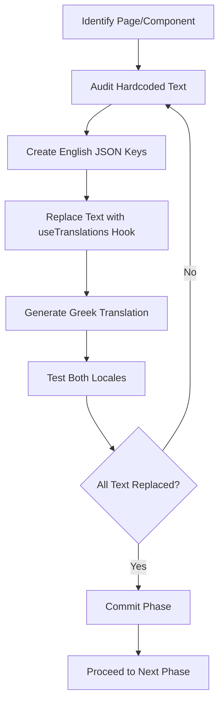
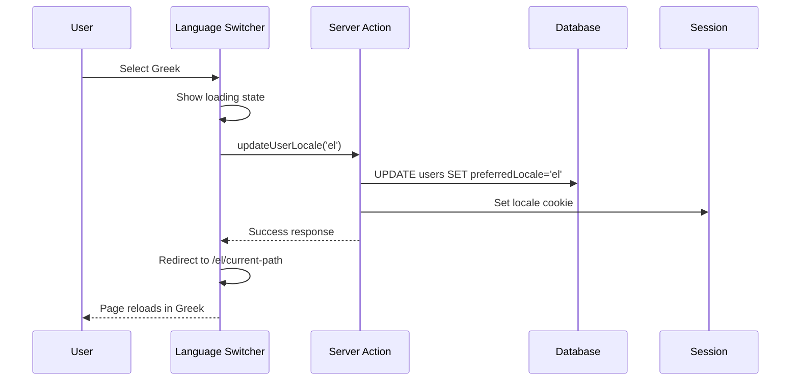

# Internationalization Integration & Validation

## Overview

This design outlines the integration of internationalization (i18n) and localization (l10n) capabilities into the Oikion App, enabling multi-language support starting with English (default) and Greek locales. The solution ensures smooth integration with the existing Next.js App Router architecture, TypeScript stack, and server/client component patterns while maintaining type safety and build-time validation.

**Strategic Goals:**
- Enable seamless language switching between English and Greek
- Maintain type-safe translation keys across the application
- Enforce translation completeness at build time for critical pages
- Organize translations in a maintainable, scalable folder structure
- Preserve existing performance optimizations and server-first architecture

## Technology Selection

### i18n Library: next-intl

**Rationale for Selection:**
- **Native Next.js App Router Support**: Built specifically for Next.js 13+ App Router with RSC (React Server Components) first-class support
- **Type Safety**: Full TypeScript integration with autocomplete for translation keys
- **Server & Client Components**: Works seamlessly with both paradigms used throughout Oikion
- **Performance**: Loads only required translations; supports static generation and streaming
- **Middleware Integration**: Leverages Next.js middleware for locale detection and routing
- **Zero Runtime Overhead**: Tree-shakable, no client-side overhead for unused translations

**Alternatives Considered & Rejected:**
- `react-i18next`: Primarily client-focused; less optimized for App Router RSC patterns
- `next-translate`: Lacks comprehensive TypeScript support and RSC optimizations
- Custom solution: Would require significant engineering effort to match next-intl's capabilities

## Locale Strategy

### Supported Locales

| Locale Code | Language | Default | Status |
|-------------|----------|---------|--------|
| `en` | English | ✓ Yes | Required |
| `el` | Greek (Ελληνικά) | No | Required |

**Default Locale Behavior:**
- English (`en`) serves as the fallback locale
- All translation keys must exist in English
- Missing Greek translations fall back to English equivalents
- URL structure: `/` (English), `/el/` (Greek)

### Locale Detection Strategy

**Priority Order:**
1. **URL Path Prefix**: `/el/dashboard` → Greek
2. **User Session Preference**: Stored in database per user
3. **Accept-Language Header**: Browser preference
4. **Default Fallback**: English

**Session Persistence:**
- Store selected locale in User model via new `preferredLocale` field
- Persist choice across sessions
- Allow override per-session via URL or language switcher

## Architecture

### Folder Structure

```
/messages
├── en/
│   ├── common.json          # Shared UI elements, buttons, forms
│   ├── dashboard.json       # Dashboard page
│   ├── properties.json      # Properties/MLS page
│   ├── relations.json       # Relations/CRM page
│   ├── oikosync.json        # Oikosync/Activity Feed page
│   ├── members.json         # Members page
│   ├── billing.json         # Billing page
│   ├── settings.json        # Settings page
│   ├── navigation.json      # Navigation, menus, sidebar
│   ├── validation.json      # Form validation messages
│   └── errors.json          # Error messages, alerts
└── el/
    ├── common.json
    ├── dashboard.json
    ├── properties.json
    ├── relations.json
    ├── oikosync.json
    ├── members.json
    ├── billing.json
    ├── settings.json
    ├── navigation.json
    ├── validation.json
    └── errors.json
```

**Organization Principles:**
- **Page-Based Files**: Each critical page has its own translation file
- **Shared Resources**: `common.json` for reusable UI elements across pages
- **Domain Separation**: Navigation, validation, and errors separated for clarity
- **Flat Namespace**: Avoid deep nesting; use dot notation for hierarchy (e.g., `properties.list.title`)

### Translation File Schema

Each locale file follows a consistent JSON structure with nested keys representing UI hierarchy:

**Example: `en/dashboard.json`**
```
{
  "header": {
    "title": "Dashboard",
    "description": "Current Role: {{role}} — Change your role in settings."
  },
  "placeholder": {
    "title": "No content created",
    "description": "You don't have any content yet. Start creating content.",
    "button": "Add Content"
  }
}
```

**Key Characteristics:**
- **Variable Interpolation**: Use `{{variable}}` syntax for dynamic content
- **Pluralization Support**: Handle singular/plural forms (e.g., "1 property" vs "5 properties")
- **Rich Text**: Support for HTML formatting where necessary
- **Contextual Keys**: Keys reflect UI hierarchy and context

### Next.js Configuration

**Middleware Integration:**

| Responsibility | Implementation |
|---------------|----------------|
| Locale Detection | Extract from URL, session, or headers |
| Locale Persistence | Set cookie for session continuity |
| Routing | Rewrite paths to include locale prefix |
| Redirection | Redirect root to default locale |

**Next.js Config Updates:**

Add i18n routing configuration to `next.config.js`:

| Property | Value | Purpose |
|----------|-------|---------|
| `locales` | `['en', 'el']` | Supported languages |
| `defaultLocale` | `'en'` | Fallback language |
| `localeDetection` | `true` | Enable automatic detection |

### Type Safety Strategy

**Translation Key Type Generation:**

Automatically generate TypeScript types from English translation files to enable autocomplete and compile-time validation:

**Type Definition Pattern:**
```
messages: {
  dashboard: {
    header: {
      title: string;
      description: string;
    };
    placeholder: {
      title: string;
      description: string;
      button: string;
    };
  };
}
```

**Implementation Approach:**
- Use `next-intl` type utilities to infer types from `en/` locale files
- English serves as source of truth for all translation keys
- TypeScript enforces key existence at development time
- IDE autocomplete for all translation paths

## Translation Migration Strategy

### Migration Phases

Translation extraction will proceed page-by-page in **bite-size increments** to minimize risk and enable iterative review:

#### Phase 1: Core Infrastructure (No Text Changes)
**Scope:**
- Install and configure `next-intl`
- Set up folder structure under `/messages`
- Configure middleware for locale routing
- Create `common.json` with shared UI elements

**Validation:**
- Application loads without errors
- Locale detection works via URL
- No visual changes to existing pages

---

#### Phase 2: Dashboard Page
**Text Extraction Target:**
- Page metadata (title, description)
- Dashboard header ("Dashboard", role message)
- Empty placeholder content
- All button labels

**Translation Files:**
- `en/dashboard.json`
- `el/dashboard.json`

**Validation:**
- Dashboard renders in both locales
- Language switcher functional
- No hardcoded English text remains

---

#### Phase 3: Properties Page (MLS)
**Text Extraction Target:**
- Page header and description
- Filter labels (status, type, price, location, bedrooms)
- Property card fields (address, price, status badges)
- Empty states and CTAs
- Subscription gate messages
- Demo property placeholders

**Translation Files:**
- `en/properties.json`
- `el/properties.json`

**Validation:**
- All property list text localized
- Filter UI operates in both languages
- Pagination and sorting labels translated

---

#### Phase 4: Relations Page (CRM)
**Text Extraction Target:**
- Client list headers
- Interaction types (call, email, meeting)
- Task status labels
- Timeline entries
- Note/Interaction modals
- Add Client/Task/Interaction button labels

**Translation Files:**
- `en/relations.json`
- `el/relations.json`

**Validation:**
- Client detail pages fully localized
- All modals and forms translated
- Timeline displays correctly in Greek

---

#### Phase 5: Oikosync Page (Activity Feed)
**Text Extraction Target:**
- Feed header and filters
- Activity types (created, updated, archived)
- Entity names (Property, Client, Task, Membership)
- Time formatting ("2 hours ago", "yesterday")
- Empty feed placeholder

**Translation Files:**
- `en/oikosync.json`
- `el/oikosync.json`

**Validation:**
- Activity verbs grammatically correct in Greek
- Timestamps use locale-appropriate formatting
- Filters operate in both languages

---

#### Phase 6: Members Page
**Text Extraction Target:**
- Members list header
- Role labels (ORG_OWNER, ADMIN, AGENT, VIEWER)
- Invitation form labels
- Pending invitations table
- Remove/update member dialogs
- Permission descriptions

**Translation Files:**
- `en/members.json`
- `el/members.json`

**Validation:**
- Role badges display correctly
- Invitation emails reference correct locale
- All dialogs fully translated

---

#### Phase 7: Billing Page
**Text Extraction Target:**
- Billing header
- Subscription plan names and descriptions
- Pricing display
- Customer portal button label
- Stripe test mode warning
- Subscription status badges

**Translation Files:**
- `en/billing.json`
- `el/billing.json`

**Validation:**
- Plan names localized appropriately
- Currency formatting respects locale (€ position)
- Stripe checkout flow handles locale parameter

---

#### Phase 8: Settings Page
**Text Extraction Target:**
- Settings header and sections
- Organization settings form labels
- User profile form fields
- Delete account/organization warnings
- Success/error toast messages

**Translation Files:**
- `en/settings.json`
- `el/settings.json`

**Validation:**
- All form labels and placeholders translated
- Validation messages appear in correct language
- Confirmation dialogs fully localized

---

#### Phase 9: Navigation & Shared UI
**Text Extraction Target:**
- Main navigation menu items
- Sidebar labels
- Footer links
- User account dropdown
- Mobile menu
- Breadcrumbs

**Translation Files:**
- `en/navigation.json`
- `el/navigation.json`
- Update `en/common.json` & `el/common.json`

**Validation:**
- All navigation paths translated
- Mobile menu operates correctly
- Breadcrumbs reflect locale

---

#### Phase 10: Forms & Validation
**Text Extraction Target:**
- Generic form labels (Name, Email, Phone, etc.)
- Validation error messages (Zod schemas)
- Required field indicators
- Success messages
- Cancel/Submit button labels

**Translation Files:**
- `en/validation.json`
- `el/validation.json`

**Validation:**
- Client-side and server-side validation messages localized
- Form errors display in active locale
- Zod schema integration verified

---

#### Phase 11: Error States & Alerts
**Text Extraction Target:**
- 404 page content
- Error boundary messages
- API error responses
- Alert/toast notifications
- Empty state placeholders

**Translation Files:**
- `en/errors.json`
- `el/errors.json`

**Validation:**
- Error pages render in correct locale
- API errors return localized messages
- Toasts and alerts fully translated

### Text Extraction Workflow (Per Phase)



**Detailed Steps:**
1. **Audit**: Identify all hardcoded strings in component/page files
2. **Structure**: Define logical key hierarchy in `en/{page}.json`
3. **Replace**: Substitute strings with `t('key.path')` calls
4. **Translate**: Create equivalent Greek translations
5. **Test**: Verify rendering in both locales, including edge cases
6. **Review**: Ensure no hardcoded text remains
7. **Commit**: Merge phase as isolated, reviewable unit

## Build-Time Validation

### Translation Completeness Check

**Objective**: Prevent builds if any critical page is missing translations for active locales.

### Validation Script Architecture

**Script Location**: `/scripts/validate-translations.mjs`

**Execution Trigger**: 
- Pre-build step via `pnpm build`
- Added to `package.json` scripts as `validate:i18n`

**Validation Logic:**

```mermaid
graph TD
    A[Start Validation] --> B[Load Locales List]
    B --> C[Load Critical Pages List]
    C --> D{For Each Locale}
    D --> E{For Each Critical Page}
    E --> F[Load en/{page}.json]
    F --> G[Load {locale}/{page}.json]
    G --> H[Extract All Keys from EN]
    H --> I{Compare Keys}
    I -->|Missing Keys Found| J[Log Missing Keys]
    I -->|All Keys Present| K[Mark Page Valid]
    J --> L{More Pages?}
    K --> L
    L -->|Yes| E
    L -->|No| M{More Locales?}
    M -->|Yes| D
    M -->|No| N{Any Missing Keys?}
    N -->|Yes| O[Exit with Error Code 1]
    N -->|No| P[Exit Success]
```

**Critical Pages List:**

| Page | Translation File | Required |
|------|------------------|----------|
| Dashboard | `dashboard.json` | ✓ |
| Properties | `properties.json` | ✓ |
| Relations | `relations.json` | ✓ |
| Oikosync | `oikosync.json` | ✓ |
| Members | `members.json` | ✓ |
| Billing | `billing.json` | ✓ |
| Settings | `settings.json` | ✓ |
| Navigation | `navigation.json` | ✓ |
| Common | `common.json` | ✓ |

**Validation Rules:**

1. **Key Existence**: Every key in `en/{page}.json` must exist in `el/{page}.json`
2. **Structure Match**: Nested key paths must match exactly
3. **Non-Empty Values**: No empty string values allowed
4. **Variable Consistency**: Interpolation variables must match (e.g., `{{role}}` in both locales)

**Error Output Format:**

```
❌ Translation validation failed!

Missing keys in el/properties.json:
  - properties.filters.bedrooms
  - properties.card.status.underOffer

Missing keys in el/dashboard.json:
  - dashboard.placeholder.button

Build aborted. Please add missing translations.
```

**Success Output:**

```
✓ All translations validated successfully
  - 9 critical pages checked
  - 2 locales validated
  - 0 missing keys
```

### Integration with Build Pipeline

**Modification to `package.json`:**

| Script | Command | Purpose |
|--------|---------|---------|
| `validate:i18n` | `node scripts/validate-translations.mjs` | Standalone validation |
| `build` | `pnpm validate:i18n && pnpm contentlayer:fix && next build` | Pre-build validation |

**Failure Behavior:**
- Script exits with code `1` if validation fails
- Build process halts before Next.js compilation
- Error message includes actionable missing key report

**CI/CD Integration:**
- Validation runs automatically in CI pipeline
- Pull requests blocked if translations incomplete
- Provides immediate feedback to developers

## User Experience Features

### Language Switcher Component

**Location**: Global navigation (navbar, user account menu)

**Component Behavior:**

| Interaction | Action | Result |
|-------------|--------|--------|
| User clicks switcher | Display locale options (EN/ΕΛ) | Modal or dropdown |
| User selects locale | Update session preference | Page reloads with new locale |
| Page navigates | Preserve selected locale | URL includes locale prefix |

**Implementation Strategy:**
- Server Component for initial render with session locale
- Client Component for interactive switching
- Optimistic UI update before server revalidation

**Persistence Flow:**



### Locale-Aware Routing

**URL Structure:**

| Locale | URL Pattern | Example |
|--------|-------------|---------|
| English | `/{path}` | `/dashboard/properties` |
| Greek | `/el/{path}` | `/el/dashboard/properties` |

**Middleware Responsibilities:**
- Detect locale from URL prefix
- Fallback to user session preference
- Set `Next-Locale` header for `next-intl`
- Redirect if locale missing and preference exists

**SEO Considerations:**
- Implement `<link rel="alternate" hreflang="el">` tags
- Ensure canonical URLs respect locale
- Metadata (title, description) localized per page

## Data Localization Strategy

### Database Content

**Approach**: English-first with optional Greek fields

**Locale-Sensitive Fields:**

| Entity | Field | Strategy |
|--------|-------|----------|
| Property | `title`, `description` | Store both `titleEn`, `titleEl` |
| Property | `features` | JSON array with locale keys |
| Client | `notes` | Single field; user's locale at creation time |
| Activity | `payload` | Store entity IDs; translate verbs/labels in UI |

**Migration Path:**
- Phase 1: Add nullable `{field}El` columns
- Phase 2: Populate via admin UI or backfill script
- Phase 3: Display based on active locale; fallback to English

**User-Generated Content:**
- Notes, comments, custom fields: stored in user's active locale at creation
- Display as-is; no automatic translation
- Optionally tag content with creation locale for context

### Date & Number Formatting

**Date Formatting:**

| Locale | Format | Example |
|--------|--------|---------|
| English | `MM/DD/YYYY` | `01/15/2025` |
| Greek | `DD/MM/YYYY` | `15/01/2025` |

**Implementation**: Use `date-fns` with locale imports (`el` for Greek)

**Number & Currency Formatting:**

| Locale | Currency Position | Decimal Separator | Thousands Separator |
|--------|-------------------|-------------------|---------------------|
| English | Prefix (`€320,000`) | `.` | `,` |
| Greek | Suffix (`320.000 €`) | `,` | `.` |

**Implementation**: Use `Intl.NumberFormat` with locale-specific options

## Testing Strategy

### Unit Testing

**Translation Hook Tests:**
- Verify `useTranslations` returns correct strings per locale
- Test fallback to English for missing Greek keys
- Validate variable interpolation

**Validation Script Tests:**
- Mock translation files with missing keys
- Assert script exits with error code 1
- Verify error message accuracy

### Integration Testing

**Page Rendering:**
- Load each critical page in both locales
- Assert no hardcoded English text in Greek mode
- Verify dynamic content (e.g., role, property count) interpolates correctly

**Locale Switching:**
- Simulate user changing language
- Assert session persistence
- Verify URL updates and page re-renders

### Manual QA Checklist

| Area | Test Case | Pass Criteria |
|------|-----------|---------------|
| Dashboard | Load in EN and EL | All text translated |
| Properties | Filter and search | Labels and placeholders localized |
| Relations | View client timeline | Activity descriptions in correct language |
| Oikosync | Activity feed | Verbs and timestamps localized |
| Members | Invite flow | Email notification respects locale |
| Billing | Stripe checkout | Checkout session passes locale parameter |
| Settings | Form validation | Error messages appear in active locale |
| Navigation | Switch language | URL updates; page content changes |

### Accessibility Considerations

**Language Attribute:**
- Set `<html lang="en">` or `<html lang="el">` based on active locale
- Screen readers announce correct language

**RTL Support (Future):**
- Greek is LTR; no immediate changes needed
- Architecture supports future RTL locales (Arabic) via `dir` attribute

## Performance Optimization

### Translation Loading Strategy

**Server Components:**
- Translations loaded server-side via `next-intl` utilities
- Zero client bundle impact for static content
- Streamed with initial HTML payload

**Client Components:**
- Only interactive components import `useTranslations`
- Translations tree-shaken; unused keys excluded
- Lazy-load translations for modals/dialogs

### Caching Strategy

| Resource | Cache Method | Invalidation |
|----------|--------------|--------------|
| Translation JSON | Next.js static generation | On build only |
| User locale preference | Session cookie + DB | On user update |
| Localized metadata | Static generation per locale | On build only |

**Build Output:**
- Separate HTML for `/dashboard` and `/el/dashboard`
- Static generation preserves performance characteristics
- No runtime translation overhead

## Migration Risks & Mitigation

### Risk Matrix

| Risk | Impact | Likelihood | Mitigation |
|------|--------|------------|------------|
| Missing translations block build | High | Medium | Validation script with clear error messages |
| Incorrect pluralization in Greek | Medium | High | Use `next-intl` plural rules; manual QA |
| Type safety breaks with wrong keys | High | Low | TypeScript integration; CI checks |
| Performance regression | Medium | Low | Maintain server component patterns |
| User sees mixed languages during rollout | Low | Medium | Deploy phases atomically; feature flags |

### Rollback Strategy

**Scenario**: Critical translation issues post-deployment

**Steps:**
1. Revert to previous deployment via Vercel
2. Translation changes isolated in `/messages`; no schema changes required
3. Fix translations offline; re-run validation script
4. Redeploy with corrections

**Prevention:**
- Require translation review from native Greek speaker before merge
- Maintain English as always-complete fallback
- Automated validation prevents incomplete translations

## Future Enhancements

### Additional Locales

**Candidate Languages:**
- Albanian (`sq`)
- Bulgarian (`bg`)
- Romanian (`ro`)

**Expansion Process:**
1. Add locale code to `next.config.js`
2. Create `messages/{locale}/` folder structure
3. Copy `en/` files and translate
4. Update validation script critical pages list
5. Test and deploy

### Automatic Translation

**Approach**: Machine translation for initial drafts (post-Alpha)

**Workflow:**
1. Developer adds new English keys
2. Pre-commit hook detects missing Greek keys
3. Script calls translation API (DeepL, Google Translate)
4. Auto-generated Greek draft added with `[AUTO]` flag
5. Native speaker reviews and approves before production

**Benefits:**
- Reduces manual translation workload
- Maintains build-time validation compliance
- Human review ensures quality

### User-Generated Content Translation

**Scenario**: Property descriptions, client notes entered in one language

**Future Feature:**
- "Translate" button on property detail pages
- On-demand translation via API
- Display translated content with disclaimer
- Original always preserved

### Translation Management UI

**Admin Interface** (future consideration):

**Features:**
- In-app translation editor for non-developers
- Side-by-side EN/EL comparison view
- Mark translations as "needs review"
- Export/import for professional translators
- Version history per key

**Use Case:**
- Marketing team updates UI copy without code changes
- Professional translator works offline, reimports
- A/B testing different phrasings

## Implementation Checklist

### Phase 0: Setup & Infrastructure
- [ ] Install `next-intl` package via pnpm
- [ ] Create `/messages` folder structure with `en/` and `el/` subdirectories
- [ ] Configure `next.config.js` with locale settings
- [ ] Implement middleware for locale detection and routing
- [ ] Set up TypeScript types for translation keys
- [ ] Create `validate-translations.mjs` script
- [ ] Update `package.json` build script to include validation
- [ ] Add `preferredLocale` field to User model (Prisma migration)
- [ ] Test basic locale switching without content changes

### Phase 1-11: Page-by-Page Migration
- [ ] Phase 1: Dashboard (header, placeholders, buttons)
- [ ] Phase 2: Properties (filters, cards, modals, empty states)
- [ ] Phase 3: Relations (client list, timeline, interactions)
- [ ] Phase 4: Oikosync (activity feed, filters, timestamps)
- [ ] Phase 5: Members (roles, invitations, dialogs)
- [ ] Phase 6: Billing (plans, portal, warnings)
- [ ] Phase 7: Settings (forms, validation, confirmations)
- [ ] Phase 8: Navigation (menu, sidebar, breadcrumbs)
- [ ] Phase 9: Forms & Validation (Zod integration, error messages)
- [ ] Phase 10: Error States (404, boundaries, alerts)
- [ ] Phase 11: Common UI (buttons, tooltips, shared components)

### Language Switcher Implementation
- [ ] Create LanguageSwitcher component (server + client)
- [ ] Add to navbar and user account menu
- [ ] Implement `updateUserLocale` server action
- [ ] Test session persistence and URL updates

### Validation & Testing
- [ ] Run validation script against all critical pages
- [ ] Verify build fails with descriptive errors for missing keys
- [ ] Manual QA in both locales for all pages
- [ ] Accessibility audit (lang attributes, screen readers)
- [ ] Performance benchmarking (ensure no regression)

### Documentation & Training
- [ ] Document translation key naming conventions
- [ ] Create developer guide for adding new translations
- [ ] Provide Greek translation style guide (tone, formality)
- [ ] Record demo video of translation workflow

## Success Metrics

| Metric | Target | Measurement Method |
|--------|--------|--------------------|
| Translation Coverage | 100% for critical pages | Build-time validation |
| Locale Switch Performance | < 200ms | Lighthouse / RUM |
| Missing Greek Keys | 0 | CI/CD validation gate |
| User Preference Persistence | 100% | Session analytics |
| Developer Friction | < 5 min to add new page | Time tracking |
| Translation Quality Score | > 4.5/5 | Native speaker review |

**Acceptance Criteria:**
- All 7 critical pages fully localized in English and Greek
- Build fails if any required translation missing
- Language switcher accessible from all authenticated pages
- User locale preference persists across sessions
- No hardcoded English text in Greek mode (manual audit)
- Type safety maintained for all translation keys
- Zero performance regression vs. pre-i18n baseline
