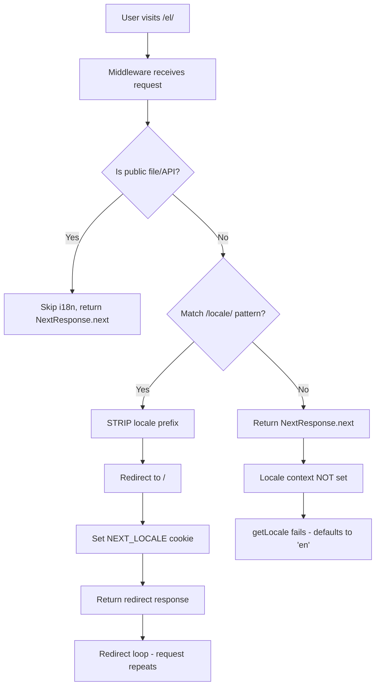
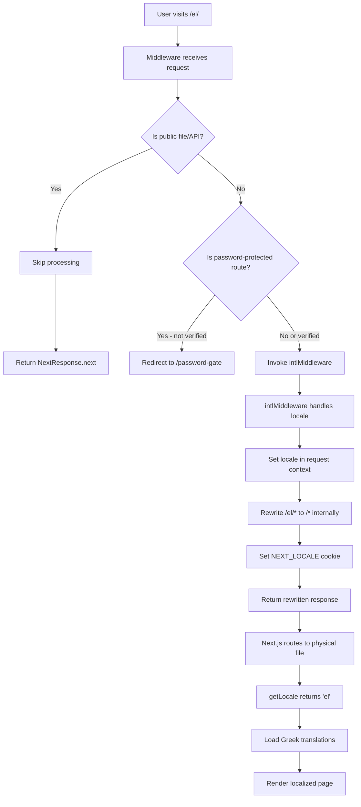
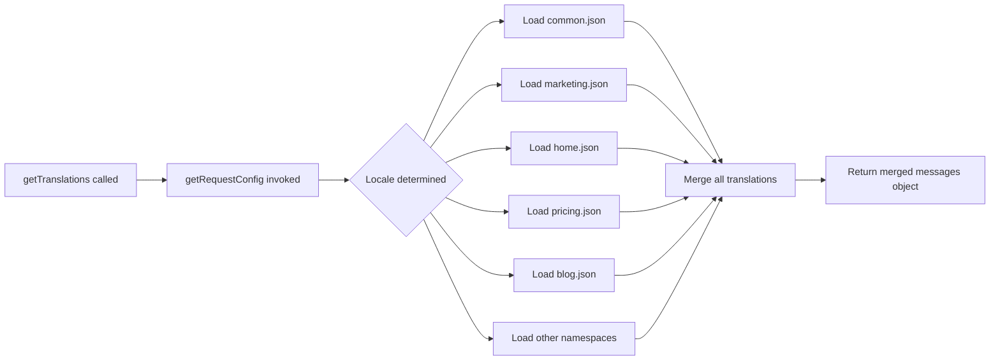
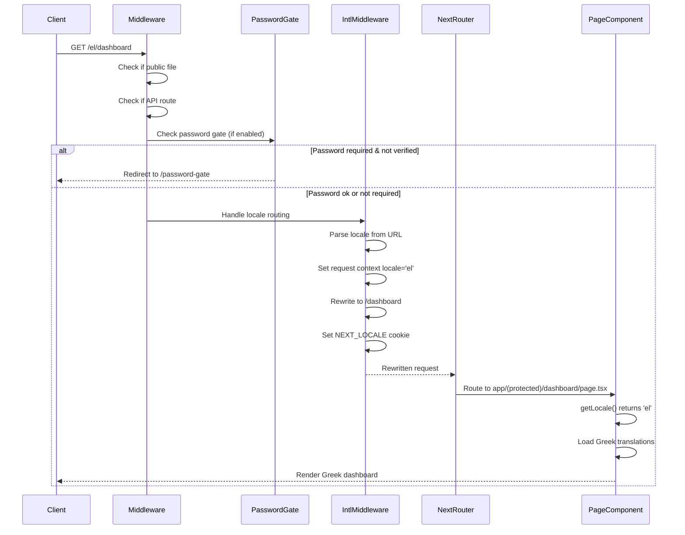
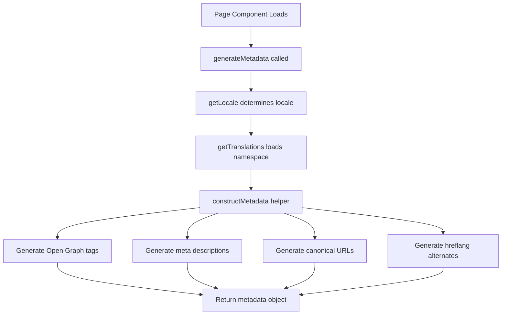
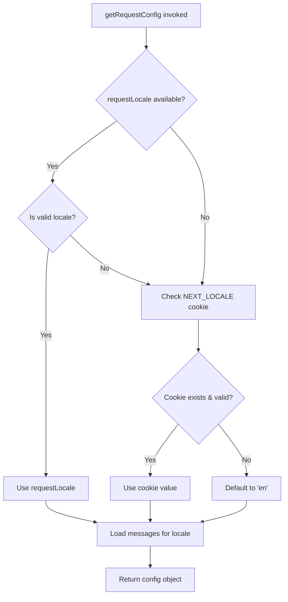
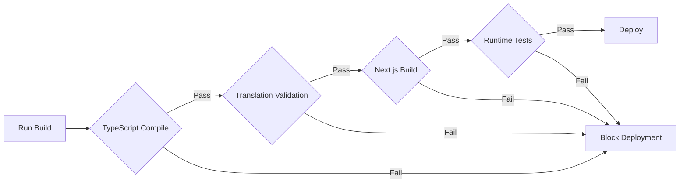
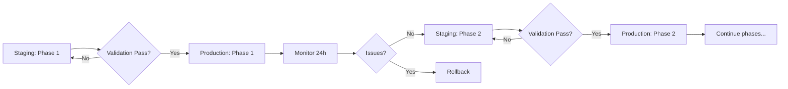
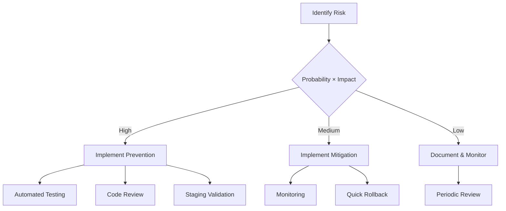

# Internationalization Routing & Marketing Translation Fix

## Overview

This design addresses critical i18n routing issues in the Oikion MVP application that prevent proper locale-based navigation and translation loading. The current implementation has a broken middleware that strips locale prefixes and missing translation loading logic, resulting in redirect loops and hardcoded English text in marketing components.

### Problem Statement

The application's internationalization infrastructure is partially implemented but suffers from four critical defects:

1. **Broken Middleware Logic**: Lines 74-81 in middleware.ts strip locale prefixes (e.g., `/el/*` → `/*`) instead of properly delegating to next-intl middleware, breaking i18n routing entirely
2. **Missing Translation Loading**: i18n/request.ts does not import marketing.json files, causing getTranslations('marketing.home') calls to fail
3. **Unused Middleware Integration**: intlMiddleware is created but never invoked in the request pipeline
4. **Hardcoded Component Text**: Marketing components contain English-only text instead of using translation keys

### Impact

- URLs like `/el/` trigger redirect loops causing 5+ session requests instead of 1-2
- Marketing pages fail to render Greek translations
- Broken user experience for non-English visitors
- SEO penalties due to missing localized content

---

## Architecture

### Current State Analysis

The application uses middleware-based i18n routing (NOT folder-based), where:
- Physical file structure remains flat: `app/(marketing)/page.tsx`
- Middleware intercepts requests and rewrites `/el/*` paths internally
- Locale context is injected via next-intl's request configuration

**Current Middleware Flow (Broken):**



### Target State Architecture

**Fixed Middleware Flow:**



**Translation Loading Flow:**



---

## Translation File Structure

### Current Structure

```
messages/
├── en/
│   ├── common.json
│   ├── dashboard.json
│   ├── marketing.json  ← Exists but not loaded
│   └── ... (9 other files)
└── el/
    ├── common.json
    ├── dashboard.json
    ├── marketing.json  ← Exists but not loaded
    └── ... (9 other files)
```

### Target Structure

Split marketing.json into page-specific files for better organization and selective loading:

```
messages/
├── en/
│   ├── common.json
│   ├── home.json        ← New: Homepage content
│   ├── pricing.json     ← New: Pricing page content
│   ├── blog.json        ← New: Blog page content
│   ├── dashboard.json
│   └── ... (other existing files)
└── el/
    ├── common.json
    ├── home.json
    ├── pricing.json
    ├── blog.json
    ├── dashboard.json
    └── ... (other existing files)
```

### Translation Key Organization

**home.json Schema:**

| Key Path | Purpose | Example (EN) | Example (EL) |
|----------|---------|--------------|--------------|
| metadata.title | SEO page title | "Oikion - Operating System for Greek Real Estate Agencies" | "Oikion - Λειτουργικό Σύστημα για Ελληνικά Μεσιτικά Γραφεία" |
| metadata.description | SEO meta description | "Complete MLS, CRM, and activity feed solution..." | "Ολοκληρωμένη λύση MLS, CRM και ροής δραστηριοτήτων..." |
| hero.badge | Hero section badge text | "Built for Greek Real Estate" | "Σχεδιασμένο για Ελληνικά Μεσιτικά" |
| hero.title | Main headline first part | "Operating System for" | "Λειτουργικό Σύστημα για" |
| hero.titleHighlight | Main headline highlight | "Real Estate Agencies" | "Μεσιτικά Γραφεία" |
| hero.description | Hero description paragraph | "Complete MLS, CRM, and internal activity feed..." | "Πλήρες MLS, CRM και εσωτερική ροή δραστηριοτήτων..." |
| features.title | Features section title | "Discover all features." | TBD |
| features.subtitle | Features section subtitle | Text content | TBD |

**pricing.json Schema:**

| Key Path | Purpose |
|----------|---------|
| metadata.title | SEO page title |
| metadata.description | SEO meta description |
| hero.title | Pricing hero title |
| hero.description | Pricing hero description |

**blog.json Schema:**

| Key Path | Purpose |
|----------|---------|
| metadata.title | SEO page title |
| metadata.description | SEO meta description |

---

## Middleware Correction Strategy

### Root Cause

The problematic code block (lines 74-81) attempts to manually parse and strip locale prefixes, reimplementing next-intl's internal logic incorrectly:

**Current (Broken) Implementation Pattern:**
- Manually regex match locale prefix
- Strip prefix and redirect
- Set cookie manually
- Return redirect response (causes loop)

**Correct Implementation Pattern:**
- Delegate locale detection to next-intl middleware
- Allow next-intl to handle rewrites internally
- Let next-intl set cookies
- Return next-intl's response (rewritten, not redirected)

### Middleware Integration Points

**Request Processing Order:**



### Configuration Alignment

The middleware must align with next.config.js plugin configuration:

**next.config.js settings:**
- `locales: ['en', 'el']`
- `defaultLocale: 'en'`
- `localePrefix: 'as-needed'` ← Critical: Default locale (en) has NO prefix

**middleware.ts must mirror:**
- Same locale array
- Same default locale
- Same prefix strategy
- `localeDetection: false` ← Already correct (prevents auto-redirects)

---

## Component Translation Strategy

### Translation Namespace Pattern

Each page will use its own namespace to avoid key conflicts and enable selective loading:

| Page | Namespace | Translation Call Pattern |
|------|-----------|-------------------------|
| Homepage | `home` | `getTranslations('home')` |
| Pricing | `pricing` | `getTranslations('pricing')` |
| Blog | `blog` | `getTranslations('blog')` |

### Component-Level Changes

**Server Components (Async):**

Components like `hero-landing.tsx` will become async and call:

```
const t = await getTranslations('home.hero');
```

Then replace hardcoded strings:

| Current (Hardcoded) | Target (Translated) |
|---------------------|---------------------|
| "Built for Greek Real Estate" | `{t('badge')}` |
| "Operating System for" | `{t('title')}` |
| "Real Estate Agencies" | `{t('titleHighlight')}` |
| Full description text | `{t('description')}` |

**Client Components:**

Components requiring client-side interactivity will use:

```
const t = useTranslations('home.hero');
```

### Affected Components Inventory

**Priority 1 (Homepage - app/(marketing)/page.tsx):**

| Component | File | Translation Keys Needed | Async Conversion Required |
|-----------|------|------------------------|---------------------------|
| HeroLanding | components/sections/hero-landing.tsx | home.hero.* | Yes |
| Features | components/sections/features.tsx | home.features.* | Yes |
| InfoLanding | components/sections/info-landing.tsx | home.info.* | Yes (receives data prop) |
| Testimonials | components/sections/testimonials.tsx | home.testimonials.* | Yes |
| PreviewLanding | components/sections/preview-landing.tsx | home.preview.* | Yes |
| Powered | components/sections/powered.tsx | home.powered.* | Yes |
| BentoGrid | components/sections/bentogrid.tsx | home.bento.* | Yes |

**Priority 2 (Pricing Page):**

| Component | File | Namespace |
|-----------|------|-----------|
| Pricing page content | app/(marketing)/pricing/page.tsx | pricing |
| Pricing cards | (nested components) | pricing.* |

**Priority 3 (Blog Page):**

| Component | File | Namespace |
|-----------|------|-----------|
| Blog page content | app/(marketing)/blog/page.tsx | blog |

---

## Data Model Changes

### Configuration Data Translation

Currently, components receive configuration objects from `config/landing.ts`:

**Example (infos array):**

```
export const infos: InfoLdg[] = [
  {
    title: "Hardcoded English Title",
    description: "Hardcoded description...",
    image: "/images/...",
    list: [...]
  }
]
```

**Migration Strategy:**

Two approaches considered:

**Approach A: Move to Translation Files (Recommended)**
- Move all textual content from config files to translation files
- Keep only non-text data (images, icons) in config
- Components fetch translations directly

**Approach B: Dynamic Config Loading**
- Keep config structure
- Load config based on locale
- Create `config/landing.en.ts` and `config/landing.el.ts`

**Decision: Approach A** for consistency with existing translation infrastructure.

### Translation File Content Migration

Content to migrate from `marketing.json` to split files:

**marketing.json → home.json:**
- `marketing.home.*` → `home.*`

**marketing.json → pricing.json:**
- `marketing.pricing.*` → `pricing.*`

**marketing.json → blog.json:**
- `marketing.blog.*` → `blog.*`

---

## Metadata Localization

### Page-Level Metadata Generation

Each marketing page must generate localized metadata:

**Pattern (Applied to all pages):**

```
async function generateMetadata() {
  const locale = await getLocale();
  const t = await getTranslations('{namespace}.metadata');
  
  return constructMetadata({
    title: t('title'),
    description: t('description'),
    locale,
    pathname: '{current-path}',
  });
}
```

**Metadata Flow:**



### SEO Considerations

**Required Elements per Page:**

| Element | Source | Purpose |
|---------|--------|---------|
| `<title>` | `{namespace}.metadata.title` | Browser tab, search results |
| `meta[description]` | `{namespace}.metadata.description` | Search result snippets |
| `og:title` | Same as title | Social sharing cards |
| `og:description` | Same as description | Social sharing cards |
| `og:locale` | Current locale | Facebook/social platforms |
| `link[rel=alternate][hreflang]` | Generated for each locale | Search engine locale signals |
| `link[rel=canonical]` | Current locale URL | Prevent duplicate content |

**Alternate Links Pattern:**

For every page, generate alternates:

```
<link rel="alternate" hreflang="en" href="https://oikion.com{pathname}" />
<link rel="alternate" hreflang="el" href="https://oikion.com/el{pathname}" />
<link rel="alternate" hreflang="x-default" href="https://oikion.com{pathname}" />
```

---

## Request Configuration Enhancement

### Translation Loading Modification

**Current i18n/request.ts structure:**

Loads 10 namespaces but missing marketing-related files:
- common.json ✓
- dashboard.json ✓
- properties.json ✓
- ... 7 others ✓
- marketing.json ✗ (exists but not loaded)

**Target structure:**

Add 4 new imports while maintaining backward compatibility:

```
const messages = {
  ...((await import(`@/messages/${locale}/common.json`)).default),
  dashboard: (await import(`@/messages/${locale}/dashboard.json`)).default,
  ... (existing imports)
  home: (await import(`@/messages/${locale}/home.json`)).default,
  pricing: (await import(`@/messages/${locale}/pricing.json`)).default,
  blog: (await import(`@/messages/${locale}/blog.json`)).default,
  // marketing: removed, split into above three
};
```

### Locale Resolution Strategy

**Priority order (unchanged):**



**Cookie Fallback Justification:**

The fallback to NEXT_LOCALE cookie is critical for:
- Direct URL navigation (e.g., bookmark to `/dashboard`)
- Post-authentication redirects
- Server-side rendering consistency

---

## Testing Strategy

### Functional Test Cases

**TC-1: Default Locale Homepage**
- **Given**: Fresh browser session, no cookies
- **When**: Navigate to `/`
- **Then**: 
  - HTTP 200 response (not redirect)
  - English content rendered
  - No locale prefix in URL
  - Session requests ≤ 2

**TC-2: Greek Locale Homepage**
- **Given**: Navigate to `/el/`
- **Then**:
  - HTTP 200 response (not redirect)
  - Greek content rendered
  - URL remains `/el/`
  - NEXT_LOCALE cookie set to 'el'
  - Session requests ≤ 2

**TC-3: Locale Prefix Persistence**
- **Given**: On Greek site (`/el/`)
- **When**: Click navigation link to `/pricing`
- **Then**: 
  - Navigates to `/el/pricing` (not `/pricing`)
  - Greek content rendered

**TC-4: Protected Routes with Locale**
- **Given**: Authenticated user, Greek locale
- **When**: Navigate to `/el/dashboard`
- **Then**:
  - Dashboard loads in Greek
  - No redirect to `/dashboard`
  - User role-based content visible

**TC-5: Password Gate with Locale**
- **Given**: APP_PASSWORD set, not verified
- **When**: Access `/el/dashboard`
- **Then**:
  - Redirect to `/password-gate?returnUrl=/el/dashboard`
  - Password page loads (locale-agnostic)
  - After verification, redirect to `/el/dashboard`

**TC-6: Metadata Localization**
- **Given**: Navigate to `/el/pricing`
- **When**: Inspect page source
- **Then**:
  - `<title>` contains Greek text
  - `meta[description]` contains Greek text
  - `og:locale` = "el_GR"
  - `link[hreflang=el]` present

### Build Validation

**Pre-Deployment Checks:**



**Validation Script Checks:**
- All translation keys referenced in code exist in both locales
- No missing keys between en/ and el/ directories
- JSON syntax validity
- No duplicate keys within files

### Performance Metrics

**Acceptance Criteria:**

| Metric | Target | Measurement Method |
|--------|--------|-------------------|
| Session requests on page load | ≤ 2 | Browser DevTools Network tab |
| Time to First Byte (TTFB) | ≤ 600ms | Lighthouse |
| Largest Contentful Paint (LCP) | ≤ 2.5s | Lighthouse |
| Cumulative Layout Shift (CLS) | ≤ 0.1 | Lighthouse |
| Translation loading time | ≤ 50ms | Server-side profiling |

---

## Migration Sequence

### Phase 1: Middleware Fix (Critical)

**Objective**: Restore functional locale routing

**Steps:**

1. Remove manual locale stripping logic (lines 74-81)
2. Properly invoke intlMiddleware for non-public, non-API routes
3. Preserve password gate logic integration
4. Test routing for both locales

**Success Criteria:**
- `/el/` loads without redirect loop
- Session requests drop to ≤ 2
- getLocale() returns correct values

### Phase 2: Translation File Restructuring

**Objective**: Split marketing.json and enable loading

**Steps:**

1. Create new files: home.json, pricing.json, blog.json (both locales)
2. Migrate content from marketing.json to appropriate files
3. Update i18n/request.ts to import new files
4. Remove marketing.json imports
5. Validate translations build

**Success Criteria:**
- All new files present in both locales
- Content accurately migrated
- No missing keys detected

### Phase 3: Homepage Component Migration

**Objective**: Enable translated homepage

**Components to Update:**
- hero-landing.tsx
- features.tsx
- info-landing.tsx
- testimonials.tsx
- preview-landing.tsx
- powered.tsx
- bentogrid.tsx

**Per-Component Steps:**

1. Convert to async if server component
2. Import getTranslations
3. Replace hardcoded strings with t() calls
4. Update configuration data usage
5. Test rendering in both locales

**Success Criteria:**
- Homepage renders in Greek when visiting `/el/`
- All text content translated
- No console errors
- Visual layout unchanged

### Phase 4: Metadata Localization

**Objective**: SEO-optimized localized metadata

**Steps:**

1. Add generateMetadata to homepage
2. Add generateMetadata to pricing page
3. Add generateMetadata to blog page
4. Verify hreflang alternates generation
5. Test Open Graph tags

**Success Criteria:**
- All marketing pages have locale-specific metadata
- Social sharing previews show correct language
- Search console validates hreflang

### Phase 5: Remaining Marketing Pages

**Objective**: Complete marketing section translation

**Steps:**

1. Update pricing page components
2. Update blog page components
3. Update any modal/dialog content
4. Translate error messages

**Success Criteria:**
- All marketing pages fully translated
- Consistent user experience across locales

---

## Validation & Verification

### Automated Checks

**Build-Time Validation:**

Script to run before each build:

```
Translation Key Coverage Check:
- Scan all TSX files for getTranslations('{namespace}') calls
- Extract t('{key}') usage patterns
- Verify {namespace}.{key} exists in all locale files
- Report missing translations
```

**Runtime Validation:**

```
Development Mode Warnings:
- Log when fallback to default locale occurs
- Warn on missing translation keys
- Alert on cookie/locale mismatch
```

### Manual Testing Checklist

**For each marketing page:**

- [ ] English version loads at /{page}
- [ ] Greek version loads at /el/{page}
- [ ] Language switcher updates URL correctly
- [ ] Metadata reflects correct language
- [ ] No console errors
- [ ] Images/media load correctly
- [ ] Links navigate with locale prefix
- [ ] Forms submit with locale context
- [ ] Error states show translated messages

**Cross-Browser Testing:**

- [ ] Chrome/Edge (Chromium)
- [ ] Firefox
- [ ] Safari
- [ ] Mobile Safari (iOS)
- [ ] Chrome Mobile (Android)

### Acceptance Criteria Summary

**Must Have:**
- ✓ Zero redirect loops on locale-prefixed URLs
- ✓ Session requests ≤ 2 per page load
- ✓ All marketing pages render translated content
- ✓ Metadata localized for SEO
- ✓ Build passes with no translation errors
- ✓ Language switcher works bidirectionally

**Should Have:**
- ✓ Performance metrics within targets
- ✓ Consistent visual design across locales
- ✓ Automated translation validation in CI

**Nice to Have:**
- Browser language detection (currently disabled by design)
- Right-to-left language support preparation
- Translation management UI

---

## Constraints & Assumptions

### Technical Constraints

**Must Maintain:**
- `localePrefix: 'as-needed'` configuration (default locale has no prefix)
- Middleware-based routing (NOT `[locale]` folder pattern)
- Existing folder structure in `app/` directory
- Compatibility with Auth.js v5 authentication
- Password gate functionality for protected routes

**Must NOT:**
- Change to folder-based routing (`app/[locale]/...`)
- Enable automatic locale detection (`localeDetection: false` is intentional)
- Modify database schema
- Alter API routes behavior
- Break existing protected route authorization

### Architectural Assumptions

1. **Single Domain Deployment**: All locales served from same domain (not locale-specific subdomains)
2. **Static Locale Set**: Only English and Greek supported (extensible but not currently needed)
3. **User Preference Persistence**: Authenticated users' locale preferences stored in database
4. **Cookie-Based State**: Anonymous users' locale tracked via NEXT_LOCALE cookie
5. **Server-Side Rendering**: Marketing pages are SSR for SEO benefits

### Content Assumptions

1. **Translation Completeness**: All English content has Greek equivalents
2. **String Stability**: Translation keys remain stable (not frequently renamed)
3. **RTL Not Required**: Greek text flows left-to-right (no RTL layout needed)
4. **Locale-Agnostic Media**: Images/videos same across languages (no locale-specific assets)

---

## Rollback Strategy

### Failure Scenarios & Mitigation

**Scenario 1: Middleware breaks routing entirely**

**Symptoms:**
- All pages return 404 or 500
- Both locales affected

**Rollback:**
- Revert middleware.ts to previous version
- Deploy immediately
- Debug in staging environment

**Prevention:**
- Test middleware changes in local dev first
- Use feature flag for middleware logic
- Maintain middleware unit tests

**Scenario 2: Translation loading causes build failure**

**Symptoms:**
- Next.js build fails with import errors
- Missing module errors for translation files

**Rollback:**
- Revert i18n/request.ts changes
- Restore marketing.json if deleted
- Rebuild and deploy

**Prevention:**
- Validate all translation files exist before build
- Run build locally before pushing
- CI/CD pipeline includes build validation step

**Scenario 3: Partial migration breaks homepage**

**Symptoms:**
- Homepage shows mixed English/Greek
- Missing translations cause blank sections
- Console errors from missing keys

**Rollback:**
- Revert component changes
- Restore hardcoded strings temporarily
- Complete migration in isolated environment

**Prevention:**
- Migrate components atomically (one PR per component)
- Use translation fallback mechanism
- Test each component in both locales before merge

### Deployment Phases

**Phase Deployment Strategy:**



**Monitoring During Rollout:**

- Server error rate (target: < 0.1%)
- Client-side error tracking (Sentry/similar)
- Page load performance metrics
- User session behavior (locale switching frequency)
- Search console crawl errors

---

## Dependencies

### External Libraries

| Library | Version | Purpose | Risk Level |
|---------|---------|---------|------------|
| next-intl | ^3.19.0 | Core i18n functionality | Low (stable API) |
| next | 14.x | Framework | Low (peer dependency) |
| react | 18.x | Framework | Low (peer dependency) |

### Internal Dependencies

**Files Modified:**

- `middleware.ts` - Core routing logic (HIGH impact)
- `i18n/request.ts` - Translation loading (MEDIUM impact)
- `messages/*/home.json` - New files (LOW impact)
- `messages/*/pricing.json` - New files (LOW impact)
- `messages/*/blog.json` - New files (LOW impact)
- Multiple component files - Content migration (MEDIUM impact)

**Files Dependent on Changes:**

- All marketing page components (reading translations)
- Language switcher component (triggering locale changes)
- Metadata generation utilities (constructMetadata helper)

### Configuration Dependencies

**Environment Variables:**

No new environment variables required. Existing vars remain:
- `AUTH_URL` - Must include locale-aware URLs
- `NEXT_PUBLIC_APP_URL` - Used in metadata generation

**Build Configuration:**

- `next.config.js` - Already configured with next-intl plugin
- `tsconfig.json` - No changes needed
- `package.json` - No new dependencies

### Database Dependencies

**Schema Changes:**

None required. Existing `preferredLocale` field on User model already supports this feature.

**Data Migration:**

None required. Existing user locale preferences will continue working.

---

## Success Metrics

### Key Performance Indicators

**Technical Metrics:**

| Metric | Baseline (Current) | Target | Measurement Window |
|--------|-------------------|--------|-------------------|
| Session requests per page | 5+ | ≤ 2 | Per page load |
| Redirect count per navigation | 1-2 | 0 | Per navigation event |
| Translation loading time | N/A | < 50ms | Server timing |
| Build time increase | N/A | < 10% | CI/CD pipeline |
| Bundle size increase | N/A | < 5% | Production build |

**User Experience Metrics:**

| Metric | Target | Tracking Method |
|--------|--------|----------------|
| Locale persistence rate | > 95% | Analytics: Users staying in chosen locale |
| Language switch success rate | > 99% | Error tracking on switcher interactions |
| Translated page view ratio | > 30% Greek | Analytics: /el/* pageviews vs total |

**Business Metrics:**

| Metric | Target | Rationale |
|--------|--------|-----------|
| Greek user retention | +15% | Localized experience improves engagement |
| SEO visibility (Greek keywords) | +25% | Proper hreflang and metadata |
| Support tickets (language-related) | -80% | Fewer confusion/frustration issues |

### Monitoring & Alerting

**Real-Time Alerts:**

- Error rate spike > 1% on any marketing page
- Translation loading failures > 0.1% of requests
- Middleware processing time > 200ms
- Cookie setting failures > 0.5% of requests

**Daily Reports:**

- Locale distribution (% English vs Greek users)
- Translation key usage heatmap
- Missing translation warnings
- Performance regression checks

**Weekly Reviews:**

- User feedback on translations
- SEO ranking changes for Greek keywords
- Accessibility audit results
- Cross-browser compatibility checks

---

## Risk Assessment

### High-Risk Areas

**Risk 1: Middleware Regression**

- **Probability**: Medium
- **Impact**: Critical (entire site routing breaks)
- **Mitigation**: Comprehensive testing, phased rollout, quick rollback plan
- **Detection**: Immediate (automated tests + monitoring)

**Risk 2: Translation Key Mismatches**

- **Probability**: Medium-High
- **Impact**: Medium (missing content, broken UI)
- **Mitigation**: Automated validation, type-safe keys, build-time checks
- **Detection**: Build-time + runtime warnings

**Risk 3: SEO Regression**

- **Probability**: Low-Medium
- **Impact**: High (lost search visibility)
- **Mitigation**: Metadata validation, hreflang testing, Search Console monitoring
- **Detection**: Weekly SEO audits

### Medium-Risk Areas

**Risk 4: Performance Degradation**

- **Probability**: Low
- **Impact**: Medium (slower page loads)
- **Mitigation**: Performance testing, bundle analysis, lazy loading
- **Detection**: Lighthouse CI, Real User Monitoring

**Risk 5: Incomplete Translation Coverage**

- **Probability**: Medium
- **Impact**: Low-Medium (mixed language UI)
- **Mitigation**: Translation validation scripts, QA checklist
- **Detection**: Manual testing, user reports

### Low-Risk Areas

**Risk 6: Cookie Compliance**

- **Probability**: Low
- **Impact**: Low (NEXT_LOCALE is functional, not tracking)
- **Mitigation**: Document cookie usage, no PII stored
- **Detection**: Privacy policy review

**Risk 7: Browser Compatibility**

- **Probability**: Very Low
- **Impact**: Low (specific browser issues)
- **Mitigation**: Cross-browser testing, progressive enhancement
- **Detection**: User agent-based error grouping

### Risk Mitigation Matrix


