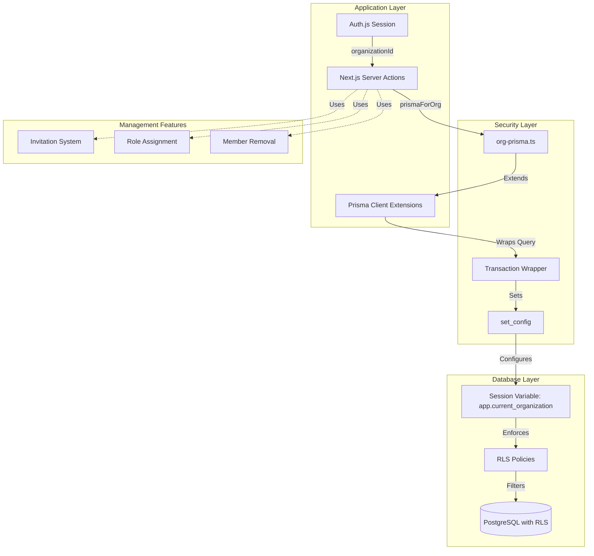
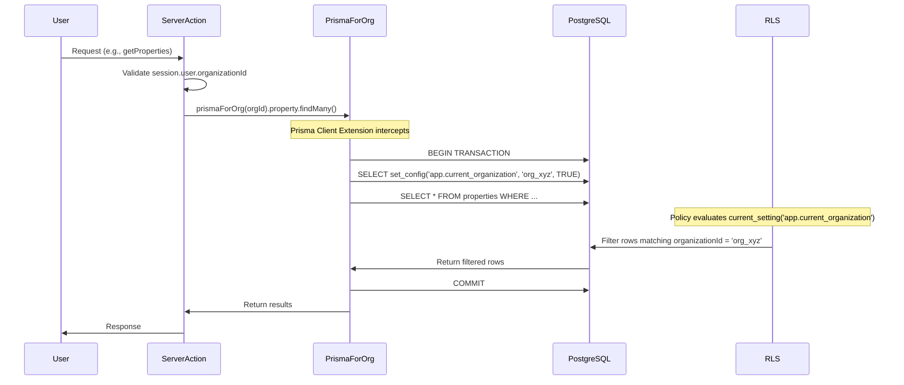
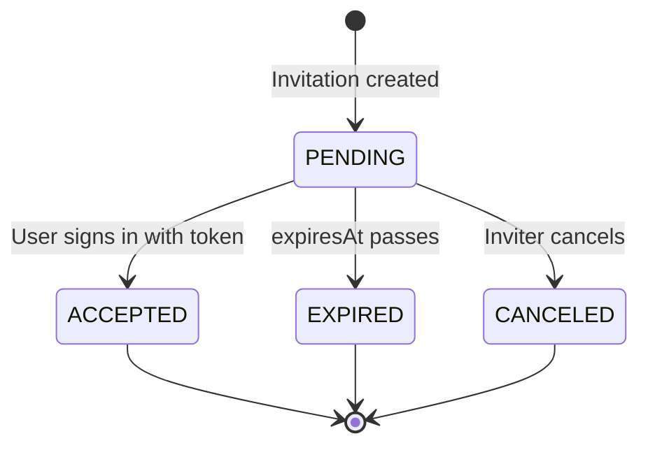
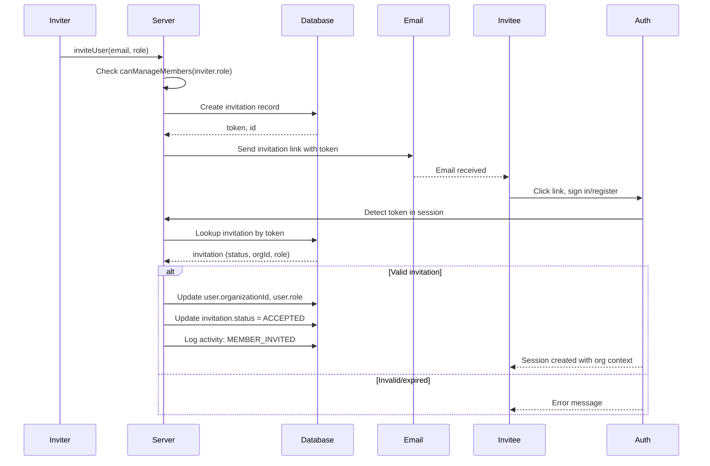
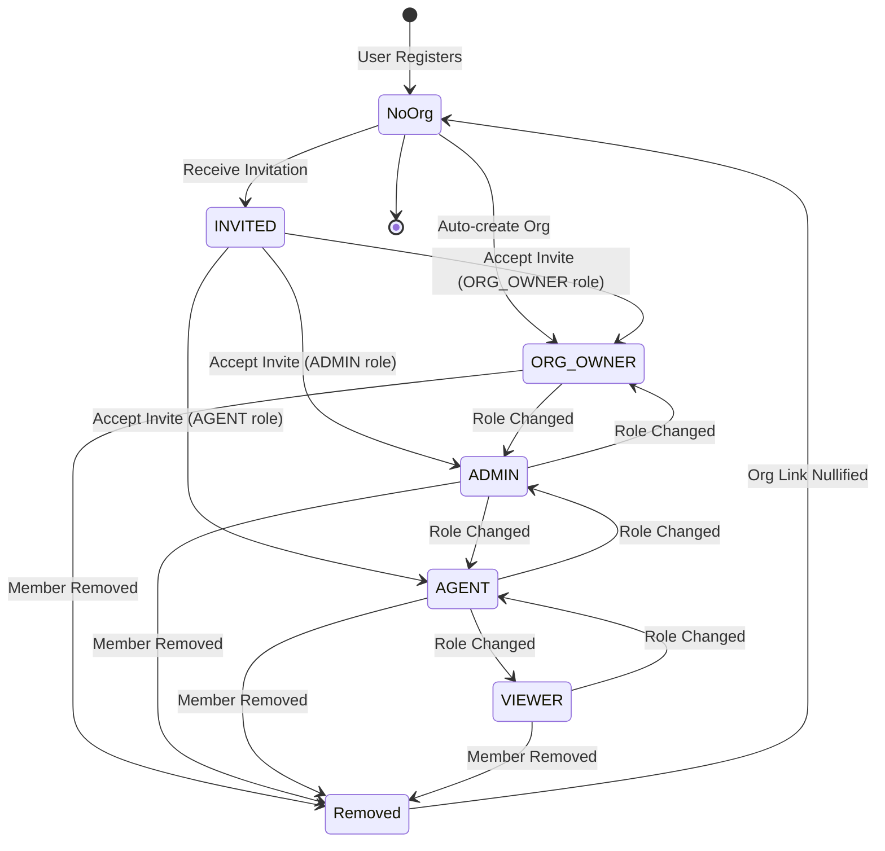
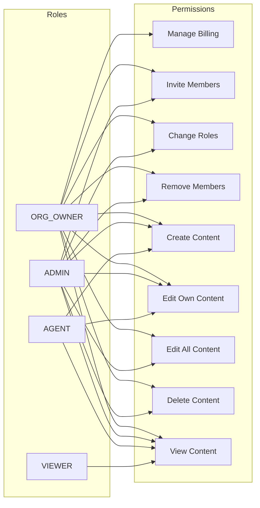

# Security & Multi-Tenancy Setup

## Overview

This design establishes a secure, multi-tenant architecture for Oikion, a real-estate agency operating system. The solution delivers **database-level tenant isolation** using PostgreSQL Row-Level Security (RLS) and **organizational member management** capabilities including invitations, role assignments, and member removal.

### Strategic Goals

1. **Absolute Data Isolation**: Enforce organization boundaries at the database layer, ensuring that even accidental missing filters or compromised application logic cannot expose cross-tenant data
2. **Collaborative Organization Model**: Enable multiple users per organization with granular role-based permissions
3. **Zero-Trust Database Access**: Eliminate reliance on application-layer filtering alone; make the database the ultimate enforcer of tenant boundaries
4. **Operational Flexibility**: Support dynamic team structures through invitation workflows, role changes, and member lifecycle management

### Core Principles

- **Defense in Depth**: RLS as the foundational security layer, supplemented by application-level RBAC
- **Fail-Secure Design**: Database policies reject unauthorized access by default
- **Audit Trail**: All organizational changes generate activity feed events
- **Minimal Disruption**: Integration with existing server actions and UI patterns

---

## Current State Analysis

### Existing Tenancy Model

The application currently implements organization-level tenancy through:

**Schema Structure**
- Organization entity links to users, properties, clients, tasks, and activities
- Tenant-specific tables include `organizationId` foreign key
- Single organization assigned per user at registration time

**Access Control Implementation**
- Auth.js v5 session contains `user.organizationId`, `user.role`
- Role hierarchy: `ORG_OWNER` → `ADMIN` → `AGENT` → `VIEWER`
- Role utilities in `lib/roles.ts` enforce permission boundaries
- Server actions manually filter queries by `session.user.organizationId`

**Security Gaps Identified**

| Gap | Risk | Impact |
|-----|------|--------|
| Application-layer filtering only | Accidental missing WHERE clause exposes all tenant data | **Critical** |
| Single ORG_OWNER per organization | No delegation of administrative duties | **High** |
| No multi-user collaboration | One user = one organization; cannot share workspaces | **High** |
| Unprotected dependent tables | `addresses`, `listings`, `media_assets` rely on parent table filters | **Medium** |

---

## Architecture

### System Components



### Data Flow: Secured Query Execution



---

## Row-Level Security (RLS) Design

### Policy Strategy

**Enforcement Approach**
- Enable RLS on all tenant-scoped tables
- Use `FORCE ROW LEVEL SECURITY` to apply policies to table owner (db admin)
- Create four policies per table: `SELECT`, `INSERT`, `UPDATE`, `DELETE`
- Session variable `app.current_organization` carries tenant context

**Policy Templates**

Tables are grouped by their relationship to `organizationId`:

| Category | Tables | Policy Logic |
|----------|--------|--------------|
| **Direct Organization FK** | `properties`, `clients`, `tasks`, `activities` | `organizationId = current_setting('app.current_organization')::text` |
| **Property Dependents** | `addresses`, `listings`, `media_assets` | `EXISTS (SELECT 1 FROM properties WHERE id = <table>.propertyId AND organizationId = ...)` |
| **Client or Property Dependents** | `interactions`, `notes` | `(clientId IS NOT NULL AND EXISTS (...)) OR (propertyId IS NOT NULL AND EXISTS (...))` |

### RLS Policy Definitions

#### Primary Tables (Direct Organization FK)

**Properties Table**

Natural language description:
- **SELECT**: Users can read properties belonging to their organization
- **INSERT**: Users can create properties only within their organization
- **UPDATE**: Users can modify properties only within their organization
- **DELETE**: Users can remove properties only within their organization

Policy pattern (applies to `properties`, `clients`, `tasks`, `activities`):

| Operation | Condition |
|-----------|-----------|
| SELECT | `USING (organizationId = current_setting('app.current_organization')::text)` |
| INSERT | `WITH CHECK (organizationId = current_setting('app.current_organization')::text)` |
| UPDATE | `USING (...) WITH CHECK (...)` |
| DELETE | `USING (organizationId = current_setting('app.current_organization')::text)` |

#### Dependent Tables (Property-Scoped)

**Addresses, Listings, Media Assets**

Natural language description:
- Access is granted when the parent property belongs to the user's organization
- Subquery validates property ownership before allowing row access

Policy pattern:

| Operation | Condition |
|-----------|-----------|
| SELECT | `USING (EXISTS (SELECT 1 FROM properties p WHERE p.id = <table>.propertyId AND p.organizationId = current_setting(...)))` |
| INSERT | `WITH CHECK (EXISTS (...))` |
| UPDATE | `USING (EXISTS (...)) WITH CHECK (EXISTS (...))` |
| DELETE | `USING (EXISTS (...))` |

#### Dependent Tables (Client or Property-Scoped)

**Interactions, Notes**

Natural language description:
- Access is granted if the row links to a client OR property within the user's organization
- Handles optional relationships (nullable `clientId`, `propertyId`)

Policy pattern:

```
USING (
  (clientId IS NOT NULL AND EXISTS (
    SELECT 1 FROM clients c 
    WHERE c.id = <table>.clientId 
      AND c.organizationId = current_setting('app.current_organization')::text
  ))
  OR
  (propertyId IS NOT NULL AND EXISTS (
    SELECT 1 FROM properties p 
    WHERE p.id = <table>.propertyId 
      AND p.organizationId = current_setting('app.current_organization')::text
  ))
)
```

### Session Variable Management

**Transaction-Scoped Configuration**

The session variable `app.current_organization` is set per-transaction to avoid conflicts in connection pooling environments (e.g., PgBouncer, Neon serverless).

Implementation mechanism:
1. Prisma Client Extension intercepts all query operations
2. Wraps each operation in a transaction
3. Executes `SELECT set_config('app.current_organization', '<orgId>', TRUE)` before the query
4. The `TRUE` flag ensures the setting is transaction-local and resets after commit

**Integration Pattern**

Server actions use the helper:

```typescript
const db = prismaForOrg(session.user.organizationId);
const clients = await db.client.findMany({ where: { ... } });
```

The `prismaForOrg` utility:
- Accepts `orgId` as parameter
- Returns an extended Prisma client instance
- Extension wraps `$allOperations` on `$allModels`
- Guarantees `app.current_organization` is set before query execution

---

## Organization Management

### Invitation System

**Purpose**: Enable existing organization members to invite new users via email, assigning them a role before they sign in.

#### Invitation Data Model

| Field | Type | Description |
|-------|------|-------------|
| `id` | String (PK) | Unique invitation identifier |
| `organizationId` | String (FK) | Target organization |
| `email` | String | Invitee email address |
| `role` | UserRole enum | Assigned role upon acceptance |
| `token` | String (unique) | Cryptographically secure acceptance token |
| `status` | Enum | `PENDING` \| `ACCEPTED` \| `CANCELED` \| `EXPIRED` |
| `invitedBy` | String (FK) | User ID of inviter |
| `expiresAt` | DateTime | Invitation expiration timestamp |
| `createdAt` | DateTime | Creation timestamp |

**Status Lifecycle**



#### Invitation Workflow



**Server Action: Invite User**

Inputs:
- `email`: Target user email (string, validated format)
- `role`: Role to assign (UserRole enum)

Business logic:
1. Validate `session.user` is authenticated
2. Check `canManageMembers(session.user.role)` → must be `ADMIN` or `ORG_OWNER`
3. Prevent inviting to roles higher than inviter's own role (`canAssignRole`)
4. Check if user with `email` already exists in organization (reject duplicate)
5. Generate cryptographically secure token (e.g., 32-byte random hex)
6. Set `expiresAt` to 7 days from creation
7. Create `invitation` record with `status = PENDING`
8. Send email via Resend provider with invitation link: `/accept-invite?token=<token>`
9. Log activity: `MEMBER_INVITED`

Outputs:
- Success: `{ success: true, invitationId }`
- Failure: Throw error with message

**Server Action: Accept Invitation**

Inputs:
- `token`: Invitation token (string)

Business logic:
1. Lookup `invitation` by `token`
2. Validate `status === PENDING` and `expiresAt > now()`
3. Check if `session.user.email === invitation.email`
4. Update `user.organizationId = invitation.organizationId`, `user.role = invitation.role`
5. Update `invitation.status = ACCEPTED`
6. Regenerate JWT token to include new `organizationId` in session
7. Log activity: `MEMBER_JOINED` (or reuse `MEMBER_INVITED` with updated payload)

Outputs:
- Success: Redirect to `/dashboard`
- Failure: Redirect to error page with reason

**Authentication Integration**

Modify `auth.ts`:
- Add check in `events.createUser`: if invitation token is present in temporary storage (e.g., cookie, database lookup by email), skip creating new organization
- Alternative: detect invitation during `signIn` callback, store token in temporary table, consume in `jwt` callback

Token passing strategy:
1. Invitation link includes query param: `/login?inviteToken=<token>`
2. Login page stores token in httpOnly cookie
3. `jwt` callback reads cookie, validates invitation, assigns organization
4. Clear cookie after consumption

### Role Assignment

**Purpose**: Allow administrators to change roles of existing organization members.

**Server Action: Update User Role**

Inputs:
- `targetUserId`: User ID to update (string)
- `newRole`: Role to assign (UserRole enum)

Business logic:
1. Validate `session.user` is authenticated
2. Check `canManageMembers(session.user.role)`
3. Check `canAssignRole(session.user.role, newRole)` → cannot promote users to higher roles than self
4. Fetch `targetUser` and verify `targetUser.organizationId === session.user.organizationId`
5. Prevent self-role changes if `targetUserId === session.user.id` (must use different mechanism for self-demotion)
6. Update `targetUser.role = newRole`
7. Log activity: `MEMBER_ROLE_CHANGED` with payload `{ userId, oldRole, newRole }`
8. Trigger session refresh for target user (optional: websocket notification or force re-login)

Outputs:
- Success: `{ success: true }`
- Failure: Throw error with message

**Role Assignment Rules**

| Inviter Role | Can Assign Roles |
|--------------|------------------|
| `ORG_OWNER` | `ORG_OWNER`, `ADMIN`, `AGENT`, `VIEWER` |
| `ADMIN` | `ADMIN`, `AGENT`, `VIEWER` |
| `AGENT` | Cannot manage members |
| `VIEWER` | Cannot manage members |

Special constraints:
- An organization must always have at least one `ORG_OWNER`
- Prevent downgrading the last `ORG_OWNER` unless transferring ownership
- `ORG_OWNER` can assign another user as `ORG_OWNER` (shared ownership model)

### Member Removal

**Purpose**: Remove users from an organization, handling data ownership and session invalidation.

**Server Action: Remove User**

Inputs:
- `targetUserId`: User ID to remove (string)

Business logic:
1. Validate `session.user` is authenticated
2. Check `canManageMembers(session.user.role)`
3. Fetch `targetUser` and verify `targetUser.organizationId === session.user.organizationId`
4. Prevent self-removal unless `session.user.role === ORG_OWNER` and alternative owner exists
5. Prevent removing the last `ORG_OWNER`
6. Determine removal strategy (see options below)
7. Log activity: `MEMBER_REMOVED` with payload `{ userId, removedBy }`

Removal strategy options:

| Strategy | Behavior | Trade-offs |
|----------|----------|------------|
| **Nullify organization** | Set `user.organizationId = NULL`, `user.role = AGENT` | User account persists; can be re-invited; loses access immediately |
| **Create personal org** | Generate new organization, assign user as sole `ORG_OWNER` | User retains account but starts fresh workspace |
| **Delete account** | Remove user entirely with cascade | Permanent; may break audit trails if user created content |

**Recommended strategy**: Nullify organization. This preserves audit trails (created content still links to user ID) while revoking access.

**Data Ownership Handling**

When a user is removed:
- Properties, clients, tasks, notes created by them remain in the organization
- `createdBy` foreign key still points to user ID
- UI displays "Former Member" or user name (soft-deleted user record)
- Alternative: implement soft-delete flag `user.deletedAt` and filter queries

**Session Invalidation**

After removal:
- Removed user's session becomes invalid on next request (JWT includes `organizationId` which now mismatches)
- Middleware redirects to organization selection or login page
- Consider implementing real-time logout via websocket or server-sent event

### Admin Access Control

**Update Admin Gating Logic**

Current implementation restricts `/dashboard/admin` to `ORG_OWNER` only. Update to support `ADMIN` role:

Middleware check:
```typescript
if (!canAccessAdmin(session.user.role)) {
  redirect('/dashboard');
}
```

Where `canAccessAdmin` returns `true` for both `ORG_OWNER` and `ADMIN`.

UI Sections by Role:

| Section | ORG_OWNER | ADMIN | AGENT | VIEWER |
|---------|-----------|-------|-------|--------|
| Member Management | ✅ | ✅ | ❌ | ❌ |
| Billing & Subscription | ✅ | ❌ | ❌ | ❌ |
| Organization Settings | ✅ | ✅ (limited) | ❌ | ❌ |
| Delete Organization | ✅ | ❌ | ❌ | ❌ |

---

## Activity Feed Integration

All organizational management actions generate events in the `activities` table for transparency and audit purposes.

### New Activity Types

Add to `ActionType` enum:

| Action Type | Triggered By | Payload Example |
|-------------|--------------|-----------------|
| `MEMBER_INVITED` | `inviteUser` | `{ email, role, invitedBy }` |
| `MEMBER_JOINED` | `acceptInvite` | `{ userId, email, role }` |
| `MEMBER_ROLE_CHANGED` | `updateUserRole` | `{ userId, oldRole, newRole, changedBy }` |
| `MEMBER_REMOVED` | `removeUser` | `{ userId, email, removedBy, reason }` |
| `INVITATION_CANCELED` | `cancelInvite` | `{ invitationId, email, canceledBy }` |

### Activity Logging Pattern

Consistent pattern across all server actions:

1. Perform primary operation (e.g., update user role)
2. Construct activity payload with relevant context
3. Call `prismaForOrg(orgId).activity.create({ ... })`
4. Log errors but do not block main operation if activity creation fails

Example for role change:
```typescript
await createActivity(
  ActionType.MEMBER_ROLE_CHANGED,
  targetUserId,
  session.user.id,
  session.user.organizationId,
  {
    targetUserName: targetUser.name,
    oldRole: targetUser.role,
    newRole: newRole,
  }
);
```

---

## User Interface Design

### Members Management Screen

**Location**: `/dashboard/admin/members`

**Sections**:

1. **Active Members List**
   - Table columns: Name, Email, Role, Joined Date, Actions
   - Actions: Change Role (dropdown), Remove (confirmation modal)
   - Filter by role
   - Sort by name, joined date

2. **Pending Invitations**
   - Table columns: Email, Role, Invited By, Expires At, Status, Actions
   - Actions: Resend Email, Cancel Invitation
   - Auto-refresh status (expired invitations highlighted)

3. **Invite New Member**
   - Form fields: Email (input), Role (select dropdown)
   - Validation: email format, role selection
   - Submit button: "Send Invitation"
   - Success message: "Invitation sent to {email}"

**Permission Checks**:
- Entire page requires `canManageMembers(user.role)`
- Role dropdown options filtered by `canAssignRole(user.role, targetRole)`
- Billing section link only visible to `ORG_OWNER`

### Components Structure

| Component | Purpose | Props |
|-----------|---------|-------|
| `MembersList` | Display active members table | `members`, `onRoleChange`, `onRemove` |
| `InvitationsList` | Display pending invitations table | `invitations`, `onResend`, `onCancel` |
| `InviteMemberForm` | Form for sending invitations | `onSubmit` |
| `RoleSelectDropdown` | Role selection with permissions | `currentUserRole`, `selectedRole`, `onChange` |
| `RemoveMemberModal` | Confirmation dialog for removal | `member`, `onConfirm`, `onCancel` |

**Accessibility Requirements**:
- Keyboard navigation for all interactive elements
- ARIA labels on role dropdowns and action buttons
- Focus management in modals (trap focus, restore on close)
- Screen reader announcements for async actions (invitations sent, members removed)

---

## Data Model Extensions

### New Table: Invitations

```
Table: invitations

Columns:
- id              String      Primary Key, CUID
- organizationId  String      Foreign Key → organizations.id, NOT NULL
- email           String      NOT NULL
- role            UserRole    Enum (ORG_OWNER, ADMIN, AGENT, VIEWER), NOT NULL
- token           String      UNIQUE, NOT NULL
- status          InvitationStatus  Enum (PENDING, ACCEPTED, CANCELED, EXPIRED), DEFAULT PENDING
- invitedBy       String      Foreign Key → users.id, NOT NULL
- expiresAt       DateTime    NOT NULL
- createdAt       DateTime    DEFAULT now()

Indexes:
- token (unique, for fast lookup)
- organizationId (for filtering org invitations)
- email (for duplicate detection)
- status (for filtering pending invitations)

Constraints:
- CHECK (expiresAt > createdAt)
- Cascading delete: when organization is deleted, delete invitations
```

### New Enum: InvitationStatus

```
Enum InvitationStatus {
  PENDING
  ACCEPTED
  CANCELED
  EXPIRED
}
```

### Schema Migration Strategy

Migration steps:
1. Create `InvitationStatus` enum type
2. Create `invitations` table with all columns
3. Add indexes and constraints
4. Create foreign key relationships with `ON DELETE CASCADE`

No backfill required (new feature, no existing data).

---

## Security Considerations

### RLS Policy Performance

**Concern**: Subquery-based policies on dependent tables may impact performance.

**Mitigation**:
- Ensure indexes exist on foreign keys (`propertyId`, `clientId`, `organizationId`)
- Monitor query execution plans using `EXPLAIN ANALYZE`
- Consider denormalizing `organizationId` onto dependent tables if performance degrades

**Current indexes** (from schema):
- `properties.organizationId` ✅
- `clients.organizationId` ✅
- `addresses.propertyId` ✅ (unique)
- `listings.propertyId` ✅ (unique)
- `media_assets.propertyId` ✅
- `interactions.clientId` ✅
- `interactions.propertyId` ✅
- `notes.clientId` ✅
- `notes.propertyId` ✅

### Invitation Token Security

**Requirements**:
- Token must be cryptographically secure (128-bit entropy minimum)
- Token must be single-use (status transition prevents reuse)
- Token must expire (7-day default, configurable)

**Implementation**:
- Generate using `crypto.randomBytes(32).toString('hex')`
- Store hashed version in database (optional, adds complexity)
- Validate expiration before acceptance
- Rate-limit invitation sending (prevent spam)

### Session Variable Injection Protection

**Concern**: Malicious SQL injection via `set_config` call.

**Mitigation**:
- `orgId` parameter is validated to match session user's organization
- Prisma parameterizes the query (`` `SELECT set_config(..., ${orgId}::text, TRUE)` ``)
- Session `organizationId` comes from authenticated JWT, not user input

### Bypass Prevention

**Scenarios & Safeguards**:

| Attack Vector | Safeguard |
|---------------|-----------|
| Direct database access | RLS enforced even for db owner (FORCE ROW LEVEL SECURITY) |
| Missing `prismaForOrg` wrapper | Policies reject queries without session variable set |
| Role escalation | `canAssignRole` prevents assigning higher roles than self |
| Invitation token theft | Expiration + email validation + single-use |
| Session hijacking | httpOnly cookies, secure HTTPS, short JWT expiry |

---

## Implementation Phases

### Phase 1: Database Isolation (Estimated: 2 days)

**Objectives**:
- RLS policies active on all tenant tables
- `prismaForOrg` utility integrated into server actions
- Verified cross-org isolation

**Tasks**:
1. Write RLS migration SQL for primary tables (properties, clients, tasks, activities)
2. Write RLS migration SQL for dependent tables (addresses, listings, media_assets, interactions, notes)
3. Test migration locally, validate policies with manual queries
4. Deploy migration to staging database
5. Verify `prismaForOrg` utility sets session variable correctly
6. Incrementally update server actions:
   - `actions/clients.ts` → use `prismaForOrg`
   - `actions/properties.ts` → use `prismaForOrg`
   - `actions/interactions.ts` → use `prismaForOrg`
   - `actions/media.ts` → use `prismaForOrg`
   - `actions/activities.ts` → use `prismaForOrg`
7. Run regression tests on all CRUD operations
8. Verify cross-org isolation: create two test users in different orgs, attempt to access each other's data

**Acceptance Criteria**:
- All queries execute successfully with RLS enabled
- No cross-org data leakage in test scenarios
- Application behavior unchanged from user perspective

### Phase 2: Invitation System (Estimated: 3 days)

**Objectives**:
- Users can invite new members via email
- Invitations tracked with expiration and status
- Token-based acceptance flow integrated with authentication

**Tasks**:
1. Create Prisma schema for `invitations` table and `InvitationStatus` enum
2. Generate and run migration
3. Implement server action: `inviteUser(email, role)`
   - Validation logic (RBAC, duplicate detection)
   - Token generation
   - Email sending via Resend
4. Implement server action: `acceptInvite(token)`
   - Token validation
   - User assignment to organization
   - Session regeneration
5. Modify `auth.ts` to detect invite token during sign-in
   - Cookie-based token passing
   - Skip org creation if invitation exists
6. Build UI component: `InviteMemberForm`
7. Build UI component: `InvitationsList` (pending invitations)
8. Add activity logging for `MEMBER_INVITED`, `MEMBER_JOINED`
9. Test end-to-end flow: send invite → receive email → sign in → verify org assignment

**Acceptance Criteria**:
- Invitation emails delivered successfully
- Invited users join organization with correct role
- Expired/invalid tokens rejected gracefully
- Activity feed logs invitation events

### Phase 3: Role Management (Estimated: 1.5 days)

**Objectives**:
- Admins can change roles of existing members
- Role assignment respects hierarchy constraints
- Activity feed logs role changes

**Tasks**:
1. Implement server action: `updateUserRole(targetUserId, newRole)`
   - Validation: RBAC, role hierarchy, same-org check
   - Update user record
   - Activity logging
2. Build UI component: `RoleSelectDropdown` with permission-aware options
3. Integrate dropdown into `MembersList` table
4. Test role change flow across all role combinations
5. Verify session refresh for updated user (or document manual re-login requirement)

**Acceptance Criteria**:
- Role changes persist correctly
- Lower-privilege users cannot escalate roles
- Activity feed reflects changes

### Phase 4: Member Removal (Estimated: 1.5 days)

**Objectives**:
- Admins can remove members from organization
- Removed users lose access immediately
- Data integrity maintained (audit trail preserved)

**Tasks**:
1. Implement server action: `removeUser(targetUserId)`
   - Validation: RBAC, same-org, prevent last ORG_OWNER removal
   - Nullify `organizationId` and reset role
   - Activity logging
2. Build UI component: `RemoveMemberModal` with confirmation step
3. Integrate modal into `MembersList` table actions
4. Test removal flow: verify session invalidation, data ownership handling
5. Document "Former Member" display logic in UI

**Acceptance Criteria**:
- Removed users cannot access organization data
- Created content remains visible with attribution
- Confirmation modal prevents accidental removals

### Phase 5: Admin Gating Update (Estimated: 0.5 days)

**Objectives**:
- Both `ORG_OWNER` and `ADMIN` roles can access admin features
- Billing section restricted to `ORG_OWNER` only

**Tasks**:
1. Update middleware to use `canAccessAdmin(role)` check
2. Update admin layout to conditionally show billing link
3. Test access control: verify ADMIN can access members, cannot access billing

**Acceptance Criteria**:
- `ADMIN` users see admin UI without billing section
- Access control functions correctly across role hierarchy

### Phase 6: Integration Testing & Validation (Estimated: 1.5 days)

**Objectives**:
- End-to-end validation of all features
- Regression testing of existing functionality
- Performance profiling of RLS policies

**Tasks**:
1. Create test scenarios:
   - Multi-org isolation (verify no cross-contamination)
   - Complete member lifecycle (invite → join → role change → remove)
   - Permission boundaries (low-privilege users blocked appropriately)
2. Run performance profiling: measure query latency with RLS enabled
3. Verify activity feed completeness (all events logged)
4. Accessibility audit: keyboard navigation, screen reader compatibility
5. Security audit: validate token handling, session management, SQL injection safeguards

**Acceptance Criteria**:
- All test scenarios pass
- No performance degradation exceeding 10% baseline
- Zero accessibility violations on critical flows

---

## Testing Strategy

### Unit Testing

**Server Actions**:
- Mock Prisma client with organization context
- Verify role-based permission checks
- Validate input schemas (Zod validation)
- Test error handling (unauthorized, not found, invalid input)

**Utilities**:
- `prismaForOrg`: verify session variable set correctly
- Role functions: validate hierarchy logic (`canAssignRole`, `canManageMembers`)

### Integration Testing

**Database Isolation**:
- Scenario: User A queries properties; verify User B's properties not returned
- Scenario: Direct SQL query with wrong `app.current_organization`; expect empty result

**Invitation Flow**:
- Scenario: Send invite → accept → verify org assignment and role
- Scenario: Expired token → expect rejection
- Scenario: Invalid token → expect error

**Role Management**:
- Scenario: ADMIN changes AGENT to VIEWER → verify success
- Scenario: AGENT attempts to change role → expect unauthorized error

### End-to-End Testing

**User Journeys**:
1. New organization setup
   - User registers → org created → user is ORG_OWNER
   - Create properties and clients → verify isolated from other orgs
2. Invite member
   - ORG_OWNER invites AGENT → email sent
   - Invitee signs in with token → joins org with AGENT role
   - Verify AGENT can create but not delete others' content
3. Role escalation
   - ORG_OWNER promotes AGENT to ADMIN
   - ADMIN invites new VIEWER
   - Verify ADMIN cannot access billing
4. Member removal
   - ADMIN removes VIEWER
   - Verify VIEWER cannot access org data
   - Verify created content persists

---

## Rollback Plan

### Database Migration Rollback

If RLS causes critical failures:

**Immediate mitigation**:
1. Disable RLS on affected tables:
   ```sql
   ALTER TABLE "properties" DISABLE ROW LEVEL SECURITY;
   ```
2. Revert application to use direct `prisma` client (comment out `prismaForOrg` calls)

**Full rollback**:
1. Create down-migration:
   - Drop all RLS policies
   - Disable RLS on all tables
2. Deploy rollback migration
3. Remove `prismaForOrg` utility and revert server actions to original code

**Data integrity**: RLS does not modify data; rollback is non-destructive.

### Feature Rollback (Invitations)

If invitation system causes issues:

**Mitigation**:
1. Disable invite UI (hide components)
2. Block `inviteUser` server action (throw error)
3. Existing members unaffected (no data corruption)

**Cleanup**:
1. Drop `invitations` table
2. Remove invitation-related server actions
3. Revert auth flow changes

---

## Operational Considerations

### Connection Pooling Compatibility

**PgBouncer / Neon Serverless**:
- Transaction-scoped `set_config` ensures compatibility
- Session pooling mode NOT supported (would require alternative strategy)
- Verify pooling mode with hosting provider

### Performance Monitoring

**Key Metrics**:
- Query latency (p50, p95, p99) before/after RLS
- Database CPU utilization
- RLS policy evaluation time (`EXPLAIN ANALYZE` output)

**Alerting Thresholds**:
- Query latency > 500ms for property/client list views
- Database CPU > 80% sustained

### Backup & Disaster Recovery

**RLS Impact on Backups**:
- Policies are part of schema; included in `pg_dump`
- Restore process preserves policies

**Testing**:
- Perform test restore on staging database
- Verify RLS enforcement after restore

---

## Documentation Requirements

### External Documentation

1. **Step-by-Step RLS Setup Guide** (for external database management):
   - Prerequisites: PostgreSQL version compatibility (11+)
   - Manual policy creation commands
   - Verification queries
   - Troubleshooting common errors (session variable not set, policy syntax)

2. **Invitation System User Guide**:
   - How to invite members
   - Understanding roles and permissions
   - Troubleshooting expired/invalid tokens

3. **Migration Runbook**:
   - Pre-migration checklist
   - Execution steps
   - Rollback procedures
   - Validation queries

### Internal Documentation

1. **Code Comments**:
   - Document `prismaForOrg` utility usage in server action headers
   - Explain RLS policy logic in migration comments

2. **Architectural Decision Records (ADRs)**:
   - ADR-001: Choice of RLS over application-layer filtering
   - ADR-002: Transaction-scoped session variable strategy
   - ADR-003: Nullify vs. delete for member removal

---

## Future Enhancements

### Phase 2+: Data Encryption

**Option A: Server-Side Field Encryption**
- Use `prisma-field-encryption` extension
- Encrypt sensitive fields: `clients.name`, `clients.email`, `clients.phone`, `interactions.summary`, `notes.content`
- Add hash side-car fields for exact-match filtering
- Key management: `PRISMA_FIELD_ENCRYPTION_KEY` in environment

**Option B: Client-Side End-to-End Encryption**
- Generate per-user keypair (public/private)
- Private key stored client-side, encrypted with password-derived key
- Encrypt fields in browser before submission
- Server stores ciphertext; cannot decrypt
- Trade-off: Complex key management, limited server-side filtering

**Recommendation**: Defer encryption to Phase 2 after validating RLS stability.

### Organization Lifecycle Management

**Delete Organization**:
- Admin UI for `ORG_OWNER` to dissolve organization
- Cascade delete all properties, clients, tasks, activities
- Transfer members to personal orgs or nullify
- Confirmation workflow with data export option

**Organization Transfer**:
- Allow `ORG_OWNER` to designate successor
- Atomic role swap with activity logging

---

## Risk Assessment

| Risk | Likelihood | Impact | Mitigation |
|------|------------|--------|------------|
| RLS performance degradation | Medium | High | Index optimization, query profiling, denormalization fallback |
| Session variable not set (bug) | Low | Critical | Comprehensive testing, monitoring alerts on failed queries |
| Invitation token theft | Low | Medium | HTTPS enforcement, expiration, single-use validation |
| Last ORG_OWNER removal | Low | High | Validation logic prevents, UI warning |
| Database migration failure | Low | Critical | Staging environment testing, rollback script ready |
| User confusion (role changes) | Medium | Low | Clear UI labels, activity feed transparency |

---

## Compliance & Audit

### GDPR Alignment

- **Right to Access**: Users can export their data via organization admin
- **Right to Erasure**: Member removal nullifies org link; full deletion requires account deletion
- **Data Minimization**: RLS enforces need-to-know access
- **Audit Trail**: Activity feed logs all organizational changes

### Audit Log Requirements

All organizational management actions generate immutable activity records with:
- Timestamp
- Actor (user ID)
- Action type
- Target entity
- Payload (context-specific details)

Retention policy: activities retained indefinitely unless organization deleted.

---

## Reference Diagrams

### Organization Membership Lifecycle



### Permission Matrix



---

## Appendix: RLS Policy Verification Queries

### Test Cross-Org Isolation

```sql
-- Setup: Create two organizations and users
-- Set session variable for Org A
SELECT set_config('app.current_organization', 'org_a_id', TRUE);

-- Query should return only Org A properties
SELECT * FROM properties;

-- Switch to Org B
SELECT set_config('app.current_organization', 'org_b_id', TRUE);

-- Query should return only Org B properties
SELECT * FROM properties;
```

### Test Dependent Table Policies

```sql
-- Set session variable
SELECT set_config('app.current_organization', 'org_a_id', TRUE);

-- Query address via property relationship
SELECT a.* 
FROM addresses a
JOIN properties p ON p.id = a."propertyId"
WHERE p."organizationId" = 'org_a_id';

-- RLS policy should allow this; verify no extra rows
```

### Verify Policy Enforcement on Admin Role

```sql
-- Attempt to bypass RLS as database owner
SET ROLE postgres; -- or your admin role

-- Enable FORCE ROW LEVEL SECURITY ensures even admin respects policies
SELECT * FROM properties; -- Should still be filtered by session variable
```

---

## Appendix: Email Template (Invitation)

**Subject**: You're invited to join {Organization Name} on Oikion

**Body**:

```
Hi,

{Inviter Name} has invited you to join {Organization Name} as a {Role} on Oikion.

Oikion is the operating system for real-estate agencies, helping teams manage properties, clients, and collaboration in one place.

Accept your invitation by clicking the link below:

[Accept Invitation]({Base URL}/accept-invite?token={Token})

This invitation expires on {Expiration Date}.

If you have any questions, reply to this email.

Thanks,
The Oikion Team
```

---

## Glossary

| Term | Definition |
|------|------------|
| **RLS** | Row-Level Security; PostgreSQL feature enforcing per-row access control |
| **Tenant** | An organization; isolated data boundary |
| **Session Variable** | PostgreSQL runtime configuration variable scoped to transaction or session |
| **RBAC** | Role-Based Access Control; permission model based on user roles |
| **ORG_OWNER** | Highest privilege role; full operational and billing access |
| **ADMIN** | Administrative role; operational access + member management, no billing |
| **AGENT** | Standard user role; create/edit own content |
| **VIEWER** | Read-only role |
| **Invitation Token** | Cryptographically secure string for one-time invitation acceptance |
| **Activity Feed** | Chronological log of organizational events |
