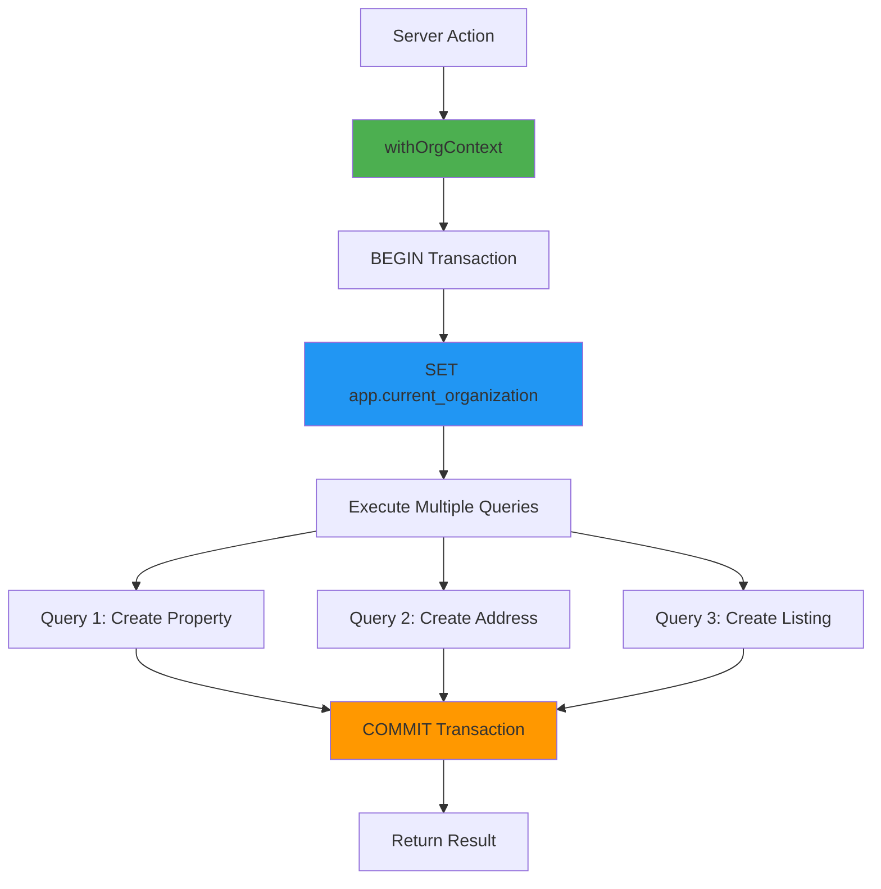
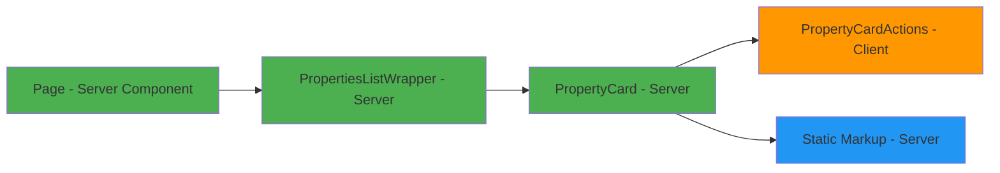
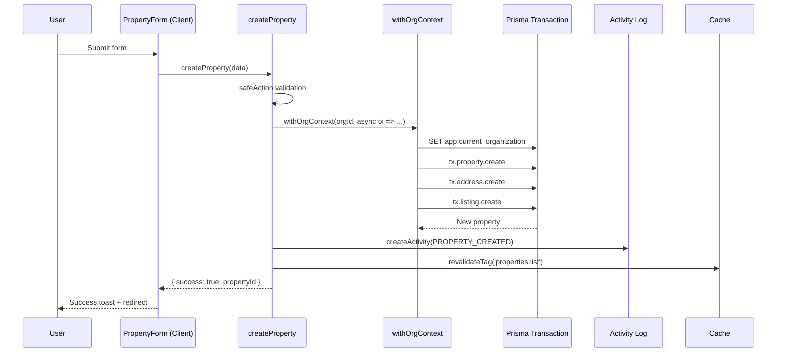
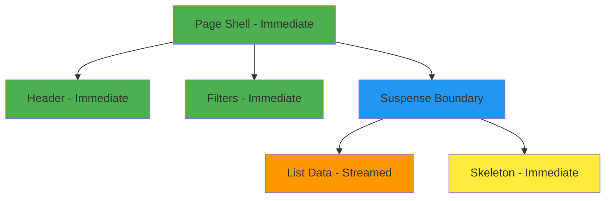
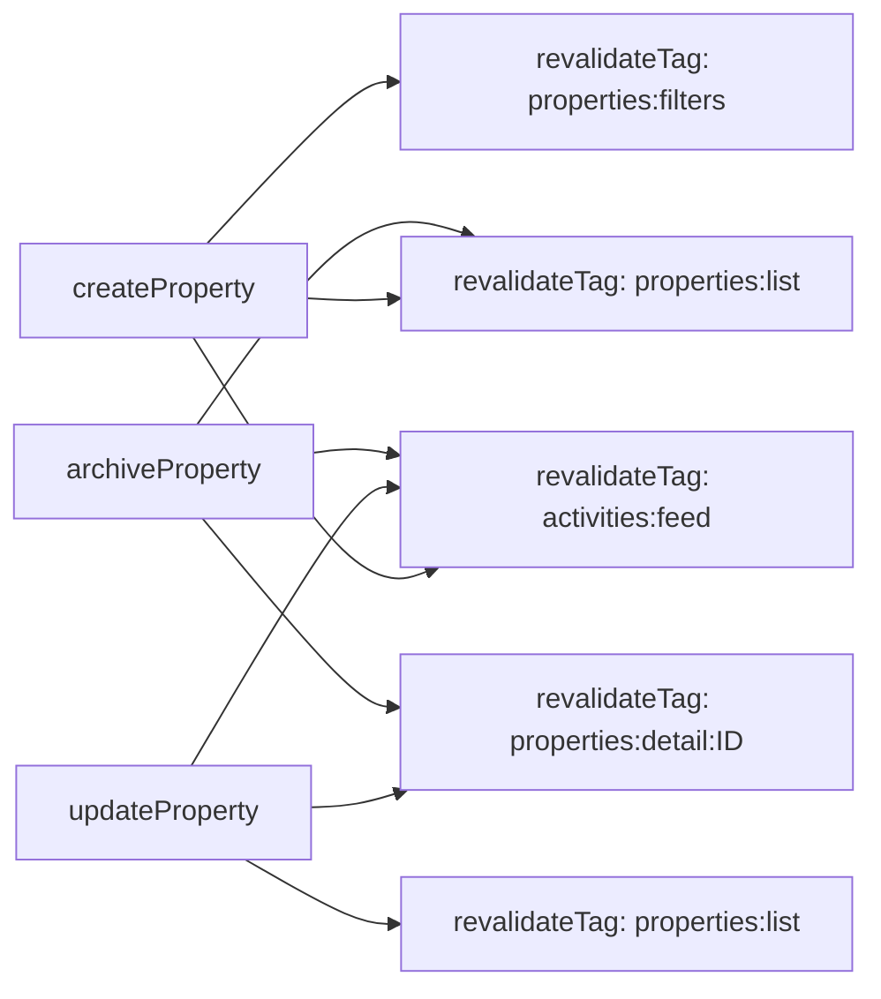
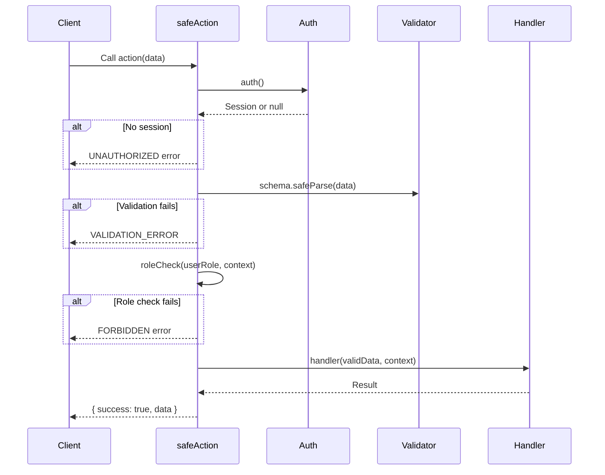

# Speed & Security Sprint Design

## Overview

**Objective**: Reduce real and perceived loading times across MLS (Properties) and CRM (Clients) workflows while maintaining strict tenant isolation and enhancing server action security defenses.

**Duration**: 7 days

**Target Metrics**:
- Properties list page: First Contentful Paint ≤ 1.2s (desktop), Hydration ≤ 300ms
- Client list page: FCP ≤ 1.2s, Hydration ≤ 300ms
- API/server actions: 30–50% reduction in average response time for list and CRUD operations
- Database: 30–50% reduction in I/O and CPU for common filter queries
- Zero RLS policy bypass; no regression in accessibility, role enforcement, or subscription gating

**Technology Context**:
- Next.js 14 App Router with React Server Components
- TypeScript, Prisma ORM, PostgreSQL (Neon)
- Auth.js v5 for authentication
- Row Level Security (RLS) for tenant isolation
- shadcn/ui components, Tailwind CSS
- Stripe for subscription management

---

## Architecture

### Current State Analysis

#### Organization Scoping Bottleneck
The existing `prismaForOrg` implementation wraps every individual Prisma query in a separate transaction with a `set_config` call to set the `app.current_organization` session variable. This creates significant overhead:
- Each server action performing multiple queries executes multiple transactions
- Example: `createProperty` performs 3 queries (property, address, listing) = 3 separate transactions with 3 `set_config` calls
- Example: `updateProperty` performs up to 4 queries = 4 transactions
- `getProperties` performs 2 queries in parallel but each still wrapped individually

#### Missing Database Indexes
The schema lacks strategic indexes for common filter patterns:
- No composite indexes on `(organizationId, status)`, `(organizationId, transactionType)`
- No text search optimization for location fields (city, region, locationText)
- No indexes for client search patterns (name, email, phone)
- Missing indexes for array operations on tags field

#### Over-fetching in List Queries
Current list endpoints include excessive data:
- Properties list includes full interaction/note/task arrays in detail view (10 items each)
- List view fetches all relationship data even though only counts are displayed
- No pagination limits enforced consistently
- Media assets fetched without restrictions on list views

#### Client-Side Rendering Overhead
List components are fully client-side:
- `PropertiesList` and `ContactsList` are "use client" components
- Entire card markup, formatting logic, and static content hydrates on client
- Interactive elements (dropdowns) force entire component to be client-rendered
- Large client bundles for features like date formatting, number formatting, badge logic

### Target Architecture

#### Batch Organization Context Pattern



New helper function `withOrgContext(orgId, fn)` that:
- Executes single `set_config` call within a transaction
- Allows multiple queries to run within the same organizational context
- Reduces transaction overhead from N queries to 1 transaction per action

#### Database Index Strategy

| Table | Index Type | Fields | Purpose |
|-------|-----------|---------|---------|
| Property | B-tree composite | (organizationId, status) | Filter by status within org |
| Property | B-tree composite | (organizationId, transactionType) | Filter sale/rent within org |
| Property | B-tree composite | (organizationId, propertyType) | Filter apartment/house within org |
| Property | B-tree composite | (organizationId, price) | Range queries on price |
| Address | GIN trigram | city | Free-text search on city names |
| Address | GIN trigram | region | Free-text search on region names |
| Address | GIN trigram | locationText | Free-text search on location descriptions |
| Client | B-tree composite | (organizationId, clientType) | Filter by buyer/seller/landlord |
| Client | GIN | tags | Array contains queries |
| Client | GIN trigram | name | Text search on client names |
| Client | GIN trigram | email | Text search on email addresses |
| Client | GIN trigram | phone | Text search on phone numbers |
| Listing | B-tree | propertyId | Join optimization |
| Listing | B-tree | marketingStatus | Filter by draft/active/archived |

#### Query Optimization Strategy

**List Endpoints - Minimal Projection**:
- Select only fields rendered in card views
- Use `_count` for relationships instead of fetching arrays
- Fetch only primary media asset with `take: 1`
- Enforce default pagination limit of 24, hard cap at 50

**Detail Views - Controlled Loading**:
- Move full interaction/note/task lists to separate queries
- Implement lazy loading for timeline components
- Limit initial timeline items to 5, load more on demand

#### Server Components Architecture



**Conversion Strategy**:
- Page components remain server components (already implemented)
- Create new server-rendered list wrappers
- Convert static card markup to server components
- Extract interactive elements (dropdowns, archive buttons) to minimal client islands
- Move formatting logic (dates, currency, badges) to server utilities

---

## Data Flow

### Properties List Flow

```mermaid
sequenceDiagram
    participant User
    participant Page as Page (RSC)
    participant Action as getProperties
    participant DB as withOrgContext
    participant Postgres
    
    User->>Page: Navigate to /dashboard/properties
    Page->>Action: getProperties(filters)
    Action->>DB: withOrgContext(orgId, fn)
    DB->>Postgres: BEGIN; SET app.current_organization
    DB->>Postgres: SELECT properties (filtered, paginated)
    Postgres-->>DB: Properties data
    DB->>Postgres: SELECT COUNT(*)
    Postgres-->>DB: Total count
    DB->>Postgres: COMMIT
    DB-->>Action: { properties, totalCount }
    Action-->>Page: Serialized data
    Page-->>User: HTML with minimal client JS
    
    Note over User,Postgres: Only dropdown interactions hydrate
```

### Property Creation Flow



---

## Database Schema Enhancements

### Migration: Add Performance Indexes

**Purpose**: Optimize common query patterns across Properties and Clients domains.

**Index Definitions**:

| Index Name | Table | Type | Definition |
|------------|-------|------|------------|
| `idx_property_org_status` | Property | B-tree | `(organizationId, status)` |
| `idx_property_org_transaction` | Property | B-tree | `(organizationId, transactionType)` |
| `idx_property_org_type` | Property | B-tree | `(organizationId, propertyType)` |
| `idx_property_org_price` | Property | B-tree | `(organizationId, price)` |
| `idx_address_city_trgm` | Address | GIN | `city gin_trgm_ops` |
| `idx_address_region_trgm` | Address | GIN | `region gin_trgm_ops` |
| `idx_address_location_trgm` | Address | GIN | `locationText gin_trgm_ops` |
| `idx_client_org_type` | Client | B-tree | `(organizationId, clientType)` |
| `idx_client_tags_gin` | Client | GIN | `tags` |
| `idx_client_name_trgm` | GIN | `name gin_trgm_ops` |
| `idx_client_email_trgm` | Client | GIN | `email gin_trgm_ops` |
| `idx_client_phone_trgm` | Client | GIN | `phone gin_trgm_ops` |
| `idx_listing_property` | Listing | B-tree | `propertyId` |
| `idx_listing_status` | Listing | B-tree | `marketingStatus` |

**Prerequisites**:
- Enable `pg_trgm` extension for trigram indexes
- Verify RLS policies remain active after index creation
- Test index usage with EXPLAIN ANALYZE on common queries

**Rollback Strategy**:
- Each index can be dropped independently
- No data migration required

---

## Server Action Security Architecture

### Safe Action Wrapper Pattern

**Purpose**: Standardize authentication, authorization, input validation, and error handling across all server actions.

**Core Responsibilities**:
1. Session verification via `auth()`
2. Organization membership validation
3. Zod schema validation with typed errors
4. Role-based authorization checks
5. Payload size and range validation
6. Consistent error response format

**Wrapper Interface**:

| Parameter | Type | Description |
|-----------|------|-------------|
| `schema` | `ZodSchema` | Input validation schema |
| `roleCheck` | `(role: UserRole, ownerId?: string) => boolean` | Authorization predicate |
| `handler` | `(data, context) => Promise<Result>` | Business logic function |

**Execution Context**:

| Field | Type | Description |
|-------|------|-------------|
| `userId` | `string` | Authenticated user ID |
| `organizationId` | `string` | Current organization ID |
| `userRole` | `UserRole` | User's role in organization |
| `db` | `PrismaClient` | Org-scoped Prisma client |

**Error Response Structure**:

| Field | Type | Description |
|-------|------|-------------|
| `success` | `false` | Indicates failure |
| `error` | `string` | User-facing error message |
| `code` | `string` | Error code for client handling |
| `fieldErrors` | `Record<string, string[]>` | Zod validation errors |

**Success Response Structure**:

| Field | Type | Description |
|-------|------|-------------|
| `success` | `true` | Indicates success |
| `data` | `T` | Typed result data |

### Input Validation Strategy

**Numeric Range Constraints**:

| Field | Minimum | Maximum | Validation |
|-------|---------|---------|------------|
| `price` | 0 | 100,000,000 | Must be positive decimal |
| `listPrice` | 0 | 100,000,000 | Must be positive decimal |
| `size` | 0 | 10,000 | Must be positive, in m² |
| `bedrooms` | 0 | 50 | Integer |
| `bathrooms` | 0 | 50 | Integer |
| `yearBuilt` | 1800 | current year + 5 | Integer |

**String Length Constraints**:

| Field | Min | Max | Validation |
|-------|-----|-----|------------|
| `name` | 1 | 200 | Required, trimmed |
| `email` | 5 | 254 | Email format |
| `phone` | 5 | 20 | Phone format |
| `description` | 0 | 5000 | Optional, trimmed |
| `notes` | 0 | 5000 | Optional |
| `locationText` | 0 | 500 | Optional |

**Array Constraints**:

| Field | Min Length | Max Length | Item Validation |
|-------|-----------|------------|-----------------|
| `features` | 0 | 50 | String, max 100 chars each |
| `tags` | 0 | 20 | String, max 50 chars each |

### RLS Verification Requirements

**Policy Verification Checklist**:
- [ ] All tables with `organizationId` have SELECT policy checking `app.current_organization`
- [ ] All tables with `organizationId` have INSERT/UPDATE/DELETE policies
- [ ] Default deny policies are active for all tenant tables
- [ ] No raw SQL queries bypass RLS (except system queries)
- [ ] `set_config` always uses `is_local = TRUE` flag
- [ ] Adapter operations (Auth.js) exempt from RLS or use bypass role

**Testing Strategy**:
- Attempt to query property with different `organizationId` in session
- Verify policy enforcement via `EXPLAIN` output
- Test cross-tenant access attempts return zero rows
- Validate `set_config` isolation between concurrent requests

---

## Frontend Optimization Strategy

### Server Component Conversion

#### Properties List Refactoring

**Current Structure (Client-Heavy)**:
```
PropertiesList (Client Component)
├── PropertyCard (Client - 326 lines)
│   ├── Formatting logic (currency, dates, badges)
│   ├── Static markup (card layout, text)
│   └── Interactive elements (dropdown, archive button)
```

**Target Structure (Server-First)**:

```
PropertiesListWrapper (Server Component)
├── PropertyServerCard (Server Component)
│   ├── Server-side formatting utilities
│   ├── Static HTML markup
│   ├── Property image (Next/Image optimized)
│   └── PropertyCardActions (Client Island)
│       └── Dropdown menu + archive handler
```

**Benefits**:
- Reduces hydration payload by ~80%
- Moves formatting logic to server (currency, badges, status)
- Only dropdown interaction requires client JS
- Faster initial render with streamed HTML

#### Client List Refactoring

**Current Structure**:
```
ContactsList (Client Component)
├── ContactCard (Client)
│   ├── Date formatting (date-fns)
│   ├── Static markup
│   └── Interactive elements
```

**Target Structure**:
```
ContactsListWrapper (Server Component)
├── ContactServerCard (Server Component)
│   ├── Server-side date formatting
│   ├── Static HTML markup
│   └── ContactCardActions (Client Island)
```

### Dynamic Import Strategy

**Heavy Modules to Defer**:

| Module | Size Impact | Strategy |
|--------|-------------|----------|
| `recharts` | ~120KB | Dynamic import with SSR disabled |
| `date-fns` (full) | ~30KB | Use minimal server utils or native `Intl` |
| Image upload components | ~40KB | Load only on property/client forms |
| Command palette | ~25KB | Dynamic import on demand |
| Advanced modals | ~15KB each | Dynamic import per modal |

**Implementation Pattern**:

Properties to dynamically import:
- Image upload tools in property forms
- Chart components in dashboard
- Command search palette
- Delete confirmation modals

### Streaming and Suspense

**Page Structure Pattern**:



**Suspense Boundaries**:

| Page Section | Boundary | Fallback |
|--------------|----------|----------|
| Properties list | Around `PropertiesContent` | Grid of card skeletons (3 cols) |
| Client list | Around `ContactsContent` | Grid of card skeletons (3 cols) |
| Property detail | Around timeline/interactions | Spinner or skeleton list |
| Activity feed | Around feed items | Skeleton feed items |

**Skeleton Components Required**:
- PropertyCardSkeleton (matches card aspect ratio and layout)
- ContactCardSkeleton (matches contact card layout)
- TimelineItemSkeleton (for detail pages)
- FeedItemSkeleton (for activity feed)

### Image Optimization

**Next.js Image Configuration**:

| Setting | Current | Target | Rationale |
|---------|---------|--------|-----------|
| `formats` | Default | `['image/avif', 'image/webp']` | 20-30% size reduction |
| `deviceSizes` | Default | `[640, 750, 828, 1080, 1200]` | Match common viewports |
| `imageSizes` | Default | `[16, 32, 48, 64, 96, 128, 256, 384]` | Cover icon to card sizes |
| `minimumCacheTTL` | Default (60) | 86400 | Cache optimized images for 24h |

**Property Image Strategy**:

| Context | Dimensions | Format | Priority |
|---------|-----------|--------|----------|
| List card | 640×400 (16:10) | AVIF/WebP | Normal |
| Detail hero | 1200×750 | AVIF/WebP | High |
| Gallery thumbnail | 128×128 | AVIF/WebP | Low |
| Primary badge | Original | AVIF/WebP | High |

**Upload Optimization**:
- Client-side AVIF compression remains for upload (user convenience)
- Add concurrency limit: max 3 simultaneous uploads
- Display upload progress per file
- Validate file size before upload (max 10MB per image)

### Navigation Prefetch Strategy

**Link Prefetch Rules**:

| Link Type | Prefetch | Rationale |
|-----------|----------|-----------|
| List → Detail | Disabled | Heavy data fetch, user may not click |
| Detail → Edit | Enabled | Likely user action |
| Dashboard nav links | Enabled | High-traffic, low cost |
| Pagination links | Disabled | User may skip pages |
| "Add Property/Client" | Disabled | Modal/form heavy |

---

## Cache & Revalidation Architecture

### Tag-Based Cache Strategy

**Purpose**: Enable fine-grained cache invalidation without over-invalidating entire routes.

**Tag Taxonomy**:

| Tag Pattern | Scope | Invalidated By |
|-------------|-------|----------------|
| `properties:list` | All property lists for org | Create, update, archive property |
| `properties:detail:{id}` | Single property detail | Update property {id} |
| `properties:filters` | Filter options/aggregates | Create, archive property |
| `clients:list` | All client lists for org | Create, update, delete client |
| `clients:detail:{id}` | Single client detail | Update client {id} |
| `clients:tags` | Available tag list | Update client with new tags |
| `activities:feed` | Activity feed | Any CRUD operation |
| `dashboard:stats` | Dashboard summary cards | Property/client mutations |

**Cache Configuration**:

| Endpoint | Cache Duration | Tags | Revalidation |
|----------|---------------|------|--------------|
| `getProperties()` | 60s | `properties:list`, `properties:filters` | On mutation |
| `getProperty(id)` | 300s | `properties:detail:{id}` | On update |
| `getClients()` | 60s | `clients:list` | On mutation |
| `getClient(id)` | 300s | `clients:detail:{id}` | On update |
| `getActivities()` | 30s | `activities:feed` | On any activity |

**Mutation → Invalidation Map**:



### Server Action Revalidation Pattern

**Current Approach** (path-based):
- `revalidatePath('/dashboard/properties')` - invalidates entire route and nested routes
- Over-invalidation causes unnecessary re-renders
- Cannot target specific data dependencies

**Target Approach** (tag-based):
- `revalidateTag('properties:list')` - only list queries
- `revalidateTag('properties:detail:123')` - only property 123
- Surgical invalidation reduces re-fetch overhead

---

## Testing Strategy

### Performance Testing

**Metrics Collection**:

| Metric | Tool | Target | Measurement Point |
|--------|------|--------|------------------|
| First Contentful Paint | Lighthouse | ≤ 1.2s | Properties/Clients list pages |
| Largest Contentful Paint | Lighthouse | ≤ 2.0s | Properties/Clients list pages |
| Time to Interactive | Lighthouse | ≤ 2.5s | Properties/Clients list pages |
| Total Blocking Time | Lighthouse | ≤ 200ms | All pages |
| Cumulative Layout Shift | Lighthouse | ≤ 0.1 | All pages |
| Hydration Time | Custom timing | ≤ 300ms | Client component hydration |
| Server Action Duration | Server logs | -30% to -50% | CRUD operations |
| Database Query Time | Neon metrics | -30% to -50% | List queries with filters |

**Load Testing Scenarios**:

| Scenario | Users | Duration | Success Criteria |
|----------|-------|----------|-----------------|
| List properties with filters | 50 concurrent | 2 min | P95 < 1.5s, 0% errors |
| Create properties | 20 concurrent | 3 min | P95 < 2s, 0% data corruption |
| Mixed CRUD operations | 30 concurrent | 5 min | P95 < 2s, RLS enforced |

### Security Testing

**RLS Bypass Attempts**:

| Test Case | Method | Expected Result |
|-----------|--------|-----------------|
| Query property with wrong org ID in session | Direct Prisma query | Zero rows returned |
| Create property without org context | Server action | Error: "Organization required" |
| Update client belonging to other org | Server action | Error: "Not found or access denied" |
| Raw SQL without set_config | `prisma.$executeRaw` | Blocked or zero rows |
| Concurrent requests with different orgs | Parallel actions | Each sees only own data |

**Input Validation Tests**:

| Field | Invalid Input | Expected Error |
|-------|--------------|----------------|
| `price` | -100 | "Must be positive" |
| `price` | 999999999999 | "Exceeds maximum" |
| `name` | "" (empty) | "Required field" |
| `email` | "notanemail" | "Invalid email format" |
| `features` | Array of 100 items | "Exceeds maximum length" |
| `description` | 10,000 chars | "Exceeds maximum length" |

**Role Enforcement Tests**:

| Role | Action | Expected Result |
|------|--------|-----------------|
| VIEWER | Create property | Error: "Insufficient permissions" |
| AGENT | Delete own property | Success |
| AGENT | Delete other's property | Error: "Insufficient permissions" |
| ADMIN | Archive any property | Success |
| ORG_OWNER | All operations | Success |

### Accessibility Testing

**Regression Prevention**:

| Feature | Test | Tool |
|---------|------|------|
| Keyboard navigation | Tab through cards, dropdowns, forms | Manual + axe DevTools |
| Screen reader labels | ARIA labels on interactive elements | NVDA/VoiceOver |
| Focus indicators | Visible focus rings on all focusable elements | Visual inspection |
| Form error states | Error messages announced and visible | Manual + axe |
| Color contrast | WCAG AA compliance | Lighthouse + Color Contrast Analyzer |

---

## Migration Path

### Phase 1: Backend Optimization (Days 1-3)

**Day 1: Batch Context & Indexes**

Deliverables:
- Implement `withOrgContext(orgId, fn)` helper in `lib/org-prisma.ts`
- Create database migration with performance indexes
- Enable `pg_trgm` extension for text search

**Day 2: Refactor Server Actions**

Deliverables:
- Migrate `createProperty` to use `withOrgContext`
- Migrate `updateProperty` to use `withOrgContext`
- Migrate `createClient`, `updateClient` to use `withOrgContext`
- Update `getProperties` and `getClients` to use tag-based caching

**Day 3: Safe Action Wrapper & RLS Audit**

Deliverables:
- Implement `safeAction` wrapper in `lib/actions/safe-action.ts`
- Refactor `createProperty`, `updateProperty`, `archiveProperty` to use `safeAction`
- Refactor client actions to use `safeAction`
- RLS policy audit and verification tests
- Document policy verification results

### Phase 2: Frontend Optimization (Days 4-5)

**Day 4: Server Component Conversion**

Deliverables:
- Create `PropertyServerCard` component (server)
- Create `PropertyCardActions` client island
- Refactor `PropertiesList` to server component wrapper
- Add Suspense boundary and `PropertyCardSkeleton`
- Create `ContactServerCard` component (server)
- Refactor `ContactsList` to server component wrapper

**Day 5: Dynamic Imports & Image Config**

Deliverables:
- Dynamic import for charts in dashboard
- Dynamic import for image upload components
- Dynamic import for modals
- Update `next.config.js` with AVIF/WebP formats
- Implement concurrency limit in image upload
- Add Link prefetch configuration

### Phase 3: Cache, Testing & Polish (Days 6-7)

**Day 6: Cache Strategy & Validation**

Deliverables:
- Replace `revalidatePath` with `revalidateTag` in all mutations
- Implement cache tags in `getProperties`, `getClients`, `getActivities`
- Add cache configuration with appropriate TTLs
- Performance testing: measure FCP, hydration, query times
- Load testing with concurrent users

**Day 7: Security Testing & Documentation**

Deliverables:
- RLS bypass security tests
- Input validation test suite
- Role enforcement tests
- Accessibility regression tests
- Performance metrics documentation
- Migration notes and rollback procedures

---

## Component Specifications

### withOrgContext Helper

**Location**: `lib/org-prisma.ts`

**Purpose**: Execute multiple Prisma queries within a single organizational context transaction.

**Function Signature**:

| Parameter | Type | Description |
|-----------|------|-------------|
| `orgId` | `string` | Organization ID for tenant isolation |
| `fn` | `(tx: Prisma.TransactionClient) => Promise<T>` | Queries to execute within context |
| **Returns** | `Promise<T>` | Result from callback function |

**Behavior**:
- Opens single transaction
- Executes `SELECT set_config('app.current_organization', orgId::text, TRUE)`
- Passes transaction client to callback
- Commits transaction and returns result
- Rolls back on error

**Error Handling**:
- Invalid `orgId`: Throws validation error
- Transaction failure: Rolls back and re-throws
- RLS violation: Returns zero rows (no error)

**Usage Constraints**:
- Must be called from server actions only
- Requires valid session with `organizationId`
- Callback must use provided transaction client
- Avoid long-running operations in callback

### safeAction Wrapper

**Location**: `lib/actions/safe-action.ts`

**Purpose**: Standardize server action security, validation, and error handling.

**Function Signature**:

| Parameter | Type | Description |
|-----------|------|-------------|
| `config.schema` | `ZodSchema` | Zod schema for input validation |
| `config.roleCheck` | `(role: UserRole, ctx: Context) => boolean` | Authorization predicate |
| `config.handler` | `(data: T, ctx: Context) => Promise<R>` | Business logic |

**Context Object**:

| Field | Type | Description |
|-------|------|-------------|
| `userId` | `string` | Authenticated user ID |
| `organizationId` | `string` | User's organization ID |
| `userRole` | `UserRole` | User's role |
| `db` | `PrismaClient` | Org-scoped Prisma client via `prismaForOrg` |

**Response Types**:

Success:
```
{ success: true, data: T }
```

Validation Error:
```
{
  success: false,
  error: "Validation failed",
  code: "VALIDATION_ERROR",
  fieldErrors: { fieldName: ["error message"] }
}
```

Authorization Error:
```
{
  success: false,
  error: "Insufficient permissions",
  code: "FORBIDDEN"
}
```

**Execution Flow**:



### PropertyServerCard Component

**Location**: `components/properties/property-server-card.tsx`

**Purpose**: Server-rendered property card with minimal client JavaScript.

**Props**:

| Prop | Type | Description |
|------|------|-------------|
| `property` | `PropertyCardData` | Property data (minimal projection) |
| `userRole` | `UserRole` | Current user's role |
| `userId` | `string` | Current user ID |

**PropertyCardData Shape**:

| Field | Type | Required | Description |
|-------|------|----------|-------------|
| `id` | `string` | Yes | Property ID |
| `propertyType` | `PropertyType` | Yes | Apartment, house, etc. |
| `status` | `PropertyStatus` | Yes | Available, sold, etc. |
| `transactionType` | `TransactionType` | Yes | Sale, rent, lease |
| `price` | `number` | Yes | Property price |
| `bedrooms` | `number \| null` | No | Bedroom count |
| `bathrooms` | `number \| null` | No | Bathroom count |
| `size` | `number \| null` | No | Size in m² |
| `description` | `string \| null` | No | Short description |
| `createdBy` | `string` | Yes | Creator user ID |
| `address` | `{ city, region }` | No | Location data |
| `listing` | `{ marketingStatus, listPrice }` | No | Listing data |
| `primaryImage` | `{ url } \| null` | No | Primary image |
| `creatorName` | `string \| null` | No | Creator display name |

**Server Utilities Used**:
- `formatCurrency(amount: number): string` - Server-side euro formatting
- `formatPropertyType(type: PropertyType): string` - Title-cased type
- `getStatusBadgeVariant(status: PropertyStatus): BadgeVariant` - Badge variant mapping
- `getTransactionTypeBadge(type: TransactionType): { label, className }` - Badge config

**Client Island Integration**:
- Renders `<PropertyCardActions>` client component for dropdown
- Passes only necessary props: `propertyId`, `canEdit`, `canArchive`, `isArchived`

**Styling**:
- Matches existing Card component structure
- Maintains 16:10 aspect ratio for images
- Uses Next/Image with optimized formats
- Preserves existing responsive grid layout

### PropertyCardActions Component

**Location**: `components/properties/property-card-actions.tsx`

**Purpose**: Client-side dropdown menu for property card actions.

**Props**:

| Prop | Type | Description |
|------|------|-------------|
| `propertyId` | `string` | Property ID |
| `canEdit` | `boolean` | Whether user can edit |
| `canArchive` | `boolean` | Whether user can archive |
| `isArchived` | `boolean` | Whether property is archived |

**Behavior**:
- Renders "View" button (Link to detail page)
- Renders dropdown if `canEdit` or `canArchive`
- Shows "Edit" option if `canEdit`
- Shows "Archive" option if `canArchive` and not archived
- Handles archive action with optimistic UI update
- Shows toast on success/error
- Triggers router.refresh() after mutation

**State Management**:
- No state required beyond internal dropdown open/close
- Uses React transitions for optimistic updates

### Skeleton Components

#### PropertyCardSkeleton

**Purpose**: Loading placeholder matching property card layout.

**Structure**:
- Animated skeleton for image area (16:10 aspect ratio)
- Skeleton bars for title, location, price
- Skeleton for bed/bath/size row
- Skeleton for creator and action buttons

**Animation**: Uses Tailwind `animate-pulse` utility

#### ContactCardSkeleton

**Purpose**: Loading placeholder matching contact card layout.

**Structure**:
- Circle skeleton for avatar/icon
- Skeleton bars for name, contact info
- Skeleton for tags row
- Skeleton for stats and last interaction

---

## Performance Budget

### JavaScript Bundle Targets

| Route | Current (Est.) | Target | Strategy |
|-------|---------------|--------|----------|
| `/dashboard/properties` | ~180KB | ≤ 100KB | RSC conversion, dynamic imports |
| `/dashboard/relations` | ~170KB | ≤ 95KB | RSC conversion, dynamic imports |
| `/dashboard/properties/[id]` | ~200KB | ≤ 130KB | Dynamic import charts/modals |
| `/dashboard` | ~150KB | ≤ 120KB | Dynamic import heavy components |

### Database Query Targets

| Query Type | Current (Est.) | Target | Strategy |
|-----------|---------------|--------|----------|
| List properties (no filter) | 80ms | ≤ 40ms | Indexes, minimal projection |
| List properties (with filters) | 150ms | ≤ 75ms | Composite indexes |
| List clients (no filter) | 70ms | ≤ 35ms | Indexes, minimal projection |
| List clients (with search) | 200ms | ≤ 100ms | Trigram indexes |
| Create property (full) | 120ms | ≤ 80ms | Batch org context |
| Update property | 100ms | ≤ 60ms | Batch org context |

### Network Targets

| Metric | Current (Est.) | Target | Strategy |
|--------|---------------|--------|----------|
| Initial HTML size | ~45KB | ≤ 50KB | RSC reduces payload |
| Property list JSON | ~80KB | ≤ 40KB | Minimal projection |
| Image payload (list) | ~2MB | ≤ 800KB | AVIF, WebP, sizes |
| Total page weight | ~2.5MB | ≤ 1.2MB | Image optimization, code splitting |

---

## Rollback Plan

### Batch Context Rollback

**If**: Transaction overhead or deadlocks increase

**Action**:
- Revert `withOrgContext` usage in server actions
- Return to per-query `prismaForOrg` wrapping
- Keep indexes in place (they have no negative impact)

**Detection**:
- Monitor Neon query metrics for increased transaction time
- Check error logs for transaction conflicts

### Index Rollback

**If**: Write performance degrades or storage costs spike

**Action**:
- Drop specific indexes causing issues
- Prioritize keeping composite indexes on `organizationId`
- Keep trigram indexes only if search is critical

**Detection**:
- Monitor write operation duration (INSERT/UPDATE)
- Check Neon storage metrics

### Server Component Rollback

**If**: Hydration errors or interactivity issues appear

**Action**:
- Revert to full client components
- Keep optimizations like dynamic imports
- Maintain Suspense boundaries

**Detection**:
- User reports of broken interactions
- Console errors related to hydration mismatches

### Cache Tag Rollback

**If**: Stale data persists or over-invalidation occurs

**Action**:
- Revert to `revalidatePath` approach
- Keep tags in place but don't rely on them
- Increase revalidation frequency

**Detection**:
- User reports of stale data
- Cache metrics showing unexpected hit rates

---

## Success Criteria

### Performance Metrics

| Metric | Baseline (Est.) | Target | Measurement |
|--------|----------------|--------|-------------|
| Properties FCP | 1.8s | ≤ 1.2s | Lighthouse |
| Properties Hydration | 600ms | ≤ 300ms | Custom timing |
| Clients FCP | 1.7s | ≤ 1.2s | Lighthouse |
| Clients Hydration | 550ms | ≤ 300ms | Custom timing |
| List query time (avg) | 100ms | ≤ 50ms | Neon metrics |
| CRUD action time (avg) | 150ms | ≤ 90ms | Server logs |
| Bundle size (lists) | 175KB | ≤ 100KB | Webpack analyzer |

### Functional Requirements

- [ ] All tenant data remains isolated (RLS enforced)
- [ ] No console errors in production builds
- [ ] Keyboard navigation works on all interactive elements
- [ ] Screen readers announce all interactive elements
- [ ] Form validation errors are accessible
- [ ] Role-based permissions enforced on all actions
- [ ] Subscription gating preserved on all features
- [ ] Image uploads work with concurrency limit
- [ ] Pagination works on all list pages
- [ ] Filters apply correctly and performantly

### Security Requirements

- [ ] RLS bypass tests pass (zero cross-tenant access)
- [ ] Input validation catches all invalid data
- [ ] Role enforcement prevents unauthorized actions
- [ ] No sensitive data exposed in error messages
- [ ] All server actions use `safeAction` wrapper
- [ ] All Prisma queries use `prismaForOrg` or `withOrgContext`
- [ ] No raw SQL bypasses RLS
- [ ] Session validation on all protected routes

### Accessibility Requirements

- [ ] Lighthouse accessibility score ≥ 95
- [ ] Axe DevTools reports zero violations
- [ ] Keyboard-only navigation possible on all features
- [ ] Focus indicators visible on all focusable elements
- [ ] ARIA labels present on all interactive elements
- [ ] Color contrast meets WCAG AA standards
- [ ] Form errors announced to screen readers
