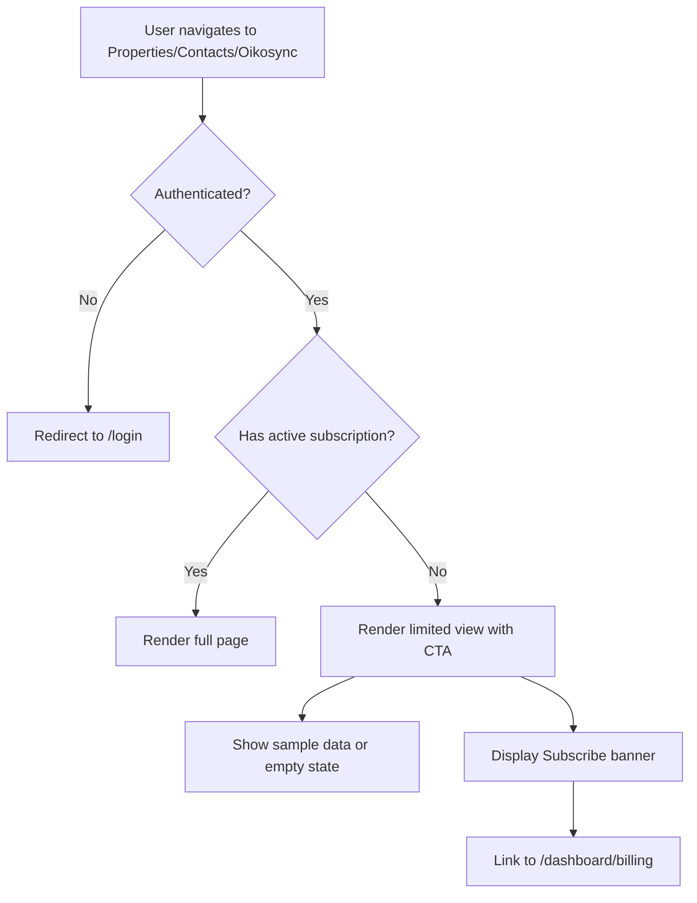
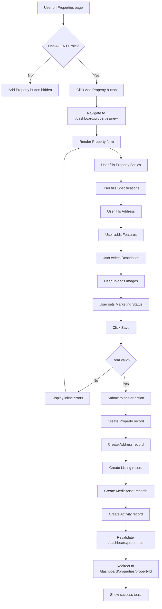
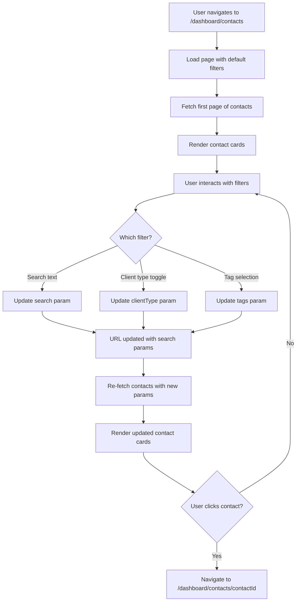
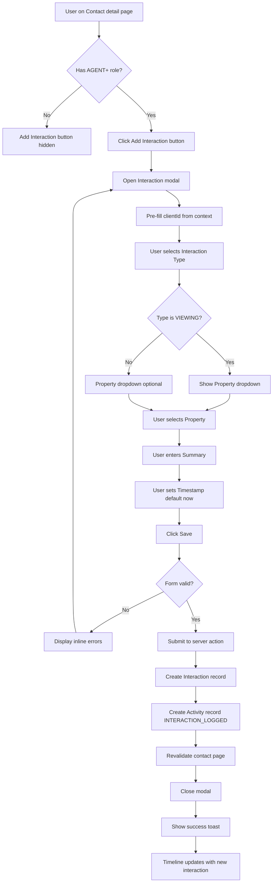
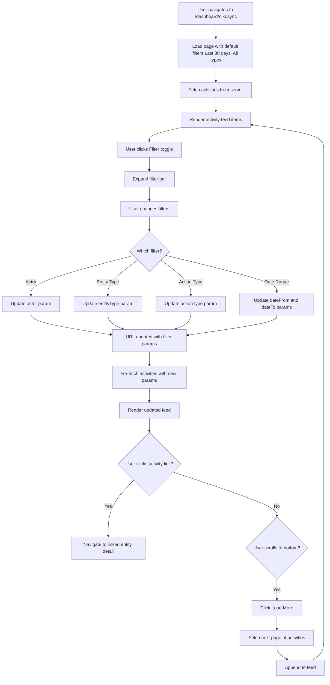

# Update Roles and Create Properties, Contacts, and Oikosync Pages

## Overview

This design defines the transformation of the existing SaaS starter into the Oikion application by updating the role-based access control system and creating three core pages: Properties (MLS), Contacts (CRM), and Oikosync (internal activity feed). The changes align with the Oikion product vision as a comprehensive operating system for Greek real-estate agencies.

### Objectives

- Replace existing USER/ADMIN roles with organization-centric roles: ORG_OWNER, ADMIN, AGENT, and VIEWER
- Create the Properties page for MLS functionality (property and listing management)
- Create the Contacts page for CRM functionality (client and interaction tracking)
- Create the Oikosync page for internal activity feed (organization-wide visibility)
- Ensure role-based access control is properly enforced across all new pages
- Maintain billing-gated access for non-subscribed organizations

## Architecture

### Role System Update

The role system will be restructured from a simple two-tier model (USER/ADMIN) to a four-tier organization-based model that reflects real-estate agency hierarchy.

#### Updated Role Enumeration

| Role | Description | Primary Use Cases | Access Level |
|------|-------------|-------------------|--------------|
| ORG_OWNER | Organization owner with full control | Billing, member management, all organization settings | Full access to all features |
| ADMIN | Administrative staff with management capabilities | Property approval, client assignment, team oversight | Full operational access, limited billing |
| AGENT | Real-estate agents performing daily operations | Property CRUD, client management, interaction logging | Operational access, no admin functions |
| VIEWER | Read-only access for stakeholders | Viewing properties, clients, activity feed | Read-only across all modules |

#### Role Hierarchy and Permissions Matrix

| Feature Area | ORG_OWNER | ADMIN | AGENT | VIEWER |
|--------------|-----------|-------|-------|--------|
| **Billing & Subscription** | Full control | View only | No access | No access |
| **Member Management** | Full control | Invite/Remove | View team | View team |
| **Properties - Create/Edit** | Yes | Yes | Yes | No |
| **Properties - Delete/Archive** | Yes | Yes | Own only | No |
| **Properties - View** | Yes | Yes | Yes | Yes |
| **Contacts - Create/Edit** | Yes | Yes | Yes | No |
| **Contacts - Delete** | Yes | Yes | Own only | No |
| **Contacts - View** | Yes | Yes | Yes | Yes |
| **Oikosync - Post Activity** | Automatic | Automatic | Automatic | No |
| **Oikosync - View Feed** | Yes | Yes | Yes | Yes |
| **Settings - Organization** | Yes | Yes | No | No |
| **Settings - Personal** | Yes | Yes | Yes | Yes |

### Data Model Extensions

The following entities extend the existing User/Account/Session models to support Oikion's MLS, CRM, and Socials functionality.

#### Organization Context

| Field | Type | Description | Constraints |
|-------|------|-------------|-------------|
| organizationId | String | Links user to their organization | Required for all users |
| organizationName | String | Organization display name | Alpha phase: one org per user |

#### Property Entity (MLS Core)

| Field | Type | Description | Constraints |
|-------|------|-------------|-------------|
| id | String | Unique identifier | Auto-generated CUID |
| propertyType | Enum | APARTMENT, HOUSE, LAND, COMMERCIAL, OTHER | Required |
| status | Enum | AVAILABLE, UNDER_OFFER, SOLD, RENTED | Required |
| transactionType | Enum | SALE, RENT, LEASE | Required |
| price | Decimal | List price in euros | Required, positive |
| bedrooms | Integer | Number of bedrooms | Optional, non-negative |
| bathrooms | Integer | Number of bathrooms | Optional, non-negative |
| size | Decimal | Square meters | Optional, positive |
| yearBuilt | Integer | Construction year | Optional |
| features | JSON | Array of feature tags | Optional |
| description | Text | Marketing description | Optional |
| organizationId | String | Organization ownership | Required |
| createdBy | String | User who created property | Required |
| createdAt | DateTime | Creation timestamp | Auto-generated |
| updatedAt | DateTime | Last update timestamp | Auto-updated |

#### Address Entity

| Field | Type | Description | Constraints |
|-------|------|-------------|-------------|
| id | String | Unique identifier | Auto-generated CUID |
| propertyId | String | Foreign key to Property | Required |
| country | String | Country name | Default: "Greece" |
| region | String | Greek region (e.g., Attica) | Optional |
| city | String | City name | Required |
| street | String | Street name | Optional |
| number | String | Street number | Optional |
| postalCode | String | Postal code | Optional |
| locationText | Text | Free-text location description | Optional |

#### Listing Entity

| Field | Type | Description | Constraints |
|-------|------|-------------|-------------|
| id | String | Unique identifier | Auto-generated CUID |
| propertyId | String | Foreign key to Property | Required |
| marketingStatus | Enum | DRAFT, ACTIVE, ARCHIVED | Required, default DRAFT |
| listPrice | Decimal | Current listing price | Required |
| publishedAt | DateTime | Date listing went active | Optional |
| archivedAt | DateTime | Date listing was archived | Optional |
| notes | Text | Internal listing notes | Optional |

#### MediaAsset Entity

| Field | Type | Description | Constraints |
|-------|------|-------------|-------------|
| id | String | Unique identifier | Auto-generated CUID |
| propertyId | String | Foreign key to Property | Required |
| assetType | Enum | IMAGE, VIDEO | Required |
| url | String | Asset storage URL | Required |
| isPrimary | Boolean | Primary image flag | Default false |
| displayOrder | Integer | Sort order for display | Optional |
| uploadedAt | DateTime | Upload timestamp | Auto-generated |

#### Client Entity (CRM Core)

| Field | Type | Description | Constraints |
|-------|------|-------------|-------------|
| id | String | Unique identifier | Auto-generated CUID |
| clientType | Enum | PERSON, COMPANY | Required |
| name | String | Client name | Required |
| email | String | Primary email | Optional |
| phone | String | Primary phone | Optional |
| secondaryEmail | String | Secondary email | Optional |
| secondaryPhone | String | Secondary phone | Optional |
| tags | JSON | Array of tag strings | Optional |
| organizationId | String | Organization ownership | Required |
| createdBy | String | User who created client | Required |
| createdAt | DateTime | Creation timestamp | Auto-generated |
| updatedAt | DateTime | Last update timestamp | Auto-updated |

#### Interaction Entity

| Field | Type | Description | Constraints |
|-------|------|-------------|-------------|
| id | String | Unique identifier | Auto-generated CUID |
| interactionType | Enum | CALL, EMAIL, MEETING, VIEWING | Required |
| clientId | String | Foreign key to Client | Optional |
| propertyId | String | Foreign key to Property | Optional |
| summary | Text | Interaction summary | Required |
| timestamp | DateTime | When interaction occurred | Required |
| createdBy | String | User who logged interaction | Required |
| createdAt | DateTime | Log timestamp | Auto-generated |

#### Task Entity

| Field | Type | Description | Constraints |
|-------|------|-------------|-------------|
| id | String | Unique identifier | Auto-generated CUID |
| title | String | Task title | Required |
| description | Text | Task details | Optional |
| dueDate | DateTime | Due date | Optional |
| status | Enum | PENDING, COMPLETED, CANCELLED | Required, default PENDING |
| assignedTo | String | Foreign key to User | Optional |
| clientId | String | Foreign key to Client | Optional |
| propertyId | String | Foreign key to Property | Optional |
| organizationId | String | Organization ownership | Required |
| createdBy | String | User who created task | Required |
| createdAt | DateTime | Creation timestamp | Auto-generated |

#### Note Entity

| Field | Type | Description | Constraints |
|-------|------|-------------|-------------|
| id | String | Unique identifier | Auto-generated CUID |
| content | Text | Note content | Required |
| clientId | String | Foreign key to Client | Optional |
| propertyId | String | Foreign key to Property | Optional |
| createdBy | String | User who created note | Required |
| createdAt | DateTime | Creation timestamp | Auto-generated |

#### Activity Entity (Socials Core)

| Field | Type | Description | Constraints |
|-------|------|-------------|-------------|
| id | String | Unique identifier | Auto-generated CUID |
| actorId | String | Foreign key to User (who did it) | Required |
| actionType | Enum | PROPERTY_CREATED, PROPERTY_UPDATED, PROPERTY_ARCHIVED, MEDIA_ADDED, CLIENT_CREATED, CLIENT_UPDATED, NOTE_ADDED, INTERACTION_LOGGED, TASK_CREATED, TASK_COMPLETED, MEMBER_INVITED, MEMBER_ROLE_CHANGED, SUBSCRIPTION_STARTED, SUBSCRIPTION_UPDATED, SUBSCRIPTION_CANCELLED | Required |
| entityType | Enum | PROPERTY, CLIENT, TASK, USER, SUBSCRIPTION | Required |
| entityId | String | ID of the affected entity | Required |
| payload | JSON | Additional context data | Optional |
| organizationId | String | Organization scope | Required |
| createdAt | DateTime | Activity timestamp | Auto-generated |

### Page Architecture

#### Properties Page (MLS)

**Purpose**: Central interface for managing the organization's property inventory and listings.

**Route**: `/dashboard/properties`

**Authorization**: All authenticated roles can view; AGENT+ can create/edit

**Layout Structure**:
- Page header with "Properties" title and "Add Property" action button (role-gated)
- Filter bar with dropdowns and search input
- Property cards grid or table view toggle
- Pagination controls

**Filter Capabilities**:

| Filter | Type | Options | Default |
|--------|------|---------|---------|
| Status | Dropdown | All, Available, Under Offer, Sold, Rented | All |
| Transaction Type | Dropdown | All, Sale, Rent, Lease | All |
| Property Type | Dropdown | All, Apartment, House, Land, Commercial, Other | All |
| Price Range | Dual-input | Min and Max fields | None |
| Location | Text Input | Free-text search across city/region/locationText | None |
| Bedrooms | Dropdown | Any, 1, 2, 3, 4, 5+ | Any |

**Property Card Display**:
- Primary image thumbnail
- Property type badge
- Price (formatted in EUR)
- Brief address (city, region)
- Key specs (beds, baths, size in m²)
- Marketing status indicator (draft/active/archived)
- Quick action menu (view, edit, archive) - role-gated

**Property Detail View**:

Route: `/dashboard/properties/[id]`

Sections:
- Image gallery with primary image highlight
- Full property specifications table
- Complete address details
- Listing information (status, publish date, list price)
- Features list
- Marketing description
- Activity timeline (from Oikosync feed filtered to this property)
- Related interactions and notes
- Action buttons: Edit, Archive, Delete (role-gated)

**Property Create/Edit Form**:

Route: `/dashboard/properties/new` and `/dashboard/properties/[id]/edit`

Form Sections:
1. Property Basics (type, transaction type, status, price)
2. Specifications (beds, baths, size, year built)
3. Address (country, region, city, street, number, postal code, location text)
4. Features (multi-select tags)
5. Description (textarea)
6. Media Upload (image upload with primary selection)
7. Listing Settings (marketing status, list price, internal notes)

Validation Rules:
- Property type, transaction type, status, and price are required
- Price must be positive decimal
- Bedrooms/bathrooms must be non-negative integers if provided
- Size must be positive decimal if provided
- City is required for address
- At least one image recommended but not required for draft listings

**State Management**:
- Filter state persisted in URL search params
- Form state managed with React Hook Form and Zod validation
- Optimistic updates for status changes
- Loading states during image upload

#### Contacts Page (CRM)

**Purpose**: Centralized client relationship management with interaction tracking.

**Route**: `/dashboard/contacts`

**Authorization**: All authenticated roles can view; AGENT+ can create/edit

**Layout Structure**:
- Page header with "Contacts" title and "Add Contact" action button (role-gated)
- Search bar and tag filter
- Client type toggle (All, Persons, Companies)
- Contacts table or card view
- Pagination controls

**Filter Capabilities**:

| Filter | Type | Options | Default |
|--------|------|---------|---------|
| Client Type | Toggle | All, Person, Company | All |
| Search | Text Input | Searches name, email, phone | None |
| Tags | Multi-select | Dynamic list from existing tags | None |

**Contact Card/Row Display**:
- Client name
- Client type badge
- Primary contact methods (email, phone)
- Tag badges
- Last interaction timestamp
- Quick action menu (view, edit, add note) - role-gated

**Contact Detail View**:

Route: `/dashboard/contacts/[id]`

Sections:
- Contact header (name, type, primary info)
- Contact methods table (all emails/phones)
- Tags with edit capability (role-gated)
- Timeline tab showing:
  - Interactions (chronological, with type badges)
  - Notes (chronological)
  - Tasks (filtered to this client)
- Related properties (properties linked via interactions)
- Action buttons: Edit, Delete (role-gated)

**Contact Create/Edit Form**:

Route: `/dashboard/contacts/new` and `/dashboard/contacts/[id]/edit`

Form Fields:
1. Client Type (radio: Person or Company)
2. Name (text input, required)
3. Primary Email (email input, optional)
4. Primary Phone (text input, optional)
5. Secondary Email (email input, optional)
6. Secondary Phone (text input, optional)
7. Tags (multi-select with create-new capability)

Validation Rules:
- Name is required
- At least one contact method (email or phone) recommended
- Email fields validated for email format
- Phone fields accept international formats

**Add Interaction Modal** (accessible from Contact detail):

Fields:
- Interaction Type (dropdown: Call, Email, Meeting, Viewing)
- Related Property (optional dropdown of organization properties)
- Summary (textarea, required)
- Timestamp (datetime picker, defaults to now)

**Add Note Modal** (accessible from Contact detail):

Fields:
- Note Content (textarea, required)

**Add Task Modal** (accessible from Contact detail or global):

Fields:
- Title (text input, required)
- Description (textarea, optional)
- Due Date (date picker, optional)
- Assign To (dropdown of organization users, optional)
- Related Client (pre-filled if from contact page)
- Related Property (optional dropdown)

**State Management**:
- Search and filter state in URL params
- Form validation with React Hook Form and Zod
- Timeline lazy-loading for performance
- Optimistic updates for tags and quick actions

#### Oikosync Page (Internal Activity Feed)

**Purpose**: Organization-wide activity stream providing visibility into team operations.

**Route**: `/dashboard/oikosync`

**Authorization**: All authenticated roles can view; posting is automatic (no manual posting in Alpha)

**Layout Structure**:
- Page header with "Oikosync" title and filter toggle
- Filter bar (collapsible)
- Activity feed (chronological, newest first)
- Load more button for pagination

**Filter Capabilities**:

| Filter | Type | Options | Default |
|--------|------|---------|---------|
| Actor | Dropdown | All Users, or specific user | All Users |
| Entity Type | Dropdown | All, Property, Client, Task, User, Subscription | All |
| Action Type | Multi-select | Grouped by entity (e.g., Property: Created/Updated/Archived) | All |
| Date Range | Date range picker | From/To dates | Last 30 days |

**Activity Item Display Format**:

Each activity renders as a feed item with:
- Actor avatar and name
- Action verb in natural language
- Entity type and link to entity detail
- Timestamp (relative, e.g., "2 hours ago")
- Payload summary (contextual details)

**Activity Type Templates**:

| Action Type | Template | Link Target |
|-------------|----------|-------------|
| PROPERTY_CREATED | "{Actor} created property {Property Name}" | /dashboard/properties/[id] |
| PROPERTY_UPDATED | "{Actor} updated property {Property Name}" | /dashboard/properties/[id] |
| PROPERTY_ARCHIVED | "{Actor} archived property {Property Name}" | /dashboard/properties/[id] |
| MEDIA_ADDED | "{Actor} added {count} images to {Property Name}" | /dashboard/properties/[id] |
| CLIENT_CREATED | "{Actor} created client {Client Name}" | /dashboard/contacts/[id] |
| CLIENT_UPDATED | "{Actor} updated client {Client Name}" | /dashboard/contacts/[id] |
| NOTE_ADDED | "{Actor} added a note to {Client/Property Name}" | /dashboard/contacts/[id] or /dashboard/properties/[id] |
| INTERACTION_LOGGED | "{Actor} logged a {type} with {Client Name}" | /dashboard/contacts/[id] |
| TASK_CREATED | "{Actor} created task \"{Title}\"" | Task modal or detail |
| TASK_COMPLETED | "{Actor} completed task \"{Title}\"" | Task modal or detail |
| MEMBER_INVITED | "{Actor} invited {Email} to the organization" | No link |
| MEMBER_ROLE_CHANGED | "{Actor} changed {User}'s role to {Role}" | No link |
| SUBSCRIPTION_STARTED | "Organization subscription started ({Plan})" | /dashboard/billing |
| SUBSCRIPTION_UPDATED | "Subscription updated to {Plan}" | /dashboard/billing |
| SUBSCRIPTION_CANCELLED | "Subscription cancelled" | /dashboard/billing |

**Activity Generation Logic**:

Activities are created automatically via server actions when:
- Property CRUD operations complete successfully
- Media assets are uploaded
- Client CRUD operations complete
- Notes are added to clients or properties
- Interactions are logged
- Tasks are created or status changes to completed
- Organization membership changes occur
- Subscription webhook events are processed

Each server action must:
1. Complete the primary operation (e.g., create property)
2. Create corresponding Activity record with appropriate payload
3. Return success status

**Payload Structure Examples**:

Property Created:
```
{
  "propertyType": "APARTMENT",
  "price": 250000,
  "city": "Athens"
}
```

Interaction Logged:
```
{
  "interactionType": "VIEWING",
  "clientName": "John Doe",
  "propertyId": "clx123..."
}
```

Task Completed:
```
{
  "taskTitle": "Follow up with client",
  "assignedTo": "agent@example.com"
}
```

**State Management**:
- Filter state persisted in URL search params
- Infinite scroll or "Load More" pagination
- Real-time updates not required for Alpha (manual refresh acceptable)

### Navigation and Routing Updates

#### Dashboard Sidebar Configuration Update

The existing `config/dashboard.ts` sidebar links will be replaced with Oikion-specific navigation.

**Updated Sidebar Structure**:

Section: MENU
- Dashboard (href: `/dashboard`, icon: dashboard, roles: all)
- Properties (href: `/dashboard/properties`, icon: home, roles: all)
- Contacts (href: `/dashboard/contacts`, icon: users, roles: all)
- Oikosync (href: `/dashboard/oikosync`, icon: activity, roles: all)
- Billing (href: `/dashboard/billing`, icon: billing, roles: ORG_OWNER only)

Section: OPTIONS
- Settings (href: `/dashboard/settings`, icon: settings, roles: all)
- Documentation (href: `/docs`, icon: bookOpen, roles: all)
- Support (href: `#`, icon: messages, roles: all, disabled: true)

**Role-Based Filtering Logic**:

The existing `app/(protected)/layout.tsx` already implements sidebar filtering based on `authorizeOnly` field. This pattern will continue to work with the new role system:
- Items with no `authorizeOnly` are visible to all roles
- Items with `authorizeOnly: UserRole.ORG_OWNER` are visible only to ORG_OWNER
- The filtering logic checks `authorizeOnly === user.role` for exact matches

For hierarchical role access (e.g., ORG_OWNER can see ADMIN items), a helper function will determine role hierarchy:
- ORG_OWNER can access ORG_OWNER items
- ADMIN can access ADMIN items (but not ORG_OWNER items)
- AGENT can access AGENT items
- VIEWER can access VIEWER items

### Subscription Gating Strategy

**Billing Gate Enforcement**:

All three new pages (Properties, Contacts, Oikosync) must enforce subscription requirements.

**Gate Check Flow**:



**Limited View Behavior** (for non-subscribed organizations):

Properties Page:
- Display empty state with illustration
- Message: "Subscribe to start managing your property inventory"
- Primary CTA button: "View Subscription Plans" (links to /dashboard/billing)
- Show 0-2 sample property cards (read-only, marked as "Demo")

Contacts Page:
- Display empty state with illustration
- Message: "Subscribe to manage your client relationships"
- Primary CTA button: "View Subscription Plans"
- Show 0-2 sample contact cards (read-only, marked as "Demo")

Oikosync Page:
- Display empty state with illustration
- Message: "Subscribe to see your team's activity feed"
- Primary CTA button: "View Subscription Plans"
- Show 0-3 sample activity items (marked as "Demo")

**Subscription Check Implementation**:

The existing subscription utility `lib/subscription.ts` provides `getUserSubscriptionPlan()` which returns an object with `isPaid` boolean. Each page component will:
1. Retrieve current user session
2. Call `getUserSubscriptionPlan(user.id)`
3. Check `isPaid` status
4. Conditionally render full page or limited view

### Form Validation Schemas

All forms will use Zod for validation with consistent error messaging.

#### Property Form Schema

```
propertyFormSchema:
  - propertyType: enum (required, one of: APARTMENT, HOUSE, LAND, COMMERCIAL, OTHER)
  - status: enum (required, one of: AVAILABLE, UNDER_OFFER, SOLD, RENTED)
  - transactionType: enum (required, one of: SALE, RENT, LEASE)
  - price: number (required, positive, max 2 decimal places)
  - bedrooms: number (optional, non-negative integer)
  - bathrooms: number (optional, non-negative integer)
  - size: number (optional, positive, max 2 decimal places)
  - yearBuilt: number (optional, integer, min 1800, max current year + 5)
  - features: array of strings (optional)
  - description: string (optional, max 5000 characters)
  - country: string (optional, default "Greece")
  - region: string (optional, max 100 characters)
  - city: string (required, min 1, max 100 characters)
  - street: string (optional, max 200 characters)
  - number: string (optional, max 20 characters)
  - postalCode: string (optional, max 20 characters)
  - locationText: string (optional, max 500 characters)
  - marketingStatus: enum (required, one of: DRAFT, ACTIVE, ARCHIVED, default DRAFT)
  - listPrice: number (required, positive, max 2 decimal places)
  - listingNotes: string (optional, max 1000 characters)
```

#### Client Form Schema

```
clientFormSchema:
  - clientType: enum (required, one of: PERSON, COMPANY)
  - name: string (required, min 1, max 200 characters)
  - email: string (optional, valid email format)
  - phone: string (optional, max 50 characters)
  - secondaryEmail: string (optional, valid email format)
  - secondaryPhone: string (optional, max 50 characters)
  - tags: array of strings (optional, each tag max 50 characters)
```

#### Interaction Form Schema

```
interactionFormSchema:
  - interactionType: enum (required, one of: CALL, EMAIL, MEETING, VIEWING)
  - clientId: string (optional, valid CUID)
  - propertyId: string (optional, valid CUID)
  - summary: string (required, min 1, max 2000 characters)
  - timestamp: datetime (required, not in future)
```

#### Task Form Schema

```
taskFormSchema:
  - title: string (required, min 1, max 200 characters)
  - description: string (optional, max 2000 characters)
  - dueDate: datetime (optional)
  - assignedTo: string (optional, valid user ID)
  - clientId: string (optional, valid CUID)
  - propertyId: string (optional, valid CUID)
  - status: enum (required, one of: PENDING, COMPLETED, CANCELLED, default PENDING)
```

#### Note Form Schema

```
noteFormSchema:
  - content: string (required, min 1, max 5000 characters)
  - clientId: string (optional, valid CUID, must provide clientId or propertyId)
  - propertyId: string (optional, valid CUID, must provide clientId or propertyId)
```

### Accessibility Requirements

All pages must meet WCAG 2.1 AA standards.

**Keyboard Navigation**:
- All interactive elements must be keyboard accessible
- Logical tab order throughout forms and lists
- Escape key closes modals and dropdowns
- Enter key submits forms when appropriate
- Arrow keys navigate within dropdowns and selects

**Screen Reader Support**:
- Page landmarks (main, nav, complementary, form)
- ARIA labels for icon buttons (e.g., "Add Property", "Filter activities")
- ARIA live regions for dynamic content updates (filter results, activity feed)
- Form field labels explicitly associated with inputs
- Error messages announced to screen readers
- Loading states announced ("Loading properties...")

**Visual Accessibility**:
- Minimum 4.5:1 contrast ratio for text
- Focus indicators visible on all interactive elements
- Form errors clearly marked with color and icons (not color alone)
- Status badges use both color and text/icons
- Responsive text sizing (supports browser zoom up to 200%)

**Form Accessibility**:
- Required fields marked with asterisk and ARIA-required
- Error messages linked to fields with ARIA-describedby
- Validation errors displayed inline and in error summary
- Submit buttons disabled during processing with loading state

### Performance Considerations

**Data Fetching Strategy**:
- Properties list: Paginated (20 items per page)
- Contacts list: Paginated (20 items per page)
- Oikosync feed: Infinite scroll or paginated (30 items per load)
- Detail views: Single-entity fetch with related data

**Image Optimization**:
- Property images resized to thumbnail (300x200) and full (1200x800) variants
- Lazy loading for images below fold
- Next.js Image component for automatic optimization
- Primary image loaded first, gallery images lazy-loaded

**Caching Strategy**:
- Server components for initial page loads
- Client components for interactive filters and forms
- Revalidation after mutations (using Next.js revalidatePath)
- Search params for shareable filter states (enables browser back/forward)

**Loading States**:
- Skeleton loaders for list views during initial load
- Spinner for form submissions
- Optimistic updates for simple state changes (e.g., task completion)
- Toast notifications for async operation results

### Testing Strategy

**Unit Testing Focus Areas**:
- Validation schemas (Zod) with edge cases
- Filter logic (URL param parsing and application)
- Activity template rendering with various payload types
- Role permission helper functions
- Form submission handlers

**Component Testing Focus Areas**:
- Property/Contact card rendering with various data states
- Filter controls updating URL params correctly
- Form validation displaying errors appropriately
- Modal open/close behavior
- Empty states and subscription gates

**Integration Testing Focus Areas**:
- Full CRUD flows (create property → view → edit → archive)
- Filter application updating displayed results
- Activity generation after mutations
- Role-based access enforcement (navigation and action visibility)
- Subscription gate behavior for non-subscribed users

**Accessibility Testing**:
- Automated axe-core checks on all pages
- Keyboard-only navigation through critical flows
- Screen reader testing (VoiceOver/NVDA) on forms
- Focus management in modals and dynamic content

## User Flows

### Create Property Flow



### View and Filter Contacts Flow



### Log Interaction from Contact Detail Flow



### View Oikosync Feed with Filters Flow



## Migration Strategy

### Role Migration from USER/ADMIN to Oikion Roles

**Existing Role Mapping**:
- All existing USER records will be migrated to AGENT role (default operational role)
- All existing ADMIN records will be migrated to ORG_OWNER role (assume they are organization owners)

**Migration Steps**:
1. Add new UserRole enum values (ORG_OWNER, ADMIN, AGENT, VIEWER) to Prisma schema
2. Create database migration script that updates existing User records:
   - USER → AGENT
   - ADMIN → ORG_OWNER
3. Run migration against production database
4. Update type definitions in `types/next-auth.d.ts` to reflect new enum
5. Update all role checks in codebase to use new role names
6. Verify existing protected routes still enforce authorization correctly

**Organization Assignment**:
- Alpha constraint: one organization per user
- For existing users, create Organization record with:
  - organizationId = user.id (initially, 1:1 mapping)
  - organizationName = "Default Organization" or derived from user name
- Add organizationId foreign key to User table
- Backfill organizationId for all existing users

### Data Seeding for Development and Testing

**Seed Data Sets**:

Properties (10 sample properties):
- Mix of property types (apartments, houses, land)
- Mix of statuses (available, under offer, sold)
- Various price ranges
- Athens, Thessaloniki, and other major cities
- 2-5 images per property

Clients (15 sample clients):
- Mix of persons and companies
- Various tag combinations
- Multiple contact methods

Interactions (30 sample interactions):
- Distributed across clients and properties
- All interaction types represented
- Timestamps spread over last 90 days

Tasks (20 sample tasks):
- Mix of pending, completed, cancelled
- Various due dates (past, today, future)
- Assigned to different users

Activities (50 sample activities):
- All action types represented
- Distributed across last 30 days
- Linked to seeded entities

**Seed Script Execution**:
- Seed script located in `prisma/seed.ts`
- Executed via `pnpm prisma db seed`
- Idempotent (can run multiple times without duplication)
- Clears existing seed data before re-seeding

### Incremental Rollout Plan

**Phase 1: Role System Update** (Week 1)
- Update Prisma schema with new roles
- Create and run migration
- Update type definitions
- Update auth callbacks to use new roles
- Update existing sidebar config with new role checks
- Test role-based access on existing pages
- Deploy to staging and verify

**Phase 2: Properties Page** (Week 2)
- Implement data models (Property, Address, Listing, MediaAsset)
- Create server actions for CRUD operations
- Build properties list page with filters
- Build property detail view
- Build property create/edit forms
- Implement image upload
- Generate activities for property operations
- Test accessibility and performance
- Deploy to staging

**Phase 3: Contacts Page** (Week 3)
- Implement data models (Client, Interaction, Task, Note)
- Create server actions for CRUD operations
- Build contacts list page with search and filters
- Build contact detail view with timeline
- Build contact create/edit forms
- Build interaction/task/note modals
- Generate activities for CRM operations
- Test accessibility and performance
- Deploy to staging

**Phase 4: Oikosync Page** (Week 4)
- Implement Activity model (completed in prior phases via activity generation)
- Build activity feed page with filters
- Implement activity template rendering
- Build deep linking to entity details
- Implement pagination or infinite scroll
- Test activity generation across all action types
- Test accessibility
- Deploy to staging

**Phase 5: Integration and Production** (Week 5)
- End-to-end testing of all flows
- Subscription gate verification
- Performance optimization
- Accessibility audit and fixes
- Security review (especially authorization checks)
- Production deployment
- Post-deployment monitoring

## Security Considerations

### Authorization Enforcement

**Server-Side Authorization Pattern**:

Every server action must:
1. Verify user is authenticated (via `auth()` from NextAuth)
2. Retrieve user's role from session
3. Check role against required permission for the operation
4. Verify organizational scope (user can only access their organization's data)
5. Perform operation only if all checks pass
6. Return standardized error for unauthorized attempts

**Example Authorization Flow**:
- Action: Delete Property
- Steps:
  1. Check session exists
  2. Check user role is AGENT or higher
  3. Fetch property to verify organizationId matches user's organizationId
  4. If user role is AGENT, verify createdBy === user.id (agents can only delete own properties)
  5. If all checks pass, proceed with deletion
  6. Create PROPERTY_ARCHIVED activity
  7. Revalidate path
  8. Return success

**Client-Side Authorization (UI)**:

UI elements (buttons, menu items, form fields) must:
- Hide or disable actions based on user role (from session)
- Provide consistent experience (don't show action then deny on click)
- Display appropriate messaging when action is unavailable ("Contact your admin to delete this property")

**Note**: Client-side checks are UX improvements only; server-side authorization is the security boundary.

### Data Scoping

**Organization Isolation**:

All queries must filter by organizationId:
- Properties: WHERE organizationId = user.organizationId
- Clients: WHERE organizationId = user.organizationId
- Activities: WHERE organizationId = user.organizationId
- Tasks: WHERE organizationId = user.organizationId

**Prevention of Cross-Organization Access**:
- Never trust client-provided organizationId in mutations
- Always derive organizationId from authenticated session
- Validate entity ownership before updates/deletes (fetch entity, check organizationId)

### Input Validation and Sanitization

**Validation Strategy**:
- All form inputs validated with Zod schemas on both client and server
- Server actions must re-validate even if client validated (client can be bypassed)
- Reject requests with invalid data before database queries

**Sanitization**:
- Text inputs sanitized to prevent XSS (use React's built-in escaping)
- No raw HTML rendering except in controlled markdown contexts
- File uploads restricted to image MIME types for media assets
- File size limits enforced (e.g., max 10MB per image)

**SQL Injection Prevention**:
- All database access via Prisma ORM (parameterized queries)
- No raw SQL queries with user input

### File Upload Security

**Image Upload Constraints**:
- Accepted MIME types: image/jpeg, image/png, image/webp
- Maximum file size: 10MB per file
- Maximum files per property: 20 images
- File storage: Next.js-compatible adapter (e.g., Vercel Blob, Cloudinary, AWS S3)

**Upload Flow**:
1. Client-side file type and size validation
2. Upload to storage service (generates secure URL)
3. Server action receives URL (not raw file)
4. Create MediaAsset record with URL
5. Associate with Property

**Validation**:
- Verify uploaded file URL matches expected domain pattern
- Prevent arbitrary URL injection
- Set appropriate CORS and access policies on storage

### Rate Limiting Considerations

**Critical Endpoints to Protect**:
- Property creation (prevent spam listings)
- Client creation (prevent contact spam)
- Activity feed queries (prevent scraping)

**Rate Limit Suggestions** (to be implemented with middleware or third-party service):
- Property/Client creation: 20 per hour per user
- Activity feed queries: 100 per hour per user
- Image uploads: 50 per hour per user

### Audit Trail

**Activity Feed as Audit Log**:

The Oikosync activity feed serves dual purpose:
1. User-facing visibility tool
2. Audit trail for critical operations

**Audit-Relevant Actions**:
- All CRUD operations on properties and clients
- Role changes (MEMBER_ROLE_CHANGED)
- Subscription changes (for billing compliance)
- Member invitations and removals

**Audit Record Requirements**:
- Immutable (Activities should not be editable or deletable by users)
- Timestamped with createdAt
- Linked to actor (user who performed action)
- Contains sufficient payload to reconstruct what happened

**Retention**:
- Activities retained indefinitely for Alpha (no automatic deletion)
- Future consideration: archive activities older than 2 years to separate table
