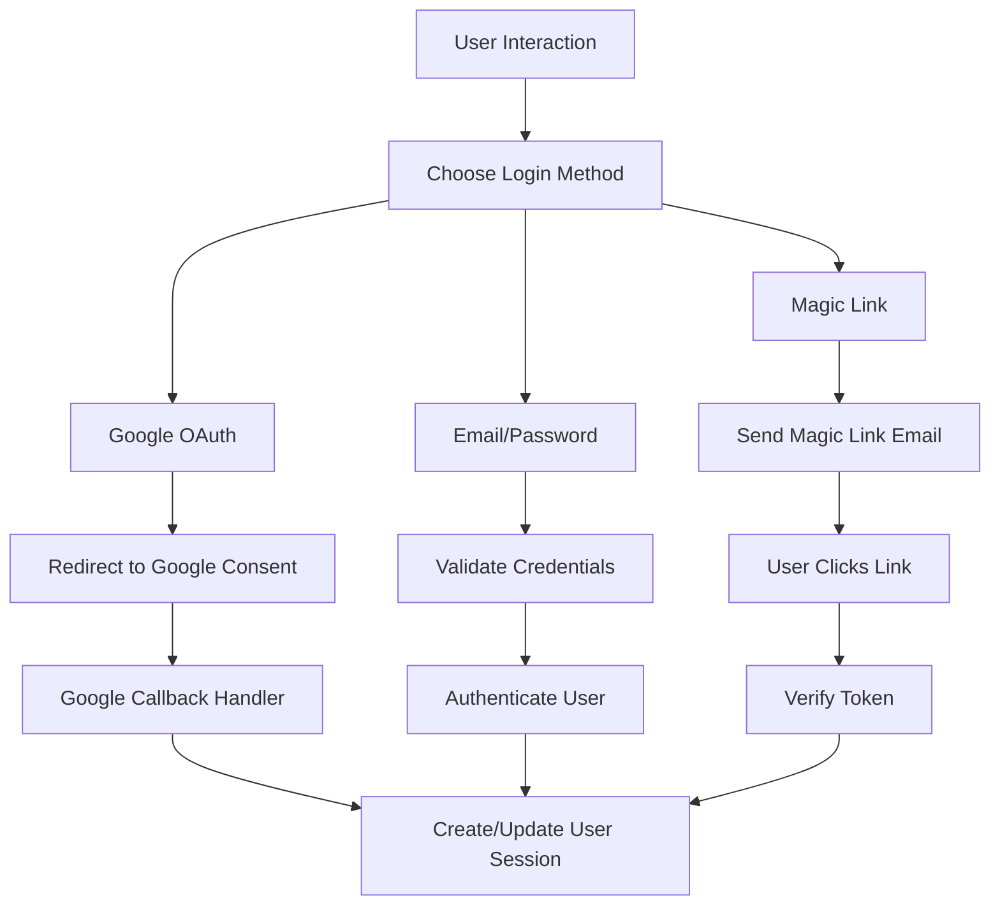
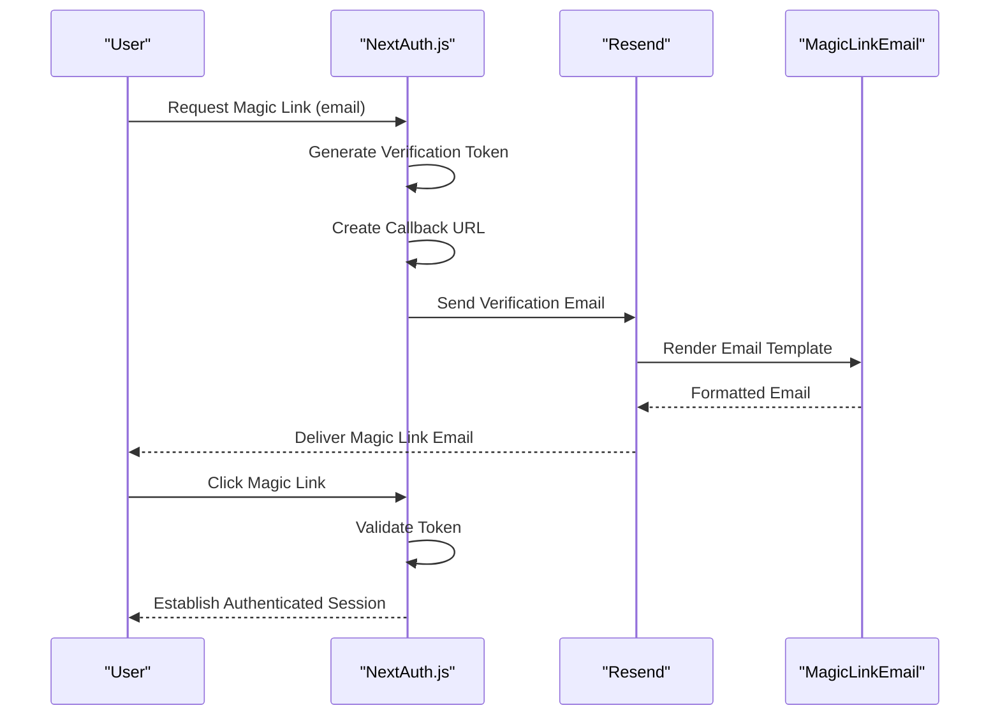
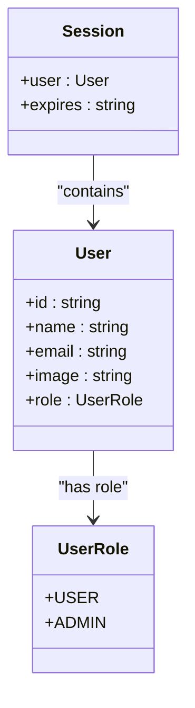
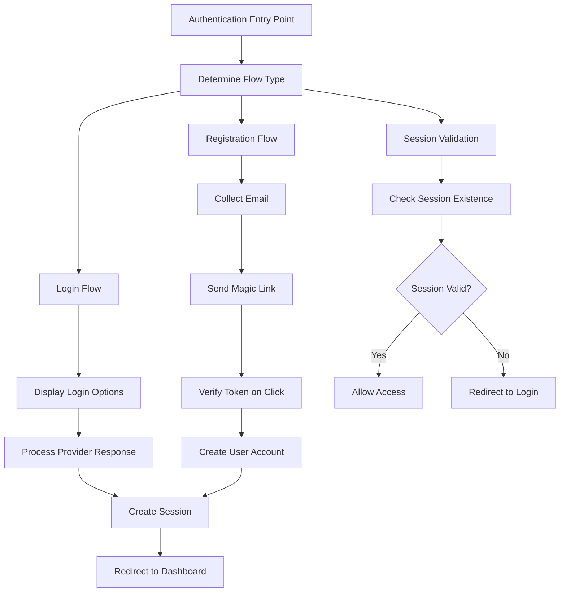

# Authentication System

<cite>
**Referenced Files in This Document**   
- [auth.config.ts](file://auth.config.ts)
- [auth.ts](file://auth.ts)
- [lib/email.ts](file://lib/email.ts)
- [emails/magic-link-email.tsx](file://emails/magic-link-email.tsx)
- [lib/user.ts](file://lib/user.ts)
- [lib/db.ts](file://lib/db.ts)
- [app/api/auth/[...nextauth]/route.ts](file://app/api/auth/[...nextauth]/route.ts)
- [actions/update-user-role.ts](file://actions/update-user-role.ts)
- [components/forms/user-role-form.tsx](file://components/forms/user-role-form.tsx)
- [types/next-auth.d.ts](file://types/next-auth.d.ts)
</cite>

## Table of Contents
1. [Authentication Configuration](#authentication-configuration)
2. [Provider Integration](#provider-integration)
3. [Magic Link Implementation](#magic-link-implementation)
4. [Session Management](#session-management)
5. [Role Augmentation](#role-augmentation)
6. [Prisma Adapter Integration](#prisma-adapter-integration)
7. [Authentication Flows](#authentication-flows)
8. [Security Considerations](#security-considerations)

## Authentication Configuration

The authentication system is configured using two primary files: `auth.config.ts` and `auth.ts`. The `auth.config.ts` file defines the available authentication providers, while `auth.ts` contains the core NextAuth.js configuration including session strategy, callbacks, and adapter integration. This separation allows for modular configuration while maintaining a centralized authentication instance that can be imported throughout the application.

**Section sources**
- [auth.config.ts](file://auth.config.ts#L1-L21)
- [auth.ts](file://auth.ts#L1-L68)

## Provider Integration

The system implements multiple authentication providers through NextAuth.js. The Google OAuth strategy is configured with client credentials loaded from environment variables, enabling secure social login. Additionally, a credentials provider is implicitly available for email/password authentication. Each provider is properly configured with environment-specific settings to ensure secure credential handling.

**Diagram sources**
- [auth.config.ts](file://auth.config.ts#L4-L15)
- [auth.ts](file://auth.ts#L1-L68)

**Section sources**
- [auth.config.ts](file://auth.config.ts#L4-L10)
- [env.mjs](file://env.mjs)

## Magic Link Implementation

The magic link authentication flow uses the Resend email provider to deliver secure, time-limited login links to users. When a user requests a magic link, the system generates a unique URL and sends it via email using Resend's API. The `sendVerificationRequest` function in `lib/email.ts` handles the email composition and delivery, including personalized content based on whether the user is registering or logging in. The email template, defined in `magic-link-email.tsx`, provides a clean, responsive design with appropriate messaging for both registration and login scenarios.

**Diagram sources**
- [auth.config.ts](file://auth.config.ts#L11-L15)
- [lib/email.ts](file://lib/email.ts#L11-L50)
- [emails/magic-link-email.tsx](file://emails/magic-link-email.tsx#L1-L69)

**Section sources**
- [lib/email.ts](file://lib/email.ts#L11-L50)
- [emails/magic-link-email.tsx](file://emails/magic-link-email.tsx#L1-L69)

## Session Management

The authentication system employs JWT-based session management with a strategy configuration in `auth.ts`. Sessions are stored as JSON Web Tokens, providing stateless authentication while maintaining security. The session callback in the configuration enriches the session object with user data from the database, including the user ID, email, name, image, and role. The JWT callback ensures that token claims are populated with the user's information from the database, enabling persistent user data across sessions.

**Section sources**
- [auth.ts](file://auth.ts#L23-L60)

## Role Augmentation

The system implements a role augmentation pattern that extends the default NextAuth.js session type to include user roles. Through module augmentation in the NextAuth.js configuration, the session interface is extended to include a role property typed with the `UserRole` enum from Prisma. This role information is injected into both the JWT token and the session object during the authentication flow, making it available throughout the application for authorization decisions. The role system supports USER and ADMIN roles, enabling differentiated access to application features.

**Diagram sources**
- [auth.ts](file://auth.ts#L10-L18)
- [types/next-auth.d.ts](file://types/next-auth.d.ts)
- [actions/update-user-role.ts](file://actions/update-user-role.ts#L13-L39)

**Section sources**
- [auth.ts](file://auth.ts#L10-L18)
- [actions/update-user-role.ts](file://actions/update-user-role.ts#L13-L39)

## Prisma Adapter Integration

The authentication system integrates with Prisma through the `PrismaAdapter` to provide persistent storage for user accounts, sessions, and verification tokens. The adapter is configured in `auth.ts` with the Prisma client instance, enabling seamless synchronization between NextAuth.js and the database. This integration ensures that all authentication-related data is securely stored and can survive application restarts. The Prisma schema (implied by the use of `@prisma/client`) defines the necessary models for users, accounts, sessions, and verification tokens that the adapter expects.

**Section sources**
- [auth.ts](file://auth.ts#L20-L22)
- [lib/db.ts](file://lib/db.ts#L8-L8)

## Authentication Flows

The system implements comprehensive authentication flows for login, registration, and session validation. These flows are coordinated through the API route at `app/api/auth/[...nextauth]/route.ts`, which exports the NextAuth.js handlers. The login flow supports multiple methods (Google OAuth, email/password, magic link) with proper redirection to the appropriate callback handlers. The registration flow is integrated with the magic link system, automatically creating user accounts when verification tokens are consumed. Session validation occurs on each protected route access, ensuring that only authenticated users can access restricted content.

**Diagram sources**
- [auth.ts](file://auth.ts#L1-L68)
- [app/api/auth/[...nextauth]/route.ts](file://app/api/auth/[...nextauth]/route.ts#L1-L1)

**Section sources**
- [app/api/auth/[...nextauth]/route.ts](file://app/api/auth/[...nextauth]/route.ts#L1-L1)
- [auth.ts](file://auth.ts#L1-L68)

## Security Considerations

The authentication system incorporates several security measures to protect user data and prevent common vulnerabilities. Secure cookie configuration is implemented through NextAuth.js defaults, with HTTP-only, secure, and same-site attributes enabled. The system leverages CSRF protection through NextAuth.js's built-in mechanisms, particularly in the magic link flow where tokens are time-limited and single-use. Rate limiting is implicitly handled by the underlying Next.js infrastructure and database operations. Environment variables are used to store all sensitive credentials, preventing exposure in the codebase. The 24-hour expiration of magic links and single-use token design mitigate replay attacks and unauthorized access.

**Section sources**
- [auth.config.ts](file://auth.config.ts#L4-L15)
- [lib/email.ts](file://lib/email.ts#L11-L50)
- [env.mjs](file://env.mjs)