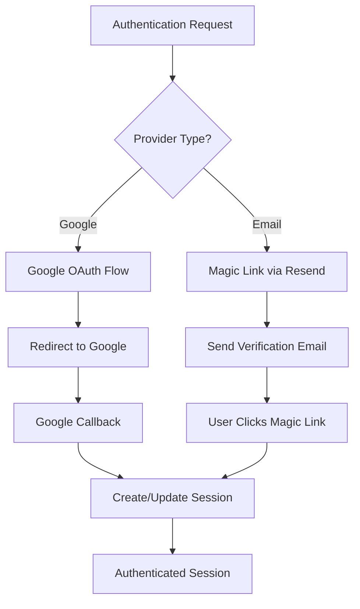
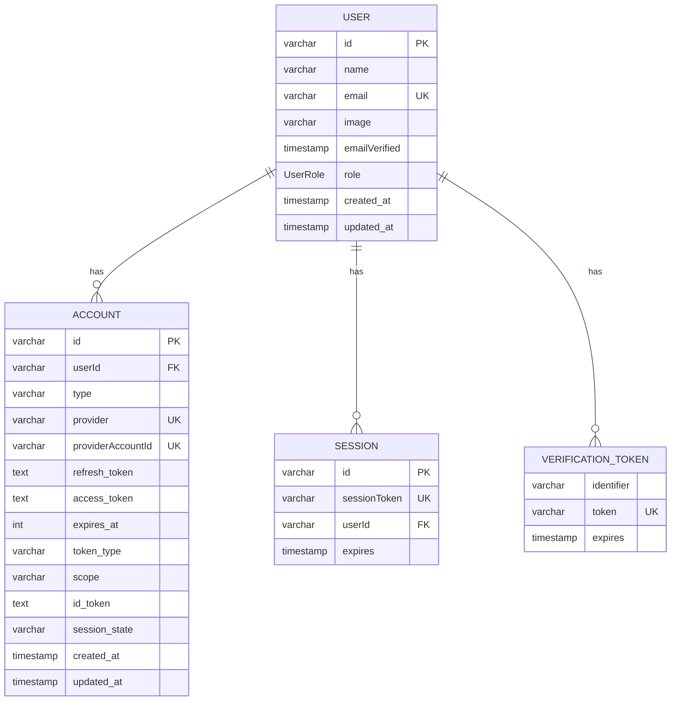
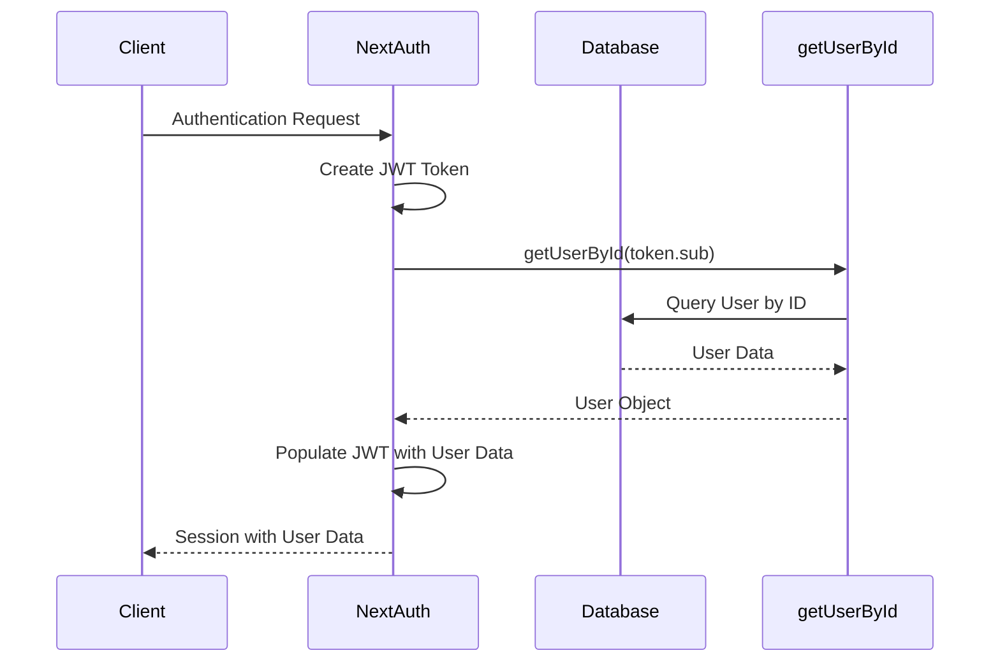
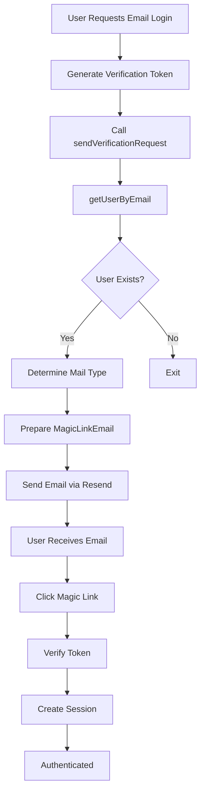
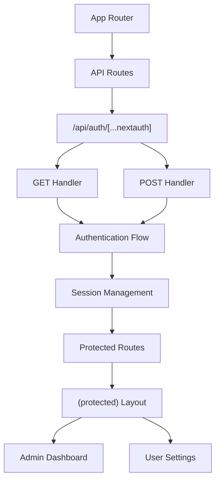
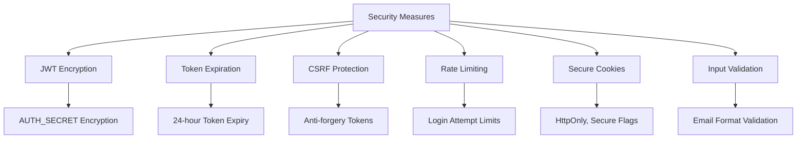
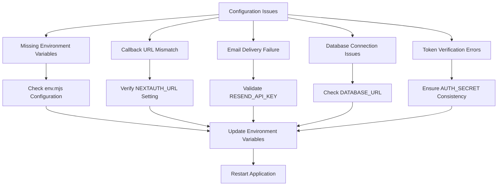
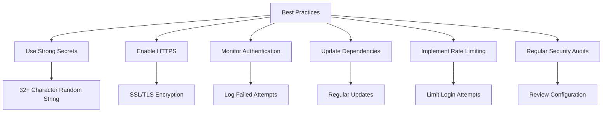

# NextAuth Configuration

<cite>
**Referenced Files in This Document**   
- [auth.config.ts](file://auth.config.ts)
- [auth.ts](file://auth.ts)
- [lib/email.ts](file://lib/email.ts)
- [emails/magic-link-email.tsx](file://emails/magic-link-email.tsx)
- [types/next-auth.d.ts](file://types/next-auth.d.ts)
- [env.mjs](file://env.mjs)
- [lib/db.ts](file://lib/db.ts)
- [app/api/auth/[...nextauth]/route.ts](file://app/api/auth/[...nextauth]/route.ts)
</cite>

## Table of Contents
1. [Modular Configuration Architecture](#modular-configuration-architecture)
2. [Authentication Providers Setup](#authentication-providers-setup)
3. [Prisma Adapter Integration](#prisma-adapter-integration)
4. [Session and JWT Configuration](#session-and-jwt-configuration)
5. [Email Magic Link Implementation](#email-magic-link-implementation)
6. [App Router Integration](#app-router-integration)
7. [Security Configuration](#security-configuration)
8. [Common Configuration Issues](#common-configuration-issues)
9. [Best Practices](#best-practices)

## Modular Configuration Architecture

The NextAuth.js configuration follows a modular approach by separating the core authentication logic from provider definitions. The `auth.config.ts` file defines the authentication providers and their configurations, while the main `auth.ts` file handles the overall authentication setup, adapter integration, and session management. This separation allows for better maintainability and easier testing of individual components.

The configuration uses the `satisfies NextAuthConfig` type assertion to ensure type safety while maintaining flexibility in the configuration structure. The main authentication instance imports the configuration from `auth.config.ts` using the spread operator, allowing for clean composition of the final configuration object.

**Section sources**
- [auth.config.ts](file://auth.config.ts#L1-L19)
- [auth.ts](file://auth.ts#L1-L66)

## Authentication Providers Setup

The application implements two primary authentication providers: Google OAuth and Email magic link via Resend. The Google provider is configured with client credentials from environment variables, enabling secure OAuth2 authentication. The Email provider uses Resend as the email delivery service, configured with API key and sender address from environment variables.

The provider configuration follows security best practices by storing sensitive credentials in environment variables rather than hardcoding them in the source files. Each provider is imported from the `next-auth/providers` package and configured with the appropriate parameters before being added to the providers array in the configuration.

**Diagram sources**
- [auth.config.ts](file://auth.config.ts#L1-L19)
- [env.mjs](file://env.mjs#L1-L48)

**Section sources**
- [auth.config.ts](file://auth.config.ts#L1-L19)
- [env.mjs](file://env.mjs#L1-L48)

## Prisma Adapter Integration

The authentication system integrates with Prisma through the `@auth/prisma-adapter` package, providing persistent storage for user sessions, accounts, and verification tokens. The adapter connects to the Prisma client instance from `@/lib/db`, enabling seamless database operations for authentication-related data.

The Prisma schema includes tables for `accounts`, `sessions`, `users`, and `verification_tokens`, with appropriate indexes and constraints to ensure data integrity and optimal query performance. The adapter automatically handles the mapping between NextAuth.js data structures and the database schema, reducing the need for manual database operations.

**Diagram sources**
- [auth.ts](file://auth.ts#L1-L66)
- [lib/db.ts](file://lib/db.ts#L1-L17)
- [prisma/migrations/0_init/migration.sql](file://prisma/migrations/0_init/migration.sql#L1-L32)

**Section sources**
- [auth.ts](file://auth.ts#L1-L66)
- [lib/db.ts](file://lib/db.ts#L1-L17)

## Session and JWT Configuration

The application uses JWT-based session management with the configuration `session: { strategy: "jwt" }`. This approach stores session data in encrypted tokens rather than database sessions, reducing database queries and improving scalability. The JWT tokens contain user information including ID, email, name, image, and role, which are synchronized between the token and session objects through callback functions.

The session callback function enriches the session object with user data from the JWT token, ensuring that the session contains all necessary user information. The JWT callback function retrieves user data from the database when a token is created or refreshed, ensuring that the token contains up-to-date user information.

**Diagram sources**
- [auth.ts](file://auth.ts#L1-L66)
- [lib/user.ts](file://lib/user.ts#L20-L28)

**Section sources**
- [auth.ts](file://auth.ts#L1-L66)
- [lib/user.ts](file://lib/user.ts#L20-L28)

## Email Magic Link Implementation

The email magic link authentication is implemented using the Resend provider and a custom `sendVerificationRequest` function. When a user requests authentication via email, NextAuth.js generates a time-limited verification token and calls the `sendVerificationRequest` function with the token URL and user identifier.

The custom email sender retrieves user information from the database and sends a personalized email using the React-based `MagicLinkEmail` component. The email contains a button with the verification URL that, when clicked, authenticates the user. The implementation includes different email templates for new user registration versus existing user login based on the user's verification status.

**Diagram sources**
- [lib/email.ts](file://lib/email.ts#L1-L50)
- [emails/magic-link-email.tsx](file://emails/magic-link-email.tsx#L1-L68)

**Section sources**
- [lib/email.ts](file://lib/email.ts#L1-L50)
- [emails/magic-link-email.tsx](file://emails/magic-link-email.tsx#L1-L68)

## App Router Integration

The NextAuth.js configuration integrates with the Next.js App Router through the API route handler in `app/api/auth/[...nextauth]/route.ts`. This file exports the GET and POST handlers from the main authentication instance, making the authentication endpoints available at `/api/auth/*`.

The configuration specifies custom pages for authentication flows, redirecting users to the `/login` page when authentication is required. This integration allows Server Components and Server Actions to access the authentication state using the `auth()` function imported from `@/auth`, enabling server-side authentication checks and user data retrieval.

**Diagram sources**
- [auth.ts](file://auth.ts#L1-L66)
- [app/api/auth/[...nextauth]/route.ts](file://app/api/auth/[...nextauth]/route.ts#L1-L1)

**Section sources**
- [auth.ts](file://auth.ts#L1-L66)
- [app/api/auth/[...nextauth]/route.ts](file://app/api/auth/[...nextauth]/route.ts#L1-L1)

## Security Configuration

The authentication system implements multiple security measures to protect user data and prevent common attacks. The JWT tokens are encrypted using the `AUTH_SECRET` environment variable, which should be a cryptographically secure random string. The magic link emails include time-limited tokens that expire after 24 hours and can only be used once, preventing replay attacks.

The configuration includes CSRF protection through the use of secure tokens and proper session management. The email sender includes unique headers to prevent email threading in Gmail, ensuring that each authentication email is treated as a separate message. The system also implements proper error handling that avoids leaking sensitive information in error messages.

**Section sources**
- [auth.config.ts](file://auth.config.ts#L1-L19)
- [env.mjs](file://env.mjs#L1-L48)
- [auth.ts](file://auth.ts#L1-L66)

## Common Configuration Issues

Several common issues may arise when configuring NextAuth.js in this application. Provider setup errors often occur when environment variables are missing or incorrectly configured, particularly `GOOGLE_CLIENT_ID`, `GOOGLE_CLIENT_SECRET`, and `RESEND_API_KEY`. Callback URL mismatches can prevent successful authentication, especially when the `NEXTAUTH_URL` environment variable doesn't match the actual deployment URL.

Email delivery failures may occur if the Resend API key is invalid or if the email sending quota has been exceeded. In development, emails are sent to `delivered@resend.dev` instead of the user's actual email address, which can cause confusion when testing the magic link flow. Database connection issues can prevent user data from being retrieved, breaking the JWT callback chain.

**Section sources**
- [env.mjs](file://env.mjs#L1-L48)
- [auth.config.ts](file://auth.config.ts#L1-L19)
- [auth.ts](file://auth.ts#L1-L66)
- [ENVIRONMENT_SETUP_GUIDE.md](file://ENVIRONMENT_SETUP_GUIDE.md#L12-L58)

## Best Practices

To ensure secure and reliable authentication, several best practices should be followed. Always use strong, randomly generated secrets for `AUTH_SECRET` and rotate them periodically in production environments. Implement proper error monitoring to detect and respond to authentication failures and security incidents.

For production deployments, ensure that all environment variables are properly configured and that the application is deployed with HTTPS to protect authentication data in transit. Regularly update the NextAuth.js and related dependencies to benefit from security patches and new features. Implement monitoring for unusual authentication patterns that might indicate brute force attacks or account takeover attempts.

**Section sources**
- [env.mjs](file://env.mjs#L1-L48)
- [auth.config.ts](file://auth.config.ts#L1-L19)
- [auth.ts](file://auth.ts#L1-L66)
- [QODER_AGENT_RULES.md](file://QODER_AGENT_RULES.md#L193-L261)