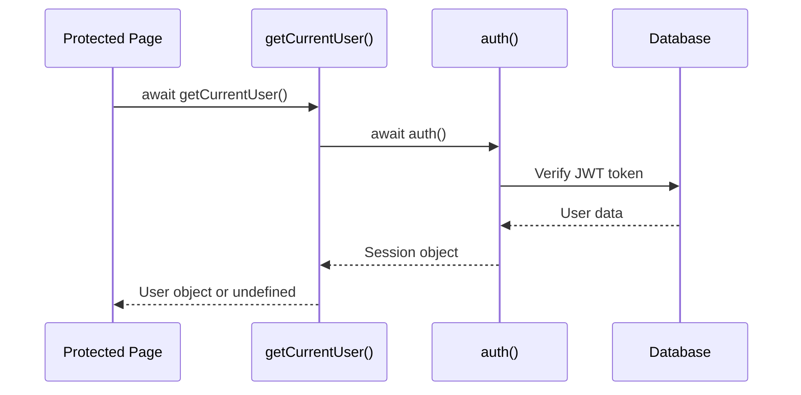
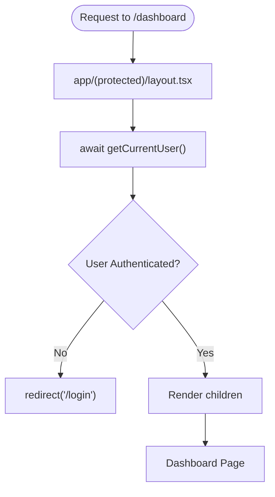
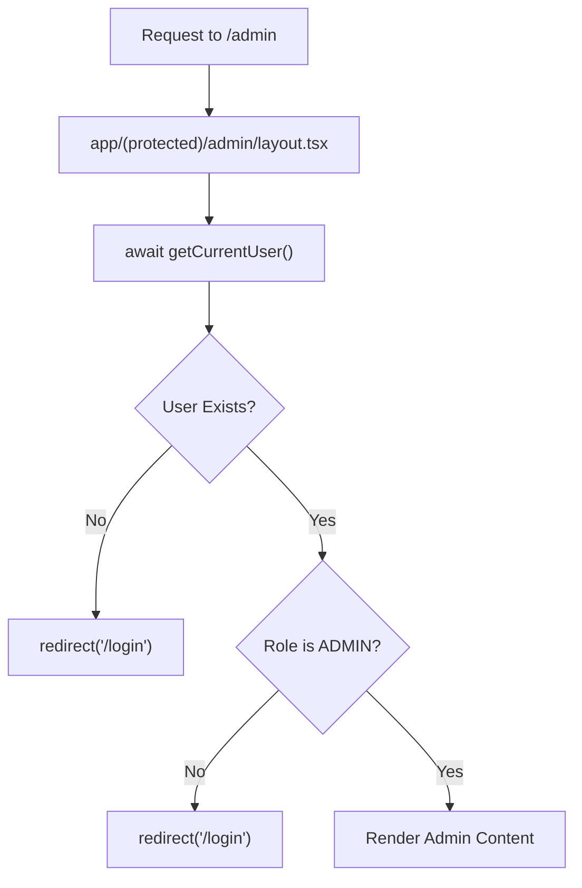
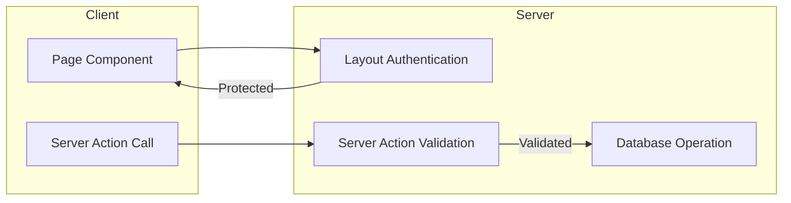
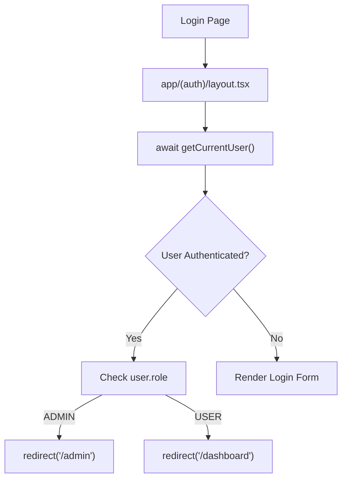

# Protected Routes

<cite>
**Referenced Files in This Document**   
- [middleware.ts](file://middleware.ts)
- [auth.ts](file://auth.ts)
- [lib/session.ts](file://lib/session.ts)
- [app/(protected)/layout.tsx](file://app/(protected)/layout.tsx)
- [app/(protected)/admin/layout.tsx](file://app/(protected)/admin/layout.tsx)
- [app/(auth)/layout.tsx](file://app/(auth)/layout.tsx)
</cite>

## Table of Contents
1. [Introduction](#introduction)
2. [Middleware-Based Route Protection](#middleware-based-route-protection)
3. [Authentication Session Management](#authentication-session-management)
4. [Layout-Level Protection Mechanisms](#layout-level-protection-mechanisms)
5. [Role-Based Access Control](#role-based-access-control)
6. [Client and Server-Side Protection Integration](#client-and-server-side-protection-integration)
7. [Common Issues and Mitigations](#common-issues-and-mitigations)
8. [Performance and Caching Considerations](#performance-and-caching-considerations)

## Introduction
This document details the implementation of protected routes in a Next.js application using middleware, authentication guards, and session management. The system leverages NextAuth.js for authentication, React Server Components for server-side data fetching, and a layered protection strategy to secure both UI routes and API endpoints. The architecture ensures that only authenticated users can access protected content, with additional role-based restrictions applied where necessary.

## Middleware-Based Route Protection

The application uses Next.js middleware to intercept requests to protected routes and enforce authentication before rendering any content. The middleware is defined in `middleware.ts` and delegates authentication logic to the NextAuth.js framework.

```mermaid
flowchart TD
A[Incoming Request] --> B{Is Path in (protected)?}
B --> |Yes| C[Invoke auth middleware]
C --> D{Valid Session?}
D --> |No| E[Redirect to /login]
D --> |Yes| F[Allow Request to Proceed]
B --> |No| G[Allow Request to Proceed]
```

**Diagram sources**
- [middleware.ts](file://middleware.ts#L1-L1)

**Section sources**
- [middleware.ts](file://middleware.ts#L1-L1)

## Authentication Session Management

Authentication state is managed through a centralized session utility located in `lib/session.ts`. This module exports a cached `getCurrentUser` function that retrieves the current user's session data from NextAuth.js. The use of React's `cache` function ensures that session data is only fetched once per request, improving performance and consistency across server components.



**Diagram sources**
- [lib/session.ts](file://lib/session.ts#L5-L11)
- [auth.ts](file://auth.ts#L20-L67)

**Section sources**
- [lib/session.ts](file://lib/session.ts#L5-L11)
- [auth.ts](file://auth.ts#L20-L67)

## Layout-Level Protection Mechanisms

Protected routes are grouped under the `(protected)` route segment, which uses a root layout component to enforce authentication. The `app/(protected)/layout.tsx` file implements server-side authentication checks that redirect unauthenticated users to the login page.



This layout-level protection ensures that no protected content is rendered without proper authentication, preventing both UI and data exposure.

**Diagram sources**
- [app/(protected)/layout.tsx](file://app/(protected)/layout.tsx#L18-L18)
- [lib/session.ts](file://lib/session.ts#L5-L11)

**Section sources**
- [app/(protected)/layout.tsx](file://app/(protected)/layout.tsx#L1-L57)

## Role-Based Access Control

The application implements role-based access control (RBAC) for administrative routes. The `app/(protected)/admin/layout.tsx` component enforces that only users with the "ADMIN" role can access admin pages. This is achieved by checking the user's role property, which is included in the session object via NextAuth.js callbacks.



The role information is securely attached to the JWT token during the `jwt` callback in the NextAuth configuration, ensuring that role data cannot be tampered with on the client side.

**Diagram sources**
- [app/(protected)/admin/layout.tsx](file://app/(protected)/admin/layout.tsx#L9-L9)
- [auth.ts](file://auth.ts#L50-L60)

**Section sources**
- [app/(protected)/admin/layout.tsx](file://app/(protected)/admin/layout.tsx#L1-L15)
- [auth.ts](file://auth.ts#L50-L60)

## Client and Server-Side Protection Integration

The application employs a defense-in-depth strategy by combining server-side and client-side protection mechanisms. While server-side checks in layout components prevent unauthorized access, client-side components also verify authentication status to provide immediate feedback and enhance user experience.

Server Actions that perform sensitive operations (such as updating user roles or managing subscriptions) validate session data before execution. This ensures that even if a client-side check is bypassed, the server will still enforce authentication and authorization rules.



**Diagram sources**
- [app/(protected)/dashboard/page.tsx](file://app/(protected)/dashboard/page.tsx#L12-L12)
- [actions/update-user-role.ts](file://actions/update-user-role.ts)
- [lib/session.ts](file://lib/session.ts#L5-L11)

**Section sources**
- [app/(protected)/dashboard/page.tsx](file://app/(protected)/dashboard/page.tsx#L12-L12)
- [actions/update-user-role.ts](file://actions/update-user-role.ts)
- [lib/session.ts](file://lib/session.ts#L5-L11)

## Common Issues and Mitigations

### Hydration Mismatches
Hydration mismatches can occur when client and server render different content based on authentication state. This is mitigated by ensuring that authentication checks happen at the layout level before any client components are rendered.

### Redirect Loops
Redirect loops are prevented by carefully designing the authentication flow. The `(auth)` layout checks if a user is already authenticated and redirects them to the appropriate dashboard, preventing infinite loops between login and protected routes.



**Diagram sources**
- [app/(auth)/layout.tsx](file://app/(auth)/layout.tsx#L8-L17)

**Section sources**
- [app/(auth)/layout.tsx](file://app/(auth)/layout.tsx#L8-L17)

### Bypassing Client-Side Checks
Client-side checks can be bypassed by manipulating the DOM or JavaScript. The application mitigates this risk by always enforcing authentication and authorization rules on the server, particularly in Server Actions and API routes.

## Performance and Caching Considerations

The session management system is optimized for performance through several mechanisms:

1. **Cached Session Data**: The `getCurrentUser` function uses React's `cache` to ensure that session data is only fetched once per request, reducing database queries.

2. **JWT Strategy**: The application uses JWT-based sessions, which are stateless and do not require server-side storage lookups on every request.

3. **Selective Revalidation**: Protected routes can leverage Next.js revalidation strategies to balance security and performance, ensuring that authentication checks are performed without unnecessary overhead.

4. **Edge Compatibility**: The middleware and server components are designed to work efficiently at the edge, minimizing latency for authentication checks.

These optimizations ensure that route protection does not introduce significant performance overhead while maintaining robust security.

**Section sources**
- [lib/session.ts](file://lib/session.ts#L5-L11)
- [auth.ts](file://auth.ts#L20-L67)
- [middleware.ts](file://middleware.ts#L1-L1)