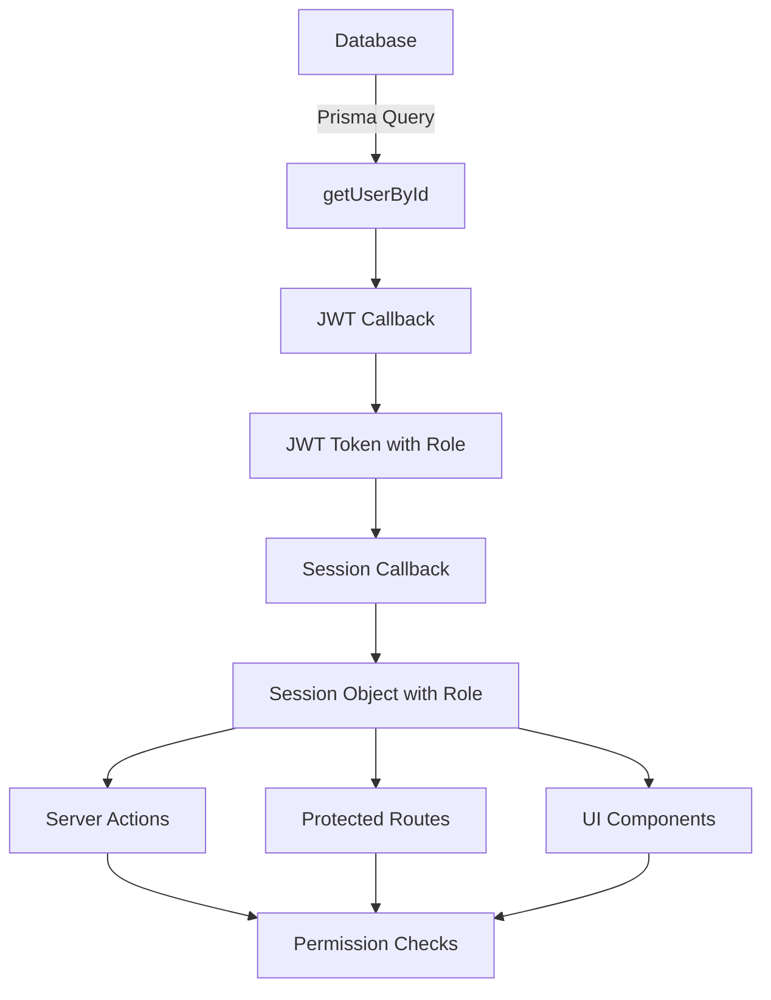

# User Roles & Permissions

<cite>
**Referenced Files in This Document**   
- [schema.prisma](file://prisma/schema.prisma)
- [auth.ts](file://auth.ts)
- [types/next-auth.d.ts](file://types/next-auth.d.ts)
- [actions/update-user-role.ts](file://actions/update-user-role.ts)
- [components/forms/user-role-form.tsx](file://components/forms/user-role-form.tsx)
- [app/(auth)/layout.tsx](file://app/(auth)/layout.tsx)
- [lib/validations/user.ts](file://lib/validations/user.ts)
</cite>

## Table of Contents
1. [Introduction](#introduction)
2. [Role Definition in Prisma Schema](#role-definition-in-prisma-schema)
3. [Session Object Augmentation](#session-object-augmentation)
4. [Type Augmentation for NextAuth](#type-augmentation-for-nextauth)
5. [Role-Based Access Control Implementation](#role-based-access-control-implementation)
6. [Data Flow from Database to Permission Enforcement](#data-flow-from-database-to-permission-enforcement)
7. [Role-Based UI Rendering and API Access](#role-based-ui-rendering-and-api-access)
8. [Common Issues and Solutions](#common-issues-and-solutions)
9. [Extending the Role System](#extending-the-role-system)
10. [Conclusion](#conclusion)

## Introduction
This document details the role-based access control (RBAC) system implemented in the Next.js SaaS application. The system defines USER and ADMIN roles, manages their persistence through authentication flows, and enforces permissions across the application. The implementation leverages Prisma for database modeling, NextAuth for authentication, and TypeScript for type safety throughout the stack.

## Role Definition in Prisma Schema

The role system is defined at the database level using Prisma's enum feature. Two roles are implemented: USER and ADMIN, with USER as the default role for new accounts.

```prisma
enum UserRole {
  ADMIN
  USER
}

model User {
  id            String    @id @default(cuid())
  name          String?
  email         String?   @unique
  emailVerified DateTime?
  image         String?
  createdAt     DateTime  @default(now()) @map(name: "created_at")
  updatedAt     DateTime  @default(now()) @map(name: "updated_at")
  role          UserRole  @default(USER)
  // ... other fields
}
```

The `role` field in the User model is of type `UserRole` and defaults to `USER`. This ensures all newly created users start with basic permissions, while administrators can be explicitly assigned the ADMIN role.

**Section sources**
- [schema.prisma](file://prisma/schema.prisma#L10-L12)

## Session Object Augmentation

The role information is propagated from the database to the authentication session through NextAuth's callback system. During the JWT and session callbacks, the user's role is extracted from the database and attached to the token and session objects.

In `auth.ts`, the `jwt` callback retrieves the user from the database and adds the role to the JWT token:

```typescript
async jwt({ token }) {
  if (!token.sub) return token;
  
  const dbUser = await getUserById(token.sub);
  if (!dbUser) return token;
  
  token.role = dbUser.role;
  return token;
}
```

The `session` callback then transfers the role from the JWT token to the session object:

```typescript
async session({ token, session }) {
  if (session.user) {
    if (token.role) {
      session.user.role = token.role;
    }
  }
  return session;
}
```

This two-step process ensures that the role information is securely stored in the JWT and made available in the session for use throughout the application.

**Section sources**
- [auth.ts](file://auth.ts#L45-L55)

## Type Augmentation for NextAuth

To maintain type safety, the NextAuth session and JWT types are augmented to include the role property. This is accomplished through module augmentation in TypeScript.

The type augmentation is defined in `types/next-auth.d.ts`:

```typescript
export type ExtendedUser = User & {
  role: UserRole;
};

declare module "next-auth/jwt" {
  interface JWT {
    role: UserRole;
  }
}

declare module "next-auth" {
  interface Session {
    user: ExtendedUser;
  }
}
```

This augmentation extends the default NextAuth types to include the `role` property, ensuring type safety when accessing `session.user.role` throughout the application. The `ExtendedUser` type combines the default User type with the role property, while the module declarations extend the JWT and Session interfaces.

**Section sources**
- [types/next-auth.d.ts](file://types/next-auth.d.ts#L4-L19)

## Role-Based Access Control Implementation

Role-based access control is implemented through server actions, protected routes, and UI components. The system ensures that only users with appropriate roles can access certain functionality.

### Server-Side Role Validation

The `updateUserRole` server action demonstrates role-based access control:

```typescript
export async function updateUserRole(userId: string, data: FormData) {
  try {
    const session = await auth();
    
    if (!session?.user || session?.user.id !== userId) {
      throw new Error("Unauthorized");
    }
    
    const { role } = userRoleSchema.parse(data);
    
    await prisma.user.update({
      where: { id: userId },
      data: { role: role },
    });
    
    revalidatePath("/dashboard/settings");
    return { status: "success" };
  } catch (error) {
    return { status: "error" };
  }
}
```

This action first verifies that the requesting user is authenticated and is attempting to update their own role. It then validates the role input against a Zod schema before updating the database.

### Role-Based Route Protection

The authentication layout implements role-based routing:

```typescript
export default async function AuthLayout({ children }: AuthLayoutProps) {
  const user = await getCurrentUser();
  
  if (user) {
    if (user.role === "ADMIN") redirect("/admin");
    redirect("/dashboard");
  }
  
  return <div className="min-h-screen">{children}</div>;
}
```

This ensures that authenticated users are redirected to appropriate dashboards based on their role, with ADMIN users going to the admin dashboard and USER roles going to the standard dashboard.

**Section sources**
- [actions/update-user-role.ts](file://actions/update-user-role.ts#L13-L39)
- [app/(auth)/layout.tsx](file://app/(auth)/layout.tsx#L8-L17)

## Data Flow from Database to Permission Enforcement

The data flow for role-based permissions follows a clear path from database storage to UI enforcement:

1. **Database Storage**: User roles are stored in the PostgreSQL database via Prisma
2. **Authentication**: During login, the user's role is retrieved from the database
3. **JWT Token**: The role is encoded in the JWT token during the jwt callback
4. **Session Object**: The role is transferred to the session object during the session callback
5. **Client Access**: The role is available in the session throughout the application
6. **Permission Enforcement**: Roles are checked in server actions, API routes, and UI components

This flow ensures that role information is securely transmitted and consistently available for permission checks.



**Diagram sources**
- [auth.ts](file://auth.ts#L45-L55)
- [actions/update-user-role.ts](file://actions/update-user-role.ts#L13-L39)
- [app/(auth)/layout.tsx](file://app/(auth)/layout.tsx#L8-L17)

## Role-Based UI Rendering and API Access

The application implements role-based rendering in both UI components and API access control.

### UI Component Implementation

The `UserRoleForm` component allows role updates with proper validation:

```typescript
export function UserRoleForm({ user }: UserNameFormProps) {
  const { update } = useSession();
  const [updated, setUpdated] = useState(false);
  const [isPending, startTransition] = useTransition();
  const updateUserRoleWithId = updateUserRole.bind(null, user.id);
  
  const roles = Object.values(UserRole);
  const [role, setRole] = useState(user.role);
  
  const form = useForm<FormData>({
    resolver: zodResolver(userRoleSchema),
    values: { role: role },
  });
  
  const onSubmit = (data: z.infer<typeof userRoleSchema>) => {
    startTransition(async () => {
      const { status } = await updateUserRoleWithId(data);
      
      if (status !== "success") {
        toast.error("Something went wrong.", {
          description: "Your role was not updated. Please try again.",
        });
      } else {
        await update();
        setUpdated(false);
        toast.success("Your role has been updated.");
      }
    });
  };
  
  // ... form rendering
}
```

The form uses Zod validation to ensure only valid roles are submitted and provides user feedback through toast notifications.

### Navigation and Menu Rendering

The `UserAccountNav` component conditionally renders admin navigation based on the user's role:

```typescript
{user.role === "ADMIN" ? (
  <DropdownMenuItem asChild>
    <Link href="/admin" className="flex items-center space-x-2.5">
      <Lock className="size-4" />
      <p className="text-sm">Admin</p>
    </Link>
  </DropdownMenuItem>
) : null}
```

This ensures that only users with the ADMIN role see the admin navigation option.

**Section sources**
- [components/forms/user-role-form.tsx](file://components/forms/user-role-form.tsx#L35-L133)
- [lib/validations/user.ts](file://lib/validations/user.ts#L7-L9)

## Common Issues and Solutions

### Role Persistence After Login

Issue: Role information not persisting after login
Solution: Ensure the jwt and session callbacks in auth.ts are properly configured to transfer role data from the database to the session object. The callbacks must retrieve the user from the database and explicitly set the role property.

### Type Errors in Augmented Session Objects

Issue: TypeScript errors when accessing session.user.role
Solution: Verify that the type augmentation in types/next-auth.d.ts is correctly implemented and that the file is properly referenced in the TypeScript configuration. Ensure the ExtendedUser type is properly defined and the module declarations are correct.

### Proper Role Validation in Server-Side Functions

Issue: Server actions not properly validating roles
Solution: Always validate input data using Zod schemas and verify user authorization before performing operations. The updateUserRole action demonstrates proper validation:

```typescript
const { role } = userRoleSchema.parse(data);
```

Additionally, always verify that the authenticated user has permission to perform the requested action:

```typescript
if (!session?.user || session?.user.id !== userId) {
  throw new Error("Unauthorized");
}
```

## Extending the Role System

The role system can be extended to support additional roles and more granular permissions.

### Adding New Roles

To add new roles, update the Prisma schema:

```prisma
enum UserRole {
  ADMIN
  USER
  MODERATOR
  VIEWER
}
```

Then update the default role in the User model if needed. The type augmentation will automatically recognize the new enum values due to TypeScript's enum inference.

### Implementing Granular Permissions

For more complex permission systems, consider creating a separate Permission model that can be associated with roles:

```prisma
model Permission {
  id   String @id @default(cuid())
  name String @unique
}

model RolePermission {
  roleId        String
  permissionId  String
  
  role        Role        @relation(fields: [roleId], references: [id])
  permission  Permission  @relation(fields: [permissionId], references: [id])
  
  @@unique([roleId, permissionId])
}
```

This would allow for more flexible permission management while maintaining the existing role-based foundation.

## Conclusion
The role-based access control system provides a robust foundation for managing user permissions in the SaaS application. By leveraging Prisma for data modeling, NextAuth for authentication, and TypeScript for type safety, the system ensures secure and reliable role management. The clear data flow from database to UI, combined with proper validation and error handling, creates a maintainable and extensible permission system that can grow with the application's needs.