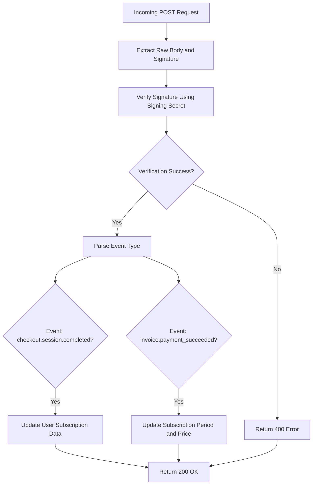
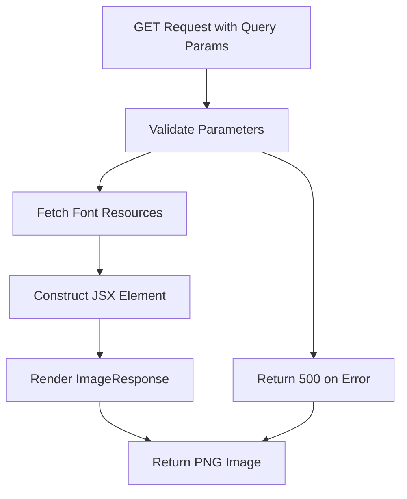

# API Endpoints Reference

<cite>
**Referenced Files in This Document**   
- [route.ts](file://app/api/auth/[...nextauth]/route.ts)
- [auth.config.ts](file://auth.config.ts)
- [route.ts](file://app/api/user/route.ts)
- [session.ts](file://lib/session.ts)
- [route.ts](file://app/api/webhooks/stripe/route.ts)
- [stripe.ts](file://lib/stripe.ts)
- [route.tsx](file://app/api/og/route.tsx)
- [og.ts](file://lib/validations/og.ts)
- [db.ts](file://lib/db.ts)
- [next-auth.d.ts](file://types/next-auth.d.ts)
</cite>

## Table of Contents
1. [Authentication API](#authentication-api)
2. [User API](#user-api)
3. [Stripe Webhook API](#stripe-webhook-api)
4. [Open Graph Image Generation API](#open-graph-image-generation-api)
5. [Security Considerations](#security-considerations)
6. [Error Handling](#error-handling)
7. [Integration Guidance](#integration-guidance)
8. [Troubleshooting Common Issues](#troubleshooting-common-issues)

## Authentication API

The authentication API at `/api/auth/[...nextauth]` serves as the central authentication endpoint powered by NextAuth.js. It handles user login, registration, session management, and provider integration through a modular configuration.

This endpoint exposes standard NextAuth.js routes via re-exporting `GET` and `POST` handlers from the global `@/auth` module, which internally uses the configuration defined in `auth.config.ts`. The system supports multiple authentication providers including Google OAuth and email-based magic links via Resend.

Upon successful authentication, a secure session is created and stored server-side. The session includes extended user properties such as role information, which is typed through the `ExtendedUser` interface defined in `next-auth.d.ts`. Session data is cached using React's `cache` function for performance optimization in server components.

Supported providers:
- **Google**: Enables OAuth2 sign-in using Google credentials
- **Resend**: Sends magic links to user email addresses for passwordless authentication

Authentication state is maintained through encrypted JWT tokens and secure HTTP-only cookies. The integration follows NextAuth.js best practices for CSRF protection and secure session handling.

**Section sources**
- [route.ts](file://app/api/auth/[...nextauth]/route.ts#L1)
- [auth.config.ts](file://auth.config.ts#L1-L21)
- [session.ts](file://lib/session.ts#L1-L12)
- [next-auth.d.ts](file://types/next-auth.d.ts#L1-L20)

## User API

The `/api/user` endpoint provides user account management functionality, currently supporting account deletion through the `DELETE` method. Access to this endpoint is protected by session-based authentication middleware.

When a DELETE request is made, the endpoint verifies the user's authentication status using the `auth` wrapper. It retrieves the authenticated user from the request object and performs a soft delete operation on the corresponding record in the database using Prisma ORM.

The response returns appropriate HTTP status codes:
- `200 OK` on successful deletion
- `401 Unauthorized` if no valid session exists
- `500 Internal Server Error` for database operation failures

User data retrieval is handled through the `getCurrentUser` function in `session.ts`, which leverages React's caching mechanism to optimize performance while ensuring security by validating session integrity before returning user data.

**Section sources**
- [route.ts](file://app/api/user/route.ts#L1-L27)
- [session.ts](file://lib/session.ts#L1-L12)
- [db.ts](file://lib/db.ts#L1-L18)

## Stripe Webhook API

The Stripe webhook endpoint at `/api/webhooks/stripe` handles subscription lifecycle events from Stripe. It is configured to receive and verify webhook payloads using Stripe's signature verification mechanism.

### Request Processing Flow


**Diagram sources**
- [route.ts](file://app/api/webhooks/stripe/route.ts#L1-L78)

The endpoint listens for two primary event types:
1. **checkout.session.completed**: Triggers when a user completes a checkout process. The handler retrieves the associated subscription and updates the user's record with:
   - Stripe Subscription ID
   - Customer ID
   - Price ID
   - Current billing period end date

2. **invoice.payment_succeeded**: Handles recurring payments and subscription updates. For non-initial payments, it updates the price ID and extends the current period end date.

Signature verification uses the `STRIPE_WEBHOOK_SECRET` environment variable to ensure requests originate from Stripe. Invalid signatures result in a 400 Bad Request response to prevent replay attacks.

**Section sources**
- [route.ts](file://app/api/webhooks/stripe/route.ts#L1-L78)
- [stripe.ts](file://lib/stripe.ts#L1-L9)
- [db.ts](file://lib/db.ts#L1-L18)

## Open Graph Image Generation API

The Open Graph image generation API at `/api/og` dynamically generates social media preview images using Vercel's `@vercel/og` library. The endpoint renders images on-demand using Edge Functions for low-latency performance.

### Request Parameters
The API accepts the following query parameters validated through `ogImageSchema`:
- `heading`: Main title text (truncated at 100 characters)
- `type`: Content type label (e.g., "Blog", "Doc")
- `mode`: Color theme ("light" or "dark", default: "dark")

### Image Rendering Process


**Diagram sources**
- [route.tsx](file://app/api/og/route.tsx#L1-L159)

The generated image features:
- A gradient background (black-to-gray in dark mode, white in light mode)
- "SaaS Starter" logo with gradient text effect
- Main heading with dynamic font sizing based on length
- Author information with GitHub profile image
- Repository URL with GitHub logo

The design uses custom fonts (Inter Regular and Cal Sans SemiBold) loaded from the project's assets directory. Error handling returns a 500 status if image generation fails for any reason.

**Section sources**
- [route.tsx](file://app/api/og/route.tsx#L1-L159)
- [og.ts](file://lib/validations/og.ts#L1-L8)

## Security Considerations

The API implements multiple security measures across endpoints:

### Authentication Security
- Uses NextAuth.js built-in CSRF protection
- Sessions are stored server-side with JWT encryption
- Magic link authentication prevents password storage
- Provider credentials are environment-protected

### Webhook Security
- Stripe signature verification prevents unauthorized access
- Webhook secret is loaded from environment variables
- Invalid signatures return 400 without revealing details

### Rate Limiting
While not explicitly implemented in the provided code, production deployments should consider:
- Implementing rate limiting on authentication endpoints
- Monitoring webhook delivery frequency
- Adding request throttling for image generation

### Data Protection
- Database operations use parameterized queries via Prisma
- User deletion is performed through authenticated requests only
- Sensitive fields are not exposed in API responses

**Section sources**
- [auth.config.ts](file://auth.config.ts#L1-L21)
- [route.ts](file://app/api/webhooks/stripe/route.ts#L1-L78)
- [route.ts](file://app/api/user/route.ts#L1-L27)

## Error Handling

Each API endpoint implements structured error handling:

### Authentication API
- Relies on NextAuth.js default error handling
- Invalid sessions automatically redirect to login
- Provider errors are communicated through standardized flows

### User API
- `401 Unauthorized`: Missing or invalid authentication
- `500 Internal Server Error`: Database operation failures
- Explicit error messages are avoided to prevent information leakage

### Webhook API
- `400 Bad Request`: Signature verification failures
- Returns generic error messages to avoid exposing secrets
- Failed events should be retried by Stripe automatically

### OG Image API
- `500 Internal Server Error`: Font loading failures or rendering errors
- Catches all exceptions to ensure graceful degradation

All error responses follow HTTP standards and avoid exposing implementation details.

**Section sources**
- [route.ts](file://app/api/user/route.ts#L1-L27)
- [route.ts](file://app/api/webhooks/stripe/route.ts#L1-L78)
- [route.tsx](file://app/api/og/route.tsx#L1-L159)

## Integration Guidance

### Frontend Authentication
Use the `auth` module to check session status in server components:
```typescript
import { getCurrentUser } from "@/lib/session";
const user = await getCurrentUser();
```

For client components, use NextAuth.js hooks or the `/api/auth/session` endpoint.

### Webhook Configuration
In the Stripe Dashboard:
1. Set webhook endpoint to `/api/webhooks/stripe`
2. Use the `STRIPE_WEBHOOK_SECRET` value for signing secret
3. Enable events: `checkout.session.completed`, `invoice.payment_succeeded`

### Open Graph Usage
Integrate dynamic OG images in page metadata:
```html
<meta property="og:image" content="/api/og?heading=My+Title&type=Blog&mode=dark" />
```

### User Management
Account deletion requires authenticated requests:
```bash
curl -X DELETE /api/user -H "Authorization: Bearer <token>"
```

**Section sources**
- [session.ts](file://lib/session.ts#L1-L12)
- [route.ts](file://app/api/webhooks/stripe/route.ts#L1-L78)
- [route.tsx](file://app/api/og/route.tsx#L1-L159)

## Troubleshooting Common Issues

### Webhook Delivery Failures
**Symptoms**: Events not reflected in application state  
**Solutions**:
- Verify `STRIPE_WEBHOOK_SECRET` matches dashboard configuration
- Check API route is deployed and accessible
- Ensure server can reach Stripe for signature verification
- Review Vercel logs for edge function errors

### Authentication State Mismatches
**Symptoms**: User appears logged out unexpectedly  
**Solutions**:
- Verify `NEXTAUTH_SECRET` is set in environment
- Check cookie settings and domain configuration
- Ensure consistent HTTPS usage across application
- Validate provider credentials are correctly configured

### OG Image Generation Failures
**Symptoms**: Broken image links or 500 errors  
**Solutions**:
- Verify font files exist in assets directory
- Check edge function deployment status
- Validate query parameters meet schema requirements
- Monitor Vercel edge function quotas

### Subscription State Sync Issues
**Symptoms**: User billing status doesn't update after payment  
**Solutions**:
- Verify webhook endpoint is activated in Stripe
- Check for database connection issues
- Validate user metadata contains correct userId
- Test with Stripe CLI in development

**Section sources**
- [route.ts](file://app/api/webhooks/stripe/route.ts#L1-L78)
- [auth.config.ts](file://auth.config.ts#L1-L21)
- [route.tsx](file://app/api/og/route.tsx#L1-L159)
- [session.ts](file://lib/session.ts#L1-L12)