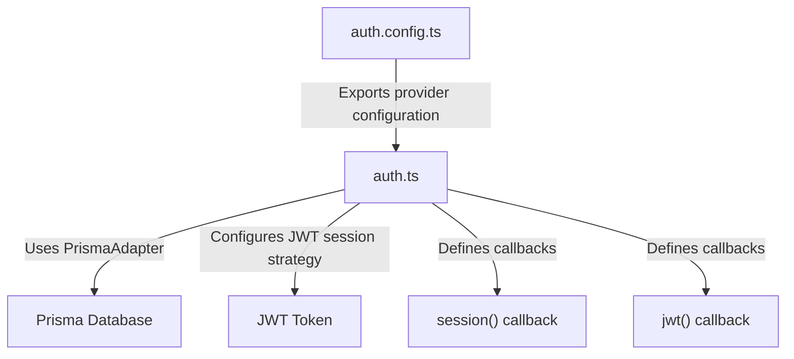
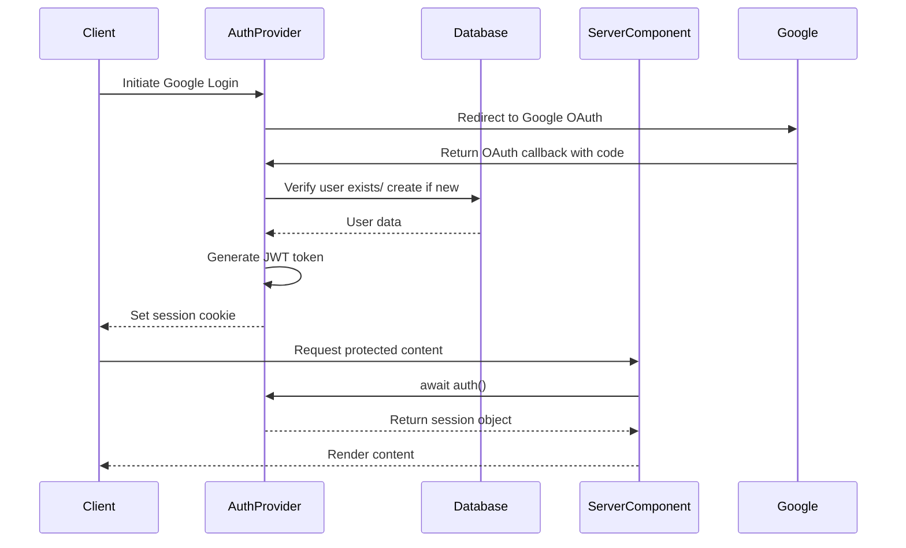
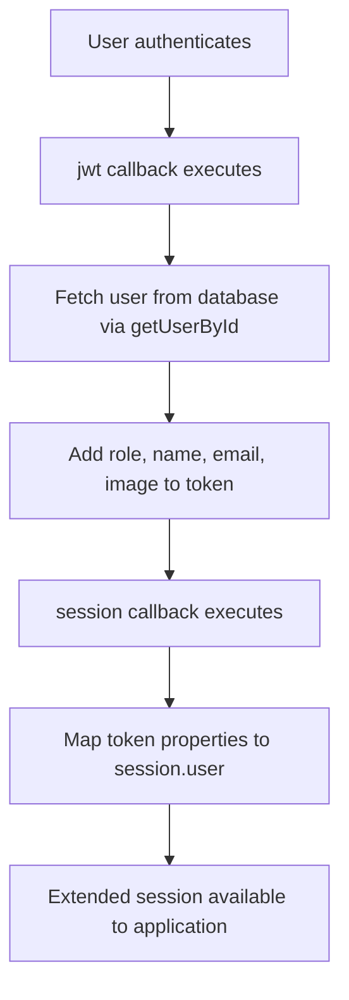
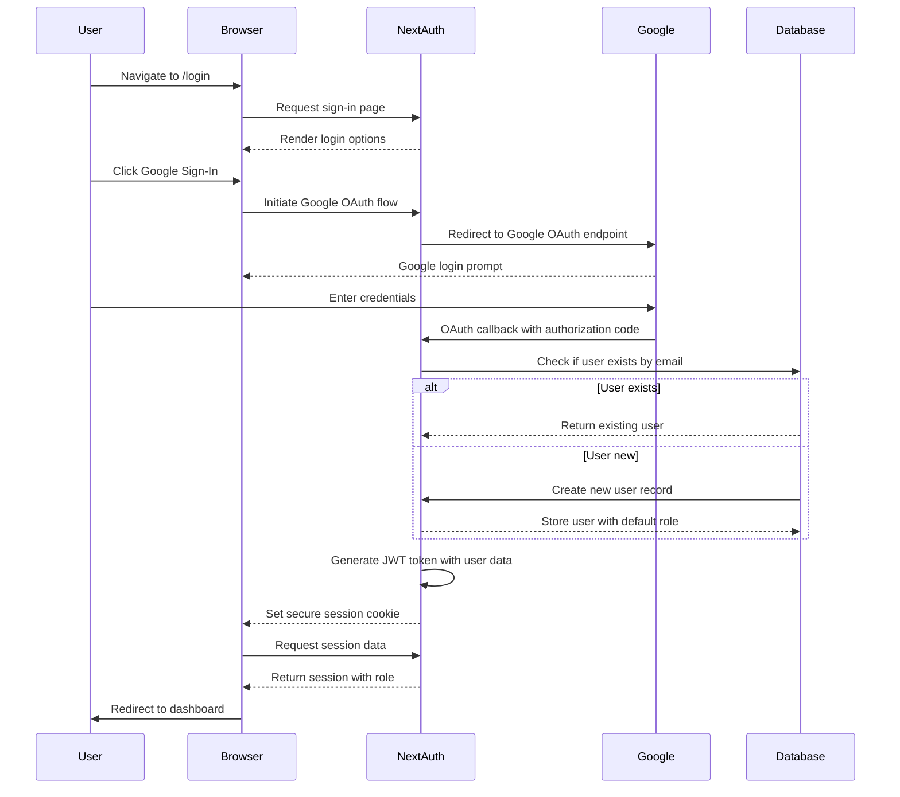
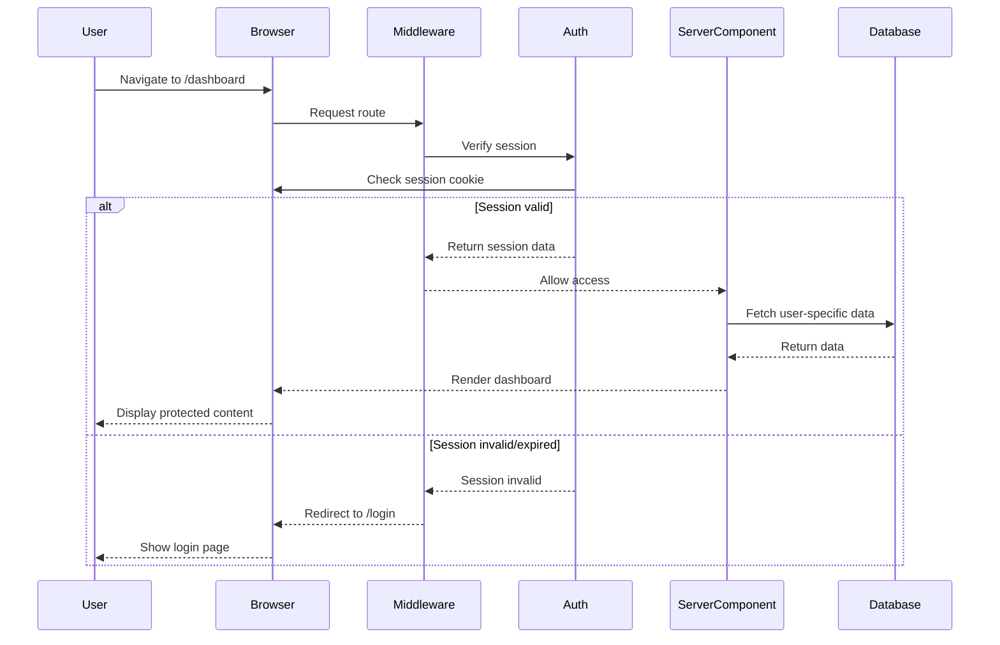

# Authentication Flow

<cite>
**Referenced Files in This Document**   
- [auth.ts](file://auth.ts)
- [auth.config.ts](file://auth.config.ts)
- [middleware.ts](file://middleware.ts)
- [app/api/auth/[...nextauth]/route.ts](file://app/api/auth/[...nextauth]/route.ts)
- [lib/session.ts](file://lib/session.ts)
- [types/next-auth.d.ts](file://types/next-auth.d.ts)
- [ENVIRONMENT_SETUP_GUIDE.md](file://ENVIRONMENT_SETUP_GUIDE.md)
- [QODER_AGENT_RULES.md](file://QODER_AGENT_RULES.md)
</cite>

## Table of Contents
1. [Introduction](#introduction)
2. [Authentication Configuration](#authentication-configuration)
3. [Login Process](#login-process)
4. [Session Management](#session-management)
5. [Route Protection](#route-protection)
6. [Session Augmentation](#session-augmentation)
7. [Sequence Diagrams](#sequence-diagrams)
8. [Troubleshooting Guide](#troubleshooting-guide)
9. [Security Best Practices](#security-best-practices)
10. [Conclusion](#conclusion)

## Introduction
This document provides a comprehensive overview of the authentication system in the next-saas-stripe-starter-main project. The authentication flow is built on NextAuth.js v5 and supports multiple sign-in methods including Google OAuth and email magic links. The system integrates with Prisma for persistent user storage and augments session data with role-based access control and subscription status. This documentation details the end-to-end authentication process, configuration, session handling, and security measures implemented in the application.

## Authentication Configuration

The authentication system is configured through two primary files: `auth.config.ts` and `auth.ts`. The `auth.config.ts` file defines the available providers (Google and Resend for magic links), while `auth.ts` contains the core NextAuth.js configuration including adapter setup, session strategy, and callback functions.

**Diagram sources**
- [auth.config.ts](file://auth.config.ts#L1-L20)
- [auth.ts](file://auth.ts#L1-L67)

**Section sources**
- [auth.config.ts](file://auth.config.ts#L1-L20)
- [auth.ts](file://auth.ts#L1-L67)

## Login Process

Users can authenticate through Google OAuth or email magic links. The login process begins at the `/login` route, which renders the login page in the `(auth)` layout. Upon successful authentication, the system creates a JWT-based session and redirects users based on their role (ADMIN users to `/admin`, others to `/dashboard`).

The authentication endpoints are exposed through the API route at `app/api/auth/[...nextauth]/route.ts`, which re-exports the NextAuth.js handlers for GET and POST requests. This route handles all OAuth callbacks and magic link verifications.

**Section sources**
- [app/(auth)/login/page.tsx](file://app/(auth)/login/page.tsx)
- [app/api/auth/[...nextauth]/route.ts](file://app/api/auth/[...nextauth]/route.ts)
- [app/(auth)/layout.tsx](file://app/(auth)/layout.tsx)

## Session Management

The application manages authentication state using NextAuth.js's built-in session handling with JWT strategy. Sessions are persisted through secure HTTP-only cookies. The `lib/session.ts` file provides a cached utility function `getCurrentUser()` that retrieves the current user's session data, ensuring efficient access to authentication state across server components.

**Diagram sources**
- [auth.ts](file://auth.ts#L1-L67)
- [lib/session.ts](file://lib/session.ts#L1-L11)
- [app/api/auth/[...nextauth]/route.ts](file://app/api/auth/[...nextauth]/route.ts)

**Section sources**
- [lib/session.ts](file://lib/session.ts#L1-L11)
- [auth.ts](file://auth.ts#L1-L67)

## Route Protection

Route protection is implemented through Next.js middleware that leverages the centralized auth instance. The `middleware.ts` file simply exports the auth middleware, which automatically protects routes based on the configuration in `auth.ts`. Protected routes are organized under the `(protected)` directory and require authentication. Unauthenticated users are redirected to the login page.

The middleware also handles role-based redirection in the auth layout, where authenticated users are immediately redirected to appropriate dashboards based on their role.

**Section sources**
- [middleware.ts](file://middleware.ts#L1-L1)
- [app/(auth)/layout.tsx](file://app/(auth)/layout.tsx#L8-L17)

## Session Augmentation

The authentication system extends the default session object with additional user properties including role information. This augmentation occurs through the `session` and `jwt` callbacks in `auth.ts`. The `jwt` callback retrieves user data from the database and adds the role field to the token, while the `session` callback maps this data to the session object.

Type augmentation is implemented in `types/next-auth.d.ts` to ensure type safety throughout the application. The extended session interface includes the `role` property typed with the `UserRole` enum from Prisma.

**Diagram sources**
- [auth.ts](file://auth.ts#L9-L15)
- [types/next-auth.d.ts](file://types/next-auth.d.ts#L8-L18)
- [lib/user.ts](file://lib/user.ts#L20-L28)

**Section sources**
- [auth.ts](file://auth.ts#L9-L15)
- [types/next-auth.d.ts](file://types/next-auth.d.ts#L8-L18)

## Sequence Diagrams

### Login Sequence

**Diagram sources**
- [auth.config.ts](file://auth.config.ts#L1-L20)
- [auth.ts](file://auth.ts#L1-L67)
- [lib/user.ts](file://lib/user.ts#L20-L28)

### Protected Route Access

**Diagram sources**
- [middleware.ts](file://middleware.ts#L1-L1)
- [auth.ts](file://auth.ts#L1-L67)
- [lib/session.ts](file://lib/session.ts#L5-L11)

## Troubleshooting Guide

### Session Expiration Issues
- **Symptom**: Users frequently logged out unexpectedly
- **Solution**: Verify `AUTH_SECRET` is consistent across deployments and environment variables are properly loaded
- **Check**: Ensure `AUTH_SECRET` is set in environment variables as per ENVIRONMENT_SETUP_GUIDE.md

### OAuth Callback Errors
- **Symptom**: Google OAuth redirects back with error
- **Solution**: Verify redirect URIs in Google Cloud Console match exactly with application endpoints
- **Check**: Development URI should be `http://localhost:3000/api/auth/callback/google`

### Role Synchronization Problems
- **Symptom**: User role changes not reflected in session
- **Solution**: The session token is only refreshed on new sign-in or when explicitly updated
- **Workaround**: Users must sign out and back in after role changes, or implement session update mechanism

### Magic Link Delivery Issues
- **Symptom**: Email verification links not received
- **Solution**: Verify `RESEND_API_KEY` and `EMAIL_FROM` environment variables are correctly configured
- **Check**: Test email configuration using Resend's API directly

**Section sources**
- [ENVIRONMENT_SETUP_GUIDE.md](file://ENVIRONMENT_SETUP_GUIDE.md#L12-L58)
- [auth.config.ts](file://auth.config.ts#L1-L20)
- [actions/update-user-role.ts](file://actions/update-user-role.ts#L13-L39)

## Security Best Practices

The authentication system implements several security best practices:

- **Secure Session Storage**: Uses JWT with HTTP-only, secure cookies to prevent XSS attacks
- **CSRF Protection**: Built-in CSRF protection through NextAuth.js state parameter in OAuth flows
- **Secret Management**: Critical secrets (AUTH_SECRET, API keys) are stored in environment variables
- **Type Safety**: Comprehensive type augmentation ensures role-based access control is type-checked
- **Input Validation**: User role updates are validated using Zod schema validation
- **Rate Limiting**: OAuth providers handle their own rate limiting; additional application-level rate limiting can be implemented

The system follows the principle of least privilege with role-based access control, where the ADMIN role grants access to administrative routes while regular users are restricted to standard dashboard functionality.

**Section sources**
- [auth.ts](file://auth.ts#L1-L67)
- [ENVIRONMENT_SETUP_GUIDE.md](file://ENVIRONMENT_SETUP_GUIDE.md#L12-L58)
- [lib/validations/user.ts](file://lib/validations/user.ts#L7-L9)

## Conclusion

The authentication flow in the next-saas-stripe-starter-main project provides a robust, secure, and extensible foundation for user authentication and authorization. By leveraging NextAuth.js v5 with JWT sessions and Prisma adapter, the system supports multiple sign-in methods while maintaining type safety and performance. The modular configuration through `auth.config.ts` and `auth.ts` allows for easy customization, while the middleware-based route protection ensures consistent security across the application. The session augmentation pattern enables rich user data to be available throughout the application without additional database queries.