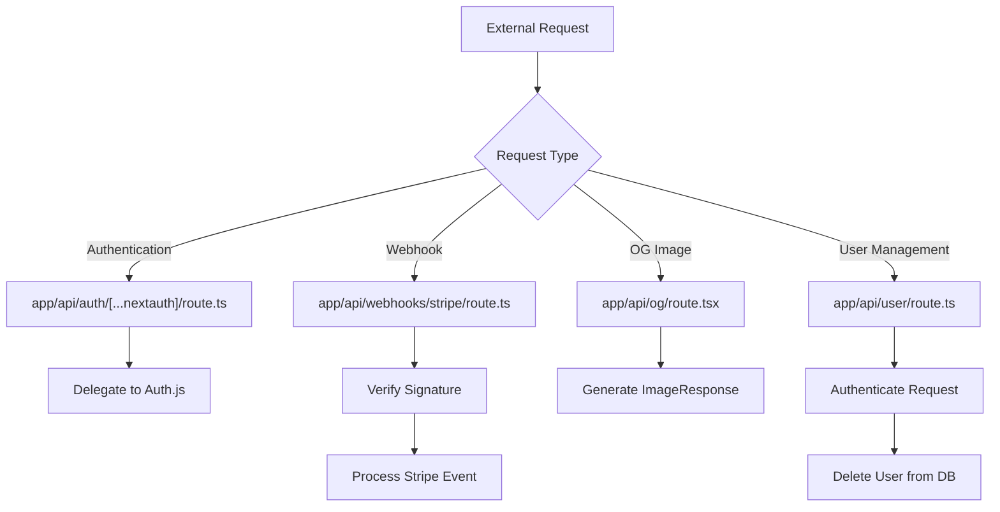
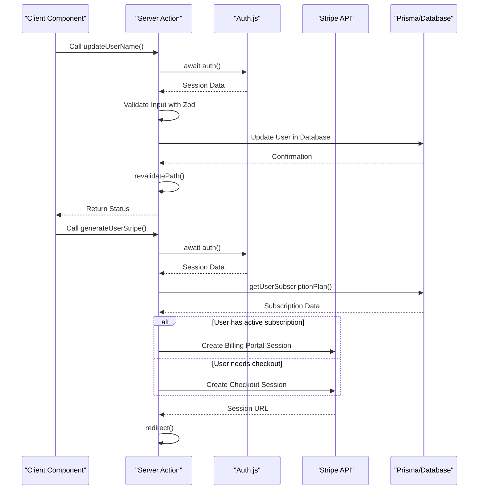
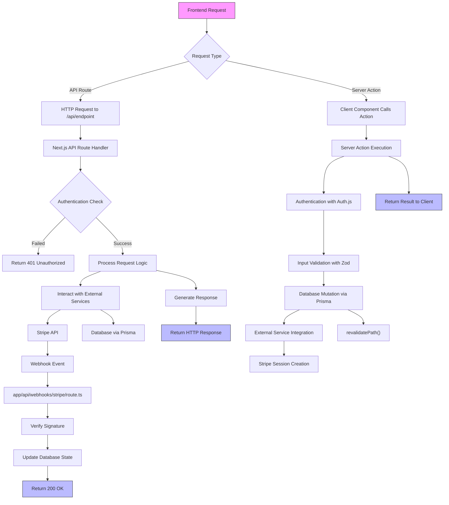

# Backend Architecture

<cite>
**Referenced Files in This Document**   
- [generate-user-stripe.ts](file://actions/generate-user-stripe.ts)
- [open-customer-portal.ts](file://actions/open-customer-portal.ts)
- [update-user-name.ts](file://actions/update-user-name.ts)
- [update-user-role.ts](file://actions/update-user-role.ts)
- [route.ts](file://app/api/auth/[...nextauth]/route.ts)
- [route.tsx](file://app/api/og/route.tsx)
- [route.ts](file://app/api/user/route.ts)
- [route.ts](file://app/api/webhooks/stripe/route.ts)
- [db.ts](file://lib/db.ts)
- [subscription.ts](file://lib/subscription.ts)
- [user.ts](file://lib/validations/user.ts)
- [utils.ts](file://lib/utils.ts)
- [stripe.ts](file://lib/stripe.ts)
- [auth.config.ts](file://auth.config.ts)
</cite>

## Table of Contents
1. [Introduction](#introduction)
2. [Hybrid Backend Approach](#hybrid-backend-approach)
3. [API Routes](#api-routes)
4. [Server Actions](#server-actions)
5. [Server-Side Execution Environment](#server-side-execution-environment)
6. [Security Model](#security-model)
7. [External Service Integration](#external-service-integration)
8. [Request Flow Diagram](#request-flow-diagram)
9. [Conclusion](#conclusion)

## Introduction
The backend architecture of the next-saas-stripe-starter-main project implements a hybrid approach that combines traditional API routes with modern Server Actions. This architecture leverages Next.js 14's App Router and React Server Components to create a robust, secure, and scalable foundation for a SaaS application with Stripe integration. The system is designed to handle authentication, subscription management, user data mutations, and external service integrations efficiently while maintaining separation of concerns and type safety throughout.

**Section sources**
- [QODER_AGENT_RULES.md](file://QODER_AGENT_RULES.md#L0-L769)

## Hybrid Backend Approach
The application employs a hybrid backend strategy that strategically uses both API routes and Server Actions based on the specific use case. API routes in the `app/api/` directory handle external-facing endpoints that require HTTP semantics, such as authentication callbacks, webhooks, and dynamic Open Graph image generation. These routes operate as standalone endpoints accessible via HTTP requests.

Concurrently, Server Actions in the `actions/` directory handle data mutations and server-side operations that are tightly integrated with React components. This approach allows for direct function calls from client components while ensuring the actual execution occurs on the server, providing better security and eliminating the need for traditional REST API endpoints for internal operations.

This hybrid model optimizes the architecture by using the right tool for each scenario: API routes for external integrations and Server Actions for internal data mutations, resulting in a cleaner, more maintainable codebase.

**Section sources**
- [QODER_AGENT_RULES.md](file://QODER_AGENT_RULES.md#L292-L301)

## API Routes
The API routes in `app/api/` handle specific use cases that require HTTP endpoint semantics. The authentication route at `app/api/auth/[...nextauth]/route.ts` serves as the entry point for NextAuth.js, exposing the necessary GET and POST handlers for authentication flows. This route delegates to the centralized auth configuration, maintaining a clean separation between the authentication logic and its HTTP interface.

The Open Graph image generation route at `app/api/og/route.tsx` demonstrates the use of Vercel's `@vercel/og` library to dynamically generate social media preview images. This route runs on the edge runtime, ensuring fast response times for image generation while allowing for dynamic content based on query parameters.

The webhook endpoint at `app/api/webhooks/stripe/route.ts` handles incoming notifications from Stripe, processing subscription and payment events to keep the application's database synchronized with Stripe's state. This route verifies the authenticity of incoming requests using the webhook signing secret before processing events.

Additionally, the user API route at `app/api/user/route.ts` provides a DELETE endpoint for user account deletion, protected by authentication middleware to ensure only authorized users can perform this sensitive operation.

**Diagram sources**
- [route.ts](file://app/api/auth/[...nextauth]/route.ts)
- [route.tsx](file://app/api/og/route.tsx)
- [route.ts](file://app/api/user/route.ts)
- [route.ts](file://app/api/webhooks/stripe/route.ts)

**Section sources**
- [route.ts](file://app/api/auth/[...nextauth]/route.ts)
- [route.tsx](file://app/api/og/route.tsx)
- [route.ts](file://app/api/user/route.ts)
- [route.ts](file://app/api/webhooks/stripe/route.ts)

## Server Actions
Server Actions in the `actions/` directory handle data mutations in a more integrated way with React components. These actions are defined as async functions that execute on the server when invoked from client components, eliminating the need for traditional API endpoints for internal operations.

The `generateUserStripe` action handles the subscription flow by checking the user's current subscription status and creating either a checkout session for new customers or a billing portal session for existing customers. This action abstracts the complexity of the Stripe integration while ensuring all sensitive operations occur on the server.

The `openCustomerPortal` action provides a direct way to redirect users to the Stripe customer portal, allowing them to manage their subscription details. This action verifies user authentication before creating the portal session, maintaining security while providing a seamless user experience.

Data mutation actions like `updateUserName` and `updateUserRole` handle updates to user information. These actions perform authentication checks, input validation using Zod schemas, and database updates via Prisma, followed by path revalidation to ensure the UI reflects the updated data.

**Diagram sources**
- [generate-user-stripe.ts](file://actions/generate-user-stripe.ts)
- [open-customer-portal.ts](file://actions/open-customer-portal.ts)
- [update-user-name.ts](file://actions/update-user-name.ts)
- [update-user-role.ts](file://actions/update-user-role.ts)

**Section sources**
- [generate-user-stripe.ts](file://actions/generate-user-stripe.ts)
- [open-customer-portal.ts](file://actions/open-customer-portal.ts)
- [update-user-name.ts](file://actions/update-user-name.ts)
- [update-user-role.ts](file://actions/update-user-role.ts)

## Server-Side Execution Environment
The server-side execution environment in Next.js provides flexibility through multiple runtime options. The Open Graph image generation route uses the edge runtime (`export const runtime = "edge"`), which offers faster cold starts and lower latency for simple, high-frequency operations like image generation.

Most other server operations, including API routes and Server Actions, run in the Node.js runtime by default, providing access to the full Node.js ecosystem and better support for complex operations like database queries and external API integrations.

Server Actions and API routes have access to the full backend environment, including direct database access through Prisma, integration with external services like Stripe, and access to environment variables. The architecture ensures that sensitive operations and credentials never reach the client side, with server-only environment variables (like `STRIPE_API_KEY` and `STRIPE_WEBHOOK_SECRET`) securely isolated from the frontend.

The use of React Server Components allows much of the application logic to execute on the server, reducing client-side JavaScript bundle size and improving performance while maintaining interactivity through selective hydration of client components.

**Section sources**
- [route.tsx](file://app/api/og/route.tsx)
- [QODER_AGENT_RULES.md](file://QODER_AGENT_RULES.md#L302-L310)

## Security Model
The security model for backend operations is comprehensive and multi-layered. Authentication checks are implemented consistently across all server operations using the centralized `auth()` function from Auth.js, which verifies the user's session before allowing access to protected resources.

Input validation is enforced using Zod schemas, with validation logic colocated with the Server Actions that use them. For example, the `userNameSchema` and `userRoleSchema` in `lib/validations/user.ts` define the acceptable input formats for user data mutations, preventing invalid or malicious data from reaching the database.

The architecture protects against common vulnerabilities through several mechanisms:
- Server Actions execute exclusively on the server, preventing exposure of sensitive logic or credentials
- Webhook requests from Stripe are verified using the signing secret to prevent spoofing
- Database operations use parameterized queries through Prisma, eliminating SQL injection risks
- Environment variables are type-safe and validated at startup, preventing configuration-related vulnerabilities

Authentication is managed through Auth.js v5 with middleware that automatically protects routes in the `(protected)` directory group, redirecting unauthenticated users to the login page. User roles are typed with the `UserRole` enum from Prisma, ensuring type safety throughout the application.

**Section sources**
- [update-user-name.ts](file://actions/update-user-name.ts)
- [update-user-role.ts](file://actions/update-user-role.ts)
- [user.ts](file://lib/validations/user.ts)
- [route.ts](file://app/api/webhooks/stripe/route.ts)
- [QODER_AGENT_RULES.md](file://QODER_AGENT_RULES.md#L193-L209)

## External Service Integration
The backend functions interact with external services through well-defined interfaces. The Stripe integration is facilitated by the `stripe` instance imported from `lib/stripe.ts`, which is configured with the API key from environment variables. This centralized configuration ensures consistent and secure access to Stripe's API across the application.

Database operations are handled through Prisma ORM, with the `prisma` client imported from `lib/db.ts`. This provides type-safe database access and abstracts the underlying PostgreSQL database (hosted on Neon). The Prisma schema defines the data model, including relationships between users, subscriptions, and other entities.

The integration with Auth.js (formerly NextAuth.js) provides authentication and session management, supporting multiple providers including Google and GitHub. The auth configuration is centralized in `auth.config.ts`, with callbacks and providers defined in a single location for maintainability.

Email functionality is integrated through Resend, allowing the application to send transactional emails like magic links for authentication. The email templates are implemented as React components in the `emails/` directory, providing a familiar development experience for email content creation.

**Section sources**
- [stripe.ts](file://lib/stripe.ts)
- [db.ts](file://lib/db.ts)
- [auth.config.ts](file://auth.config.ts)
- [emails/magic-link-email.tsx](file://emails/magic-link-email.tsx)

## Request Flow Diagram
The following diagram illustrates the complete request flow from frontend to backend processing and external service integration:

**Diagram sources**
- [route.ts](file://app/api/auth/[...nextauth]/route.ts)
- [route.tsx](file://app/api/og/route.tsx)
- [route.ts](file://app/api/user/route.ts)
- [route.ts](file://app/api/webhooks/stripe/route.ts)
- [generate-user-stripe.ts](file://actions/generate-user-stripe.ts)
- [update-user-name.ts](file://actions/update-user-name.ts)
- [db.ts](file://lib/db.ts)
- [stripe.ts](file://lib/stripe.ts)

## Conclusion
The backend architecture of the next-saas-stripe-starter-main project effectively combines traditional API routes with modern Server Actions to create a robust foundation for a SaaS application. This hybrid approach leverages the strengths of both paradigms: API routes for external integrations and Server Actions for internal data mutations. The architecture prioritizes security through consistent authentication checks, input validation with Zod, and protection against common vulnerabilities. Integration with external services like Stripe and the database via Prisma is well-abstracted and type-safe, while the server-side execution environment provides flexibility with edge and Node runtimes. This comprehensive backend design enables the development of a secure, scalable, and maintainable SaaS application with subscription management capabilities.