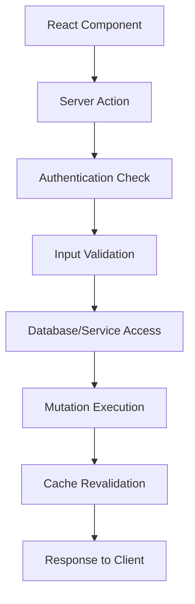
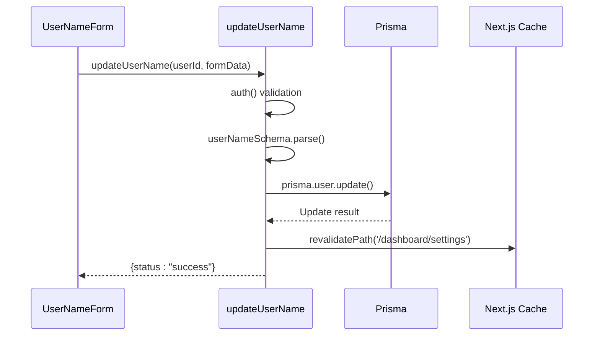
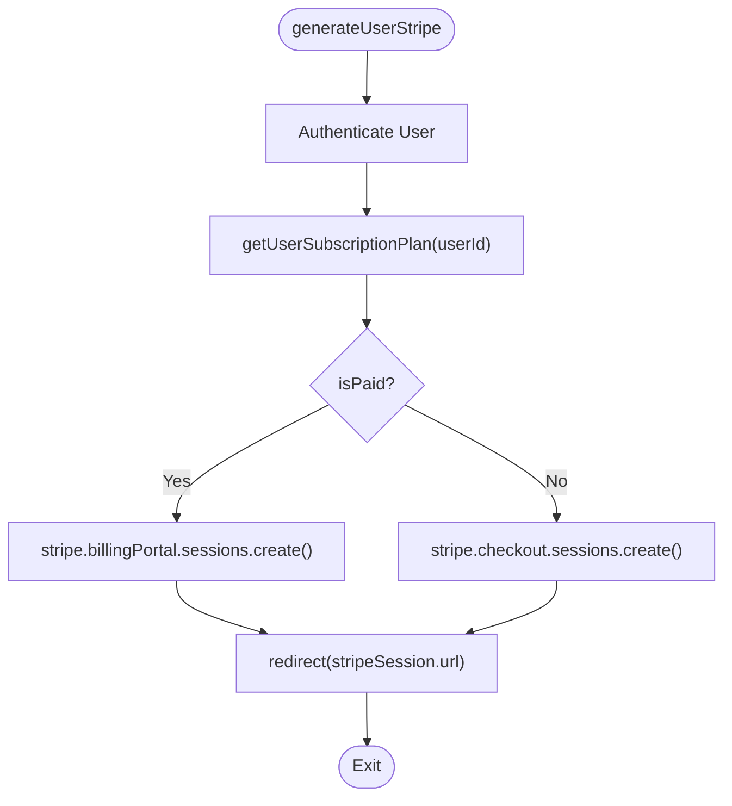
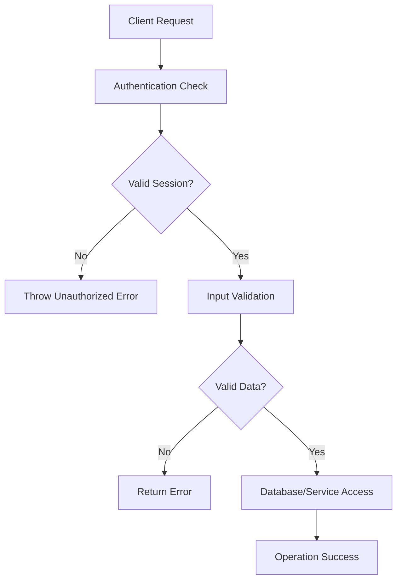
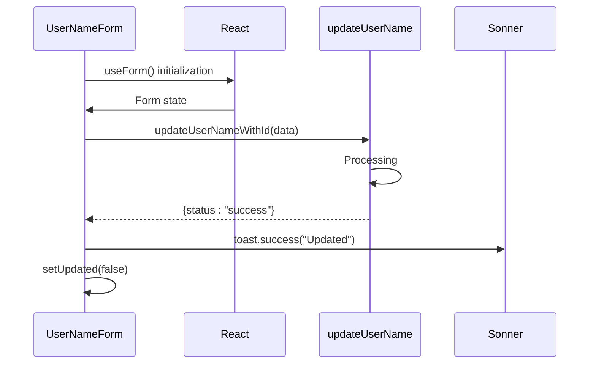

# Server Actions

<cite>
**Referenced Files in This Document**   
- [update-user-name.ts](file://actions/update-user-name.ts)
- [update-user-role.ts](file://actions/update-user-role.ts)
- [generate-user-stripe.ts](file://actions/generate-user-stripe.ts)
- [open-customer-portal.ts](file://actions/open-customer-portal.ts)
- [user.ts](file://lib/validations/user.ts)
- [db.ts](file://lib/db.ts)
- [stripe.ts](file://lib/stripe.ts)
- [subscription.ts](file://lib/subscription.ts)
- [user-name-form.tsx](file://components/forms/user-name-form.tsx)
- [user-role-form.tsx](file://components/forms/user-role-form.tsx)
</cite>

## Table of Contents
1. [Introduction](#introduction)
2. [Server Actions Overview](#server-actions-overview)
3. [Core Actions Implementation](#core-actions-implementation)
4. [Security Model](#security-model)
5. [Error Handling Strategy](#error-handling-strategy)
6. [Usage Examples](#usage-examples)
7. [Performance Considerations](#performance-considerations)
8. [Extending the Pattern](#extending-the-pattern)
9. [Conclusion](#conclusion)

## Introduction
The Server Actions pattern in the next-saas-stripe-starter-main project enables direct function calls from React components without traditional API endpoints. This approach reduces boilerplate code, improves type safety, and streamlines data mutations by allowing client components to invoke server-side functions directly. The implementation leverages Next.js App Router features to create a seamless integration between frontend forms and backend operations, with actions securely accessing the database and external services.

## Server Actions Overview
Server Actions in this project are implemented as asynchronous functions in the `actions/` directory that can be directly imported and invoked from client components. These actions eliminate the need for separate API routes, reducing the complexity of request handling and response formatting. Each action runs on the server, ensuring sensitive operations like database mutations and payment processing remain secure. The pattern uses the `"use server"` directive implicitly through Next.js App Router conventions, allowing direct function calls while maintaining server-side execution.

**Diagram sources**
- [update-user-name.ts](file://actions/update-user-name.ts)
- [generate-user-stripe.ts](file://actions/generate-user-stripe.ts)

**Section sources**
- [update-user-name.ts](file://actions/update-user-name.ts)
- [generate-user-stripe.ts](file://actions/generate-user-stripe.ts)

## Core Actions Implementation

### User Name Updates with Validation
The `updateUserName` action handles user name updates with validation via Zod. It receives a user ID and FormData, validates the input against the `userNameSchema`, and updates the user record in the database. The action includes authentication validation to ensure users can only update their own names.

**Diagram sources**
- [update-user-name.ts](file://actions/update-user-name.ts)
- [user.ts](file://lib/validations/user.ts)
- [db.ts](file://lib/db.ts)

**Section sources**
- [update-user-name.ts](file://actions/update-user-name.ts)
- [user.ts](file://lib/validations/user.ts)

### Role Management with Admin Authorization
The `updateUserRole` action enables role management with proper authorization checks. Similar to the name update action, it validates authentication and parses input through `userRoleSchema`, which uses the `UserRole` enum from Prisma for type safety. This ensures only valid role values can be assigned.

**Section sources**
- [update-user-role.ts](file://actions/update-user-role.ts)
- [user.ts](file://lib/validations/user.ts)

### Stripe Customer Creation with Idempotency
The `generateUserStripe` action handles Stripe customer creation and checkout sessions with idempotency. It determines whether the user is on a paid plan by checking their subscription status via `getUserSubscriptionPlan`, then creates either a billing portal session for existing customers or a checkout session for new customers.

**Diagram sources**
- [generate-user-stripe.ts](file://actions/generate-user-stripe.ts)
- [subscription.ts](file://lib/subscription.ts)
- [stripe.ts](file://lib/stripe.ts)

**Section sources**
- [generate-user-stripe.ts](file://actions/generate-user-stripe.ts)
- [subscription.ts](file://lib/subscription.ts)

### Customer Portal Session Generation
The `openCustomerPortal` action generates customer portal sessions for managing subscriptions. It creates a Stripe billing portal session with a return URL pointing to the billing page, allowing users to update payment methods, cancel subscriptions, or change plans.

**Section sources**
- [open-customer-portal.ts](file://actions/open-customer-portal.ts)
- [stripe.ts](file://lib/stripe.ts)

## Security Model
The Server Actions pattern implements a robust security model with multiple layers of protection. Authentication validation occurs at the beginning of each action using the centralized `auth()` function, ensuring only authenticated users can perform operations. Input sanitization is handled through Zod schemas that validate and parse incoming data, preventing injection attacks and ensuring data integrity.

The system protects against unauthorized role changes by binding actions to specific user IDs and verifying session ownership. Database access is secured through the `prisma` client instance in `lib/db.ts`, which uses environment variables and connection pooling. External service interactions with Stripe are protected by storing API keys in environment variables and using the configured `stripe` client instance.

**Diagram sources**
- [update-user-name.ts](file://actions/update-user-name.ts)
- [update-user-role.ts](file://actions/update-user-role.ts)
- [db.ts](file://lib/db.ts)

**Section sources**
- [update-user-name.ts](file://actions/update-user-name.ts)
- [update-user-role.ts](file://actions/update-user-role.ts)
- [db.ts](file://lib/db.ts)

## Error Handling Strategy
The error handling strategy in Server Actions prioritizes user experience while maintaining security. Actions use try-catch blocks to handle exceptions gracefully, returning user-friendly status objects instead of throwing errors to the client. The pattern avoids exposing sensitive error details to the frontend, logging errors internally while providing generic feedback to users.

Each action returns a standardized response object with a status field indicating success or error, allowing consistent handling in client components. The `responseAction` type defines the expected return structure, enhancing type safety across the application.

**Section sources**
- [update-user-name.ts](file://actions/update-user-name.ts)
- [generate-user-stripe.ts](file://actions/generate-user-stripe.ts)
- [open-customer-portal.ts](file://actions/open-customer-portal.ts)

## Usage Examples
Client components invoke Server Actions through direct function calls, often using React Hook Form for form state management. The `user-name-form.tsx` component demonstrates this pattern by importing `updateUserName` and binding it to the current user's ID. It uses `useTransition` for loading states and `react-hook-form` with `zodResolver` for validation.

**Diagram sources**
- [user-name-form.tsx](file://components/forms/user-name-form.tsx)
- [update-user-name.ts](file://actions/update-user-name.ts)

**Section sources**
- [user-name-form.tsx](file://components/forms/user-name-form.tsx)
- [user-role-form.tsx](file://components/forms/user-role-form.tsx)

## Performance Considerations
The Server Actions pattern includes several performance optimizations. Server action deduplication is achieved through Next.js' built-in caching mechanisms and the use of `useTransition` to prevent multiple concurrent submissions. The `revalidatePath` function strategically invalidates cache for specific routes after mutations, ensuring fresh data without full site revalidation.

The `use server` directive ensures actions run only on the server, preventing unnecessary client-side processing. Database queries are optimized through Prisma's query engine, and Stripe API calls are minimized by checking subscription status before creating sessions. The pattern also benefits from Next.js' automatic code splitting, loading only the necessary action code when required.

**Section sources**
- [update-user-name.ts](file://actions/update-user-name.ts)
- [generate-user-stripe.ts](file://actions/generate-user-stripe.ts)

## Extending the Pattern
To extend the Server Actions pattern for new features, developers should follow established conventions: create a new file in the `actions/` directory, import necessary utilities from `lib/`, implement authentication checks, validate input with Zod, perform the required operations, and return standardized responses. New actions should leverage existing infrastructure like the Prisma client and Stripe integration.

When creating actions that modify data, always include appropriate authorization checks and use `revalidatePath` to update cached content. For actions that redirect, use the `redirect` function from Next.js. Maintain consistency in error handling by using try-catch blocks and returning the standardized `responseAction` type.

**Section sources**
- [update-user-name.ts](file://actions/update-user-name.ts)
- [generate-user-stripe.ts](file://actions/generate-user-stripe.ts)

## Conclusion
The Server Actions pattern in the next-saas-stripe-starter-main project provides an efficient, secure, and type-safe approach to handling data mutations. By eliminating traditional API endpoints, it reduces boilerplate code and simplifies the development workflow. The implementation demonstrates best practices in authentication, input validation, error handling, and performance optimization, serving as a robust foundation for building SaaS applications with Next.js and Stripe integration.