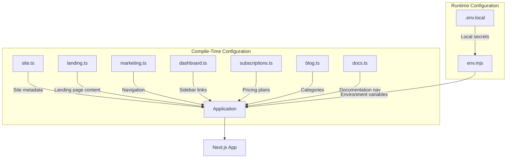
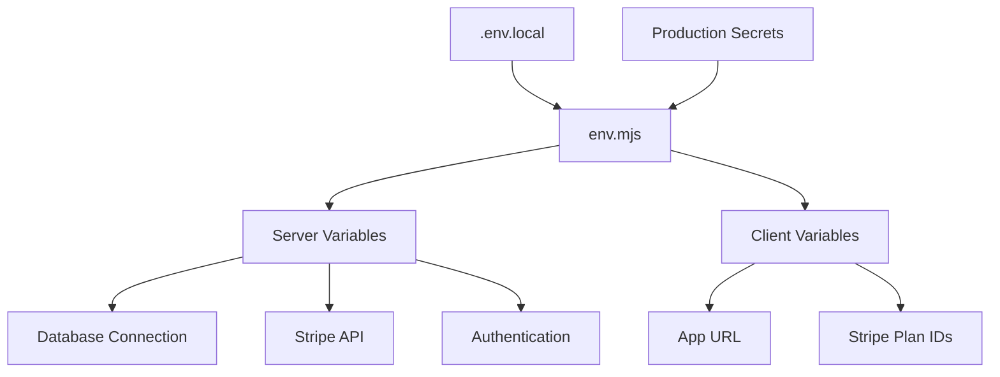

# Configuration System

<cite>
**Referenced Files in This Document**   
- [config/site.ts](file://config/site.ts)
- [config/landing.ts](file://config/landing.ts)
- [config/marketing.ts](file://config/marketing.ts)
- [config/dashboard.ts](file://config/dashboard.ts)
- [config/subscriptions.ts](file://config/subscriptions.ts)
- [config/blog.ts](file://config/blog.ts)
- [config/docs.ts](file://config/docs.ts)
- [env.mjs](file://env.mjs)
- [types/index.d.ts](file://types/index.d.ts)
</cite>

## Table of Contents
1. [Introduction](#introduction)
2. [Two-Layer Configuration Architecture](#two-layer-configuration-architecture)
3. [Compile-Time Configuration](#compile-time-configuration)
4. [Runtime Environment Variables](#runtime-environment-variables)
5. [Type Safety and Validation](#type-safety-and-validation)
6. [Configuration-Driven Features](#configuration-driven-features)
7. [Best Practices for Environment Management](#best-practices-for-environment-management)
8. [Conclusion](#conclusion)

## Introduction
The application employs a robust two-layer configuration system that separates compile-time settings from runtime environment variables. This design enables flexible customization of behavior, content, and appearance across different deployment environments without requiring code changes. The system leverages TypeScript for type safety in static configurations and Next.js conventions for secure environment variable management, ensuring both developer ergonomics and production security.

## Two-Layer Configuration Architecture
The configuration system is structured in two distinct layers:
- **Compile-time configuration**: Managed through TypeScript files in the `config/` directory, providing type-safe, modular settings for different application sections.
- **Runtime environment variables**: Defined in `env.mjs` using T3's `createEnv`, enabling secure access to sensitive credentials and environment-specific values.

This separation ensures that non-sensitive, structural configuration (e.g., site metadata, navigation) is bundled at build time, while sensitive or environment-specific values (e.g., API keys, URLs) are injected at runtime.



**Diagram sources**
- [config/site.ts](file://config/site.ts#L1-L48)
- [config/landing.ts](file://config/landing.ts#L1-L151)
- [config/marketing.ts](file://config/marketing.ts#L1-L19)
- [config/dashboard.ts](file://config/dashboard.ts#L1-L55)
- [config/subscriptions.ts](file://config/subscriptions.ts#L1-L164)
- [config/blog.ts](file://config/blog.ts#L1-L30)
- [config/docs.ts](file://config/docs.ts#L1-L71)
- [env.mjs](file://env.mjs#L1-L49)

**Section sources**
- [config/site.ts](file://config/site.ts#L1-L48)
- [env.mjs](file://env.mjs#L1-L49)

## Compile-Time Configuration
The `config/` directory contains dedicated TypeScript files for each major application section, enabling modular and type-safe configuration:

- **site.ts**: Defines core site metadata (name, description, URLs, social links) via the `SiteConfig` interface.
- **landing.ts**: Configures landing page content including features, testimonials, and informational sections.
- **marketing.ts**: Sets up main navigation for marketing pages (Pricing, Blog, Docs).
- **dashboard.ts**: Defines sidebar navigation structure with role-based authorization.
- **subscriptions.ts**: Contains pricing plan definitions and feature comparison data.
- **blog.ts**: Manages blog categories and author information.
- **docs.ts**: Configures documentation navigation structure.

These configurations are imported directly into components and pages, allowing content and structure to be modified without touching core logic.

**Section sources**
- [config/site.ts](file://config/site.ts#L1-L48)
- [config/landing.ts](file://config/landing.ts#L1-L151)
- [config/marketing.ts](file://config/marketing.ts#L1-L19)
- [config/dashboard.ts](file://config/dashboard.ts#L1-L55)
- [config/subscriptions.ts](file://config/subscriptions.ts#L1-L164)
- [config/blog.ts](file://config/blog.ts#L1-L30)
- [config/docs.ts](file://config/docs.ts#L1-L71)

## Runtime Environment Variables
The `env.mjs` file uses `@t3-oss/env-nextjs` to define and validate environment variables with Zod, providing:

- **Server-side variables**: Sensitive credentials (database URL, Stripe API keys, auth secrets) accessible only on the server.
- **Client-side variables**: Prefixed with `NEXT_PUBLIC_`, these are exposed to the browser (app URL, Stripe plan IDs).
- **Runtime validation**: All variables are validated at startup using Zod schemas, preventing misconfiguration.
- **Type safety**: The `createEnv` function generates TypeScript types automatically, ensuring type-safe access throughout the codebase.

The `runtimeEnv` object maps environment variables from `process.env`, enabling consistent access via the exported `env` object across the application.



**Diagram sources**
- [env.mjs](file://env.mjs#L1-L49)

**Section sources**
- [env.mjs](file://env.mjs#L1-L49)

## Type Safety and Validation
The configuration system provides strong type safety through:

- **TypeScript interfaces**: Defined in `types/index.d.ts`, interfaces like `SiteConfig`, `SubscriptionPlan`, and `PlansRow` ensure consistent structure across configuration files.
- **Zod validation**: Environment variables are validated at runtime using Zod schemas, with required fields and URL validation.
- **Compile-time checking**: TypeScript catches configuration errors during development.
- **IDE support**: Full autocomplete and type checking for configuration objects and environment variables.

This combination prevents runtime errors due to misconfiguration and provides excellent developer experience.

```mermaid
classDiagram
class SiteConfig {
+name : string
+description : string
+url : string
+ogImage : string
+mailSupport : string
+links : {twitter : string, github : string}
}
class SubscriptionPlan {
+title : string
+description : string
+benefits : string[]
+limitations : string[]
+prices : {monthly : number, yearly : number}
+stripeIds : {monthly : string | null, yearly : string | null}
}
class PlansRow {
+feature : string
+tooltip? : string
+[key in plan column] : ColumnType
}
class MarketingConfig {
+mainNav : MainNavItem[]
}
class DocsConfig {
+mainNav : MainNavItem[]
+sidebarNav : SidebarNavItem[]
}
```

**Diagram sources**
- [types/index.d.ts](file://types/index.d.ts#L5-L15)
- [types/index.d.ts](file://types/index.d.ts#L29-L31)
- [types/index.d.ts](file://types/index.d.ts#L46-L59)
- [types/index.d.ts](file://types/index.d.ts#L40-L43)
- [types/index.d.ts](file://types/index.d.ts#L71-L73)

**Section sources**
- [types/index.d.ts](file://types/index.d.ts#L5-L73)

## Configuration-Driven Features
The configuration system powers several key application features:

### Feature Flags and Conditional Rendering
Navigation items and UI components use configuration to enable or disable features based on user role or environment. For example, the dashboard sidebar uses `authorizeOnly` to show admin-only routes.

### Pricing Plans and Subscriptions
The `pricingData` object in `subscriptions.ts` defines all pricing tiers, which are used to render the pricing page and determine Stripe checkout behavior. Plan IDs are pulled from environment variables, allowing different Stripe products to be used in different environments.

### Site Metadata and SEO
The `siteConfig` object provides consistent metadata across the application, including Open Graph image URLs that incorporate the `NEXT_PUBLIC_APP_URL` environment variable for proper absolute URLs.

### Content Personalization
Landing page content (features, testimonials) is fully configurable, enabling marketing teams to update messaging without developer involvement.

**Section sources**
- [config/subscriptions.ts](file://config/subscriptions.ts#L1-L164)
- [config/landing.ts](file://config/landing.ts#L1-L151)
- [config/site.ts](file://config/site.ts#L1-L48)
- [config/dashboard.ts](file://config/dashboard.ts#L1-L55)

## Best Practices for Environment Management
To effectively manage configuration across environments:

1. **Use .env.local for local development**: Store local environment variables in `.env.local` (git-ignored).
2. **Define required variables in env.mjs**: Use Zod to enforce required fields and validate formats.
3. **Separate client and server variables**: Only expose non-sensitive data to the client via `NEXT_PUBLIC_` prefix.
4. **Use consistent naming**: Follow the `NEXT_PUBLIC_` convention for client variables and descriptive names for server variables.
5. **Validate in CI/CD**: Ensure environment variables are present and valid before deployment.
6. **Document variables**: Maintain an environment setup guide listing all required variables.

The current implementation follows these practices, with sensitive credentials kept on the server and only essential public values exposed to the client.

**Section sources**
- [env.mjs](file://env.mjs#L1-L49)
- [ENVIRONMENT_SETUP_GUIDE.md](file://ENVIRONMENT_SETUP_GUIDE.md)

## Conclusion
The two-layer configuration system provides a robust foundation for managing application settings across environments. By combining type-safe compile-time configuration with securely validated runtime environment variables, the system enables flexible customization while maintaining security and developer productivity. This approach allows teams to modify content, features, and behavior without code changes, supporting rapid iteration and environment-specific tuning.