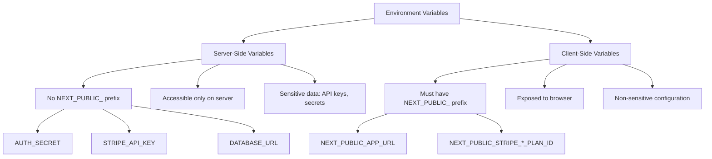
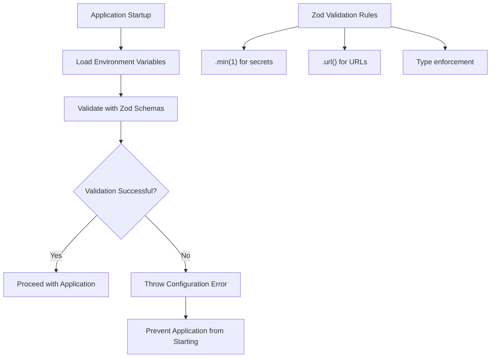
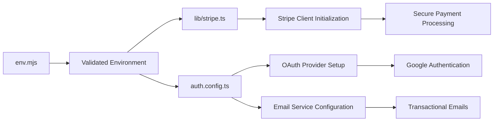

# Environment Variables

<cite>
**Referenced Files in This Document**   
- [env.mjs](file://env.mjs)
- [lib/stripe.ts](file://lib/stripe.ts)
- [auth.config.ts](file://auth.config.ts)
- [ENVIRONMENT_SETUP_GUIDE.md](file://ENVIRONMENT_SETUP_GUIDE.md)
- [app/api/webhooks/stripe/route.ts](file://app/api/webhooks/stripe/route.ts)
- [config/subscriptions.ts](file://config/subscriptions.ts)
</cite>

## Table of Contents
1. [Environment Variables](#environment-variables)
2. [Role of env.mjs in Environment Management](#role-of-envmjs-in-environment-management)
3. [Client-Side vs Server-Side Variables](#client-side-vs-server-side-variables)
4. [Secure Handling of Sensitive Credentials](#secure-handling-of-sensitive-credentials)
5. [Validation Process Using Zod](#validation-process-using-zod)
6. [Usage Examples in lib/stripe.ts and auth.config.ts](#usage-examples-in-libstripets-and-authconfigts)
7. [Setup Instructions from ENVIRONMENT_SETUP_GUIDE.md](#setup-instructions-from-environment_setup_guidemd)
8. [Best Practices for Managing Variables Across Environments](#best-practices-for-managing-variables-across-environments)
9. [Troubleshooting Common Issues](#troubleshooting-common-issues)

## Role of env.mjs in Environment Management

The `env.mjs` file serves as the central configuration point for environment variable management in this Next.js application. It leverages the `@t3-oss/env-nextjs` package to provide type-safe, runtime-validated access to environment variables following Next.js conventions. This module defines both server and client environment variables, ensuring proper separation of concerns and security boundaries. The configuration enforces validation rules at application startup, preventing runtime errors due to missing or incorrectly formatted variables.

**Section sources**
- [env.mjs](file://env.mjs#L1-L48)

## Client-Side vs Server-Side Variables

The environment configuration strictly separates client-side and server-side variables using Next.js conventions. Server-side variables (defined in the `server` object) are only accessible during server execution and are never exposed to the client. These include sensitive credentials like `AUTH_SECRET`, `STRIPE_API_KEY`, and database connection strings. Client-side variables (defined in the `client` object) must be prefixed with `NEXT_PUBLIC_` to be exposed to the browser. This includes non-sensitive configuration such as `NEXT_PUBLIC_APP_URL` and Stripe price IDs (`NEXT_PUBLIC_STRIPE_PRO_MONTHLY_PLAN_ID`, etc.), which are needed for client-side operations like subscription management.

**Diagram sources**
- [env.mjs](file://env.mjs#L6-L23)

**Section sources**
- [env.mjs](file://env.mjs#L6-L23)

## Secure Handling of Sensitive Credentials

Sensitive credentials such as Stripe API keys, authentication secrets, and database URLs are securely managed through server-side environment variables that never reach the client. The `STRIPE_API_KEY` and `STRIPE_WEBHOOK_SECRET` are accessed only on the server, ensuring payment processing credentials remain protected. Similarly, `AUTH_SECRET` is used exclusively for JWT token encryption on the server. The `DATABASE_URL` contains authentication credentials for the PostgreSQL database and is only used within server components and API routes. All sensitive values are validated at runtime to ensure they exist and meet minimum security requirements (non-empty strings).

**Section sources**
- [env.mjs](file://env.mjs#L9-L17)
- [lib/stripe.ts](file://lib/stripe.ts#L4)
- [auth.config.ts](file://auth.config.ts#L10-L11)

## Validation Process Using Zod

Environment variables are validated using Zod schemas defined within the `createEnv` configuration in `env.mjs`. Each variable has an associated Zod validator that ensures type safety and data integrity. Most sensitive variables use `.min(1)` to guarantee they are non-empty strings, while `NEXTAUTH_URL` uses `.url().optional()` to validate URL format when present. The validation occurs at application startup, preventing the app from running with invalid or missing configuration. This approach provides immediate feedback during development and ensures production reliability by catching configuration errors before they cause runtime failures.

**Diagram sources**
- [env.mjs](file://env.mjs#L6-L23)

**Section sources**
- [env.mjs](file://env.mjs#L6-L23)

## Usage Examples in lib/stripe.ts and auth.config.ts

The validated environment variables are imported and used across the application in critical integration points. In `lib/stripe.ts`, the `STRIPE_API_KEY` is accessed from `env` to initialize the Stripe client with proper API versioning. This ensures secure payment processing with type-safe configuration. In `auth.config.ts`, multiple environment variables are utilized: `GOOGLE_CLIENT_ID` and `GOOGLE_CLIENT_SECRET` for OAuth configuration, `RESEND_API_KEY` for email services, and `EMAIL_FROM` for sender identification. These examples demonstrate how the validated environment variables are safely injected into third-party service configurations without exposing secrets to the client.

**Diagram sources**
- [env.mjs](file://env.mjs#L1-L48)
- [lib/stripe.ts](file://lib/stripe.ts#L1-L8)
- [auth.config.ts](file://auth.config.ts#L1-L20)

**Section sources**
- [lib/stripe.ts](file://lib/stripe.ts#L1-L8)
- [auth.config.ts](file://auth.config.ts#L1-L20)

## Setup Instructions from ENVIRONMENT_SETUP_GUIDE.md

The `ENVIRONMENT_SETUP_GUIDE.md` provides comprehensive instructions for configuring all required environment variables. For authentication, it details the generation of `AUTH_SECRET` and setup of OAuth credentials for Google and GitHub. The database section explains how to obtain the `DATABASE_URL` from Neon PostgreSQL. Email configuration covers obtaining the `RESEND_API_KEY` and setting up the `EMAIL_FROM` address. The Stripe section provides step-by-step guidance for retrieving the `STRIPE_API_KEY`, configuring webhook endpoints to obtain `STRIPE_WEBHOOK_SECRET`, and creating subscription products to get the corresponding price IDs. The guide emphasizes security best practices, including using test keys during development and never committing `.env.local` files to version control.

**Section sources**
- [ENVIRONMENT_SETUP_GUIDE.md](file://ENVIRONMENT_SETUP_GUIDE.md#L1-L223)

## Best Practices for Managing Variables Across Environments

Best practices for environment variable management include maintaining separate configurations for development, staging, and production environments. Sensitive credentials should differ across environments, with test keys used during development and live keys only in production. The `.env.local` file should be git-ignored to prevent accidental exposure of secrets. Variable names should follow consistent naming conventions, with `NEXT_PUBLIC_` prefixing only those variables intentionally exposed to the client. Regular audits should be conducted to ensure no sensitive data is inadvertently exposed. Environment-specific values should be documented, and onboarding documentation should include clear instructions for setting up all required variables.

**Section sources**
- [ENVIRONMENT_SETUP_GUIDE.md](file://ENVIRONMENT_SETUP_GUIDE.md#L1-L223)
- [env.mjs](file://env.mjs#L1-L48)

## Troubleshooting Common Issues

Common issues include missing environment variables, incorrect prefixes, and invalid formats. Missing variables typically result in application startup failures due to Zod validation. Variables without the `NEXT_PUBLIC_` prefix will not be available on the client side, causing runtime errors in browser code. Incorrectly formatted values (such as non-URL `NEXTAUTH_URL`) will fail validation. Webhook issues often stem from mismatched `STRIPE_WEBHOOK_SECRET` values between the application and Stripe dashboard. Database connection failures usually indicate an incorrect `DATABASE_URL` format. The recommended troubleshooting approach is to verify all variables against the setup guide, ensure proper prefixing, and check that the `.env.local` file is properly loaded by restarting the development server after changes.

**Section sources**
- [ENVIRONMENT_SETUP_GUIDE.md](file://ENVIRONMENT_SETUP_GUIDE.md#L200-L223)
- [env.mjs](file://env.mjs#L1-L48)
- [app/api/webhooks/stripe/route.ts](file://app/api/webhooks/stripe/route.ts#L3-L17)