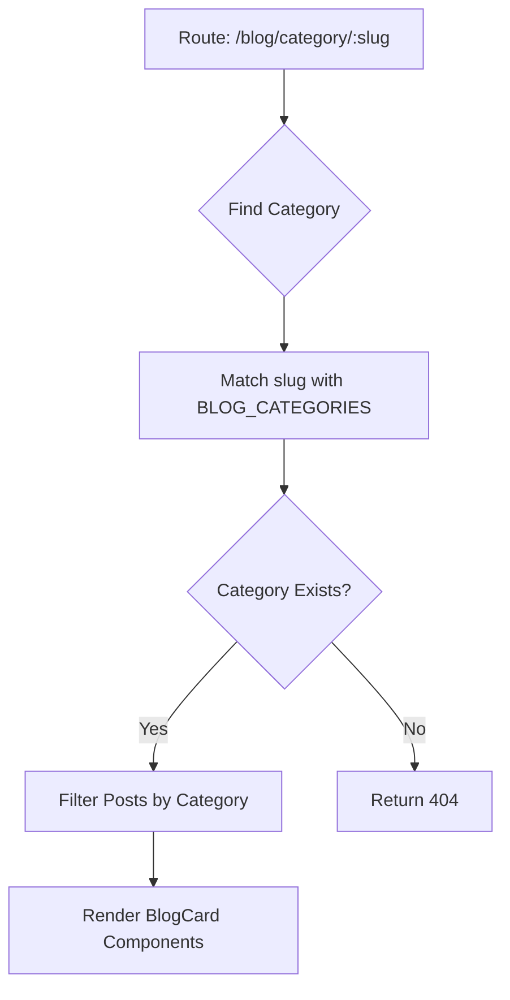
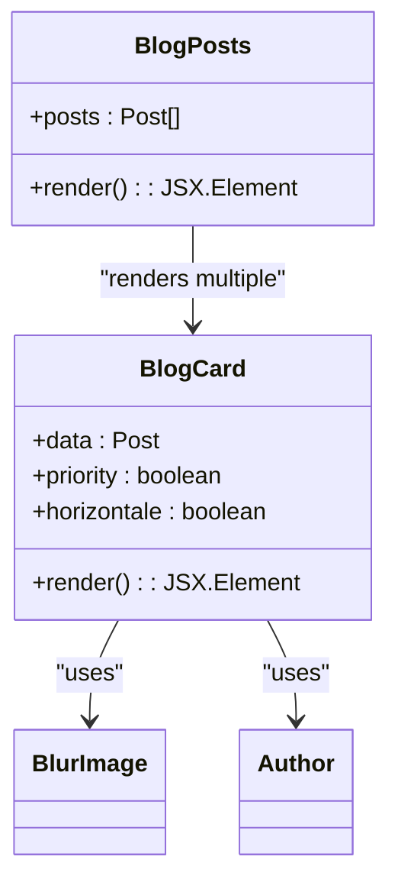
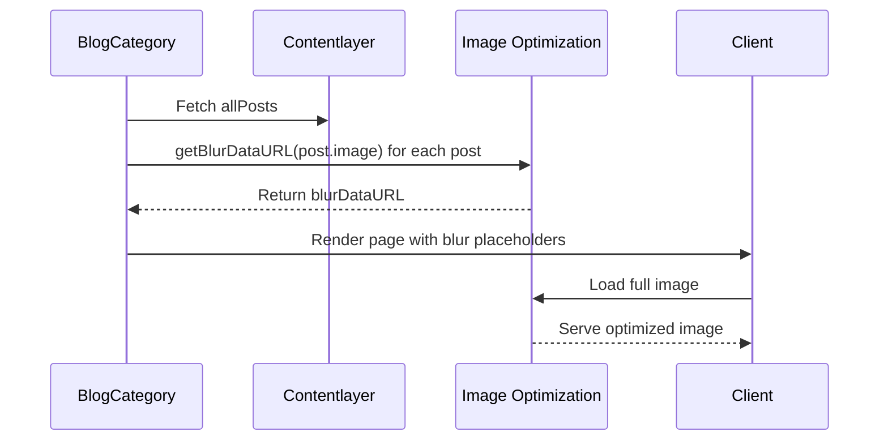
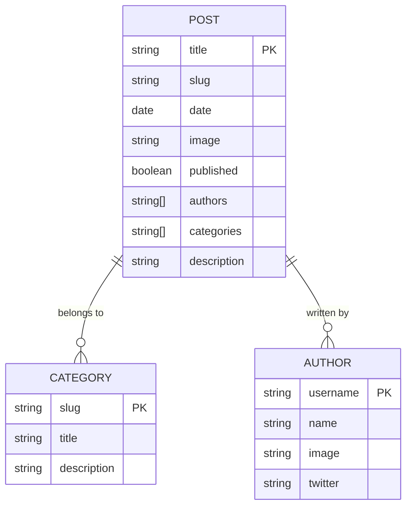

# Blog Configuration

<cite>
**Referenced Files in This Document**   
- [blog.ts](file://config/blog.ts)
- [blog/page.tsx](file://app/(marketing)/blog/page.tsx)
- [category/[slug]/page.tsx](file://app/(marketing)/blog/category/[slug]/page.tsx)
- [blog-posts.tsx](file://components/content/blog-posts.tsx)
- [blog-card.tsx](file://components/content/blog-card.tsx)
- [contentlayer.config.ts](file://contentlayer.config.ts)
</cite>

## Table of Contents
1. [Introduction](#introduction)
2. [Blog Configuration Structure](#blog-configuration-structure)
3. [Category Management](#category-management)
4. [Post Rendering and Layout](#post-rendering-and-layout)
5. [Metadata and SEO Handling](#metadata-and-seo-handling)
6. [Image and Performance Optimization](#image-and-performance-optimization)
7. [Content Integration with Contentlayer](#content-integration-with-contentlayer)
8. [Extensibility and Maintenance](#extensibility-and-maintenance)

## Introduction
The blog configuration system in this Next.js SaaS starter provides a centralized mechanism for managing blog categories, authors, and display behavior. It enables consistent rendering of blog content across listing and category pages while supporting SEO-friendly metadata generation and responsive design patterns. This document details how the configuration drives content organization, presentation, and integration with the MDX-based content pipeline.

## Blog Configuration Structure

The core blog configuration is defined in `config/blog.ts`, which exports two primary constants: `BLOG_CATEGORIES` and `BLOG_AUTHORS`. These configurations serve as the source of truth for blog taxonomy and contributor information.

`BLOG_CATEGORIES` defines an array of category objects, each containing a title, slug, and description. These values are used throughout the application for filtering, navigation, and metadata generation. The category slugs are strongly typed as a union type ("news" | "education"), ensuring type safety across the codebase.

`BLOG_AUTHORS` provides author metadata including name, avatar image path, and Twitter handle. This information is used to render author components consistently across blog posts and cards.

**Section sources**
- [blog.ts](file://config/blog.ts#L0-L29)

## Category Management

Category configuration directly drives both navigation and content filtering. The `BLOG_CATEGORIES` array is used in multiple contexts to ensure consistency between UI elements and data queries.

On the blog listing page (`blog/page.tsx`), all published posts are retrieved from Contentlayer and sorted by date. Category pages (`category/[slug]/page.tsx`) use the category slug from the route parameters to filter posts that include the matching category in their metadata.

The `generateStaticParams` function in the category page uses `BLOG_CATEGORIES` to statically generate routes for each category at build time, enabling efficient static site generation. This ensures that only valid category slugs are available as routes.

**Diagram sources**
- [category/[slug]/page.tsx](file://app/(marketing)/blog/category/[slug]/page.tsx#L19-L21)
- [blog.ts](file://config/blog.ts#L0-L15)

**Section sources**
- [category/[slug]/page.tsx](file://app/(marketing)/blog/category/[slug]/page.tsx#L0-L64)
- [blog.ts](file://config/blog.ts#L0-L15)

## Post Rendering and Layout

The blog rendering system uses a hierarchical component structure to display posts with consistent styling. The `BlogPosts` component serves as the main container for the blog index page, while `BlogCard` provides the reusable presentation unit for individual posts.

`BlogPosts` implements a featured post layout where the first post is displayed horizontally with emphasis, and subsequent posts are arranged in a responsive grid. This layout adapts to different screen sizes using Tailwind CSS grid classes.

`BlogCard` accepts several props to control its presentation:
- `data`: The post object with metadata and content
- `priority`: Indicates if the image should be prioritized for loading
- `horizontale`: Controls the horizontal/vertical layout variant

The component renders the post image using `BlurImage` for placeholder effects, title with truncation, description, author avatars, and publication date. All cards are wrapped in a link to the full post.

**Diagram sources**
- [blog-posts.tsx](file://components/content/blog-posts.tsx#L4-L22)
- [blog-card.tsx](file://components/content/blog-card.tsx#L8-L81)

**Section sources**
- [blog-posts.tsx](file://components/content/blog-posts.tsx#L0-L22)
- [blog-card.tsx](file://components/content/blog-card.tsx#L0-L82)

## Metadata and SEO Handling

The blog system implements comprehensive metadata generation for both SEO and social sharing. Each page dynamically constructs metadata based on the current context.

The main blog page (`blog/page.tsx`) defines static metadata with a general title and description. Category pages use `generateMetadata` to create dynamic metadata based on the current category. This function finds the matching category from `BLOG_CATEGORIES` and constructs a page-specific title and description.

The `constructMetadata` utility from `lib/utils` combines default site metadata with page-specific overrides, ensuring consistent branding while allowing contextual customization. This approach supports Open Graph tags, Twitter cards, and other SEO elements.

**Section sources**
- [blog/page.tsx](file://app/(marketing)/blog/page.tsx#L6-L10)
- [category/[slug]/page.tsx](file://app/(marketing)/blog/category/[slug]/page.tsx#L23-L37)

## Image and Performance Optimization

The blog system implements several performance optimizations, particularly for image loading. The `getBlurDataURL` function from `lib/utils` generates low-quality image placeholders (LQIP) using a remote service that creates blurred versions of images at small dimensions.

When rendering posts, the system pre-computes blur data for all post images during the page generation phase. This is done using `Promise.all` to process multiple images concurrently, minimizing render-blocking operations.

The `BlogCard` component uses Next.js Image with priority hints for the first few posts (controlled by `priority={idx <= 2}`). Images are served with responsive sizes and use the blur placeholder effect to improve perceived performance.

**Diagram sources**
- [category/[slug]/page.tsx](file://app/(marketing)/blog/category/[slug]/page.tsx#L45-L55)
- [lib/utils.ts](file://lib/utils.ts#L112-L162)

**Section sources**
- [category/[slug]/page.tsx](file://app/(marketing)/blog/category/[slug]/page.tsx#L41-L64)
- [lib/utils.ts](file://lib/utils.ts#L112-L162)

## Content Integration with Contentlayer

The blog configuration is tightly integrated with Contentlayer, which processes MDX files into structured data. The `contentlayer.config.ts` file defines the `Post` document type with fields that align with the blog configuration.

The `categories` field in the Post schema is defined as an enum with options restricted to "news" and "education", matching the slugs defined in `BLOG_CATEGORIES`. This ensures data consistency between content authors and the application configuration.

Contentlayer generates types and utilities that are consumed by the blog components. The `allPosts` import provides access to all processed blog posts with type safety. The build process ensures that only published posts (`published: true`) are included in the final output.

**Diagram sources**
- [contentlayer.config.ts](file://contentlayer.config.ts#L50-L124)
- [blog.ts](file://config/blog.ts#L0-L15)

**Section sources**
- [contentlayer.config.ts](file://contentlayer.config.ts#L50-L124)
- [blog.ts](file://config/blog.ts#L0-L15)

## Extensibility and Maintenance

The blog configuration system is designed for easy extension and maintenance. Adding new categories requires updating only the `BLOG_CATEGORIES` array in `config/blog.ts`. The type system will automatically enforce the required structure.

To add a new category:
1. Add an entry to `BLOG_CATEGORIES` with title, slug, and description
2. Ensure the slug is added to the enum options in `contentlayer.config.ts`
3. Rebuild the application

The system automatically handles route generation, navigation updates, and content filtering without requiring changes to page components. This separation of configuration from presentation logic makes the system scalable and maintainable.

The use of centralized configuration also simplifies internationalization efforts and allows for dynamic category management in future versions.

**Section sources**
- [blog.ts](file://config/blog.ts#L0-L29)
- [contentlayer.config.ts](file://contentlayer.config.ts#L50-L124)