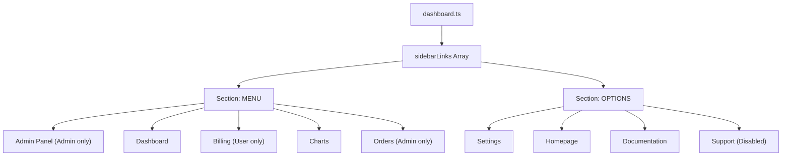
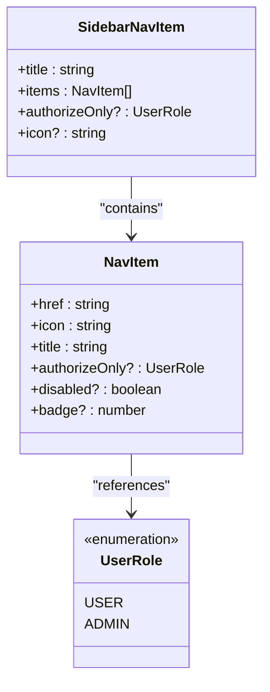
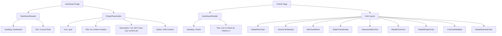
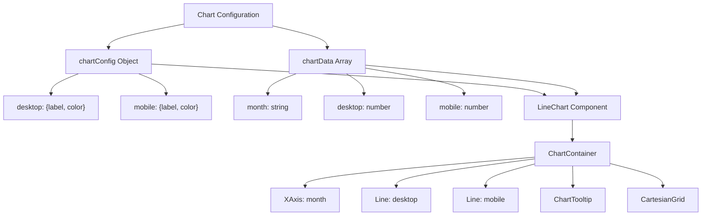
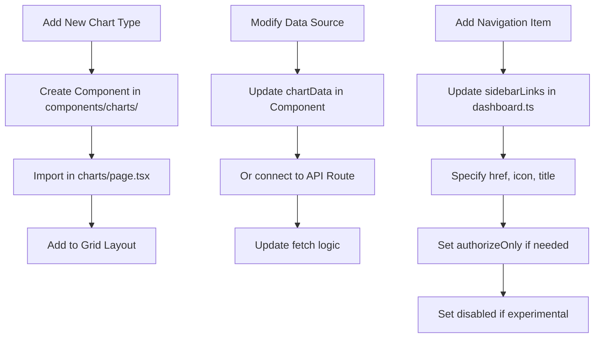
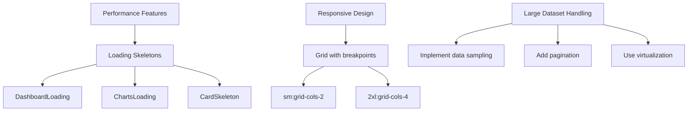

# Dashboard Configuration

<cite>
**Referenced Files in This Document**   
- [dashboard.ts](file://config/dashboard.ts)
- [info-card.tsx](file://components/dashboard/info-card.tsx)
- [line-chart-multiple.tsx](file://components/charts/line-chart-multiple.tsx)
- [page.tsx](file://app/(protected)/dashboard/page.tsx)
- [charts/page.tsx](file://app/(protected)/dashboard/charts/page.tsx)
- [index.d.ts](file://types/index.d.ts)
</cite>

## Table of Contents
1. [Introduction](#introduction)
2. [Dashboard Configuration Structure](#dashboard-configuration-structure)
3. [Role-Based Access Control](#role-based-access-control)
4. [Dashboard Layout and Component Rendering](#dashboard-layout-and-component-rendering)
5. [Chart Configuration and Data Visualization](#chart-configuration-and-data-visualization)
6. [Extending Dashboard Functionality](#extending-dashboard-functionality)
7. [Performance Considerations](#performance-considerations)

## Introduction
This document provides comprehensive documentation for the dashboard configuration system in the Next.js SaaS application. It explains how the `config/dashboard.ts` file defines the navigation structure, access control, and layout organization for the user dashboard. The configuration enables role-based content visibility, supports various chart types through reusable components, and allows for easy customization without code modifications. The system integrates with UI components to render dynamic content based on user roles and subscription tiers.

## Dashboard Configuration Structure

The dashboard configuration is defined in `config/dashboard.ts` and primarily consists of the `sidebarLinks` array, which structures the navigation menu for the application. This configuration follows a hierarchical pattern with sections and items, enabling organized presentation of dashboard features.

**Diagram sources**
- [dashboard.ts](file://config/dashboard.ts#L1-L53)

**Section sources**
- [dashboard.ts](file://config/dashboard.ts#L1-L53)

## Role-Based Access Control

The dashboard configuration implements role-based access control through the `authorizeOnly` property in navigation items. This property restricts access to specific routes based on user roles defined in the `UserRole` enum from Prisma. The system supports at least two roles: USER and ADMIN, with different dashboard content visibility based on these roles.

**Diagram sources**
- [dashboard.ts](file://config/dashboard.ts#L1-L53)
- [index.d.ts](file://types/index.d.ts#L33-L38)

**Section sources**
- [dashboard.ts](file://config/dashboard.ts#L1-L53)
- [user-role-form.tsx](file://components/forms/user-role-form.tsx#L35-L133)
- [update-user-role.ts](file://actions/update-user-role.ts#L13-L39)

## Dashboard Layout and Component Rendering

The dashboard pages consume the configuration to render appropriate components based on the route. The main dashboard page displays a header with user role information and an empty placeholder for content, while specialized pages like the charts page render multiple visualization components in a responsive grid layout.

**Diagram sources**
- [page.tsx](file://app/(protected)/dashboard/page.tsx#L1-L31)
- [charts/page.tsx](file://app/(protected)/dashboard/charts/page.tsx#L1-L42)

**Section sources**
- [page.tsx](file://app/(protected)/dashboard/page.tsx#L1-L31)
- [charts/page.tsx](file://app/(protected)/dashboard/charts/page.tsx#L1-L42)
- [header.tsx](file://components/dashboard/header.tsx#L1-L20)

## Chart Configuration and Data Visualization

Chart components are configured with predefined settings that define their appearance and behavior. The `line-chart-multiple.tsx` component, for example, uses a `chartConfig` object to specify labels, colors, and other visualization options. This configuration-driven approach allows for consistent styling and easy customization without modifying component code.

**Diagram sources**
- [line-chart-multiple.tsx](file://components/charts/line-chart-multiple.tsx#L1-L93)
- [chart.tsx](file://components/ui/chart.tsx#L10-L18)

**Section sources**
- [line-chart-multiple.tsx](file://components/charts/line-chart-multiple.tsx#L1-L93)
- [chart.tsx](file://components/ui/chart.tsx#L10-L18)
- [info-card.tsx](file://components/dashboard/info-card.tsx#L1-L23)

## Extending Dashboard Functionality

To extend dashboard functionality, developers can add new chart types by creating components in the `components/charts/` directory and importing them in the appropriate page. Modifying data sources involves updating the `chartData` structure in chart components or connecting to external data sources through API routes. The configuration system supports adding new navigation items with role-based access control.

**Section sources**
- [dashboard.ts](file://config/dashboard.ts#L1-L53)
- [charts/page.tsx](file://app/(protected)/dashboard/charts/page.tsx#L1-L42)
- [line-chart-multiple.tsx](file://components/charts/line-chart-multiple.tsx#L1-L93)

## Performance Considerations

The dashboard implementation includes performance optimizations such as loading skeletons to provide visual feedback during data fetching. The responsive grid layout adapts to different screen sizes, ensuring optimal display across devices. For large datasets, the chart components should implement data sampling or pagination to maintain performance.

**Diagram sources**
- [page.tsx](file://app/(protected)/dashboard/page.tsx#L1-L31)
- [charts/page.tsx](file://app/(protected)/dashboard/charts/page.tsx#L1-L42)
- [loading.tsx](file://app/(protected)/dashboard/loading.tsx#L1-L10)
- [charts/loading.tsx](file://app/(protected)/dashboard/charts/loading.tsx#L1-L19)

**Section sources**
- [loading.tsx](file://app/(protected)/dashboard/loading.tsx#L1-L10)
- [charts/loading.tsx](file://app/(protected)/dashboard/charts/loading.tsx#L1-L19)
- [page.tsx](file://app/(protected)/dashboard/page.tsx#L1-L31)
- [charts/page.tsx](file://app/(protected)/dashboard/charts/page.tsx#L1-L42)