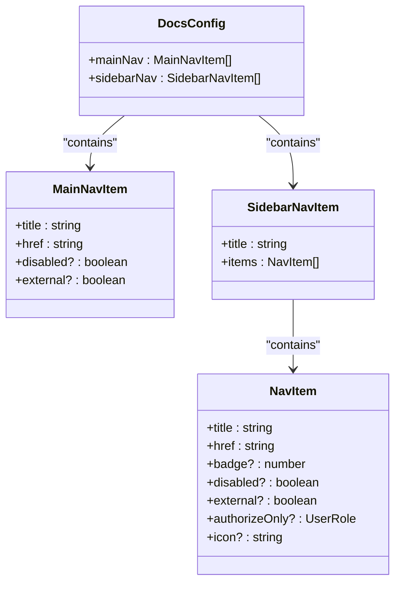
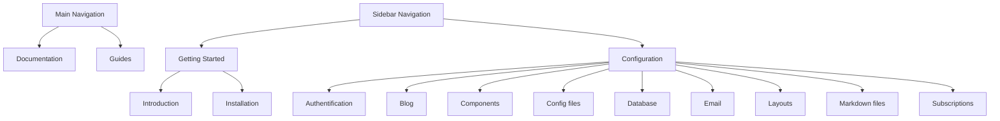
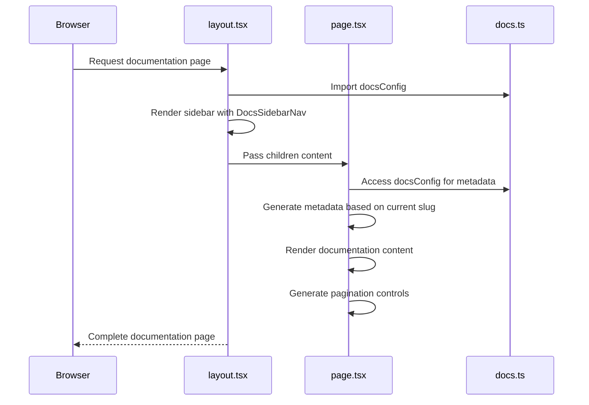
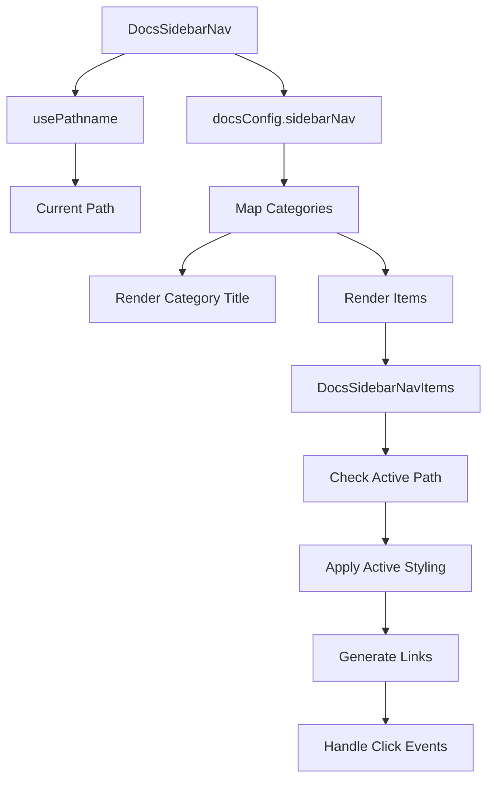
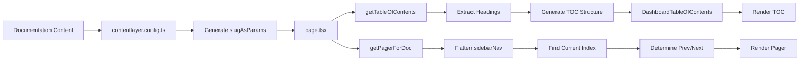

# Documentation Portal Configuration

<cite>
**Referenced Files in This Document**   
- [docs.ts](file://config/docs.ts)
- [layout.tsx](file://app/(docs)/docs/layout.tsx)
- [page.tsx](file://app/(docs)/docs/[[...slug]]/page.tsx)
- [sidebar-nav.tsx](file://components/docs/sidebar-nav.tsx)
- [toc.ts](file://lib/toc.ts)
- [pager.tsx](file://components/docs/pager.tsx)
- [contentlayer.config.ts](file://contentlayer.config.ts)
</cite>

## Table of Contents
1. [Introduction](#introduction)
2. [Configuration Schema](#configuration-schema)
3. [Navigation Structure](#navigation-structure)
4. [Layout Integration](#layout-integration)
5. [Sidebar Navigation](#sidebar-navigation)
6. [Content Processing](#content-processing)
7. [Best Practices](#best-practices)
8. [Conclusion](#conclusion)

## Introduction
The documentation portal configuration system provides a centralized approach to managing navigation, sidebar organization, and layout behavior for the integrated documentation system. This configuration-driven architecture enables content restructuring without modifying routing logic, allowing for flexible documentation organization and presentation.

**Section sources**
- [docs.ts](file://config/docs.ts#L1-L70)

## Configuration Schema
The documentation configuration is defined in `config/docs.ts` using the `DocsConfig` interface. This configuration object contains two primary sections: `mainNav` for top-level navigation and `sidebarNav` for hierarchical sidebar organization.

The `mainNav` array defines the primary navigation items visible in the header, while the `sidebarNav` array structures the documentation into categorized sections with nested items. Each navigation item includes a title and href property, with optional properties for disabling items or marking them as external links.

**Diagram sources**
- [docs.ts](file://config/docs.ts#L1-L70)
- [types/index.d.ts](file://types/index.d.ts#L40-L43)

**Section sources**
- [docs.ts](file://config/docs.ts#L1-L70)
- [types/index.d.ts](file://types/index.d.ts#L17-L25)

## Navigation Structure
The navigation structure is controlled by the `docsConfig` object, which defines both the main navigation and sidebar navigation. The main navigation includes top-level items like "Documentation" and "Guides" that appear in the header, providing high-level access to different content sections.

The sidebar navigation organizes documentation into logical categories such as "Getting Started" and "Configuration", with each category containing specific documentation pages. This hierarchical structure enables users to easily browse related content and understand the documentation organization.

**Diagram sources**
- [docs.ts](file://config/docs.ts#L1-L70)

**Section sources**
- [docs.ts](file://config/docs.ts#L1-L70)

## Layout Integration
The documentation layout system integrates the configuration with Next.js routing to generate dynamic navigation and breadcrumbs. The `layout.tsx` file in the docs directory wraps all documentation pages and provides the structural framework for the documentation portal.

The `[[...slug]]/page.tsx` file serves as the dynamic route handler for all documentation pages, using the configuration to determine page metadata, generate static paths, and render content. This component leverages the `docsConfig` to ensure consistent navigation across all documentation pages.

**Diagram sources**
- [layout.tsx](file://app/(docs)/docs/layout.tsx#L1-L20)
- [page.tsx](file://app/(docs)/docs/[[...slug]]/page.tsx#L1-L87)

**Section sources**
- [layout.tsx](file://app/(docs)/docs/layout.tsx#L1-L20)
- [page.tsx](file://app/(docs)/docs/[[...slug]]/page.tsx#L1-L87)

## Sidebar Navigation
The sidebar navigation is rendered by the `sidebar-nav.tsx` component, which consumes the `docsConfig` to generate hierarchical documentation links. This component uses the Next.js `usePathname` hook to determine the current page and highlight the active section in the sidebar.

The `DocsSidebarNav` component maps through the `sidebarNav` configuration, rendering each category title and its associated items. The `DocsSidebarNavItems` component handles the rendering of individual navigation items, applying appropriate styling to indicate the currently active page.

**Diagram sources**
- [sidebar-nav.tsx](file://components/docs/sidebar-nav.tsx#L1-L82)

**Section sources**
- [sidebar-nav.tsx](file://components/docs/sidebar-nav.tsx#L1-L82)

## Content Processing
The documentation system processes content through several integrated components that enhance the user experience. The `getPagerForDoc` function in `pager.tsx` uses the flattened sidebar navigation to determine previous and next pages, enabling sequential navigation through the documentation.

The table of contents is generated from the document content using the `getTableOfContents` function in `lib/toc.ts`, which processes the Markdown content to extract headings and create a navigable structure. This TOC is then rendered alongside the content for quick navigation within long documents.

**Diagram sources**
- [page.tsx](file://app/(docs)/docs/[[...slug]]/page.tsx#L1-L87)
- [pager.tsx](file://components/docs/pager.tsx#L1-L63)
- [toc.ts](file://lib/toc.ts#L1-L78)
- [contentlayer.config.ts](file://contentlayer.config.ts#L1-L48)

**Section sources**
- [page.tsx](file://app/(docs)/docs/[[...slug]]/page.tsx#L1-L87)
- [pager.tsx](file://components/docs/pager.tsx#L1-L63)
- [toc.ts](file://lib/toc.ts#L1-L78)
- [contentlayer.config.ts](file://contentlayer.config.ts#L1-L48)

## Best Practices
When adding new documentation sections, update the `sidebarNav` configuration in `docs.ts` with the appropriate category and item. Ensure the href matches the file path in the `docs` directory to maintain routing consistency.

For versioned content, consider creating separate configuration objects for different versions and implementing a version selector that switches between configurations. This approach maintains clean separation between versions while reusing the same rendering components.

To ensure search engine discoverability, leverage the `generateStaticParams` function in `page.tsx` which automatically generates static paths for all documentation pages. This enables Next.js to pre-render all documentation pages, improving SEO and page load performance.

Organize content hierarchically in the sidebar configuration to reflect logical groupings and user journeys. Use consistent naming conventions and maintain a clear information architecture to help users navigate the documentation effectively.

**Section sources**
- [docs.ts](file://config/docs.ts#L1-L70)
- [page.tsx](file://app/(docs)/docs/[[...slug]]/page.tsx#L1-L87)
- [contentlayer.config.ts](file://contentlayer.config.ts#L1-L48)

## Conclusion
The documentation portal configuration system provides a flexible and maintainable approach to organizing and presenting documentation content. By centralizing navigation and structure in the `docs.ts` configuration file, the system enables content restructuring without modifying routing logic or component code.

This configuration-driven architecture promotes consistency across documentation pages while allowing for easy updates and additions. The integration with Next.js routing and Contentlayer ensures optimal performance and search engine visibility, making the documentation portal both user-friendly and developer-friendly.