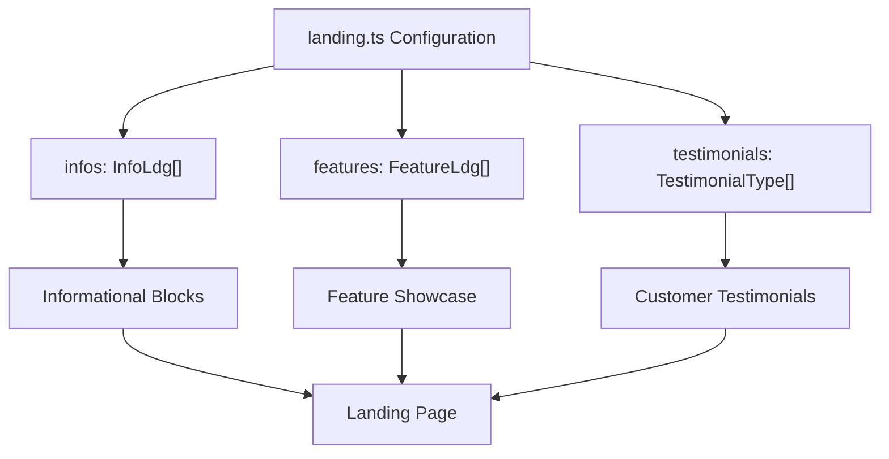
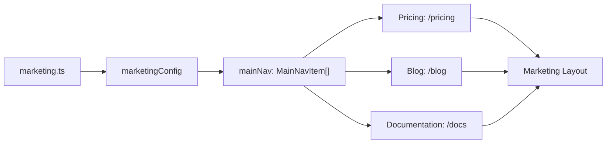
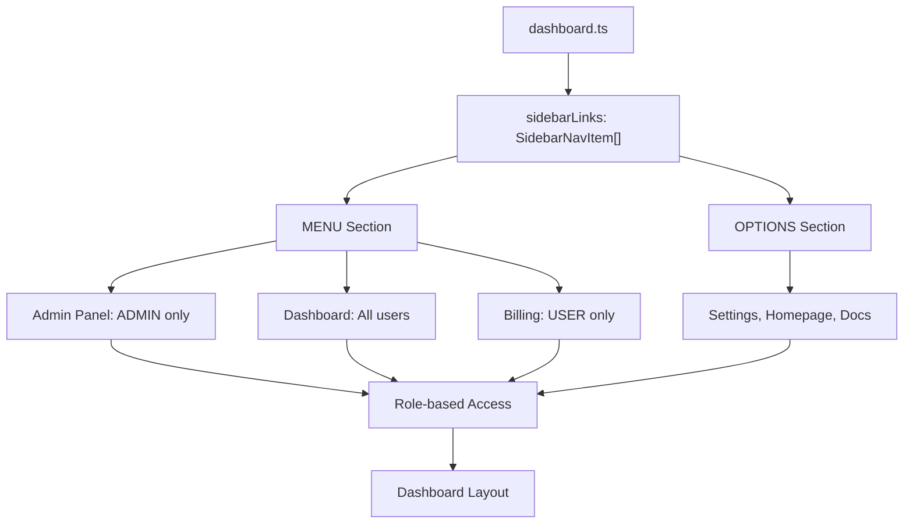
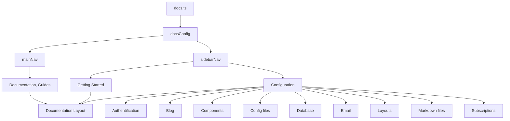
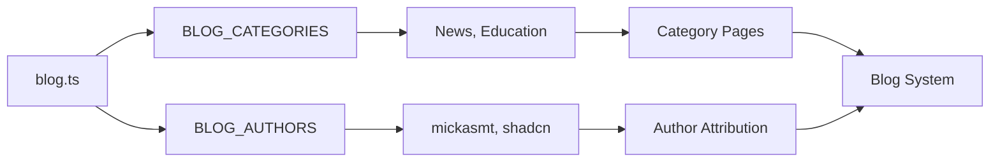
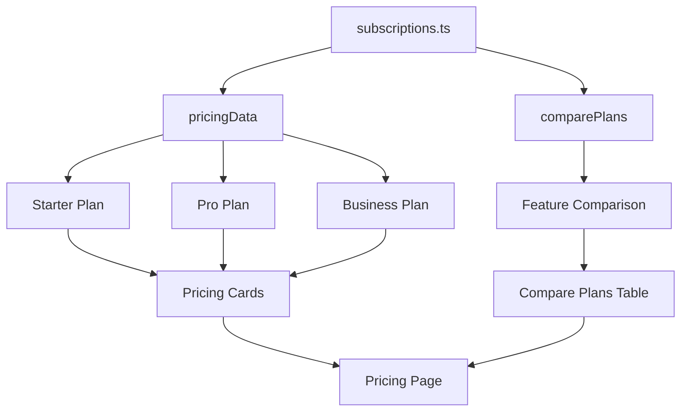

# Feature Configuration

<cite>
**Referenced Files in This Document**   
- [landing.ts](file://config/landing.ts)
- [marketing.ts](file://config/marketing.ts)
- [dashboard.ts](file://config/dashboard.ts)
- [docs.ts](file://config/docs.ts)
- [blog.ts](file://config/blog.ts)
- [subscriptions.ts](file://config/subscriptions.ts)
- [site.ts](file://config/site.ts)
- [pricing-faq.tsx](file://components/pricing/pricing-faq.tsx)
- [compare-plans.tsx](file://components/pricing/compare-plans.tsx)
- [sidebar-nav.tsx](file://components/docs/sidebar-nav.tsx)
- [mobile-nav.tsx](file://components/layout/mobile-nav.tsx)
- [navbar.tsx](file://components/layout/navbar.tsx)
- [blog-header-layout.tsx](file://components/content/blog-header-layout.tsx)
- [author.tsx](file://components/content/author.tsx)
- [features.tsx](file://components/sections/features.tsx)
- [testimonials.tsx](file://components/sections/testimonials.tsx)
- [index.d.ts](file://types/index.d.ts)
- [subscription.ts](file://lib/subscription.ts)
</cite>

## Table of Contents
1. [Introduction](#introduction)
2. [Configuration File Structure](#configuration-file-structure)
3. [Landing Page Configuration](#landing-page-configuration)
4. [Marketing Configuration](#marketing-configuration)
5. [Dashboard Configuration](#dashboard-configuration)
6. [Documentation Configuration](#documentation-configuration)
7. [Blog Configuration](#blog-configuration)
8. [Subscriptions Configuration](#subscriptions-configuration)
9. [Benefits of Modular Configuration](#benefits-of-modular-configuration)
10. [Best Practices for Extending Configurations](#best-practices-for-extending-configurations)

## Introduction
This document provides a comprehensive overview of the feature-specific configuration system in the Next SaaS Stripe Starter application. The architecture separates UI content, navigation, and functional parameters into dedicated configuration files, enabling non-developers to manage content while preserving core logic integrity. Each configuration file corresponds to a specific application module, controlling its behavior, layout, and presentation through structured data objects.

## Configuration File Structure
The configuration system follows a modular pattern with dedicated files for each major feature area. All configuration files reside in the `config/` directory and export typed objects that define module-specific behavior. These configurations are consumed by components throughout the application to control content, navigation, and feature availability without requiring code changes.

The system leverages TypeScript interfaces defined in `types/index.d.ts` to ensure type safety and consistency across configuration objects. This approach enables autocomplete support and compile-time validation, reducing configuration errors.

**Section sources**
- [landing.ts](file://config/landing.ts)
- [marketing.ts](file://config/marketing.ts)
- [dashboard.ts](file://config/dashboard.ts)
- [docs.ts](file://config/docs.ts)
- [blog.ts](file://config/blog.ts)
- [subscriptions.ts](file://config/subscriptions.ts)
- [site.ts](file://config/site.ts)

## Landing Page Configuration
The `landing.ts` configuration file controls the content and structure of the application's landing page. It exports three primary data objects: `infos`, `features`, and `testimonials`, each defining distinct sections of the landing experience.

The `infos` array contains informational blocks with titles, descriptions, images, and feature lists that highlight key value propositions. The `features` array defines the feature showcase section with titles, descriptions, icons, and links. The `testimonials` array manages customer feedback display with names, job titles, profile images, and review content.

These configurations are consumed by components like `features.tsx` and `testimonials.tsx` to render dynamic content without hardcoding text or media references.

**Diagram sources**
- [landing.ts](file://config/landing.ts#L2-L149)
- [features.tsx](file://components/sections/features.tsx#L8-L63)
- [testimonials.tsx](file://components/sections/testimonials.tsx#L5-L51)

**Section sources**
- [landing.ts](file://config/landing.ts#L2-L149)
- [features.tsx](file://components/sections/features.tsx#L8-L63)
- [testimonials.tsx](file://components/sections/testimonials.tsx#L5-L51)

## Marketing Configuration
The `marketing.ts` file defines the global navigation structure for marketing pages through the `marketingConfig` object. This configuration controls the main navigation menu that appears across marketing-related routes, including links to Pricing, Blog, and Documentation sections.

The `mainNav` array contains objects with `title` and `href` properties that determine the label and destination of each navigation item. This configuration is consumed by layout components like `mobile-nav.tsx` and `navbar.tsx` to render consistent navigation across the marketing site.

**Diagram sources**
- [marketing.ts](file://config/marketing.ts#L2-L17)
- [mobile-nav.tsx](file://components/layout/mobile-nav.tsx#L27-L28)
- [navbar.tsx](file://components/layout/navbar.tsx#L36-L37)

**Section sources**
- [marketing.ts](file://config/marketing.ts#L2-L17)
- [mobile-nav.tsx](file://components/layout/mobile-nav.tsx#L27-L28)
- [navbar.tsx](file://components/layout/navbar.tsx#L36-L37)

## Dashboard Configuration
The `dashboard.ts` configuration file controls the navigation structure within the protected dashboard area. It exports the `sidebarLinks` array, which defines the complete sidebar navigation hierarchy with authorization rules.

Each navigation item can specify an `authorizeOnly` property to restrict access based on user roles (ADMIN or USER). The configuration includes icons, titles, href destinations, and optional badges. Disabled items can be marked with a `disabled` flag for future feature planning.

This configuration is processed in the protected layout to filter menu items based on the current user's role, ensuring appropriate access control.

**Diagram sources**
- [dashboard.ts](file://config/dashboard.ts#L4-L53)
- [layout.tsx](file://app/(protected)/layout.tsx#L22-L27)

**Section sources**
- [dashboard.ts](file://config/dashboard.ts#L4-L53)
- [layout.tsx](file://app/(protected)/layout.tsx#L22-L27)

## Documentation Configuration
The `docs.ts` file manages the navigation structure for the documentation section through the `docsConfig` object. It defines both the main navigation (`mainNav`) and the comprehensive sidebar navigation (`sidebarNav`) that organizes documentation content hierarchically.

The `sidebarNav` array contains sections with titles and nested items, each with titles and href destinations that correspond to documentation routes. This configuration enables easy reorganization of documentation structure without modifying component code.

Components like `sidebar-nav.tsx` and `pager.tsx` consume this configuration to render the navigation interface and page progression controls.

**Diagram sources**
- [docs.ts](file://config/docs.ts#L2-L69)
- [sidebar-nav.tsx](file://components/docs/sidebar-nav.tsx#L15-L15)
- [pager.tsx](file://components/docs/pager.tsx#L44-L44)

**Section sources**
- [docs.ts](file://config/docs.ts#L2-L69)
- [sidebar-nav.tsx](file://components/docs/sidebar-nav.tsx#L15-L15)
- [pager.tsx](file://components/docs/pager.tsx#L44-L44)

## Blog Configuration
The `blog.ts` configuration file defines two primary data structures: `BLOG_CATEGORIES` and `BLOG_AUTHORS`. These objects control blog content organization and author attribution throughout the blogging system.

The `BLOG_CATEGORIES` array defines available blog categories with titles, slugs, and descriptions, enabling category-based filtering and organization. The `BLOG_AUTHORS` object contains author profiles with names, avatar images, and social media links that are displayed in blog post headers and author components.

These configurations are consumed by blog-related pages and components to maintain consistent author information and category metadata.

**Diagram sources**
- [blog.ts](file://config/blog.ts#L0-L28)
- [blog-header-layout.tsx](file://components/content/blog-header-layout.tsx#L15-L15)
- [author.tsx](file://components/content/author.tsx#L13-L13)

**Section sources**
- [blog.ts](file://config/blog.ts#L0-L28)
- [blog-header-layout.tsx](file://components/content/blog-header-layout.tsx#L15-L15)
- [author.tsx](file://components/content/author.tsx#L13-L13)

## Subscriptions Configuration
The `subscriptions.ts` file contains the core pricing and plan configuration for the application's subscription model. It exports two primary objects: `pricingData` and `comparePlans`, along with supporting constants.

The `pricingData` array defines each subscription plan with detailed properties including title, description, benefits, limitations, prices, and Stripe product IDs. These configurations directly control the pricing page display and are used by the checkout flow to determine available plans.

The `comparePlans` array defines the feature comparison table with detailed feature availability across different plan tiers. Each row specifies feature names, tooltip explanations, and availability indicators for Starter, Pro, Business, and Enterprise plans.

This configuration is consumed by pricing components and the subscription logic in `lib/subscription.ts` to determine user plan status and available features.

**Diagram sources**
- [subscriptions.ts](file://config/subscriptions.ts#L3-L162)
- [pricing-faq.tsx](file://components/pricing/pricing-faq.tsx#L9-L40)
- [compare-plans.tsx](file://components/pricing/compare-plans.tsx#L12-L84)
- [subscription.ts](file://lib/subscription.ts#L34-L38)

**Section sources**
- [subscriptions.ts](file://config/subscriptions.ts#L3-L162)
- [pricing-faq.tsx](file://components/pricing/pricing-faq.tsx#L9-L40)
- [compare-plans.tsx](file://components/pricing/compare-plans.tsx#L12-L84)
- [subscription.ts](file://lib/subscription.ts#L34-L38)

## Benefits of Modular Configuration
The modular configuration approach provides several key advantages:

1. **Separation of Concerns**: Content and presentation logic are separated from application functionality, allowing non-technical team members to update content without risking code stability.

2. **Consistency**: Centralized configuration ensures consistent navigation, labeling, and feature availability across the application.

3. **Maintainability**: Changes to navigation structure or content can be made in a single location rather than scattered across multiple components.

4. **Role-Based Access Control**: Configuration supports authorization rules, enabling dynamic UI rendering based on user roles.

5. **Type Safety**: TypeScript interfaces provide compile-time validation of configuration structure, preventing runtime errors.

6. **Easy Localization**: The pattern can be extended to support multiple languages by creating language-specific configuration files.

7. **Rapid Iteration**: Product managers and content editors can modify feature availability, pricing, and messaging without developer involvement.

## Best Practices for Extending Configurations
When extending the configuration system with new features, follow these best practices:

1. **Create Dedicated Files**: For new major features, create a dedicated configuration file in the `config/` directory following the existing naming pattern.

2. **Define TypeScript Interfaces**: Create or extend type definitions in `types/index.d.ts` to ensure type safety and IDE support.

3. **Use Consistent Structure**: Follow the established pattern of exporting named constants that match component expectations.

4. **Include Documentation**: Add JSDoc comments to explain the purpose and structure of configuration objects.

5. **Validate Dependencies**: Ensure configuration files only import essential dependencies (types, environment variables) to prevent circular dependencies.

6. **Plan for Internationalization**: Design configurations with potential translation needs in mind, using keys rather than hardcoded text when appropriate.

7. **Test Thoroughly**: Verify that configuration changes render correctly across all relevant components and screen sizes.

8. **Maintain Backward Compatibility**: When modifying existing configurations, ensure changes don't break dependent components without proper migration.

9. **Use Environment Variables**: For sensitive or environment-specific values (like Stripe IDs), reference environment variables rather than hardcoding values.

10. **Document Changes**: Update relevant documentation when introducing new configuration options or modifying existing ones.