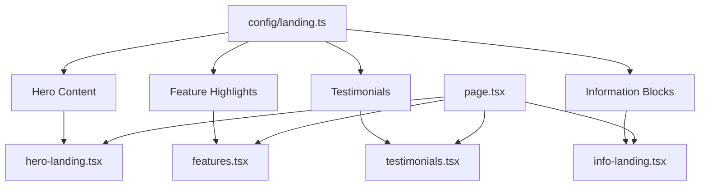
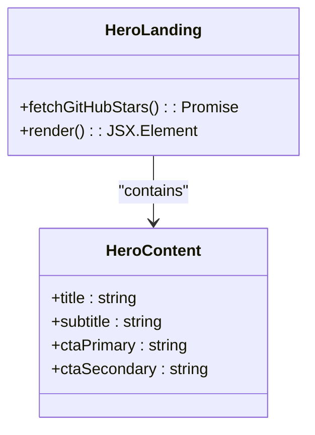
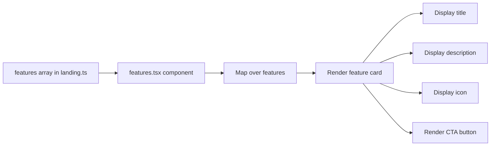
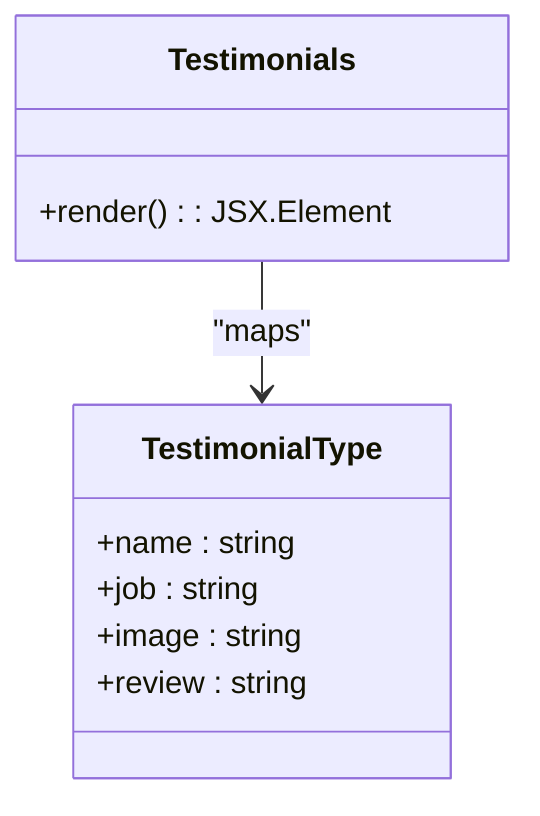
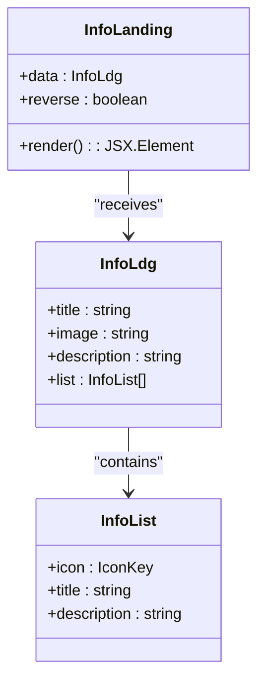
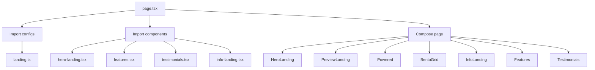

# Landing Page Configuration

<cite>
**Referenced Files in This Document**   
- [landing.ts](file://config/landing.ts)
- [hero-landing.tsx](file://components/sections/hero-landing.tsx)
- [features.tsx](file://components/sections/features.tsx)
- [testimonials.tsx](file://components/sections/testimonials.tsx)
- [info-landing.tsx](file://components/sections/info-landing.tsx)
- [site.ts](file://config/site.ts)
- [page.tsx](file://app/(marketing)/page.tsx)
- [index.d.ts](file://types/index.d.ts)
</cite>

## Table of Contents
1. [Introduction](#introduction)
2. [Configuration Schema Overview](#configuration-schema-overview)
3. [Hero Section Configuration](#hero-section-configuration)
4. [Feature Highlights Configuration](#feature-highlights-configuration)
5. [Testimonials Configuration](#testimonials-configuration)
6. [Information Sections Configuration](#information-sections-configuration)
7. [Content Rendering Mechanism](#content-rendering-mechanism)
8. [Site-Wide Integration](#site-wide-integration)
9. [Content Management Guidelines](#content-management-guidelines)
10. [Conclusion](#conclusion)

## Introduction
The landing page configuration system in this SaaS starter application provides a centralized, type-safe approach to managing marketing content. By separating content definition from UI rendering, the system enables non-technical stakeholders to update marketing copy, features, testimonials, and calls-to-action without modifying component code. This documentation details how the `config/landing.ts` file defines the structure and content of the marketing homepage, and how this configuration is consumed by various UI components to render a cohesive user experience.

**Section sources**
- [landing.ts](file://config/landing.ts)
- [page.tsx](file://app/(marketing)/page.tsx)

## Configuration Schema Overview
The landing page configuration is structured around four primary content sections: hero, features, testimonials, and information blocks. Each section is defined with a specific TypeScript interface in `types/index.d.ts`, ensuring type safety and autocompletion support. The configuration follows a modular pattern where content is statically defined in `config/landing.ts` and imported by components as needed. This separation of concerns allows for easy content updates while maintaining consistent UI presentation across the marketing site.



**Diagram sources**
- [landing.ts](file://config/landing.ts)
- [hero-landing.tsx](file://components/sections/hero-landing.tsx)
- [features.tsx](file://components/sections/features.tsx)
- [testimonials.tsx](file://components/sections/testimonials.tsx)
- [info-landing.tsx](file://components/sections/info-landing.tsx)
- [page.tsx](file://app/(marketing)/page.tsx)

**Section sources**
- [landing.ts](file://config/landing.ts)
- [index.d.ts](file://types/index.d.ts)

## Hero Section Configuration
The hero section configuration is directly embedded within the `hero-landing.tsx` component rather than being sourced from `landing.ts`. This design choice allows for dynamic content such as GitHub star count to be fetched at runtime. The hero section includes a promotional banner, main headline, descriptive subtitle, and call-to-action buttons. While the text content is hardcoded in the component, this approach could be enhanced by moving these strings to the landing configuration for greater content flexibility.



**Diagram sources**
- [hero-landing.tsx](file://components/sections/hero-landing.tsx)

**Section sources**
- [hero-landing.tsx](file://components/sections/hero-landing.tsx)

## Feature Highlights Configuration
The feature highlights are defined in the `features` array within `config/landing.ts`, following the `FeatureLdg` interface. Each feature object includes a title, description, navigation link, and icon identifier that references icons from the `Icons` component library. The `features.tsx` component consumes this configuration and renders a responsive grid of feature cards. The configuration supports easy addition or modification of features by simply updating the array, with the UI automatically adapting to the content changes.



**Diagram sources**
- [landing.ts](file://config/landing.ts#L54-L97)
- [features.tsx](file://components/sections/features.tsx)

**Section sources**
- [landing.ts](file://config/landing.ts#L54-L97)
- [features.tsx](file://components/sections/features.tsx)

## Testimonials Configuration
The testimonials section is powered by the `testimonials` array in `config/landing.ts`, which implements the `TestimonialType` interface. Each testimonial includes the person's name, job title, profile image URL, and review text. The `testimonials.tsx` component maps over this array to create a responsive grid layout that displays testimonials with proper attribution. The configuration supports an unlimited number of testimonials, with the UI automatically handling responsive column layout across different screen sizes.



**Diagram sources**
- [landing.ts](file://config/landing.ts#L99-L149)
- [testimonials.tsx](file://components/sections/testimonials.tsx)

**Section sources**
- [landing.ts](file://config/landing.ts#L99-L149)
- [testimonials.tsx](file://components/sections/testimonials.tsx)

## Information Sections Configuration
The information sections are defined in the `infos` array within `config/landing.ts`, following the `InfoLdg` interface. Each information block includes a title, description, background image, and a list of feature points with associated icons. The `info-landing.tsx` component consumes this configuration and renders a two-column layout with text content on one side and an image on the other. The configuration supports multiple information blocks, with the homepage currently using the first entry and the second commented out for potential future use.



**Diagram sources**
- [landing.ts](file://config/landing.ts#L2-L52)
- [info-landing.tsx](file://components/sections/info-landing.tsx)

**Section sources**
- [landing.ts](file://config/landing.ts#L2-L52)
- [info-landing.tsx](file://components/sections/info-landing.tsx)

## Content Rendering Mechanism
The landing page content is orchestrated through the `page.tsx` file in the marketing route, which imports and composes all the configured sections. This file serves as the integration point that brings together the hero, preview, powered, bento grid, information, features, and testimonials components. Each component receives its configuration data either directly from `config/landing.ts` or through props, creating a cohesive marketing page from modular, reusable components. The rendering mechanism follows Next.js server component patterns, allowing for efficient server-side rendering of marketing content.



**Diagram sources**
- [page.tsx](file://app/(marketing)/page.tsx)
- [landing.ts](file://config/landing.ts)

**Section sources**
- [page.tsx](file://app/(marketing)/page.tsx)

## Site-Wide Integration
The landing page configuration integrates with site-wide settings through the `site.ts` configuration file. While `landing.ts` focuses specifically on marketing content, `site.ts` defines global metadata such as the site name, description, URLs, and social links. This separation allows for consistent branding across the application while keeping marketing-specific content isolated. The site configuration is consumed by various components, including the hero section which uses `siteConfig.links.github` for the GitHub CTA button, ensuring that changes to the GitHub repository URL are reflected site-wide.

```mermaid
classDiagram
class SiteConfig {
+name : string
+description : string
+url : string
+ogImage : string
+links : {twitter : string, github : string}
+mailSupport : string
}
class LandingConfig {
+infos : InfoLdg[]
+features : FeatureLdg[]
+testimonials : TestimonialType[]
}
class HeroLanding {
+uses siteConfig.links.github
}
HeroLanding --> SiteConfig : "references"
LandingConfig --> SiteConfig : "complements"
```

**Diagram sources**
- [site.ts](file://config/site.ts)
- [hero-landing.tsx](file://components/sections/hero-landing.tsx)

**Section sources**
- [site.ts](file://config/site.ts)
- [hero-landing.tsx](file://components/sections/hero-landing.tsx)

## Content Management Guidelines
To add new sections to the landing page, create additional configuration arrays in `landing.ts` following existing patterns and define corresponding TypeScript interfaces in `types/index.d.ts`. For modifying existing content, update the relevant array entries in `landing.ts` with new text, links, or images. When adding new features, ensure the icon specified exists in the `Icons` component library. To maintain responsive design consistency, avoid hardcoding styles in components and rely on the existing Tailwind CSS utility classes. For SEO optimization, ensure all text content is descriptive and includes relevant keywords, as the static nature of the configuration ensures content is available during server-side rendering.

**Section sources**
- [landing.ts](file://config/landing.ts)
- [types/index.d.ts](file://types/index.d.ts)

## Conclusion
The landing page configuration system provides a robust framework for managing marketing content in a type-safe, modular manner. By centralizing content in `config/landing.ts` and separating it from UI rendering logic, the system enables efficient content updates without requiring changes to component code. This approach facilitates collaboration between marketing teams and developers, allowing for rapid iteration on messaging while maintaining a consistent user interface. The integration with site-wide configuration ensures branding consistency across the application, while the modular component architecture supports easy extension and customization of the marketing pages.