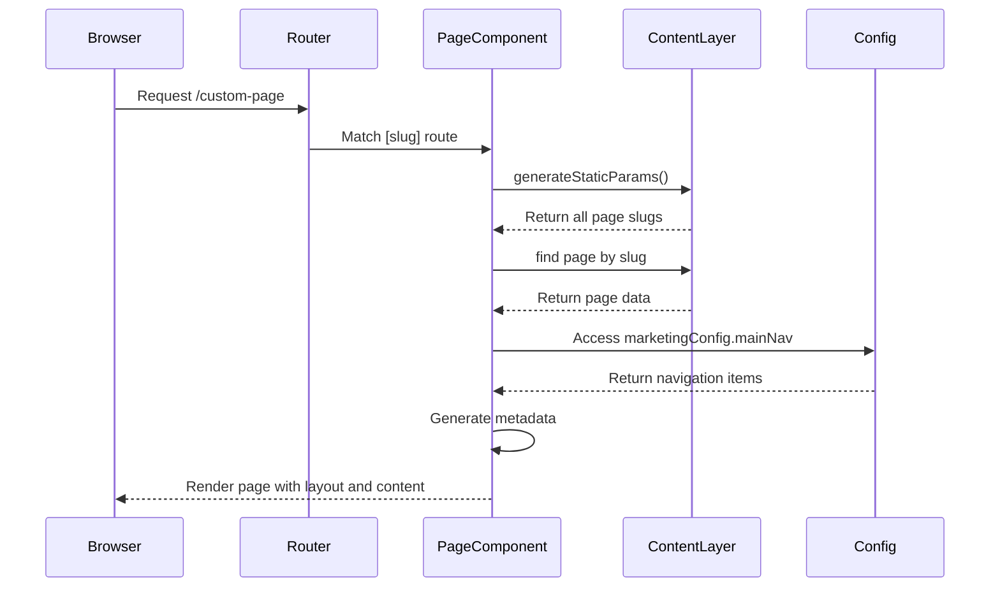
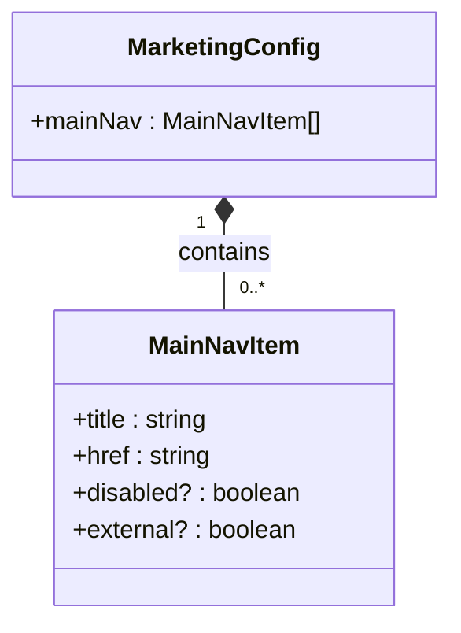
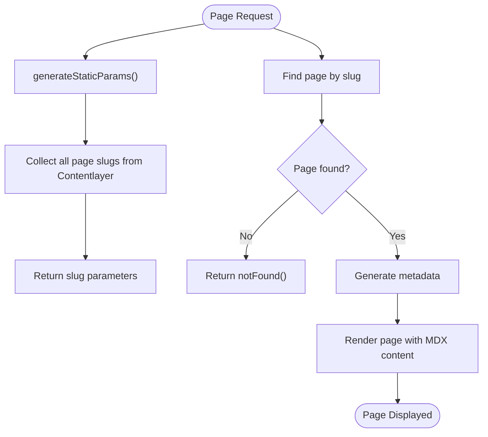
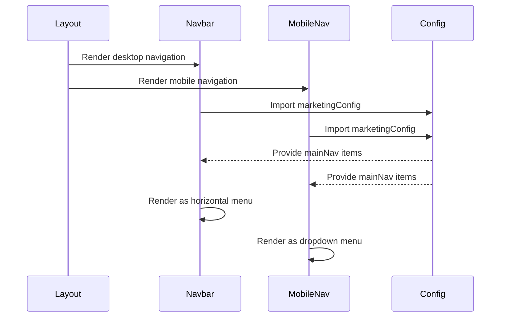

# Marketing Pages Configuration

<cite>
**Referenced Files in This Document**   
- [marketing.ts](file://config/marketing.ts)
- [page.tsx](file://app/(marketing)/[slug]/page.tsx)
- [blog-header-layout.tsx](file://components/content/blog-header-layout.tsx)
- [navbar.tsx](file://components/layout/navbar.tsx)
- [mobile-nav.tsx](file://components/layout/mobile-nav.tsx)
- [site.ts](file://config/site.ts)
- [blog.ts](file://config/blog.ts)
- [layout.tsx](file://app/(marketing)/layout.tsx)
</cite>

## Table of Contents
1. [Introduction](#introduction)
2. [Project Structure](#project-structure)
3. [Core Components](#core-components)
4. [Architecture Overview](#architecture-overview)
5. [Detailed Component Analysis](#detailed-component-analysis)
6. [Dependency Analysis](#dependency-analysis)
7. [Performance Considerations](#performance-considerations)
8. [Troubleshooting Guide](#troubleshooting-guide)
9. [Conclusion](#conclusion)

## Introduction
This document provides a comprehensive overview of the marketing pages configuration system in the Next.js SaaS Starter application. It explains how the `marketing.ts` configuration file controls dynamic routing, navigation, and page-level settings for non-landing marketing content. The system enables flexible creation of custom marketing pages using slug-based routing while maintaining consistent UI/UX across the application through shared components and centralized configuration.

## Project Structure

```mermaid
graph TB
subgraph "Config"
marketing[marketing.ts]
site[site.ts]
blog[blog.ts]
end
subgraph "App Routes"
marketingLayout[app/(marketing)/layout.tsx]
dynamicPage[app/(marketing)/[slug]/page.tsx]
blogPage[app/(marketing)/blog/page.tsx]
pricingPage[app/(marketing)/pricing/page.tsx]
end
subgraph "Components"
navbar[components/layout/navbar.tsx]
mobileNav[components/layout/mobile-nav.tsx]
blogHeader[components/content/blog-header-layout.tsx]
end
marketing --> |Provides config| navbar
marketing --> |Provides config| mobileNav
marketing --> |Defines routes| dynamicPage
site --> |Provides site metadata| marketing
blog --> |Provides categories| blogHeader
dynamicPage --> |Renders content| blogHeader
marketingLayout --> |Wraps all marketing pages| dynamicPage
```

**Diagram sources**
- [marketing.ts](file://config/marketing.ts#L1-L18)
- [layout.tsx](file://app/(marketing)/layout.tsx#L1-L18)
- [page.tsx](file://app/(marketing)/[slug]/page.tsx#L1-L70)

**Section sources**
- [marketing.ts](file://config/marketing.ts#L1-L18)
- [layout.tsx](file://app/(marketing)/layout.tsx#L1-L18)

## Core Components

The marketing configuration system revolves around three key components: the `marketingConfig` object in `marketing.ts`, the dynamic route handler in `[slug]/page.tsx`, and shared UI components like `blog-header-layout.tsx`. These components work together to enable dynamic page creation, consistent navigation, and proper metadata handling across all marketing content.

The configuration supports slug-based routing by mapping URL slugs to content layer pages, allowing new marketing pages to be created without modifying route configurations. Each page automatically inherits navigation elements, metadata settings, and layout properties defined in the configuration.

**Section sources**
- [marketing.ts](file://config/marketing.ts#L1-L18)
- [page.tsx](file://app/(marketing)/[slug]/page.tsx#L1-L70)
- [blog-header-layout.tsx](file://components/content/blog-header-layout.tsx#L1-L138)

## Architecture Overview



**Diagram sources**
- [page.tsx](file://app/(marketing)/[slug]/page.tsx#L1-L70)
- [marketing.ts](file://config/marketing.ts#L1-L18)

## Detailed Component Analysis

### Marketing Configuration Analysis

The `marketingConfig` object defines the main navigation structure for all marketing pages. It contains an array of navigation items, each with a title and href property that determine the visible label and destination URL.



**Diagram sources**
- [marketing.ts](file://config/marketing.ts#L1-L18)
- [types/index.d.ts](file://types/index.d.ts#L29-L31)

### Dynamic Route Handler Analysis

The `[slug]/page.tsx` component serves as the universal handler for all dynamic marketing pages. It leverages Contentlayer's `allPages` collection to dynamically generate routes and retrieve content based on the URL slug parameter.



**Diagram sources**
- [page.tsx](file://app/(marketing)/[slug]/page.tsx#L1-L70)
- [types/index.d.ts](file://types/index.d.ts#L7-L7)

### Navigation Components Analysis

The navigation system uses the marketing configuration to render consistent navigation across desktop and mobile views. Both `navbar.tsx` and `mobile-nav.tsx` import and utilize the `marketingConfig` object to display the main navigation menu.



**Diagram sources**
- [navbar.tsx](file://components/layout/navbar.tsx#L1-L135)
- [mobile-nav.tsx](file://components/layout/mobile-nav.tsx#L1-L140)
- [marketing.ts](file://config/marketing.ts#L1-L18)

## Dependency Analysis

```mermaid
graph LR
A[marketing.ts] --> B[navbar.tsx]
A --> C[mobile-nav.tsx]
A --> D[[slug]/page.tsx]
E[site.ts] --> A
F[blog.ts] --> G[blog-header-layout.tsx]
D --> H[Contentlayer]
I[layout.tsx] --> B
I --> C
I --> D
style A fill:#f9f,stroke:#333
style B fill:#bbf,stroke:#333
style C fill:#bbf,stroke:#333
style D fill:#bbf,stroke:#333
```

**Diagram sources**
- [marketing.ts](file://config/marketing.ts#L1-L18)
- [navbar.tsx](file://components/layout/navbar.tsx#L1-L135)
- [mobile-nav.tsx](file://components/layout/mobile-nav.tsx#L1-L140)
- [page.tsx](file://app/(marketing)/[slug]/page.tsx#L1-L70)
- [layout.tsx](file://app/(marketing)/layout.tsx#L1-L18)

**Section sources**
- [marketing.ts](file://config/marketing.ts#L1-L18)
- [navbar.tsx](file://components/layout/navbar.tsx#L1-L135)
- [mobile-nav.tsx](file://components/layout/mobile-nav.tsx#L1-L140)

## Performance Considerations

The marketing configuration system is optimized for performance through static generation and efficient data loading. The `generateStaticParams` function pre-renders all possible page routes at build time, eliminating runtime lookup overhead. Content is fetched directly from the Contentlayer generated files, which are statically optimized during the build process.

Metadata generation occurs at build time for static pages, reducing server-side processing requirements. The navigation configuration is imported as a plain JavaScript object, enabling tree-shaking and minimizing bundle size impact.

## Troubleshooting Guide

When encountering issues with marketing page configuration, verify the following:

1. Ensure new pages are properly defined in the Contentlayer source files
2. Confirm that slugs in content files match expected URL patterns
3. Check that required metadata fields (title, description) are present in content files
4. Verify navigation items in `marketing.ts` have valid href values
5. Ensure the `allPages` collection is properly imported and available

Common issues include broken navigation links due to incorrect href values, missing metadata from incomplete content files, and 404 errors from unmatched slugs.

**Section sources**
- [marketing.ts](file://config/marketing.ts#L1-L18)
- [page.tsx](file://app/(marketing)/[slug]/page.tsx#L1-L70)
- [types/index.d.ts](file://types/index.d.ts#L90-L96)

## Conclusion

The marketing pages configuration system provides a robust, scalable solution for managing dynamic marketing content in the Next.js SaaS Starter application. By centralizing navigation configuration in `marketing.ts` and leveraging Contentlayer for content management, the system enables easy creation and maintenance of marketing pages while ensuring consistency across the user interface. The integration between configuration files, dynamic route handlers, and shared components creates a cohesive architecture that supports both developer efficiency and optimal user experience.