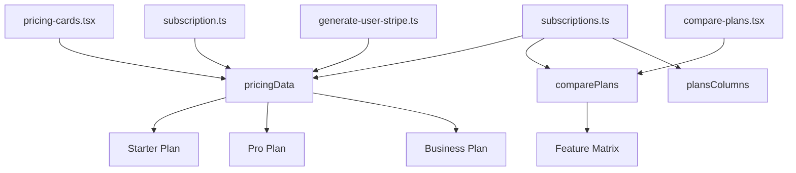
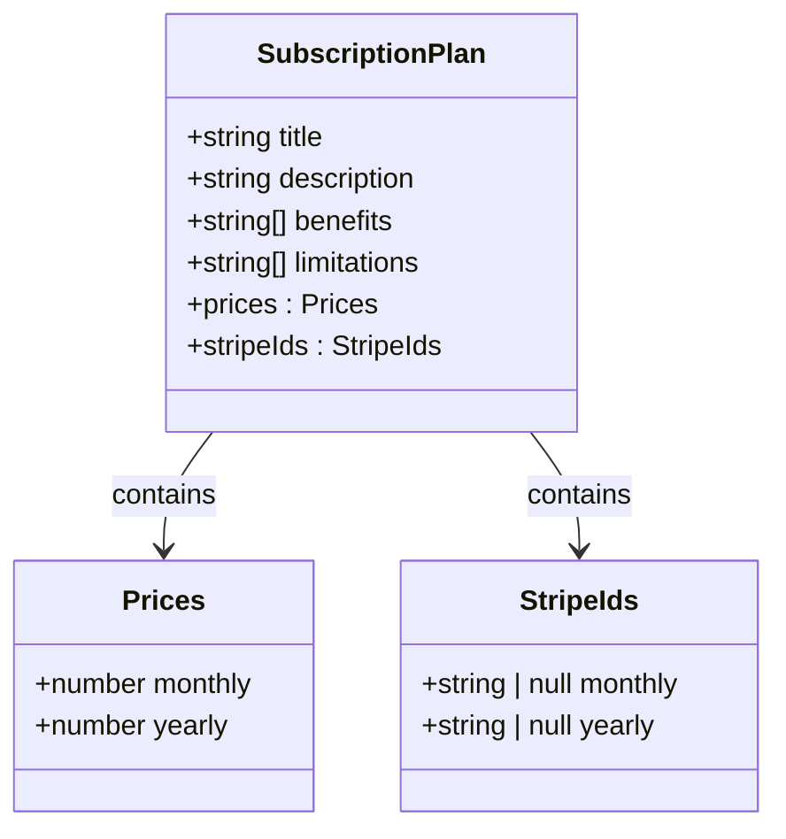
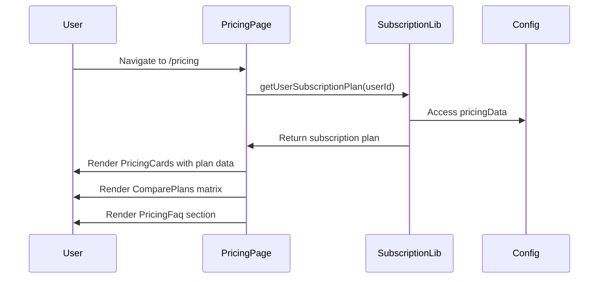
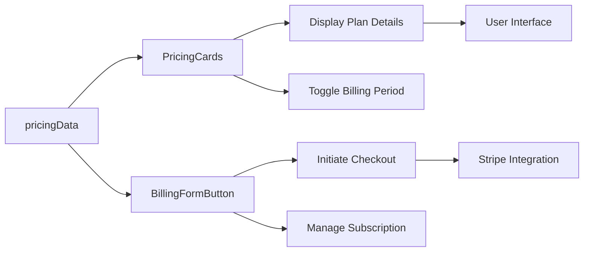
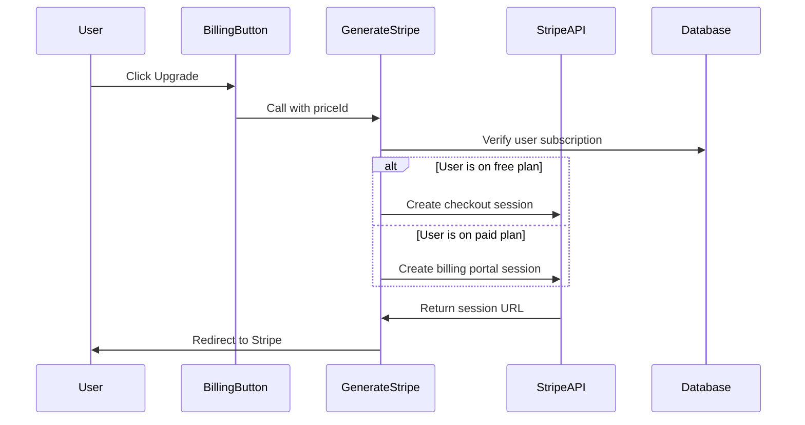

# Subscriptions Configuration

<cite>
**Referenced Files in This Document**   
- [subscriptions.ts](file://config/subscriptions.ts)
- [pricing-cards.tsx](file://components/pricing/pricing-cards.tsx)
- [compare-plans.tsx](file://components/pricing/compare-plans.tsx)
- [subscription.ts](file://lib/subscription.ts)
- [generate-user-stripe.ts](file://actions/generate-user-stripe.ts)
- [env.mjs](file://env.mjs)
- [pricing/page.tsx](file://app/(marketing)/pricing/page.tsx)
- [billing-form-button.tsx](file://components/forms/billing-form-button.tsx)
</cite>

## Table of Contents
1. [Introduction](#introduction)
2. [Subscription Configuration Structure](#subscription-configuration-structure)
3. [Pricing Data Definition](#pricing-data-definition)
4. [Feature Comparison Matrix](#feature-comparison-matrix)
5. [Pricing Page Implementation](#pricing-page-implementation)
6. [Subscription Plan Consumption](#subscription-plan-consumption)
7. [Stripe Integration and Checkout Flow](#stripe-integration-and-checkout-flow)
8. [Adding and Modifying Plans](#adding-and-modifying-plans)
9. [Best Practices and Environment Management](#best-practices-and-environment-management)
10. [Conclusion](#conclusion)

## Introduction
This document provides a comprehensive overview of the subscription plan configuration system in the SaaS application. It details how pricing tiers, feature matrices, and Stripe product mappings are defined and consumed throughout the application. The configuration enables dynamic rendering of pricing information, determines user capabilities based on their subscription level, and facilitates seamless integration with Stripe for subscription management.

**Section sources**
- [subscriptions.ts](file://config/subscriptions.ts)

## Subscription Configuration Structure
The subscription configuration is centralized in the `config/subscriptions.ts` file, which defines the complete pricing model for the SaaS business. The configuration consists of two main components: pricing data for subscription tiers and a feature comparison matrix. These configurations are consumed by various components across the application to render pricing information, determine user capabilities, and manage subscription flows.

The configuration leverages environment variables for Stripe price IDs, enabling environment-specific deployments without code changes. Type definitions in `types/index.d.ts` ensure type safety across the application, with `SubscriptionPlan` defining the structure of each pricing tier and `UserSubscriptionPlan` extending this with user-specific subscription data.



**Diagram sources**
- [subscriptions.ts](file://config/subscriptions.ts)
- [pricing-cards.tsx](file://components/pricing/pricing-cards.tsx)
- [compare-plans.tsx](file://components/pricing/compare-plans.tsx)
- [subscription.ts](file://lib/subscription.ts)
- [generate-user-stripe.ts](file://actions/generate-user-stripe.ts)

**Section sources**
- [subscriptions.ts](file://config/subscriptions.ts)

## Pricing Data Definition
The `pricingData` constant in `config/subscriptions.ts` defines the available subscription tiers with their respective features, pricing, and Stripe mappings. Each plan includes a title, description, list of benefits, limitations, price structure for monthly and yearly billing, and corresponding Stripe price IDs. The Starter plan is free with limited features, while Pro and Business plans offer progressively advanced capabilities at tiered pricing.

Stripe price IDs are injected via environment variables (`NEXT_PUBLIC_STRIPE_PRO_MONTHLY_PLAN_ID`, etc.), allowing for secure configuration management across environments. The price structure includes both monthly and yearly rates, with the yearly option providing a discount (e.g., $144/year for the Pro plan equates to $12/month, a 20% discount from the $15/month rate).



**Diagram sources**
- [subscriptions.ts](file://config/subscriptions.ts)
- [types/index.d.ts](file://types/index.d.ts)

**Section sources**
- [subscriptions.ts](file://config/subscriptions.ts)

## Feature Comparison Matrix
The `comparePlans` array in `config/subscriptions.ts` defines a comprehensive feature matrix that compares all subscription tiers across various capabilities. This matrix is consumed by the `ComparePlans` component to render a detailed comparison table on the pricing page. Each row represents a specific feature with its availability or limitations across the Starter, Pro, Business, and Enterprise plans.

The matrix supports multiple data types for feature values: boolean (true/false), string (custom values like "Email & Chat"), or null (not available). Tooltip properties provide additional context for users, enhancing the decision-making process. The `plansColumns` constant defines the order and names of the columns in the comparison table, ensuring consistency across the application.

```mermaid
flowchart TD
A[comparePlans] --> B[Feature: Access to Analytics]
A --> C[Feature: Custom Branding]
A --> D[Feature: Priority Support]
A --> E[Feature: Advanced Reporting]
A --> F[Feature: Dedicated Manager]
B --> G[Starter: true]
B --> H[Pro: true]
B --> I[Business: true]
B --> J[Enterprise: Custom]
C --> K[Starter: null]
C --> L[Pro: "500/mo"]
C --> M[Business: "1,500/mo"]
C --> N[Enterprise: Unlimited]
```

**Diagram sources**
- [subscriptions.ts](file://config/subscriptions.ts)

**Section sources**
- [subscriptions.ts](file://config/subscriptions.ts)

## Pricing Page Implementation
The pricing page at `app/(marketing)/pricing/page.tsx` serves as the primary interface for users to explore and select subscription plans. It orchestrates multiple components that consume the subscription configuration: `PricingCards` for tiered pricing display, `ComparePlans` for feature comparison, and `PricingFaq` for addressing common questions.

The page dynamically loads the user's current subscription plan via `getUserSubscriptionPlan` to personalize the displayed options. For authenticated users, it shows appropriate call-to-action buttons based on their current plan, while unauthenticated users are prompted to sign in. The page also includes special handling for administrators, redirecting them to the admin dashboard instead of showing pricing information.



**Diagram sources**
- [pricing/page.tsx](file://app/(marketing)/pricing/page.tsx)
- [subscription.ts](file://lib/subscription.ts)
- [subscriptions.ts](file://config/subscriptions.ts)

**Section sources**
- [pricing/page.tsx](file://app/(marketing)/pricing/page.tsx)

## Subscription Plan Consumption
The subscription configuration is consumed across multiple components to provide a consistent user experience. The `PricingCards` component renders individual plan cards with pricing, benefits, and call-to-action buttons. It implements a toggle for monthly/yearly billing, dynamically calculating and displaying the effective monthly rate for annual plans.

The `BillingFormButton` component uses the Stripe price IDs from the configuration to initiate the checkout process. It determines whether to show "Upgrade" or "Manage Subscription" based on the user's current plan, providing a seamless transition between subscription management and new purchases.



**Diagram sources**
- [pricing-cards.tsx](file://components/pricing/pricing-cards.tsx)
- [billing-form-button.tsx](file://components/forms/billing-form-button.tsx)
- [subscriptions.ts](file://config/subscriptions.ts)

**Section sources**
- [pricing-cards.tsx](file://components/pricing/pricing-cards.tsx)
- [billing-form-button.tsx](file://components/forms/billing-form-button.tsx)

## Stripe Integration and Checkout Flow
The subscription system integrates with Stripe through server actions and webhook handlers. The `generate-user-stripe` action determines the appropriate Stripe flow based on the user's current subscription status. For users on a free plan, it creates a checkout session to upgrade, while users on a paid plan are directed to the billing portal to manage their subscription.

The action retrieves the Stripe price ID from the subscription configuration based on the selected plan and billing interval. It constructs the appropriate Stripe session with success and cancel URLs pointing back to the pricing page. The environment variables in `env.mjs` contain the necessary Stripe configuration, including API keys and webhook secrets.



**Diagram sources**
- [generate-user-stripe.ts](file://actions/generate-user-stripe.ts)
- [subscription.ts](file://lib/subscription.ts)
- [env.mjs](file://env.mjs)

**Section sources**
- [generate-user-stripe.ts](file://actions/generate-user-stripe.ts)
- [subscription.ts](file://lib/subscription.ts)
- [env.mjs](file://env.mjs)

## Adding and Modifying Plans
To add a new subscription plan, developers must update the `pricingData` array in `config/subscriptions.ts` with the new tier's details, including title, description, benefits, limitations, pricing, and Stripe price IDs. The corresponding price IDs must be created in the Stripe Dashboard and added to the environment variables.

When modifying existing plans, it's crucial to update both the configuration and the Stripe product definitions to maintain synchronization. For plan deprecations, the configuration should be updated to mark the plan as unavailable, and appropriate messaging should be added to guide existing subscribers to alternative options. The webhook handler in `app/api/webhooks/stripe/route.ts` automatically updates user subscription data when changes occur in Stripe, ensuring data consistency.

**Section sources**
- [subscriptions.ts](file://config/subscriptions.ts)
- [ENVIRONMENT_SETUP_GUIDE.md](file://ENVIRONMENT_SETUP_GUIDE.md)

## Best Practices and Environment Management
The subscription configuration follows several best practices for maintainability and security. Environment variables are used for all Stripe-related identifiers, preventing sensitive information from being hardcoded in the source code. The type definitions in `types/index.d.ts` ensure type safety across the application, reducing the risk of runtime errors.

For environment-specific configurations, different Stripe price IDs can be set in the environment variables for development, staging, and production environments. This allows testing of subscription flows without affecting production data. Regular synchronization between the configuration file and Stripe Dashboard is essential to prevent discrepancies that could affect user experience.

**Section sources**
- [env.mjs](file://env.mjs)
- [ENVIRONMENT_SETUP_GUIDE.md](file://ENVIRONMENT_SETUP_GUIDE.md)

## Conclusion
The subscription configuration system provides a robust foundation for managing pricing tiers and feature access in the SaaS application. By centralizing subscription data in `config/subscriptions.ts`, the application ensures consistency across all user interfaces and business logic. The integration with Stripe enables secure and reliable subscription management, while the type-safe configuration promotes maintainability and reduces errors. Following the documented patterns for adding and modifying plans ensures that the subscription system can evolve with the business requirements while maintaining a seamless user experience.