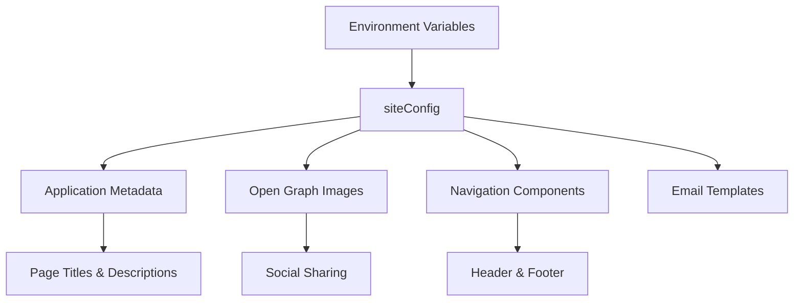
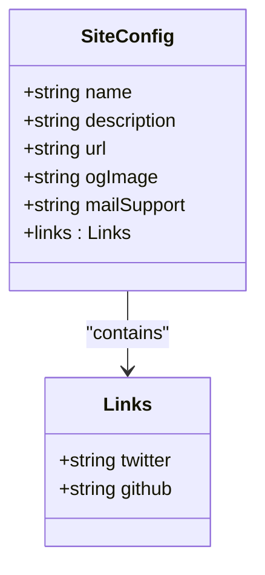
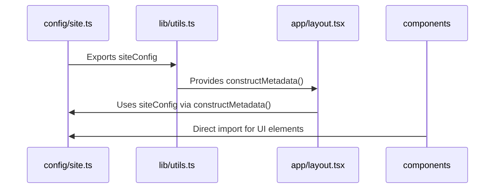

# Site Configuration

<cite>
**Referenced Files in This Document**   
- [config/site.ts](file://config/site.ts)
- [types/index.d.ts](file://types/index.d.ts)
- [lib/utils.ts](file://lib/utils.ts)
- [app/layout.tsx](file://app/layout.tsx)
- [app/api/og/route.tsx](file://app/api/og/route.tsx)
- [components/layout/navbar.tsx](file://components/layout/navbar.tsx)
- [components/layout/site-footer.tsx](file://components/layout/site-footer.tsx)
</cite>

## Table of Contents
1. [Introduction](#introduction)
2. [Site Configuration Structure](#site-configuration-structure)
3. [Type Safety and Interface Definition](#type-safety-and-interface-definition)
4. [Consumption Across Application](#consumption-across-application)
5. [Open Graph Image Integration](#open-graph-image-integration)
6. [Customization and Branding Guidance](#customization-and-branding-guidance)
7. [Build Impact and Environment Considerations](#build-impact-and-environment-considerations)

## Introduction
The site configuration module serves as the central source for global metadata in the Next.js SaaS application. This document details how the `config/site.ts` file provides essential site-wide information including branding, SEO settings, and social links, and how these values are consumed throughout the application for consistent metadata management.

**Section sources**
- [config/site.ts](file://config/site.ts#L5-L16)
- [config/site.ts](file://config/site.ts#L18-L46)

## Site Configuration Structure
The `siteConfig` object in `config/site.ts` defines core metadata properties such as name, description, URL, Open Graph image, and social media links. The configuration leverages environment variables through `env.mjs` to ensure the base URL is dynamically set based on deployment environment. This centralized approach ensures consistency across all pages and components that require site metadata.

The configuration also includes `footerLinks`, an array of navigation sections used in the site footer, organizing links into logical groups like Company, Product, and Documentation. This structure enables easy maintenance and updates to footer navigation without modifying component code.

**Diagram sources**
- [config/site.ts](file://config/site.ts#L5-L16)
- [config/site.ts](file://config/site.ts#L18-L46)

**Section sources**
- [config/site.ts](file://config/site.ts#L5-L46)

## Type Safety and Interface Definition
The `SiteConfig` TypeScript interface defined in `types/index.d.ts` enforces strict type safety across the configuration. This interface specifies exact property types including string values for name, description, URL, and ogImage, as well as a structured links object containing Twitter and GitHub URLs. The type definition prevents invalid configurations and provides IDE autocomplete support, reducing errors during development.

The interface is imported and implemented directly in `config/site.ts`, ensuring that any deviation from the expected structure will result in TypeScript compilation errors. This contract between the type definition and implementation guarantees that all consumers of the site configuration can rely on consistent data shapes.

**Diagram sources**
- [types/index.d.ts](file://types/index.d.ts#L5-L15)

**Section sources**
- [types/index.d.ts](file://types/index.d.ts#L5-L15)
- [config/site.ts](file://config/site.ts#L5-L16)

## Consumption Across Application
Site configuration values are consumed throughout the application via the `constructMetadata` utility function in `lib/utils.ts`. This function uses `siteConfig` as default values for generating Next.js metadata objects, allowing individual pages to override specific properties while inheriting defaults. The root layout in `app/layout.tsx` uses this function to set default metadata for the entire application.

Components such as `navbar.tsx` and `site-footer.tsx` directly import and use `siteConfig` for displaying the site name and linking to social profiles. The email system also references `siteConfig.name` in email subject lines, ensuring brand consistency across communication channels. This widespread consumption pattern establishes `siteConfig` as the single source of truth for site metadata.

**Diagram sources**
- [lib/utils.ts](file://lib/utils.ts#L12-L70)
- [app/layout.tsx](file://app/layout.tsx#L16-L16)
- [components/layout/navbar.tsx](file://components/layout/navbar.tsx#L36-L77)
- [components/layout/site-footer.tsx](file://components/layout/site-footer.tsx#L0-L36)

**Section sources**
- [lib/utils.ts](file://lib/utils.ts#L12-L70)
- [app/layout.tsx](file://app/layout.tsx#L16-L16)
- [components/layout/navbar.tsx](file://components/layout/navbar.tsx#L36-L77)
- [components/layout/site-footer.tsx](file://components/layout/site-footer.tsx#L0-L36)

## Open Graph Image Integration
The site configuration directly supports Open Graph image generation through the `ogImage` property, which points to a static image at `${site_url}/_static/og.jpg`. This image URL is used as the default in metadata generation and can be overridden per page. The Open Graph route in `app/api/og/route.tsx` could leverage `siteConfig` values for consistent branding in dynamically generated social images, such as using the site name in the image template.

The `constructMetadata` function specifically references `siteConfig.ogImage` as the default image value, ensuring that all pages inherit the correct Open Graph image unless explicitly overridden. This integration provides a seamless experience for social sharing while maintaining brand consistency across all shared content.

**Section sources**
- [config/site.ts](file://config/site.ts#L5-L16)
- [lib/utils.ts](file://lib/utils.ts#L12-L70)
- [app/api/og/route.tsx](file://app/api/og/route.tsx#L0-L158)

## Customization and Branding Guidance
To customize site metadata for branding and SEO optimization, developers should modify the `siteConfig` object in `config/site.ts`. Key properties like `name`, `description`, and `ogImage` should be updated to reflect the specific brand identity. The `links` object should be updated with official social media profiles to ensure proper attribution and linking.

For SEO optimization, the `description` field should contain relevant keywords and a compelling summary of the site's purpose. The `mailSupport` field should be updated to the official support email address. When updating the Open Graph image, both the `ogImage` URL and the actual image file at `/_static/og.jpg` should be replaced to maintain consistency.

All changes should maintain the TypeScript interface structure to prevent runtime errors. After customization, developers should verify that metadata appears correctly across various pages and in social sharing previews.

**Section sources**
- [config/site.ts](file://config/site.ts#L5-L16)
- [lib/utils.ts](file://lib/utils.ts#L12-L70)

## Build Impact and Environment Considerations
Configuration changes in `site.ts` affect both development and production builds identically, as the values are compiled into the application at build time. The use of `env.NEXT_PUBLIC_APP_URL` ensures that the correct base URL is injected based on the deployment environment, allowing the same configuration to work across development, staging, and production environments.

Since the configuration is imported as a module, any changes require a rebuild of the application to take effect. This ensures that all references to site metadata remain consistent throughout the built application. The type safety provided by TypeScript helps prevent configuration errors that could break the build process or cause runtime issues in production.

**Section sources**
- [config/site.ts](file://config/site.ts#L5-L16)
- [env.mjs](file://env.mjs)
- [lib/utils.ts](file://lib/utils.ts#L12-L70)