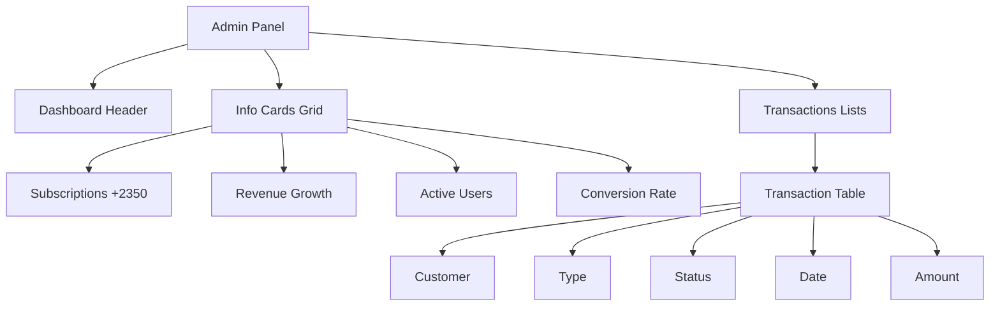
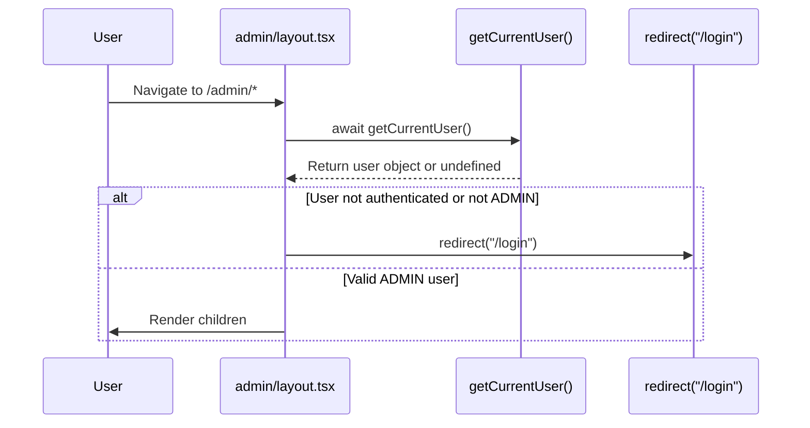
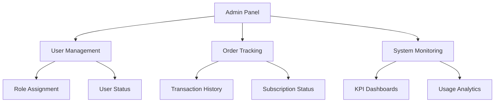
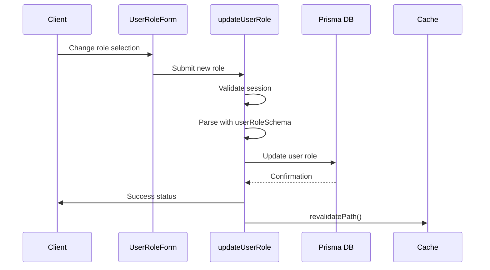
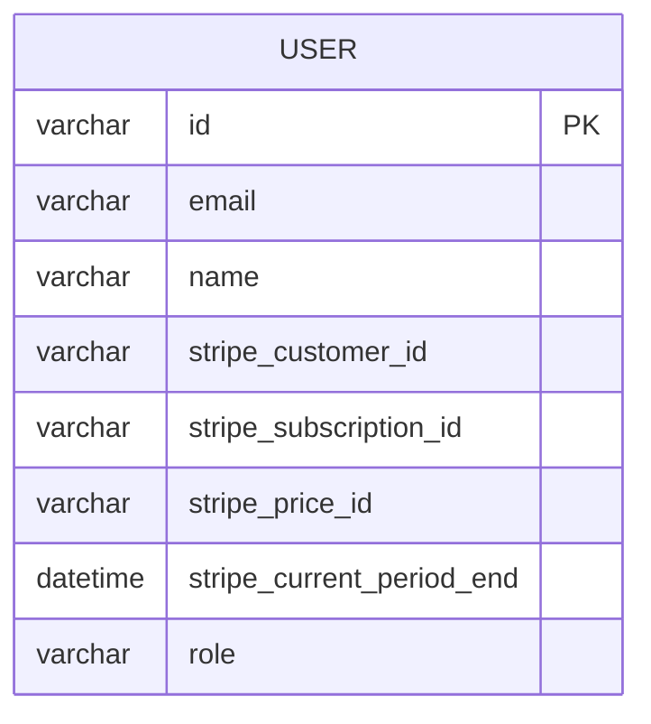
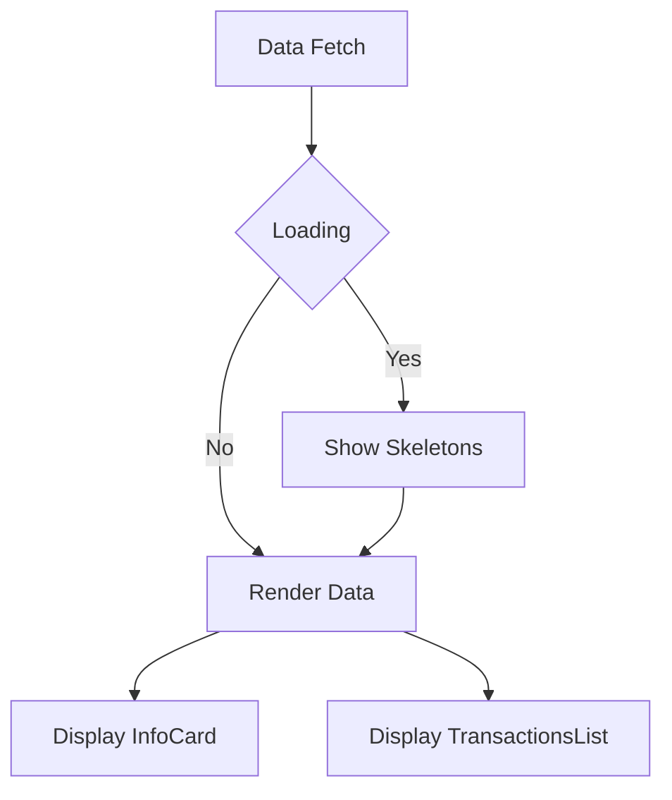
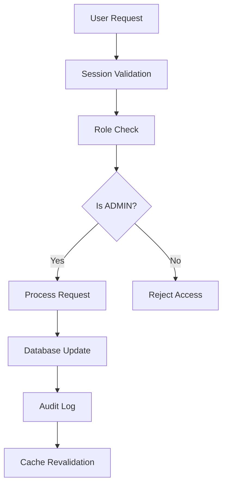

# Admin Panel

<cite>
**Referenced Files in This Document**   
- [admin/page.tsx](file://app/(protected)/admin/page.tsx)
- [admin/layout.tsx](file://app/(protected)/admin/layout.tsx)
- [lib/session.ts](file://lib/session.ts)
- [components/dashboard/info-card.tsx](file://components/dashboard/info-card.tsx)
- [components/dashboard/transactions-list.tsx](file://components/dashboard/transactions-list.tsx)
- [config/dashboard.ts](file://config/dashboard.ts)
- [actions/update-user-role.ts](file://actions/update-user-role.ts)
- [lib/db.ts](file://lib/db.ts)
- [types/next-auth.d.ts](file://types/next-auth.d.ts)
- [prisma/migrations/0_init/migration.sql](file://prisma/migrations/0_init/migration.sql)
</cite>

## Table of Contents
1. [Introduction](#introduction)
2. [Admin Panel Overview](#admin-panel-overview)
3. [Route Protection and Role-Based Access](#route-protection-and-role-based-access)
4. [Core Functionalities](#core-functionalities)
5. [User Management Implementation](#user-management-implementation)
6. [Orders and Subscription Data Querying](#orders-and-subscription-data-querying)
7. [UI Components for Sensitive Data Display](#ui-components-for-sensitive-data-display)
8. [Security Considerations](#security-considerations)
9. [Extending the Admin Panel](#extending-the-admin-panel)
10. [Conclusion](#conclusion)

## Introduction

The Admin Panel is a protected interface within the SaaS application that provides exclusive access to administrative functionalities for users with the ADMIN role. This document details the implementation, security mechanisms, and extensibility of the admin features, focusing on user management, order tracking, and system monitoring capabilities.

**Section sources**
- [admin/page.tsx](file://app/(protected)/admin/page.tsx#L13-L35)
- [config/dashboard.ts](file://config/dashboard.ts#L0-L53)

## Admin Panel Overview

The Admin Panel serves as a centralized hub for administrative tasks, accessible only to authenticated users with the ADMIN role. It features a dashboard layout with informational widgets and transaction lists, providing insights into system activity and user behavior.

The panel includes two primary routes:
- `/admin`: Main dashboard with summary cards and transaction history
- `/admin/orders`: Dedicated interface for order management (currently in development)

The UI leverages reusable components such as `InfoCard` for displaying key metrics and `TransactionsList` for presenting financial data in tabular format.



**Diagram sources**
- [admin/page.tsx](file://app/(protected)/admin/page.tsx#L13-L35)
- [components/dashboard/info-card.tsx](file://components/dashboard/info-card.tsx#L9-L22)
- [components/dashboard/transactions-list.tsx](file://components/dashboard/transactions-list.tsx#L21-L147)

**Section sources**
- [admin/page.tsx](file://app/(protected)/admin/page.tsx#L13-L35)
- [components/dashboard/info-card.tsx](file://components/dashboard/info-card.tsx#L9-L22)
- [components/dashboard/transactions-list.tsx](file://components/dashboard/transactions-list.tsx#L21-L147)

## Route Protection and Role-Based Access

Access to the Admin Panel is strictly controlled through multiple layers of protection. The system implements role-based access control (RBAC) by validating the user's role attribute stored in their session.

The protection mechanism operates at two levels:
1. **Layout-level protection**: The `admin/layout.tsx` file contains a middleware-like check that redirects unauthorized users to the login page.
2. **Page-level protection**: Individual admin pages perform their own role validation using the `getCurrentUser()` function.



**Diagram sources**
- [admin/layout.tsx](file://app/(protected)/admin/layout.tsx#L0-L13)
- [lib/session.ts](file://lib/session.ts#L5-L11)

**Section sources**
- [admin/layout.tsx](file://app/(protected)/admin/layout.tsx#L0-L13)
- [lib/session.ts](file://lib/session.ts#L5-L11)

## Core Functionalities

The Admin Panel provides three primary administrative capabilities:

### User Management
Administrators can view and modify user roles through the system. The role management functionality is implemented using server actions that update the user record in the database.

### Order Tracking
The orders section allows administrators to monitor transactions and subscriptions. Although the current implementation shows placeholder data, it is designed to display real-time order information from the database.

### System Monitoring
The dashboard provides key performance indicators through informational cards that can be extended to show metrics such as active subscriptions, revenue trends, and user growth.



**Diagram sources**
- [admin/page.tsx](file://app/(protected)/admin/page.tsx#L13-L35)
- [config/dashboard.ts](file://config/dashboard.ts#L0-L53)

**Section sources**
- [admin/page.tsx](file://app/(protected)/admin/page.tsx#L13-L35)
- [config/dashboard.ts](file://config/dashboard.ts#L0-L53)

## User Management Implementation

User role management is implemented through a combination of client-side forms and server actions. The process involves:

1. **Client Interface**: The `UserRoleForm` component provides a select dropdown for choosing user roles.
2. **Validation**: Zod schema (`userRoleSchema`) validates the input on both client and server.
3. **Server Action**: `updateUserRole` action handles the database update securely.

The implementation follows security best practices by:
- Using server actions for database mutations
- Validating user authorization before processing
- Revalidating cached data after updates
- Implementing proper error handling



**Diagram sources**
- [actions/update-user-role.ts](file://actions/update-user-role.ts#L0-L39)
- [components/forms/user-role-form.tsx](file://components/forms/user-role-form.tsx#L0-L49)
- [lib/validations/user.ts](file://lib/validations/user.ts#L0-L9)

**Section sources**
- [actions/update-user-role.ts](file://actions/update-user-role.ts#L0-L39)
- [components/forms/user-role-form.tsx](file://components/forms/user-role-form.tsx#L0-L49)
- [lib/validations/user.ts](file://lib/validations/user.ts#L0-L9)

## Orders and Subscription Data Querying

The system is designed to query user subscription data from the database using Prisma ORM. While the current orders page displays placeholder content, the infrastructure supports real data retrieval through:

### Prisma Queries
The application uses Prisma Client to interact with the database. Example queries include:

```typescript
// Retrieve user with subscription details
await prisma.user.findFirst({
  where: { id: userId },
  select: {
    stripeSubscriptionId: true,
    stripeCurrentPeriodEnd: true,
    stripeCustomerId: true,
    stripePriceId: true,
  },
})
```

### Subscription Status Aggregation
The `getUserSubscriptionPlan` function aggregates subscription data from both the database and Stripe API to provide a comprehensive view of user plans.

### Database Schema
The user table contains Stripe-related fields that enable subscription tracking:
- `stripe_customer_id`
- `stripe_subscription_id`
- `stripe_price_id`
- `stripe_current_period_end`



**Diagram sources**
- [lib/db.ts](file://lib/db.ts#L0-L16)
- [prisma/migrations/0_init/migration.sql#L45-L64)
- [lib/subscription.ts](file://lib/subscription.ts#L0-L64)

**Section sources**
- [lib/db.ts](file://lib/db.ts#L0-L16)
- [prisma/migrations/0_init/migration.sql#L45-L64)
- [lib/subscription.ts](file://lib/subscription.ts#L0-L64)

## UI Components for Sensitive Data Display

The Admin Panel uses specialized UI components to securely display sensitive information:

### InfoCard Component
Displays key metrics with iconography and trend indicators. Designed to be reusable across different data types.

### TransactionsList Component
Presents financial data in a tabular format with responsive design considerations:
- Shows customer information and transaction details
- Uses badges to indicate transaction status
- Implements responsive column hiding for different screen sizes

### Loading States
The panel includes dedicated loading components (`AdminPanelLoading`) that display skeleton screens while data is being fetched, enhancing user experience during asynchronous operations.



**Diagram sources**
- [components/dashboard/info-card.tsx](file://components/dashboard/info-card.tsx#L9-L22)
- [components/dashboard/transactions-list.tsx](file://components/dashboard/transactions-list.tsx#L21-L147)
- [admin/loading.tsx](file://app/(protected)/admin/loading.tsx#L3-L22)

**Section sources**
- [components/dashboard/info-card.tsx](file://components/dashboard/info-card.tsx#L9-L22)
- [components/dashboard/transactions-list.tsx](file://components/dashboard/transactions-list.tsx#L21-L147)
- [admin/loading.tsx](file://app/(protected)/admin/loading.tsx#L3-L22)

## Security Considerations

The Admin Panel implements multiple security measures to protect against unauthorized access and privilege escalation:

### Role Validation
- Role information is extended in the NextAuth session through type augmentation
- The `ExtendedUser` type includes the role field for type safety
- All admin routes validate the role before rendering content

### Audit Logging
While explicit audit logging is not implemented in the current codebase, the architecture supports adding logging to server actions like `updateUserRole` to track administrative changes.

### Protection Against Privilege Escalation
- Server actions validate that the session user matches the target user ID
- Database operations are performed through parameterized queries
- Input validation using Zod prevents injection attacks

### Type Safety
The system uses TypeScript enums (`UserRole`) to ensure role values are consistent and type-safe throughout the application.



**Diagram sources**
- [types/next-auth.d.ts](file://types/next-auth.d.ts#L0-L19)
- [actions/update-user-role.ts](file://actions/update-user-role.ts#L0-L39)
- [lib/validations/user.ts](file://lib/validations/user.ts#L0-L9)

**Section sources**
- [types/next-auth.d.ts](file://types/next-auth.d.ts#L0-L19)
- [actions/update-user-role.ts](file://actions/update-user-role.ts#L0-L39)
- [lib/validations/user.ts](file://lib/validations/user.ts#L0-L9)

## Extending the Admin Panel

The Admin Panel can be extended with additional management features by following the established patterns:

### Adding New Admin Routes
1. Create new pages under `/app/(protected)/admin/`
2. Add route to `sidebarLinks` in `config/dashboard.ts` with `authorizeOnly: UserRole.ADMIN`
3. Implement layout-level protection

### Implementing New Management Features
- Create server actions for database operations
- Use Zod for input validation
- Implement client forms with React Hook Form
- Add appropriate UI components

### Data Aggregation
For complex administrative queries, create service functions in the `lib` directory that:
- Combine data from multiple sources (database, Stripe API)
- Aggregate metrics for dashboard display
- Handle error cases gracefully

### Best Practices for Extension
- Always use server actions for data mutations
- Validate user authorization in both layout and page components
- Implement proper loading and error states
- Use existing UI components for consistency
- Add comprehensive input validation

**Section sources**
- [config/dashboard.ts](file://config/dashboard.ts#L0-L53)
- [actions/update-user-role.ts](file://actions/update-user-role.ts#L0-L39)
- [lib/validations/user.ts](file://lib/validations/user.ts#L0-L9)

## Conclusion

The Admin Panel provides a secure, role-restricted interface for administrative tasks within the SaaS application. Its architecture emphasizes security through multiple layers of access control, type safety, and server-side validation. The implementation leverages modern Next.js features including server actions, route handlers, and caching mechanisms to create a responsive and secure administrative experience. By following the established patterns, developers can extend the panel with additional management capabilities while maintaining the security and usability standards of the application.