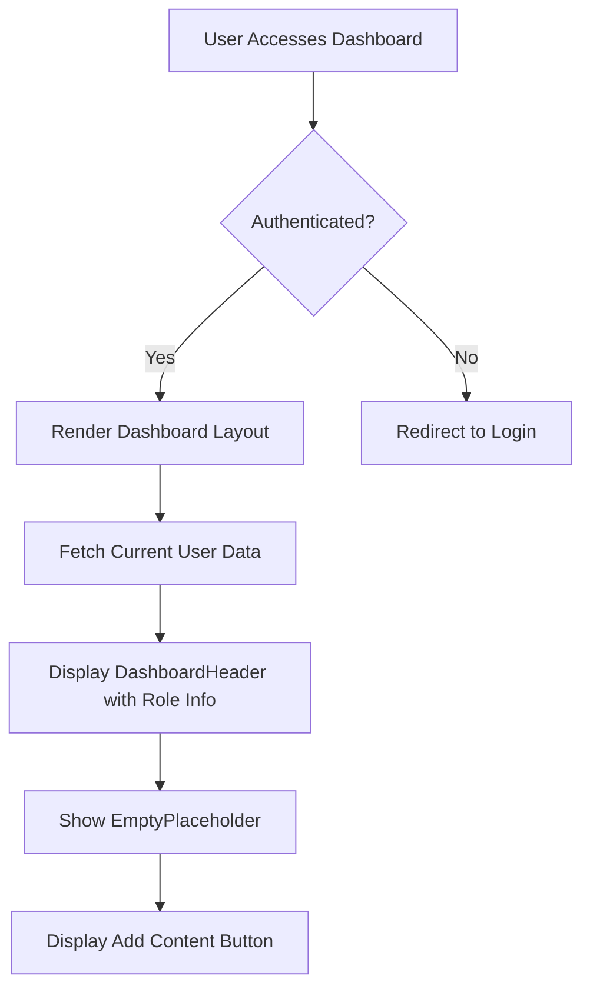
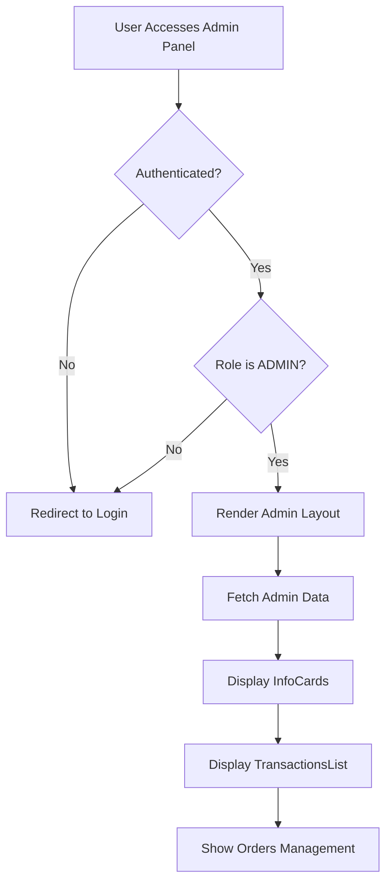
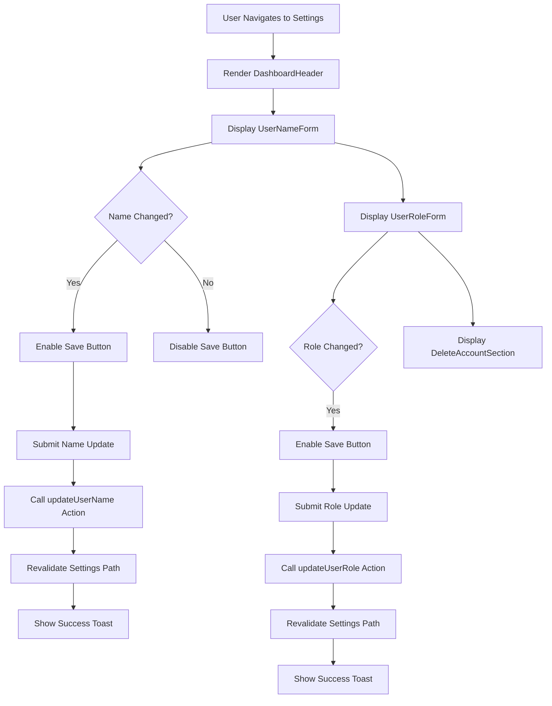
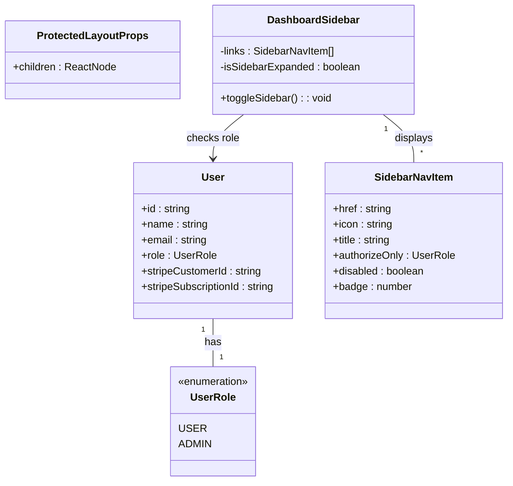
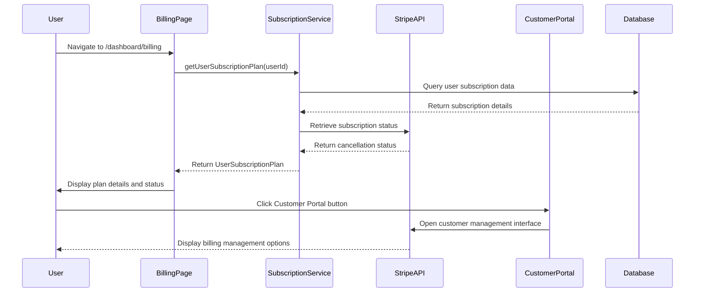
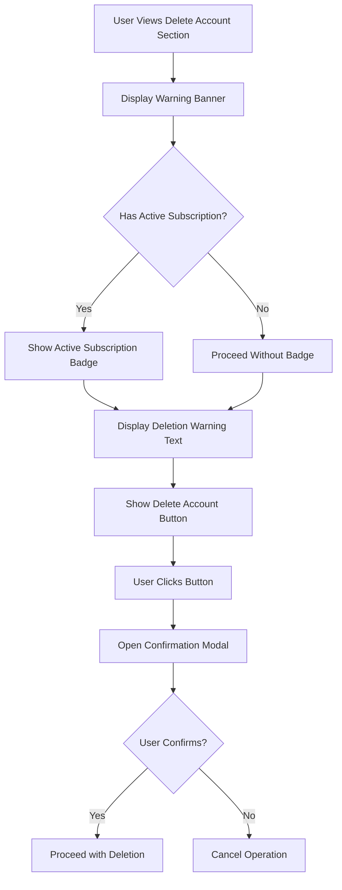
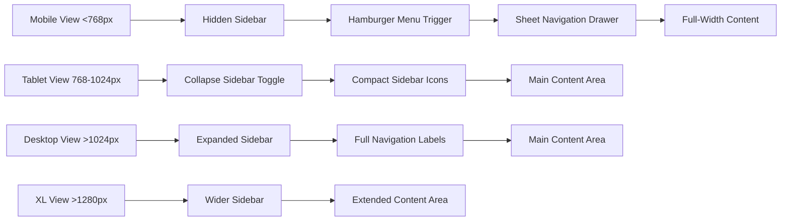
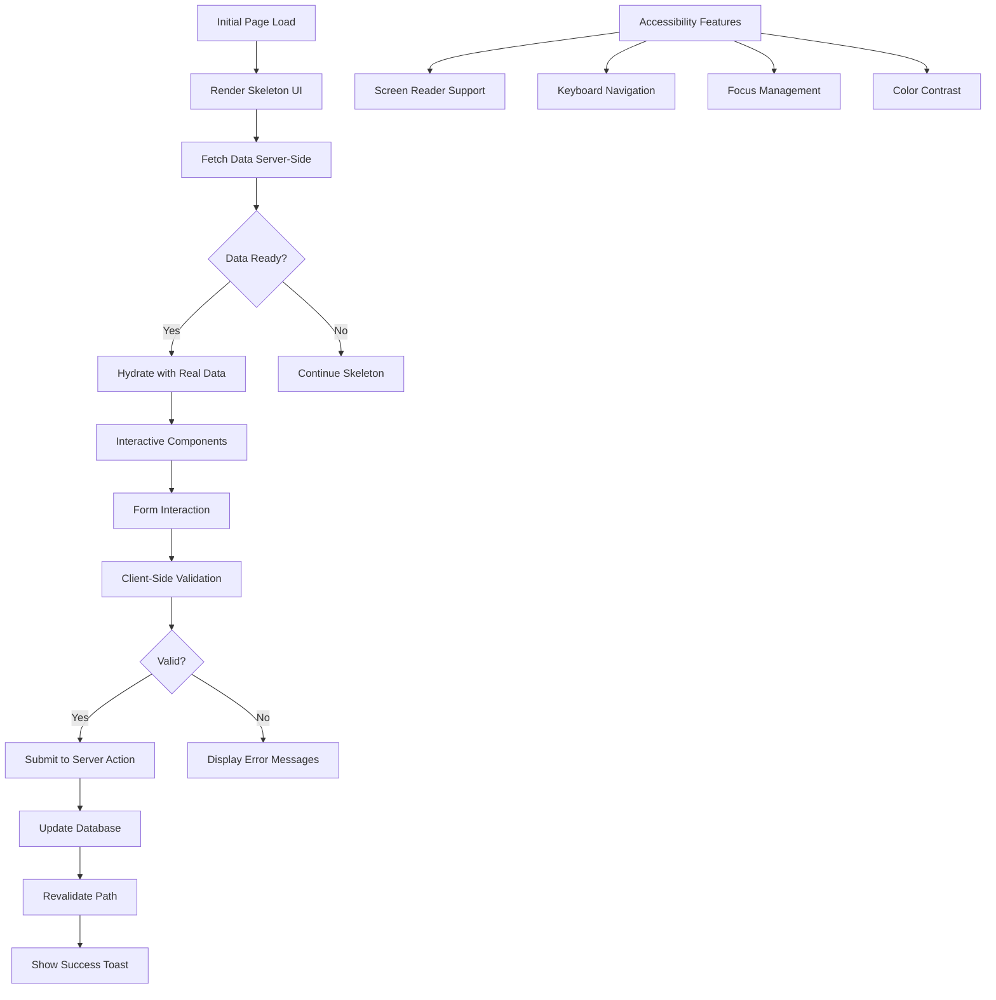

# Core Features

<cite>
**Referenced Files in This Document**   
- [dashboard/page.tsx](file://app/(protected)/dashboard/page.tsx)
- [dashboard/billing/page.tsx](file://app/(protected)/dashboard/billing/page.tsx)
- [dashboard/settings/page.tsx](file://app/(protected)/dashboard/settings/page.tsx)
- [admin/page.tsx](file://app/(protected)/admin/page.tsx)
- [dashboard-sidebar.tsx](file://components/layout/dashboard-sidebar.tsx)
- [user-name-form.tsx](file://components/forms/user-name-form.tsx)
- [user-role-form.tsx](file://components/forms/user-role-form.tsx)
- [delete-account.tsx](file://components/dashboard/delete-account.tsx)
- [billing-info.tsx](file://components/pricing/billing-info.tsx)
- [transactions-list.tsx](file://components/dashboard/transactions-list.tsx)
- [dashboard.ts](file://config/dashboard.ts)
- [subscription.ts](file://lib/subscription.ts)
- [update-user-name.ts](file://actions/update-user-name.ts)
- [update-user-role.ts](file://actions/update-user-role.ts)
</cite>

## Table of Contents
1. [Dashboard Overview](#dashboard-overview)
2. [Admin Panel Functionality](#admin-panel-functionality)
3. [Profile Settings Interface](#profile-settings-interface)
4. [User Role-Based Feature Access](#user-role-based-feature-access)
5. [Subscription and Billing Management](#subscription-and-billing-management)
6. [Account Deletion Workflow](#account-deletion-workflow)
7. [Responsive Design and Mobile-First Strategy](#responsive-design-and-mobile-first-strategy)
8. [Accessibility and Performance Optimization](#accessibility-and-performance-optimization)

## Dashboard Overview

The application provides a comprehensive dashboard interface accessible at `/dashboard`, serving as the central hub for user activities. The dashboard features a clean header with role information and a placeholder for future content creation. It includes navigation to key sections such as analytics charts, billing information, and user settings through a persistent sidebar menu. The dashboard layout is wrapped in a protected route that ensures authentication before access, with loading states implemented for optimal user experience during data fetching.

**Diagram sources**
- [dashboard/page.tsx](file://app/(protected)/dashboard/page.tsx#L11-L30)
- [dashboard/header.tsx](file://components/dashboard/header.tsx#L6-L20)

**Section sources**
- [dashboard/page.tsx](file://app/(protected)/dashboard/page.tsx#L11-L30)
- [dashboard/loading.tsx](file://app/(protected)/dashboard/loading.tsx#L3-L10)

## Admin Panel Functionality

The admin panel, accessible only to users with ADMIN role at `/admin`, provides elevated functionality for system management. The route implementation includes role-based authorization that redirects non-admin users to the login page. The admin interface displays informational cards and transaction lists, enabling oversight of system activity. A dedicated orders management section with badge indicators shows pending tasks. The admin layout extends the protected layout with additional role verification, ensuring strict access control to sensitive operations.

**Diagram sources**
- [admin/page.tsx](file://app/(protected)/admin/page.tsx#L13-L35)
- [admin/layout.tsx](file://app/(protected)/admin/layout.tsx#L8-L13)

**Section sources**
- [admin/page.tsx](file://app/(protected)/admin/page.tsx#L13-L35)
- [admin/loading.tsx](file://app/(protected)/admin/loading.tsx#L3-L22)
- [dashboard.ts](file://config/dashboard.ts#L0-L54)

## Profile Settings Interface

The profile settings interface at `/dashboard/settings` enables users to manage their account information through a structured form layout. The interface is divided into logical sections using the SectionColumns component, each dedicated to a specific aspect of user management. Users can update their display name through a validated form that provides real-time feedback and character limits. A role selection component allows users to change their role for testing purposes, with visual indicators for pending changes. The interface concludes with a prominent account deletion section that includes appropriate warnings and confirmation steps.

**Diagram sources**
- [dashboard/settings/page.tsx](file://app/(protected)/dashboard/settings/page.tsx#L0-L33)
- [user-name-form.tsx](file://components/forms/user-name-form.tsx#L0-L102)
- [user-role-form.tsx](file://components/forms/user-role-form.tsx#L0-L133)

**Section sources**
- [dashboard/settings/page.tsx](file://app/(protected)/dashboard/settings/page.tsx#L0-L33)
- [user-name-form.tsx](file://components/forms/user-name-form.tsx#L0-L102)
- [user-role-form.tsx](file://components/forms/user-role-form.tsx#L0-L133)
- [delete-account.tsx](file://components/dashboard/delete-account.tsx#L0-L56)

## User Role-Based Feature Access

The application implements a role-based access control system that determines feature availability based on user roles (USER vs ADMIN). The sidebar navigation is dynamically filtered using the authorizeOnly property in sidebar links, ensuring users only see relevant options. ADMIN users gain access to the admin panel and orders management, while USER roles can access billing and subscription features. The system uses NextAuth for session management and role verification, with server-side checks on protected routes. This approach prevents unauthorized access while maintaining a consistent user interface across roles.

**Diagram sources**
- [dashboard.ts](file://config/dashboard.ts#L0-L54)
- [layout.tsx](file://app/(protected)/layout.tsx#L17-L55)
- [dashboard-sidebar.tsx](file://components/layout/dashboard-sidebar.tsx#L29-L178)

**Section sources**
- [dashboard.ts](file://config/dashboard.ts#L0-L54)
- [layout.tsx](file://app/(protected)/layout.tsx#L17-L55)

## Subscription and Billing Management

The billing management system at `/dashboard/billing` provides users with comprehensive subscription information and management capabilities. The interface displays the current subscription plan details, billing cycle status, and renewal information. Users can access the Stripe Customer Portal through a dedicated button to manage payment methods, update billing information, and handle subscription changes. The system integrates with Stripe webhooks to maintain synchronization between the application and Stripe's subscription state. A demo warning alert informs users that the application operates in a test environment with test card numbers.

**Diagram sources**
- [dashboard/billing/page.tsx](file://app/(protected)/dashboard/billing/page.tsx#L0-L54)
- [billing-info.tsx](file://components/pricing/billing-info.tsx#L0-L60)
- [subscription.ts](file://lib/subscription.ts#L0-L65)

**Section sources**
- [dashboard/billing/page.tsx](file://app/(protected)/dashboard/billing/page.tsx#L0-L54)
- [billing-info.tsx](file://components/pricing/billing-info.tsx#L0-L60)
- [subscription.ts](file://lib/subscription.ts#L0-L65)
- [open-customer-portal.ts](file://actions/open-customer-portal.ts)

## Account Deletion Workflow

The account deletion workflow implements a safety-conscious approach to permanent account removal. The DeleteAccountSection component presents a prominent warning with visual indicators for active subscriptions. Users must confirm their intention through a modal dialog to prevent accidental deletions. The interface clearly communicates the irreversible nature of the action and its impact on subscriptions. While the current implementation shows a placeholder for subscription cancellation, the full workflow would integrate with Stripe to properly cancel active subscriptions before account removal. The design follows security best practices by requiring explicit user confirmation for destructive operations.

**Diagram sources**
- [delete-account.tsx](file://components/dashboard/delete-account.tsx#L0-L56)
- [delete-account-modal.tsx](file://components/modals/delete-account-modal.tsx)

**Section sources**
- [delete-account.tsx](file://components/dashboard/delete-account.tsx#L0-L56)
- [delete-account-modal.tsx](file://components/modals/delete-account-modal.tsx)

## Responsive Design and Mobile-First Strategy

The application implements a responsive design system that adapts to various screen sizes using a mobile-first approach. The dashboard sidebar collapses into a compact icon-only mode on smaller screens, with a toggle button to expand and collapse the navigation. On mobile devices, the sidebar transforms into a sheet-based navigation drawer triggered by a hamburger menu icon. The layout uses CSS grid and flexbox systems to create responsive card layouts that adjust column counts based on screen width. Media queries are implemented through the useMediaQuery hook to provide different behaviors for tablet, desktop, and mobile viewports.

**Diagram sources**
- [dashboard-sidebar.tsx](file://components/layout/dashboard-sidebar.tsx#L29-L178)
- [use-media-query.ts](file://hooks/use-media-query.ts)
- [layout.tsx](file://app/(protected)/layout.tsx#L17-L55)

**Section sources**
- [dashboard-sidebar.tsx](file://components/layout/dashboard-sidebar.tsx#L29-L178)
- [use-media-query.ts](file://hooks/use-media-query.ts)
- [mobile-nav.tsx](file://components/layout/mobile-nav.tsx)

## Accessibility and Performance Optimization

The application incorporates several accessibility and performance optimization techniques to enhance user experience. Loading states are implemented for all protected routes using Next.js loading.tsx convention, providing immediate feedback during data fetching. Skeleton screens maintain layout stability and reduce perceived loading times. The application uses React Server Components to minimize client-side JavaScript, improving initial load performance. Accessibility features include proper ARIA labels, keyboard navigation support, and semantic HTML structure. Form inputs include appropriate error messaging and validation feedback. The use of React Hook Form with Zod validation ensures efficient form handling with minimal re-renders.

**Diagram sources**
- [loading.tsx](file://app/(protected)/dashboard/loading.tsx#L3-L10)
- [user-name-form.tsx](file://components/forms/user-name-form.tsx#L0-L102)
- [use-toast.ts](file://components/ui/use-toast.ts)
- [skeleton.tsx](file://components/ui/skeleton.tsx)

**Section sources**
- [loading.tsx](file://app/(protected)/dashboard/loading.tsx#L3-L10)
- [user-name-form.tsx](file://components/forms/user-name-form.tsx#L0-L102)
- [update-user-name.ts](file://actions/update-user-name.ts#L0-L37)
- [toast.tsx](file://components/ui/toast.ts)
- [skeleton.tsx](file://components/ui/skeleton.tsx)