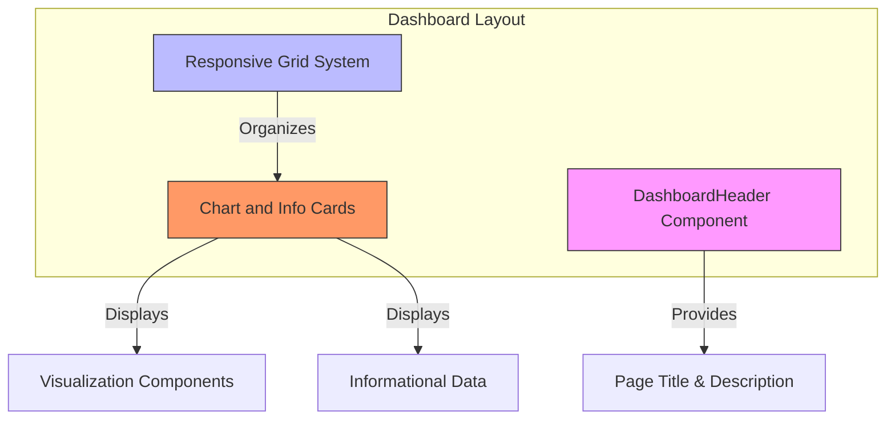
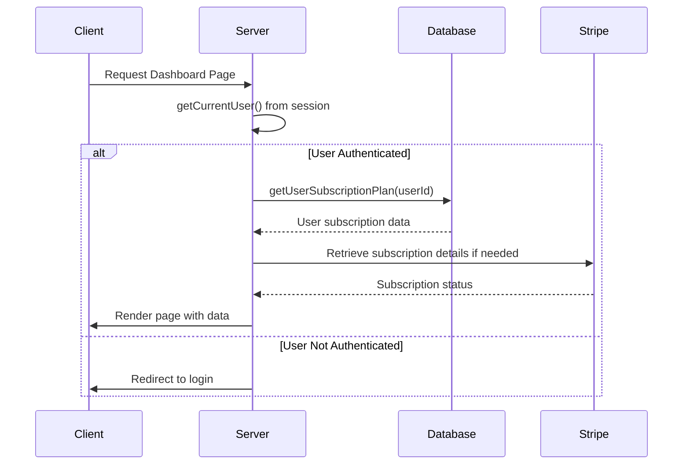
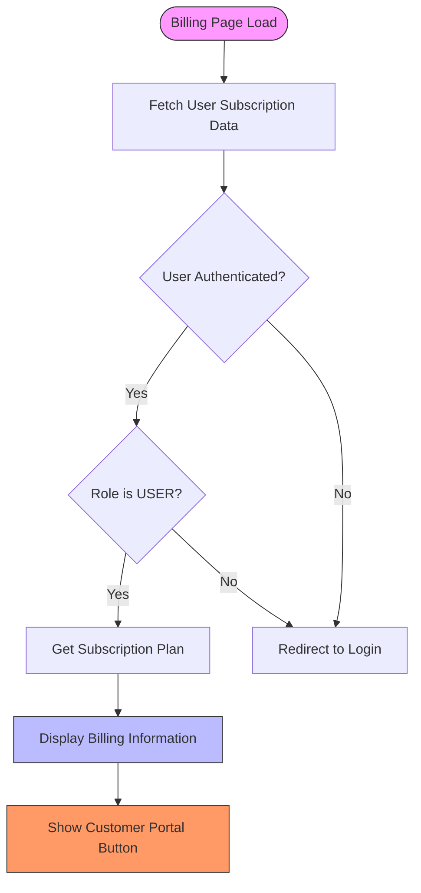
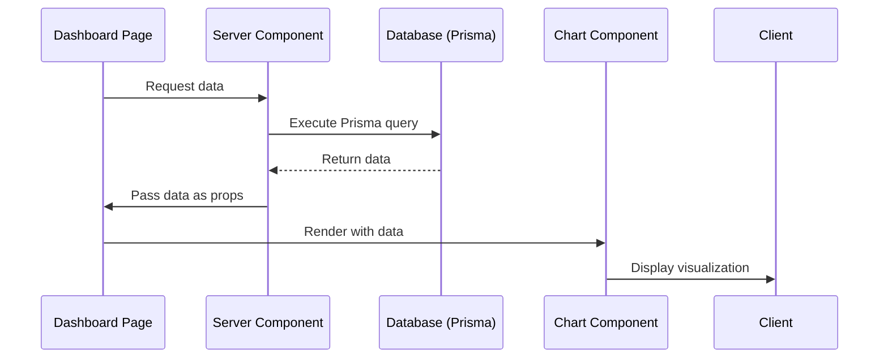
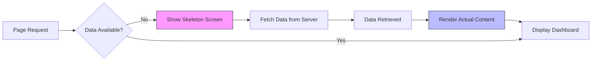

# Dashboard & Analytics

<cite>
**Referenced Files in This Document**   
- [page.tsx](file://app/(protected)/dashboard/page.tsx)
- [charts/page.tsx](file://app/(protected)/dashboard/charts/page.tsx)
- [billing/page.tsx](file://app/(protected)/dashboard/billing/page.tsx)
- [header.tsx](file://components/dashboard/header.tsx)
- [transactions-list.tsx](file://components/dashboard/transactions-list.tsx)
- [info-card.tsx](file://components/dashboard/info-card.tsx)
- [billing-info.tsx](file://components/pricing/billing-info.tsx)
- [area-chart-stacked.tsx](file://components/charts/area-chart-stacked.tsx)
- [bar-chart-mixed.tsx](file://components/charts/bar-chart-mixed.tsx)
- [radial-text-chart.tsx](file://components/charts/radial-text-chart.tsx)
- [radar-chart-simple.tsx](file://components/charts/radar-chart-simple.tsx)
- [radial-chart-grid.tsx](file://components/charts/radial-chart-grid.tsx)
- [radial-shape-chart.tsx](file://components/charts/radial-shape-chart.tsx)
- [line-chart-multiple.tsx](file://components/charts/line-chart-multiple.tsx)
- [radial-stacked-chart.tsx](file://components/charts/radial-stacked-chart.tsx)
- [interactive-bar-chart.tsx](file://components/charts/interactive-bar-chart.tsx)
- [chart.tsx](file://components/ui/chart.tsx)
- [card-skeleton.tsx](file://components/shared/card-skeleton.tsx)
- [section-skeleton.tsx](file://components/shared/section-skeleton.tsx)
- [loading.tsx](file://app/(protected)/dashboard/loading.tsx)
- [charts/loading.tsx](file://app/(protected)/dashboard/charts/loading.tsx)
- [billing/loading.tsx](file://app/(protected)/dashboard/billing/loading.tsx)
- [db.ts](file://lib/db.ts)
- [subscription.ts](file://lib/subscription.ts)
- [session.ts](file://lib/session.ts)
</cite>

## Table of Contents
1. [Introduction](#introduction)
2. [Layout Structure](#layout-structure)
3. [Data Fetching Strategy](#data-fetching-strategy)
4. [Chart Implementation](#chart-implementation)
5. [Billing Information Display](#billing-information-display)
6. [Data Flow from Prisma to Charts](#data-flow-from-prisma-to-charts)
7. [Loading States and Skeleton Screens](#loading-states-and-skeleton-screens)
8. [Responsive Design and Accessibility](#responsive-design-and-accessibility)
9. [Best Practices for Adding New Widgets](#best-practices-for-adding-new-widgets)
10. [Conclusion](#conclusion)

## Introduction
The Dashboard & Analytics interface provides a comprehensive overview of user activity, subscription status, and financial transactions. Built using Next.js Server Components and integrated with Prisma and Stripe, the dashboard offers real-time insights through various visualizations. This document details the implementation of the dashboard's core features, including layout structure, data fetching, chart rendering, and user experience optimizations.

## Layout Structure
The dashboard follows a modular layout structure with consistent header patterns and responsive grid systems. Each dashboard section uses a common header component with dynamic titles and descriptive text. The layout adapts to different screen sizes using Tailwind CSS grid classes that transition from single-column on mobile to multi-column layouts on larger screens.



**Diagram sources**
- [header.tsx](file://components/dashboard/header.tsx#L6-L20)
- [charts/page.tsx](file://app/(protected)/dashboard/charts/page.tsx#L18-L41)

**Section sources**
- [page.tsx](file://app/(protected)/dashboard/page.tsx#L11-L30)
- [header.tsx](file://components/dashboard/header.tsx#L6-L20)

## Data Fetching Strategy
The dashboard leverages Next.js Server Components for efficient data fetching. Authentication state is retrieved using cached session data, while subscription information is fetched directly from the database via Prisma. The data fetching occurs server-side, ensuring sensitive operations remain secure and reducing client-side JavaScript payload.



**Diagram sources**
- [session.ts](file://lib/session.ts#L5-L11)
- [subscription.ts](file://lib/subscription.ts#L7-L64)
- [billing/page.tsx](file://app/(protected)/dashboard/billing/page.tsx#L15-L53)

**Section sources**
- [session.ts](file://lib/session.ts#L5-L11)
- [subscription.ts](file://lib/subscription.ts#L7-L64)
- [db.ts](file://lib/db.ts#L0-L17)

## Chart Implementation
The dashboard implements various chart types using Recharts through the shadcn/ui chart components. Each chart is encapsulated in a reusable component that follows a consistent design pattern with header, content, and footer sections. The charts are styled using CSS variables defined in the chart configuration.

### Chart Types Implemented
- **Stacked Area Chart**: Shows cumulative data across categories over time
- **Mixed Bar Chart**: Displays categorical data with vertical orientation
- **Radial Text Chart**: Features a central text display with radial visualization
- **Radar Chart**: Presents multivariate data in a circular format
- **Interactive Bar Chart**: Allows users to toggle between different data views
- **Multiple Line Chart**: Compares trends across different data series
- **Radial Stacked Chart**: Combines radial visualization with stacked data

```mermaid
classDiagram
class ChartComponent {
+config : ChartConfig
+data : any[]
+render() : JSX.Element
}
class AreaChartStacked {
+chartData : {month, desktop, mobile}[]
+chartConfig : {desktop, mobile}
}
class BarChartMixed {
+chartData : {browser, visitors}[]
+chartConfig : {visitors, browser types}
}
class RadialTextChart {
+chartData : {browser, visitors}[]
+chartConfig : {visitors, browser}
}
class InteractiveBarChart {
+activeChart : string
+total : {desktop, mobile}
+setActiveChart() : void
}
ChartComponent <|-- AreaChartStacked
ChartComponent <|-- BarChartMixed
ChartComponent <|-- RadialTextChart
ChartComponent <|-- InteractiveBarChart
```

**Diagram sources**
- [area-chart-stacked.tsx](file://components/charts/area-chart-stacked.tsx#L40-L100)
- [bar-chart-mixed.tsx](file://components/charts/bar-chart-mixed.tsx#L54-L100)
- [radial-text-chart.tsx](file://components/charts/radial-text-chart.tsx#L35-L106)
- [interactive-bar-chart.tsx](file://components/charts/interactive-bar-chart.tsx#L127-L218)

**Section sources**
- [charts/page.tsx](file://app/(protected)/dashboard/charts/page.tsx#L18-L41)
- [area-chart-stacked.tsx](file://components/charts/area-chart-stacked.tsx#L20-L38)
- [bar-chart-mixed.tsx](file://components/charts/bar-chart-mixed.tsx#L20-L52)
- [chart.tsx](file://components/ui/chart.tsx#L0-L365)

## Billing Information Display
The billing section displays subscription details and transaction information. It retrieves user subscription data from the database and presents it in a structured format with plan details, renewal information, and action buttons for managing the subscription through the Stripe customer portal.



**Diagram sources**
- [billing/page.tsx](file://app/(protected)/dashboard/billing/page.tsx#L15-L53)
- [billing-info.tsx](file://components/pricing/billing-info.tsx#L20-L59)

**Section sources**
- [billing/page.tsx](file://app/(protected)/dashboard/billing/page.tsx#L15-L53)
- [billing-info.tsx](file://components/pricing/billing-info.tsx#L20-L59)
- [subscription.ts](file://lib/subscription.ts#L7-L64)

## Data Flow from Prisma to Charts
The data flow begins with Prisma queries to the database, continues through server-side processing, and ends with client-side chart rendering. Static chart data is defined within each chart component, while dynamic data would follow a similar pattern through server actions.



**Diagram sources**
- [db.ts](file://lib/db.ts#L0-L17)
- [subscription.ts](file://lib/subscription.ts#L7-L64)
- [charts/page.tsx](file://app/(protected)/dashboard/charts/page.tsx#L18-L41)

**Section sources**
- [db.ts](file://lib/db.ts#L0-L17)
- [subscription.ts](file://lib/subscription.ts#L7-L64)
- [area-chart-stacked.tsx](file://components/charts/area-chart-stacked.tsx#L20-L27)
- [interactive-bar-chart.tsx](file://components/charts/interactive-bar-chart.tsx#L19-L111)

## Loading States and Skeleton Screens
The dashboard implements skeleton screens to improve perceived performance during data loading. Each page has a dedicated loading state component that renders placeholder UI elements matching the final layout's dimensions and structure.



**Diagram sources**
- [loading.tsx](file://app/(protected)/dashboard/loading.tsx#L0-L11)
- [charts/loading.tsx](file://app/(protected)/dashboard/charts/loading.tsx#L0-L20)
- [billing/loading.tsx](file://app/(protected)/dashboard/billing/loading.tsx#L0-L18)
- [card-skeleton.tsx](file://components/shared/card-skeleton.tsx#L0-L20)
- [section-skeleton.tsx](file://components/shared/section-skeleton.tsx#L0-L25)

**Section sources**
- [loading.tsx](file://app/(protected)/dashboard/loading.tsx#L0-L11)
- [charts/loading.tsx](file://app/(protected)/dashboard/charts/loading.tsx#L0-L20)
- [billing/loading.tsx](file://app/(protected)/dashboard/billing/loading.tsx#L0-L18)

## Responsive Design and Accessibility
The dashboard components are designed to be responsive across different screen sizes and accessible to all users. Grid layouts adapt from single-column on mobile to multi-column on desktop, and charts include ARIA labels and keyboard navigation support through the underlying Recharts library.

### Responsive Breakpoints
- Mobile: Single column layout
- Tablet: Two-column layout
- Desktop: Four-column layout for charts
- Large screens: Optimized spacing and sizing

### Accessibility Features
- ARIA labels in all chart components
- Semantic HTML structure
- Keyboard navigable interactive elements
- Sufficient color contrast
- Screen reader support for data visualization

**Section sources**
- [charts/page.tsx](file://app/(protected)/dashboard/charts/page.tsx#L18-L41)
- [chart.tsx](file://components/ui/chart.tsx#L0-L365)
- [area-chart-stacked.tsx](file://components/charts/area-chart-stacked.tsx#L40-L100)

## Best Practices for Adding New Widgets
When adding new widgets or metrics to the dashboard, follow these best practices:

1. **Component Structure**: Create new chart components in the `components/charts/` directory following the existing pattern with consistent styling and layout.

2. **Data Configuration**: Define chart data and configuration using the `chartConfig` type for consistent theming and labeling.

3. **Performance**: Use static data for demonstration purposes or server-side data fetching for real data to minimize client-side processing.

4. **Loading States**: Implement corresponding skeleton components and update the loading state for the parent page.

5. **Responsiveness**: Ensure new components work across all breakpoints by testing with different screen sizes.

6. **Accessibility**: Include proper ARIA labels and ensure keyboard navigation works for interactive elements.

7. **Error Handling**: Implement graceful degradation when data is unavailable.

**Section sources**
- [area-chart-stacked.tsx](file://components/charts/area-chart-stacked.tsx#L20-L38)
- [chart.tsx](file://components/ui/chart.tsx#L0-L365)
- [charts/page.tsx](file://app/(protected)/dashboard/charts/page.tsx#L18-L41)

## Conclusion
The Dashboard & Analytics interface provides a robust foundation for data visualization in the application. By leveraging Next.js Server Components, Prisma, and Recharts, it delivers a performant and secure user experience. The modular architecture allows for easy extension with new chart types and data visualizations while maintaining consistency in design and behavior. The implementation of skeleton screens and responsive layouts ensures a smooth user experience across different devices and network conditions.