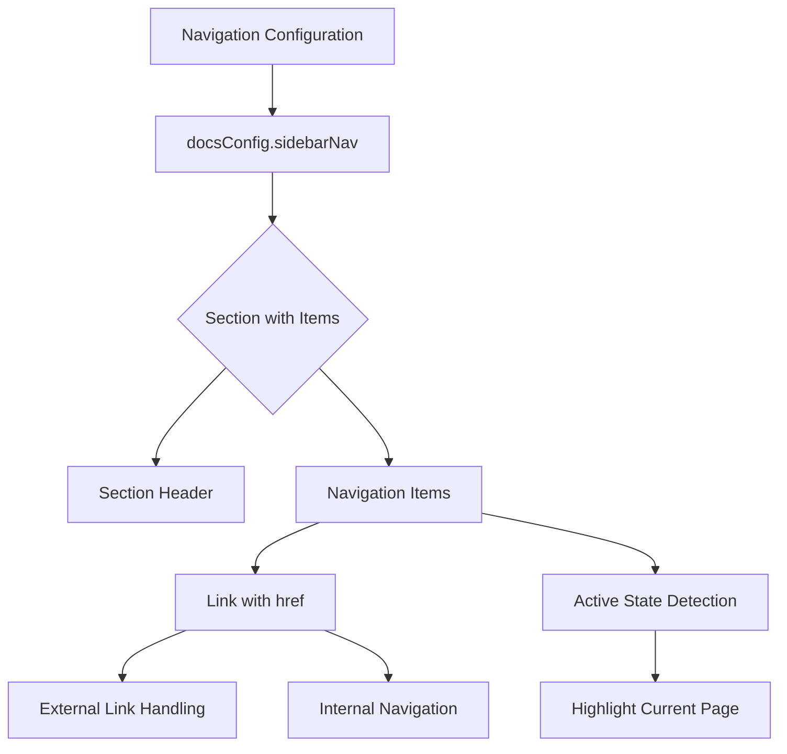
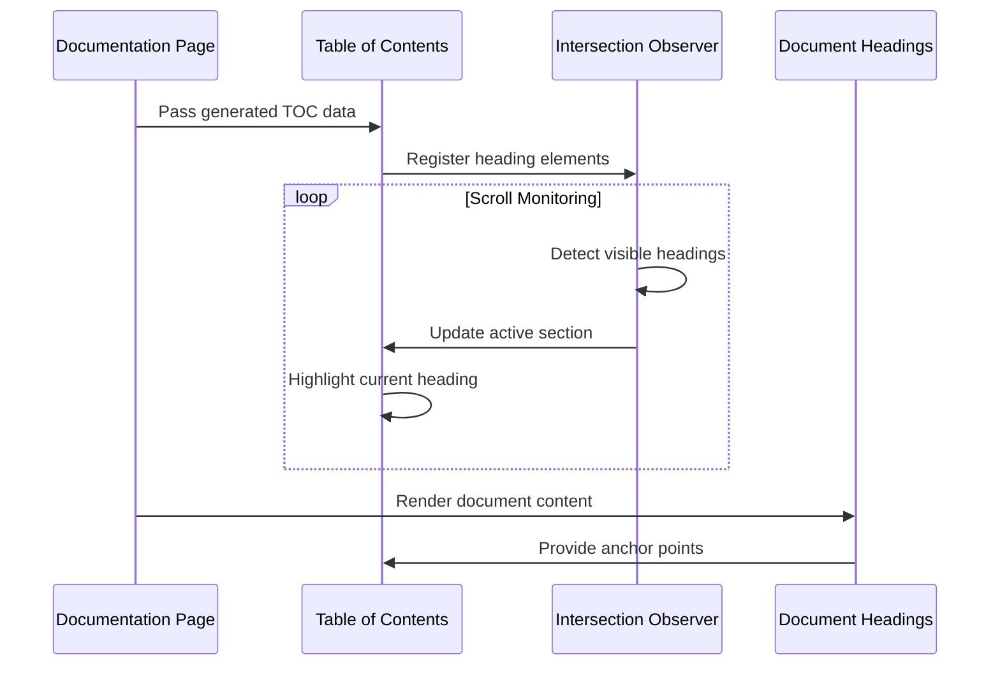
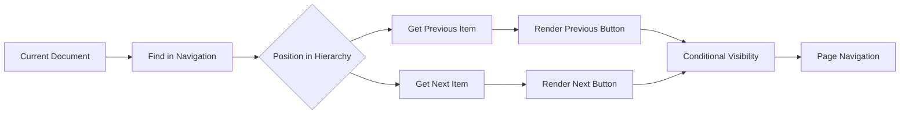

# Documentation Portal

<cite>
**Referenced Files in This Document**   
- [docs.ts](file://config/docs.ts)
- [page.tsx](file://app/(docs)/docs/[[...slug]]/page.tsx)
- [page.tsx](file://app/(docs)/guides/[slug]/page.tsx)
- [mdx-components.tsx](file://components/content/mdx-components.tsx)
- [sidebar-nav.tsx](file://components/docs/sidebar-nav.tsx)
- [pager.tsx](file://components/docs/pager.tsx)
- [toc.ts](file://lib/toc.ts)
- [toc.tsx](file://components/shared/toc.tsx)
- [contentlayer.config.ts](file://contentlayer.config.ts)
</cite>

## Table of Contents
1. [Introduction](#introduction)
2. [Routing Structure](#routing-structure)
3. [MDX Content Processing](#mdx-content-processing)
4. [Sidebar Navigation System](#sidebar-navigation-system)
5. [Table of Contents Implementation](#table-of-contents-implementation)
6. [Search Integration](#search-integration)
7. [Pagination System](#pagination-system)
8. [Adding New Documentation Pages](#adding-new-documentation-pages)
9. [Content Organization and Versioning](#content-organization-and-versioning)
10. [Search Engine Optimization](#search-engine-optimization)
11. [Documentation Style Best Practices](#documentation-style-best-practices)

## Introduction
The Documentation Portal provides a comprehensive system for managing and presenting technical documentation and guides. Built on Next.js with Contentlayer integration, the portal supports MDX-based content with dynamic routing, sidebar navigation, table of contents generation, and pagination. This document details the implementation of key features and provides guidance for maintaining and extending the documentation system.

## Routing Structure
The documentation portal implements a dynamic routing structure using Next.js App Router with two primary content types: documentation and guides. The routing follows a slug-based pattern that enables hierarchical content organization.

The documentation section uses catch-all dynamic routing with the `[[...slug]]` pattern in `app/(docs)/docs/[[...slug]]/page.tsx`, allowing for nested paths like `/docs/configuration/database`. This approach enables deep content hierarchies while maintaining a clean URL structure.

The guides section implements single dynamic routing with `[slug]` in `app/(docs)/guides/[slug]/page.tsx`, supporting flat URL structures for tutorial-style content like `/guides/build-blog-using-contentlayer-mdx`.

Both routes leverage `generateStaticParams` to pre-render all documentation pages at build time, improving performance and SEO. The function retrieves all available documents from Contentlayer's generated types and creates parameter combinations for static generation.

**Section sources**
- [page.tsx](file://app/(docs)/docs/[[...slug]]/page.tsx#L0-L87)
- [page.tsx](file://app/(docs)/guides/[slug]/page.tsx#L0-L83)

## MDX Content Processing
The documentation portal processes MDX content through a comprehensive pipeline that transforms markdown files into interactive web pages with custom components. The system leverages Contentlayer to parse MDX files and generate TypeScript types, ensuring type safety throughout the documentation system.

MDX content is rendered using the `Mdx` component in `components/content/mdx-components.tsx`, which accepts compiled code and renders it with a set of custom components. The component system supports various HTML elements with styled defaults, including headings, code blocks, tables, and images.

Custom components extend the basic MDX functionality:
- `Callout` for highlighting important information
- `MdxCard` for content grouping
- `Step` and `Steps` for procedural guides
- `LinkedCard` for navigational elements
- `CopyButton` for code snippets

Image processing includes automatic blurDataURL generation for placeholder effects during loading. The system extracts image sources from the MDX content and pre-processes them to create low-quality image placeholders that enhance perceived performance.

The MDX processing pipeline in `contentlayer.config.ts` includes several rehype plugins:
- `rehype-slug` for generating anchor IDs from headings
- `rehype-autolink-headings` for adding permalink anchors to headings
- `rehype-pretty-code` for syntax highlighting with GitHub Dark theme
- `remark-gfm` for GitHub-flavored markdown support

**Section sources**
- [mdx-components.tsx](file://components/content/mdx-components.tsx#L0-L237)
- [contentlayer.config.ts](file://contentlayer.config.ts#L0-L201)

## Sidebar Navigation System
The sidebar navigation system provides structured access to documentation content through a configurable hierarchy defined in `config/docs.ts`. The system implements a two-level navigation structure with section headers and individual page links.

The navigation configuration follows a consistent interface with `mainNav` for top-level navigation and `sidebarNav` for the hierarchical sidebar content. Each navigation item includes a title and href, with optional disabled states for placeholder entries.

The `DocsSidebarNav` component renders the navigation structure by mapping through the configured items and generating appropriate HTML elements. Section headers are displayed as titled groups, with nested items rendered as clickable links. The current page is highlighted through CSS classes that detect the active pathname.

Navigation items support external links through the `external` property, which adds appropriate target and rel attributes. Disabled items are rendered with reduced opacity and cursor styles to indicate non-interactivity.

The sidebar maintains its state and scroll position through client-side rendering, ensuring a smooth user experience when navigating between documentation pages.

**Diagram sources**
- [docs.ts](file://config/docs.ts#L0-L70)
- [sidebar-nav.tsx](file://components/docs/sidebar-nav.tsx#L0-L81)

**Section sources**
- [docs.ts](file://config/docs.ts#L0-L70)
- [sidebar-nav.tsx](file://components/docs/sidebar-nav.tsx#L0-L81)

## Table of Contents Implementation
The table of contents (TOC) system automatically generates a navigable outline from document headings, providing users with an overview of content structure and quick navigation to specific sections.

The TOC generation process begins with `lib/toc.ts`, which uses remark and mdast-util-toc to parse the raw MDX content and extract heading structure. The `getTableOfContents` function processes the content string and returns a structured object representing the document's hierarchy.

The `DashboardTableOfContents` component in `components/shared/toc.tsx` renders the generated TOC with client-side interactivity. It implements intersection observers to track which heading is currently in view, automatically highlighting the active section in the TOC.

The TOC displays up to two levels of hierarchy, with first and second-level headings rendered as nested lists. The component is conditionally rendered only on larger screens (hidden on mobile), preserving screen space for content on smaller devices.

Active section detection uses a 20% threshold from the bottom of the viewport, ensuring that the TOC updates as users scroll through content. The implementation handles edge cases such as multiple headings with the same text by using unique IDs generated from the heading content.

**Diagram sources**
- [toc.ts](file://lib/toc.ts#L0-L79)
- [toc.tsx](file://components/shared/toc.tsx#L0-L113)

**Section sources**
- [toc.ts](file://lib/toc.ts#L0-L79)
- [toc.tsx](file://components/shared/toc.tsx#L0-L113)
- [page.tsx](file://app/(docs)/docs/[[...slug]]/page.tsx#L0-L87)

## Search Integration
The documentation portal includes a search interface component, though the backend search functionality is currently not implemented. The `DocsSearch` component provides a client-side search input with visual feedback and keyboard shortcut indication.

The search component renders an input field with placeholder text and a ⌘K keyboard shortcut indicator, following common documentation site patterns. When submitted, the form triggers a toast notification indicating that search is not yet implemented, providing user feedback while the feature is under development.

The search UI is integrated into the main navigation layout, appearing in the header for documentation pages. It's hidden on mobile views, with a search icon placeholder instead, maintaining a clean interface across device sizes.

Future implementation would likely integrate with a full-text search service or implement client-side search across pre-loaded documentation metadata.

**Section sources**
- [search.tsx](file://components/docs/search.tsx#L0-L37)
- [navbar.tsx](file://components/layout/navbar.tsx#L79-L100)

## Pagination System
The pagination system provides sequential navigation between documentation pages based on the sidebar navigation order. Implemented in `components/docs/pager.tsx`, the system generates "Previous" and "Next" buttons that follow the logical flow of the documentation.

The `DocsPager` component determines the current document's position within the flattened sidebar navigation structure and identifies adjacent pages. It uses the `getPagerForDoc` function to find the previous and next items in the navigation hierarchy, creating a linear path through the documentation.

The pager displays navigation buttons with chevron icons and page titles, providing clear visual cues for direction. When on the first page, only the "Next" button appears; when on the last page, only the "Previous" button appears. The buttons are styled as outline variants to maintain visual consistency with the design system.

The pagination logic handles edge cases such as disabled navigation items and ensures that only published, accessible pages are included in the navigation flow.

**Diagram sources**
- [pager.tsx](file://components/docs/pager.tsx#L0-L64)

**Section sources**
- [pager.tsx](file://components/docs/pager.tsx#L0-L64)
- [page.tsx](file://app/(docs)/docs/[[...slug]]/page.tsx#L0-L87)

## Adding New Documentation Pages
Adding new documentation pages follows a structured content layer approach using MDX files in designated directories. The system automatically discovers and renders new content through Contentlayer's file-based sourcing.

To add a new documentation page:
1. Create an MDX file in the `content/docs/` directory or its subdirectories
2. Include required frontmatter with title and description
3. Write content using markdown and supported MDX components
4. Ensure the file has a `.mdx` extension

The `contentlayer.config.ts` file defines the `Doc` document type with a `filePathPattern` of `docs/**/*.mdx`, which recursively includes all MDX files in the docs directory and its subfolders. The system automatically generates slugs based on the file path, with `slugAsParams` used for routing parameters.

For guides, create MDX files in the `content/guides/` directory following the same pattern. Guides include additional frontmatter fields such as date, authors, and featured status.

The computed fields in Contentlayer automatically generate:
- `slug`: Full path including leading slash
- `slugAsParams`: Path segments joined by slashes (used in routing)
- `images`: Array of image sources extracted from Image components

After adding new content, rebuild the application to regenerate the Contentlayer types and static paths.

**Section sources**
- [contentlayer.config.ts](file://contentlayer.config.ts#L0-L201)
- [page.tsx](file://app/(docs)/docs/[[...slug]]/page.tsx#L0-L87)
- [page.tsx](file://app/(docs)/guides/[slug]/page.tsx#L0-L83)

## Content Organization and Versioning
The documentation portal follows a hierarchical content organization strategy with clear separation between different content types. The structure uses dedicated directories for different content categories:

- `content/docs/` - Core documentation and reference materials
- `content/guides/` - Tutorial-style content and how-to articles
- `content/blog/` - News and educational articles
- `content/pages/` - Static pages like terms and privacy

This separation enables different content types to have distinct metadata requirements and rendering patterns while maintaining a consistent overall structure.

The system supports content versioning through file path organization, allowing for version-specific documentation by creating subdirectories like `docs/v1/` and `docs/v2/`. The routing system naturally supports this hierarchy, creating URLs that reflect the version.

Content visibility is controlled through the `published` field in the document frontmatter, allowing authors to draft content without making it publicly accessible. This supports a content review workflow before publication.

The navigation configuration in `config/docs.ts` serves as the authoritative source for content discoverability, with the sidebar structure determining which pages appear in the main navigation.

**Section sources**
- [contentlayer.config.ts](file://contentlayer.config.ts#L0-L201)
- [docs.ts](file://config/docs.ts#L0-L70)

## Search Engine Optimization
The documentation portal implements several SEO best practices to ensure content is discoverable and properly indexed by search engines.

Each documentation page generates dynamic metadata through the `generateMetadata` function, which creates unique titles and descriptions for every page. The title follows a consistent pattern of "Page Title – SaaS Starter", balancing specificity with brand recognition.

The metadata system uses the `constructMetadata` utility to generate comprehensive meta tags, including:
- Title and description tags
- Open Graph metadata for social sharing
- Twitter card information
- Canonical URLs
- Robots directives

The static generation approach ensures that all documentation pages are pre-rendered as HTML, providing search engines with fully formed content rather than requiring JavaScript execution. This improves crawlability and indexing speed.

Semantic HTML structure with proper heading levels (h1, h2, h3) helps search engines understand content hierarchy and importance. The automatic slug generation creates clean, readable URLs that include relevant keywords.

Image optimization includes blurDataURL placeholders and proper alt text handling, contributing to better page experience metrics that influence search rankings.

**Section sources**
- [page.tsx](file://app/(docs)/docs/[[...slug]]/page.tsx#L0-L87)
- [page.tsx](file://app/(docs)/guides/[slug]/page.tsx#L0-L83)
- [utils.ts](file://lib/utils.ts)

## Documentation Style Best Practices
Maintaining consistent documentation style and structure ensures a cohesive user experience across all content. The following best practices are recommended for contributors:

**Content Structure**
- Use a clear hierarchy with descriptive headings
- Follow the inverted pyramid approach: most important information first
- Keep paragraphs short (3-4 sentences maximum)
- Use bullet points for lists of three or more items
- Include a brief summary at the beginning of longer guides

**Writing Style**
- Use active voice and present tense
- Address the reader as "you" for direct engagement
- Avoid jargon when simpler terms suffice
- Define technical terms on first use
- Use consistent terminology throughout

**Code Documentation**
- Include complete, runnable code examples
- Add comments to explain non-obvious logic
- Show both the code and its expected output
- Use the `Callout` component for important notes
- Highlight breaking changes or deprecations

**Visual Elements**
- Use images sparingly and only when they add value
- Ensure all images have descriptive alt text
- Use the `MdxCard` component to group related content
- Apply the `Steps` component for procedural guides
- Include appropriate whitespace between sections

**Navigation and Discoverability**
- Ensure all new content is added to the sidebar configuration
- Use consistent title capitalization in navigation
- Consider the logical flow when ordering content
- Cross-link related topics using inline links
- Update the table of contents when adding major sections

Following these practices ensures that documentation remains accessible, maintainable, and valuable to users across different skill levels.

**Section sources**
- [mdx-components.tsx](file://components/content/mdx-components.tsx#L0-L237)
- [docs.ts](file://config/docs.ts#L0-L70)
- [contentlayer.config.ts](file://contentlayer.config.ts#L0-L201)