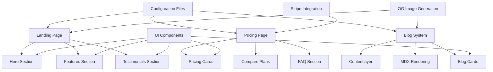
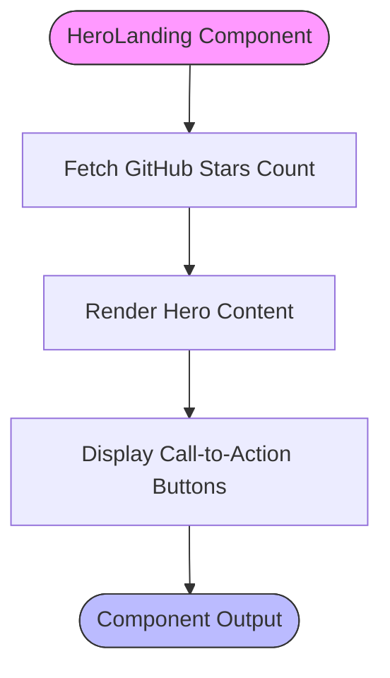
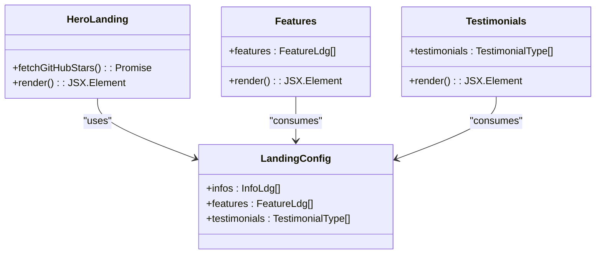
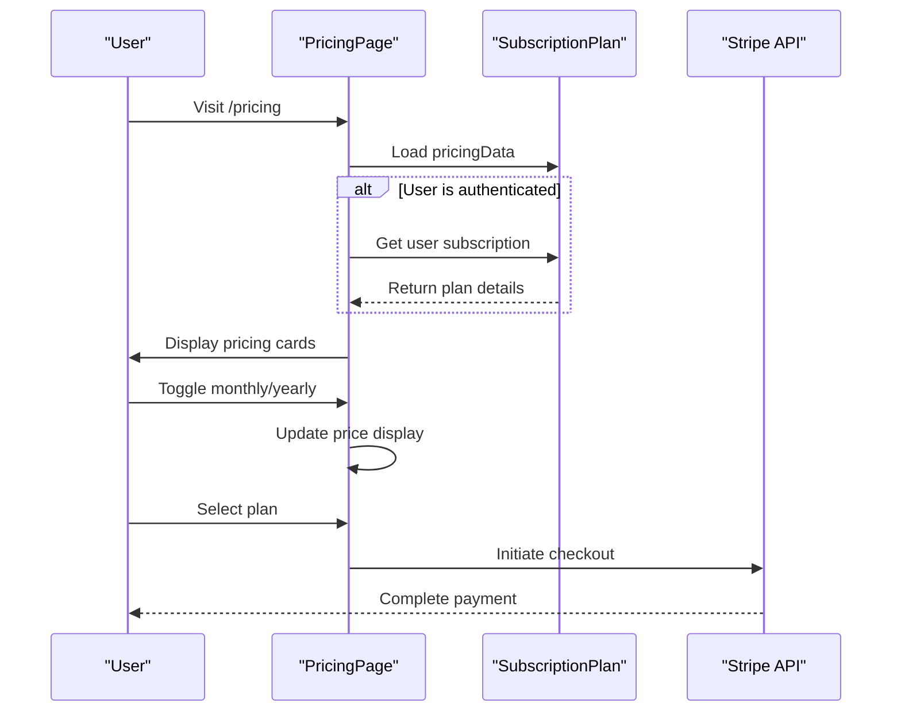
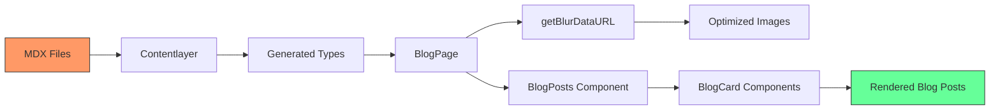

# Marketing Pages

<cite>
**Referenced Files in This Document**   
- [page.tsx](file://app/(marketing)/page.tsx)
- [pricing/page.tsx](file://app/(marketing)/pricing/page.tsx)
- [blog/page.tsx](file://app/(marketing)/blog/page.tsx)
- [landing.ts](file://config/landing.ts)
- [marketing.ts](file://config/marketing.ts)
- [subscriptions.ts](file://config/subscriptions.ts)
- [pricing-cards.tsx](file://components/pricing/pricing-cards.tsx)
- [blog-posts.tsx](file://components/content/blog-posts.tsx)
- [blog-card.tsx](file://components/content/blog-card.tsx)
- [contentlayer.config.ts](file://contentlayer.config.ts)
- [hero-landing.tsx](file://components/sections/hero-landing.tsx)
- [features.tsx](file://components/sections/features.tsx)
- [testimonials.tsx](file://components/sections/testimonials.tsx)
- [route.tsx](file://app/api/og/route.tsx)
</cite>

## Table of Contents
1. [Introduction](#introduction)
2. [Project Structure](#project-structure)
3. [Core Components](#core-components)
4. [Architecture Overview](#architecture-overview)
5. [Detailed Component Analysis](#detailed-component-analysis)
6. [Dependency Analysis](#dependency-analysis)
7. [Performance Considerations](#performance-considerations)
8. [Troubleshooting Guide](#troubleshooting-guide)
9. [Conclusion](#conclusion)

## Introduction
This document provides a comprehensive overview of the marketing pages implementation in the Next SaaS Stripe Starter application. It details the architecture and functionality of the landing page, pricing page, and blog section, focusing on dynamic content configuration, UI composition, and integration with external services like Stripe. The documentation covers content modeling, SEO strategies, and customization approaches for marketing content.

## Project Structure
The marketing pages are organized under the `(marketing)` route group in the `app` directory, following Next.js App Router conventions. This structure separates marketing content from authenticated and protected routes, enabling independent routing and layout management.

```mermaid
graph TB
subgraph "Marketing Routes"
A[/(marketing)] --> B[/pricing]
A --> C[/blog]
A --> D[/[slug]]
A --> E[/blog/[slug]]
end
subgraph "Configuration"
F[config/] --> G[landing.ts]
F --> H[marketing.ts]
F --> I[subscriptions.ts]
end
subgraph "Components"
J[components/sections] --> K[hero-landing.tsx]
J --> L[features.tsx]
J --> M[testimonials.tsx]
N[components/pricing] --> O[pricing-cards.tsx]
P[components/content] --> Q[blog-posts.tsx]
P --> R[blog-card.tsx]
end
A --> J
B --> N
C --> P
F --> A
F --> B
```

**Diagram sources**
- [app/(marketing)/page.tsx](file://app/(marketing)/page.tsx#L1-L24)
- [config/landing.ts](file://config/landing.ts#L1-L151)
- [components/sections/hero-landing.tsx](file://components/sections/hero-landing.tsx#L1-L96)

**Section sources**
- [app/(marketing)/page.tsx](file://app/(marketing)/page.tsx#L1-L24)
- [config/landing.ts](file://config/landing.ts#L1-L151)

## Core Components
The marketing pages are built using a component-based architecture that separates concerns between content configuration, UI presentation, and business logic. Key components include the landing page sections, pricing cards system, and blog content renderer, all driven by configuration files in the `config/` directory.

**Section sources**
- [app/(marketing)/page.tsx](file://app/(marketing)/page.tsx#L1-L24)
- [components/sections/hero-landing.tsx](file://components/sections/hero-landing.tsx#L1-L96)

## Architecture Overview
The marketing pages architecture follows a configuration-driven approach where content is defined in TypeScript configuration files and consumed by reusable UI components. This separation enables easy customization without modifying component logic. The system integrates Contentlayer for blog content management, Stripe for subscription handling, and Vercel OG for dynamic image generation.



**Diagram sources**
- [config/landing.ts](file://config/landing.ts#L1-L151)
- [config/subscriptions.ts](file://config/subscriptions.ts#L1-L164)
- [contentlayer.config.ts](file://contentlayer.config.ts#L1-L202)

## Detailed Component Analysis

### Landing Page Implementation
The landing page is composed of multiple reusable sections that are configured through the `config/landing.ts` file. Each section receives its content from this configuration, enabling easy updates without code changes.

#### Hero Section
The hero section displays the main value proposition with dynamic GitHub star count fetching. It includes call-to-action buttons for pricing and GitHub repository.



**Diagram sources**
- [components/sections/hero-landing.tsx](file://components/sections/hero-landing.tsx#L1-L96)
- [app/(marketing)/page.tsx](file://app/(marketing)/page.tsx#L1-L24)

#### Features and Testimonials
The features and testimonials sections consume data from the `config/landing.ts` file, mapping configuration objects to UI components. This approach allows for easy content updates and reordering.



**Diagram sources**
- [config/landing.ts](file://config/landing.ts#L1-L151)
- [components/sections/features.tsx](file://components/sections/features.tsx#L1-L65)
- [components/sections/testimonials.tsx](file://components/sections/testimonials.tsx#L1-L53)

**Section sources**
- [config/landing.ts](file://config/landing.ts#L1-L151)
- [components/sections/features.tsx](file://components/sections/features.tsx#L1-L65)

### Pricing Page and Stripe Integration
The pricing page implements a subscription management system integrated with Stripe, allowing users to select and purchase plans. The pricing data is configured in `config/subscriptions.ts` and rendered by the `PricingCards` component.

#### Pricing Card System
The pricing card system dynamically renders subscription plans based on configuration, handling both monthly and yearly billing cycles with discount calculations.



**Diagram sources**
- [app/(marketing)/pricing/page.tsx](file://app/(marketing)/pricing/page.tsx#L1-L58)
- [components/pricing/pricing-cards.tsx](file://components/pricing/pricing-cards.tsx#L1-L194)
- [config/subscriptions.ts](file://config/subscriptions.ts#L1-L164)

### Blog Architecture with Contentlayer
The blog system uses Contentlayer to transform MDX files into TypeScript types, enabling type-safe content management. The blog pages are statically generated with dynamic data fetching for performance optimization.

#### Content Processing Flow
The blog content flows from MDX files through Contentlayer to the frontend components, with image optimization and metadata generation.



**Diagram sources**
- [contentlayer.config.ts](file://contentlayer.config.ts#L1-L202)
- [app/(marketing)/blog/page.tsx](file://app/(marketing)/blog/page.tsx#L1-L24)
- [components/content/blog-posts.tsx](file://components/content/blog-posts.tsx#L1-L24)

## Dependency Analysis
The marketing pages have well-defined dependencies between configuration, components, and external services. The architecture minimizes coupling while maintaining flexibility for content updates.

```mermaid
dependencyDiagram
config/landing.ts --> components/sections/hero-landing.tsx
config/landing.ts --> components/sections/features.tsx
config/landing.ts --> components/sections/testimonials.tsx
config/subscriptions.ts --> components/pricing/pricing-cards.tsx
config/marketing.ts --> app/(marketing)/layout.tsx
contentlayer.config.ts --> app/(marketing)/blog/page.tsx
app/api/og/route.tsx --> components/sections/hero-landing.tsx
app/api/og/route.tsx --> app/(marketing)/blog/page.tsx
```

**Diagram sources**
- [config/landing.ts](file://config/landing.ts#L1-L151)
- [config/subscriptions.ts](file://config/subscriptions.ts#L1-L164)
- [config/marketing.ts](file://config/marketing.ts#L1-L19)

**Section sources**
- [config/landing.ts](file://config/landing.ts#L1-L151)
- [config/subscriptions.ts](file://config/subscriptions.ts#L1-L164)

## Performance Considerations
The marketing pages are optimized for performance through static generation, image optimization, and efficient data fetching. The landing page uses incremental static regeneration for the GitHub star count, while blog content is pre-generated at build time.

The pricing page implements client-side interactivity only where necessary, keeping the initial load lightweight. Blog images are processed with blur-up placeholders and responsive sizing to improve perceived performance.

## Troubleshooting Guide
When customizing marketing pages, ensure that configuration files maintain the expected TypeScript interfaces. For blog content issues, verify that MDX files follow the required frontmatter structure defined in `contentlayer.config.ts`.

If pricing plans are not displaying correctly, check that the Stripe plan IDs in environment variables match those referenced in `config/subscriptions.ts`. For OG image generation problems, ensure the API route has access to the required font files and GitHub avatar URLs.

**Section sources**
- [contentlayer.config.ts](file://contentlayer.config.ts#L1-L202)
- [app/api/og/route.tsx](file://app/api/og/route.tsx#L1-L159)
- [config/subscriptions.ts](file://config/subscriptions.ts#L1-L164)

## Conclusion
The marketing pages implementation provides a flexible, configuration-driven architecture that separates content from presentation. By leveraging Contentlayer for blog management, Stripe for subscriptions, and a component-based UI system, the solution enables easy customization and maintenance. The architecture supports SEO optimization, performance best practices, and seamless integration with external services, making it suitable for production SaaS applications.