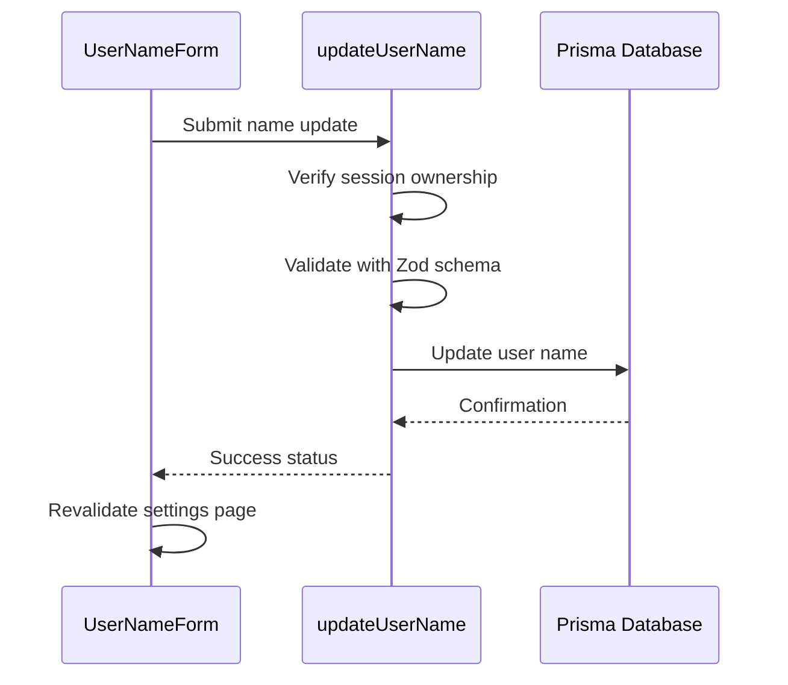
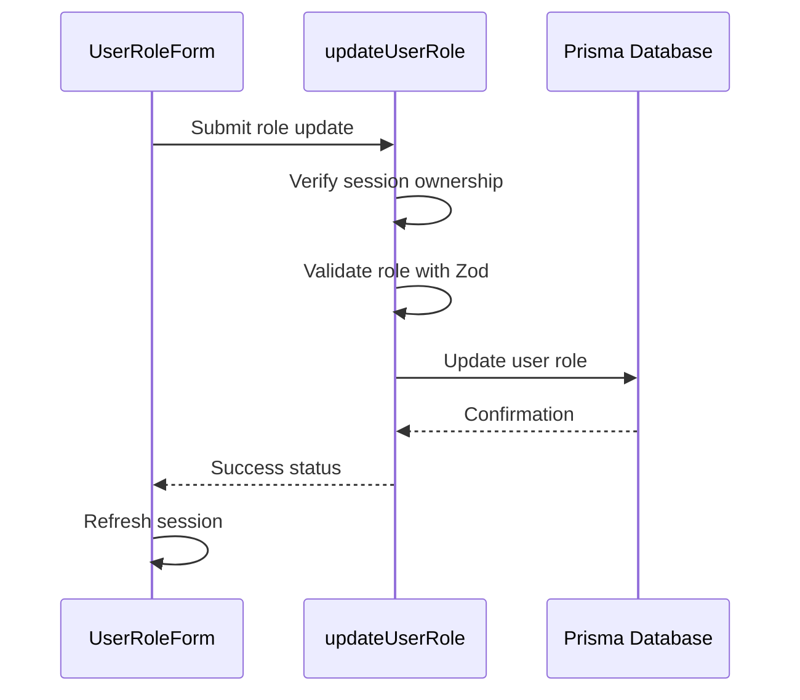
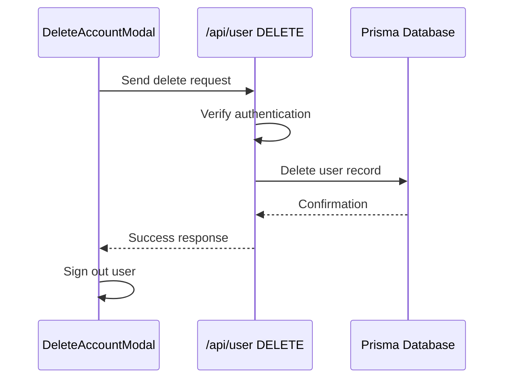
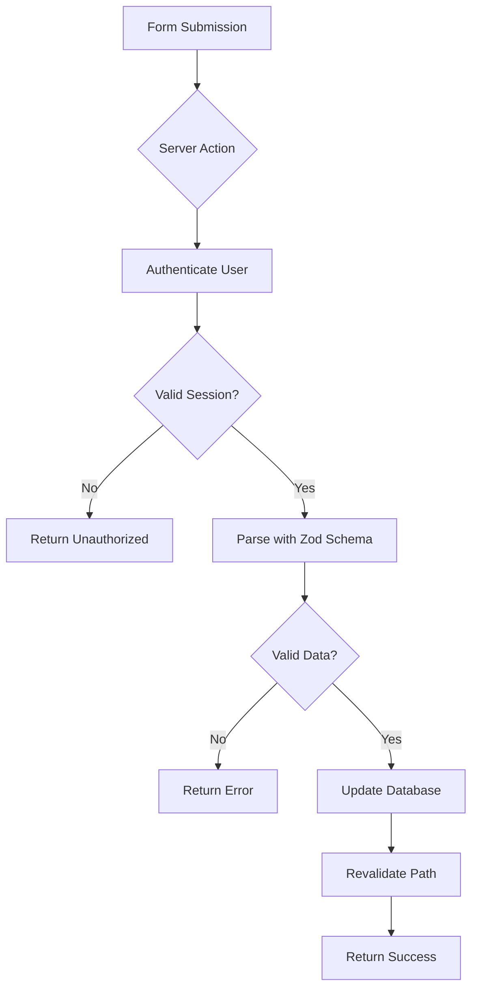

# User Management

<cite>
**Referenced Files in This Document**   
- [update-user-name.ts](file://actions/update-user-name.ts)
- [update-user-role.ts](file://actions/update-user-role.ts)
- [user-name-form.tsx](file://components/forms/user-name-form.tsx)
- [user-role-form.tsx](file://components/forms/user-role-form.tsx)
- [delete-account-modal.tsx](file://components/modals/delete-account-modal.tsx)
- [user.ts](file://lib/validations/user.ts)
- [route.ts](file://app/api/user/route.ts)
</cite>

## Table of Contents
1. [Profile Editing](#profile-editing)
2. [Role Management](#role-management)
3. [Account Deletion](#account-deletion)
4. [Server Actions and Validation](#server-actions-and-validation)
5. [Form Components and UI State](#form-components-and-ui-state)
6. [Common Issues and Troubleshooting](#common-issues-and-troubleshooting)
7. [Extending the User Schema](#extending-the-user-schema)

## Profile Editing

The profile editing functionality allows authenticated users to update their display name through a secure form interface. The implementation uses React Hook Form for state management and integrates with a Server Action to persist changes to the database.

The frontend form validates input length (minimum 3, maximum 32 characters) and only enables the save button when changes are detected. Upon submission, the form triggers a Server Action that performs authentication checks and data validation before updating the user record.



**Diagram sources**
- [user-name-form.tsx](file://components/forms/user-name-form.tsx#L1-L102)
- [update-user-name.ts](file://actions/update-user-name.ts#L1-L37)

**Section sources**
- [user-name-form.tsx](file://components/forms/user-name-form.tsx#L1-L102)
- [update-user-name.ts](file://actions/update-user-name.ts#L1-L37)

## Role Management

Role management enables users to change their role within the application, primarily for testing purposes. The feature is implemented using React Hook Form with Zod validation and a dedicated Server Action for secure data mutation.

The role selection uses a dropdown interface with all available roles from the UserRole enum. The form tracks changes and only enables submission when a different role is selected. After successful update, the session is refreshed to reflect the new role in the UI.



**Diagram sources**
- [user-role-form.tsx](file://components/forms/user-role-form.tsx#L1-L133)
- [update-user-role.ts](file://actions/update-user-role.ts#L1-L40)

**Section sources**
- [user-role-form.tsx](file://components/forms/user-role-form.tsx#L1-L133)
- [update-user-role.ts](file://actions/update-user-role.ts#L1-L40)

## Account Deletion

Account deletion is a destructive operation that permanently removes a user's account and associated subscription. The implementation includes a confirmation modal that requires the user to type "confirm delete account" to proceed, preventing accidental deletions.

The deletion process is handled through an API route that verifies authentication before removing the user record from the database. After successful deletion, the user is signed out and redirected to the homepage.



**Diagram sources**
- [delete-account-modal.tsx](file://components/modals/delete-account-modal.tsx#L1-L135)
- [route.ts](file://app/api/user/route.ts#L1-L26)

**Section sources**
- [delete-account-modal.tsx](file://components/modals/delete-account-modal.tsx#L1-L135)
- [route.ts](file://app/api/user/route.ts#L1-L26)

## Server Actions and Validation

Server Actions provide a secure way to handle data mutations with built-in authentication and validation. The user management system uses two primary Server Actions: `updateUserName` and `updateUserRole`, both located in the actions directory.

Each Server Action follows a consistent pattern:
1. Verify the current session and ensure the user owns the resource
2. Validate input data using Zod schemas from `lib/validations/user.ts`
3. Perform the database update using Prisma
4. Revalidate relevant paths to update cached data
5. Return a status object indicating success or failure

The validation schemas are defined using Zod and imported into both the frontend forms and Server Actions, ensuring consistent validation rules across the stack.



**Diagram sources**
- [update-user-name.ts](file://actions/update-user-name.ts#L1-L37)
- [update-user-role.ts](file://actions/update-user-role.ts#L1-L40)
- [user.ts](file://lib/validations/user.ts#L1-L10)

**Section sources**
- [update-user-name.ts](file://actions/update-user-name.ts#L1-L37)
- [update-user-role.ts](file://actions/update-user-role.ts#L1-L40)
- [user.ts](file://lib/validations/user.ts#L1-L10)

## Form Components and UI State

The user management forms are built using React Hook Form with Zod resolver for validation. Each form component manages several UI states:
- `updated`: Tracks whether the current form values differ from the initial values
- `isPending`: Indicates when a Server Action is in progress
- Form errors: Displayed below input fields when validation fails

The forms integrate with Sonner for toast notifications, providing feedback on operation success or failure. They also use Next.js `useTransition` for smooth loading states during Server Action execution.

Both forms are wrapped in SectionColumns components that provide consistent styling and layout across the settings page. The name form uses a simple input field, while the role form uses a Select component from the UI library.

**Section sources**
- [user-name-form.tsx](file://components/forms/user-name-form.tsx#L1-L102)
- [user-role-form.tsx](file://components/forms/user-role-form.tsx#L1-L133)
- [ui/form.tsx](file://components/ui/form.tsx)
- [ui/select.tsx](file://components/ui/select.tsx)

## Common Issues and Troubleshooting

### Form Submission Errors
Form submissions may fail due to:
- Invalid session (user not authenticated)
- Validation errors (name too short/long, invalid role)
- Database connection issues

The system handles these by returning a status object and displaying appropriate toast notifications. Ensure the Zod schema in `lib/validations/user.ts` matches the expected data types.

### Role Permission Conflicts
The role management form includes a known issue where the Select component's value doesn't update properly. This is temporarily mitigated by using useState to track the role value independently of the form state.

For production applications, consider implementing role-based access control that validates role changes against permission policies and prevents unauthorized role assignments.

### Session Synchronization
After successful updates, the `useSession().update()` method is called to refresh the session data. This ensures that UI elements that depend on user data (like avatars or role badges) display the updated information.

If session data appears stale, verify that:
- The Server Action returns success status
- `update()` is called in the form's success handler
- The relevant paths are properly revalidated

**Section sources**
- [user-name-form.tsx](file://components/forms/user-name-form.tsx#L1-L102)
- [user-role-form.tsx](file://components/forms/user-role-form.tsx#L1-L133)
- [update-user-name.ts](file://actions/update-user-name.ts#L1-L37)
- [update-user-role.ts](file://actions/update-user-role.ts#L1-L40)

## Extending the User Schema

To extend the user schema with custom profile fields:

1. **Update the Prisma schema**: Add new fields to the User model in `prisma/schema.prisma`
2. **Generate migration**: Run `npx prisma migrate dev` to create and apply the migration
3. **Update validation schemas**: Add new field validations in `lib/validations/user.ts`
4. **Create new Server Actions**: Implement actions for updating the new fields
5. **Build form components**: Create new form components using the same patterns

For example, to add a bio field:
```ts
// In lib/validations/user.ts
export const userBioSchema = z.object({
  bio: z.string().max(500).optional()
});
```

Then create a corresponding Server Action and form component following the existing patterns. Ensure all new Server Actions include proper authentication checks and path revalidation.

**Section sources**
- [user.ts](file://lib/validations/user.ts#L1-L10)
- [update-user-name.ts](file://actions/update-user-name.ts#L1-L37)
- [prisma/migrations/0_init/migration.sql](file://prisma/migrations/0_init/migration.sql#L1-L32)