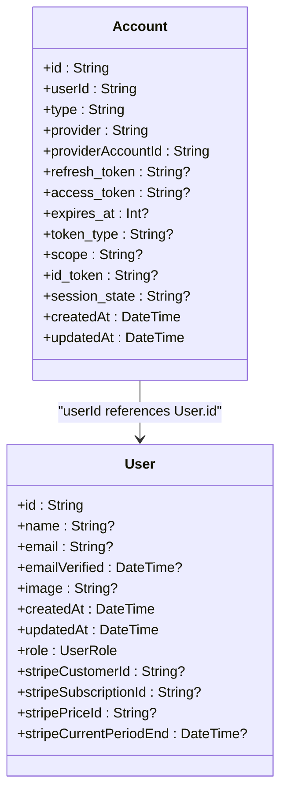
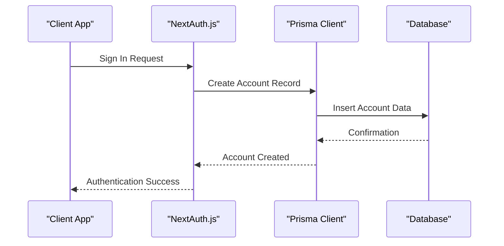

# Account Model

<cite>
**Referenced Files in This Document**   
- [prisma/schema.prisma](file://prisma/schema.prisma)
- [auth.ts](file://auth.ts)
- [types/next-auth.d.ts](file://types/next-auth.d.ts)
- [prisma/migrations/0_init/migration.sql](file://prisma/migrations/0_init/migration.sql)
</cite>

## Table of Contents
1. [Introduction](#introduction)
2. [Account Model Fields](#account-model-fields)
3. [Relationship with User Model](#relationship-with-user-model)
4. [OAuth Provider Information Storage](#oauth-provider-information-storage)
5. [Token Management](#token-management)
6. [Query Examples](#query-examples)
7. [Security Considerations](#security-considerations)
8. [Integration with NextAuth.js](#integration-with-nextauthjs)
9. [Conclusion](#conclusion)

## Introduction
The Account model in the Prisma schema is a critical component of the authentication system, designed to store OAuth provider information and enable multi-provider authentication. This model supports various OAuth providers such as Google, GitHub, and others, allowing users to sign in using their existing accounts from these services. The model is structured to securely store authentication tokens and related metadata, facilitating seamless user experiences across different platforms.

**Section sources**
- [prisma/schema.prisma](file://prisma/schema.prisma#L15-L37)

## Account Model Fields
The Account model includes several fields that capture essential information about the user's account with an OAuth provider:

- **id**: A unique identifier for the account, generated using `cuid()`.
- **userId**: A string that references the user associated with this account.
- **type**: The type of authentication (e.g., oauth, email).
- **provider**: The name of the OAuth provider (e.g., google, github).
- **providerAccountId**: The unique identifier for the user within the OAuth provider.
- **refresh_token**: An optional string storing the refresh token, marked with `@db.Text` for large text storage.
- **access_token**: An optional string storing the access token, also marked with `@db.Text`.
- **expires_at**: An optional integer indicating when the access token expires.
- **token_type**: An optional string describing the type of token.
- **scope**: An optional string defining the scope of access granted by the token.
- **id_token**: An optional string storing the ID token, marked with `@db.Text`.
- **session_state**: An optional string for managing session state.
- **createdAt** and **updatedAt**: Timestamps for when the account was created and last updated, respectively.

These fields collectively provide a comprehensive record of the user's authentication details with external providers.

**Section sources**
- [prisma/schema.prisma](file://prisma/schema.prisma#L15-L37)

## Relationship with User Model
The Account model has a many-to-one relationship with the User model, established through the `userId` foreign key. This relationship allows multiple accounts (from different OAuth providers) to be linked to a single user. The `user` field in the Account model is defined with a relation to the User model, specifying that the `userId` field in Account references the `id` field in User. This setup enables features like account linking, where a user can associate multiple OAuth identities with their primary account.



**Diagram sources**
- [prisma/schema.prisma](file://prisma/schema.prisma#L28)
- [prisma/schema.prisma](file://prisma/schema.prisma#L65-L80)

## OAuth Provider Information Storage
The Account model stores information necessary for authenticating users via OAuth providers. Each record in the Account table corresponds to a user's identity with a specific provider. The `provider` and `providerAccountId` fields uniquely identify the user within the provider's system, ensuring that each combination of provider and account ID is unique across the database. This uniqueness constraint prevents duplicate entries and maintains data integrity.

The model supports storing tokens such as `access_token`, `refresh_token`, and `id_token`, which are crucial for maintaining authenticated sessions and accessing protected resources on behalf of the user. These tokens are stored securely, with appropriate considerations for their sensitivity and expiration times.

**Section sources**
- [prisma/schema.prisma](file://prisma/schema.prisma#L15-L37)

## Token Management
Token management in the Account model involves storing and handling various types of tokens used in OAuth flows:

- **Access Token**: Used to access protected resources on the provider's API. It may have an expiration time indicated by `expires_at`.
- **Refresh Token**: Allows the application to obtain new access tokens without requiring the user to re-authenticate.
- **ID Token**: Contains user identity information, typically used in OpenID Connect flows.

The model includes fields like `expires_at` to manage token lifetimes and `token_type` to specify the nature of the token. Proper handling of these tokens ensures secure and efficient authentication processes.

**Section sources**
- [prisma/schema.prisma](file://prisma/schema.prisma#L15-L37)

## Query Examples
To interact with the Account model, developers can use Prisma Client to perform queries. Here are some common examples:

### Query Accounts by ProviderAccountId
```typescript
const account = await prisma.account.findUnique({
  where: {
    provider_providerAccountId: {
      provider: 'google',
      providerAccountId: '123456789'
    }
  }
});
```

### Find a User's Accounts
```typescript
const userAccounts = await prisma.user.findUnique({
  where: { id: 'user-id' },
  include: { accounts: true }
});
```

These queries demonstrate how to retrieve account information based on provider-specific identifiers or to fetch all accounts associated with a particular user.

**Section sources**
- [prisma/schema.prisma](file://prisma/schema.prisma#L15-L37)

## Security Considerations
Security is paramount when dealing with authentication tokens. The Account model addresses several security aspects:

- **Token Storage**: Tokens are stored in the database with appropriate data types (`@db.Text`) to accommodate their size and sensitivity.
- **Server-Side Handling**: All token operations should occur on the server side to prevent exposure to client-side code.
- **Expiration Management**: The `expires_at` field helps track token validity, ensuring that expired tokens are not used.
- **Secure Transmission**: Tokens should be transmitted over secure channels (HTTPS) to prevent interception.

Developers must ensure that tokens are handled securely throughout their lifecycle, from issuance to revocation.

**Section sources**
- [prisma/schema.prisma](file://prisma/schema.prisma#L15-L37)

## Integration with NextAuth.js
The Account model integrates seamlessly with NextAuth.js, a popular authentication library for Next.js applications. The `auth.ts` configuration file sets up NextAuth with a Prisma adapter, enabling the use of the Prisma schema for managing authentication data. The adapter maps the Account model to the underlying database structure, allowing NextAuth to create, read, update, and delete account records as needed during the authentication flow.

The `callbacks` in the NextAuth configuration handle session and JWT management, ensuring that user roles and other metadata are correctly propagated to the session object. This integration simplifies the implementation of complex authentication scenarios, such as multi-provider sign-in and account linking.



**Diagram sources**
- [auth.ts](file://auth.ts#L1-L67)
- [prisma/schema.prisma](file://prisma/schema.prisma#L15-L37)

## Conclusion
The Account model plays a vital role in enabling multi-provider authentication within the application. By securely storing OAuth provider information and managing authentication tokens, it supports a flexible and robust authentication system. The integration with NextAuth.js and the Prisma ORM ensures that developers can implement sophisticated authentication flows with minimal effort, while maintaining high standards of security and reliability.

**Section sources**
- [prisma/schema.prisma](file://prisma/schema.prisma#L15-L37)
- [auth.ts](file://auth.ts#L1-L67)