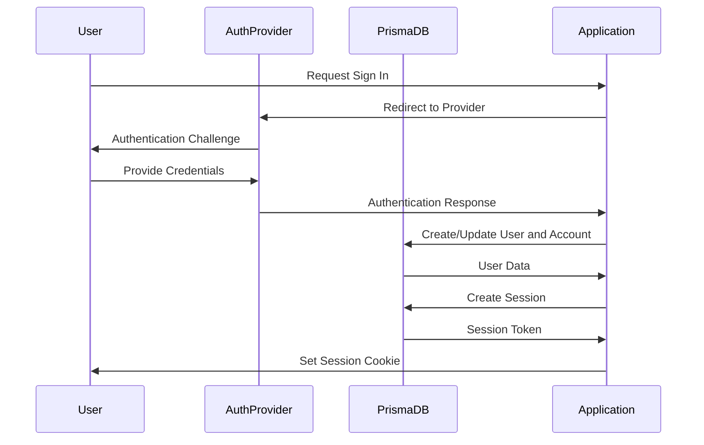
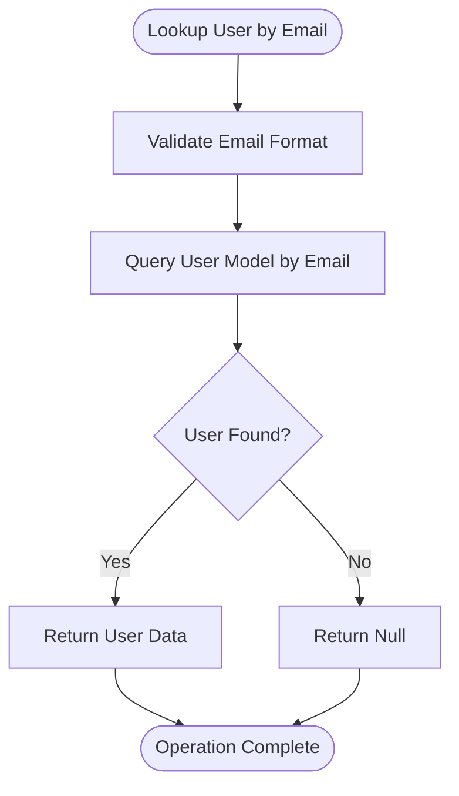
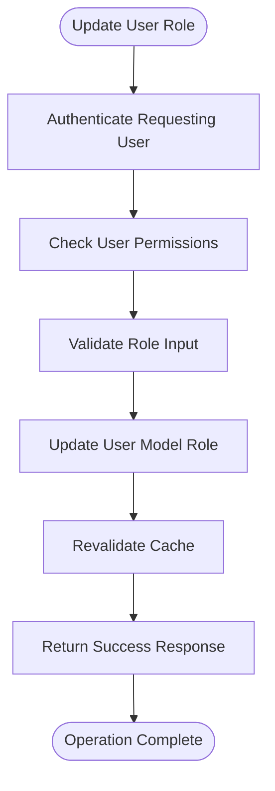

# Data Models

<cite>
**Referenced Files in This Document**   
- [schema.prisma](file://prisma/schema.prisma)
- [next-auth.d.ts](file://types/next-auth.d.ts)
- [auth.ts](file://auth.ts)
- [db.ts](file://lib/db.ts)
- [user.ts](file://lib/user.ts)
- [subscription.ts](file://lib/subscription.ts)
- [update-user-role.ts](file://actions/update-user-role.ts)
- [user-role-form.tsx](file://components/forms/user-role-form.tsx)
</cite>

## Table of Contents
1. [User Model](#user-model)
2. [UserRole Enum](#userrole-enum)
3. [Account Model](#account-model)
4. [Session Model](#session-model)
5. [VerificationToken Model](#verificationtoken-model)
6. [Authentication Flow](#authentication-flow)
7. [Common Operations](#common-operations)

## User Model

The User model represents the core user entity in the application and contains essential fields for user identification, authentication, and subscription management. It includes the following fields:

- **id**: Unique identifier for the user, generated using cuid()
- **name**: Optional user display name
- **email**: Optional email address with unique constraint
- **emailVerified**: Timestamp indicating when the email was verified
- **image**: Optional URL to user's profile image
- **createdAt**: Timestamp of user creation with database mapping to "created_at"
- **updatedAt**: Timestamp of last update with database mapping to "updated_at"
- **role**: UserRole enum with default value of USER
- **stripeCustomerId**: Unique Stripe customer ID with unique constraint
- **stripeSubscriptionId**: Unique Stripe subscription ID with unique constraint
- **stripePriceId**: Reference to the Stripe price ID for the current subscription
- **stripeCurrentPeriodEnd**: Timestamp indicating when the current subscription period ends

The model is mapped to the "users" table in the database and includes appropriate indexes and constraints for performance and data integrity.

**Section sources**
- [schema.prisma](file://prisma/schema.prisma#L37-L62)

## UserRole Enum

The UserRole enum defines the permission levels within the application with two possible values: ADMIN and USER. This enum is defined in the Prisma schema and extended in the NextAuth type system for enhanced type safety.

In the Prisma schema, the enum is defined as:
```prisma
enum UserRole {
  ADMIN
  USER
}
```

For type safety across the application, the UserRole enum is extended in the next-auth.d.ts file to include role information in both the JWT token and session objects. This extension ensures that the user's role is available throughout the authentication flow and can be accessed via session.user.role.

The type extension in next-auth.d.ts creates an ExtendedUser type that combines the base User type from NextAuth with the role property, and declares this structure in both the JWT and Session interfaces.

**Section sources**
- [schema.prisma](file://prisma/schema.prisma#L10-L13)
- [next-auth.d.ts](file://types/next-auth.d.ts#L4-L17)

## Account Model

The Account model stores information about user accounts from various authentication providers. This model enables the application to support multiple authentication methods (such as Google, GitHub, etc.) while maintaining a consistent user experience.

Key fields in the Account model include:
- **id**: Unique identifier for the account record
- **userId**: Reference to the associated User record
- **type**: Type of authentication (e.g., oauth, email)
- **provider**: Name of the authentication provider
- **providerAccountId**: Unique identifier from the provider
- **refresh_token**, **access_token**: OAuth tokens for provider access
- **expires_at**: Expiration timestamp for the access token
- **id_token**: OpenID Connect ID token
- **createdAt**, **updatedAt**: Timestamps for record creation and updates

The model includes a foreign key relationship to the User model with cascade deletion, ensuring that when a user is deleted, all their associated accounts are also removed. It also includes a unique constraint on the combination of provider and providerAccountId to prevent duplicate accounts, and an index on userId for efficient lookups.

**Section sources**
- [schema.prisma](file://prisma/schema.prisma#L15-L35)

## Session Model

The Session model manages user sessions within the application, enabling persistent authentication across requests. This model works in conjunction with the authentication system to maintain user state.

Key fields in the Session model include:
- **id**: Unique identifier for the session record
- **sessionToken**: Unique token used to identify the session
- **userId**: Reference to the associated User record
- **expires**: Timestamp indicating when the session expires

The model includes a foreign key relationship to the User model with cascade deletion, ensuring that when a user is deleted, their sessions are also removed. It has a unique constraint on sessionToken to prevent conflicts and an index on userId for efficient session lookups by user.

The session management system integrates with NextAuth's JWT-based authentication strategy, where session information is stored in encrypted tokens and validated on each request.

**Section sources**
- [schema.prisma](file://prisma/schema.prisma#L64-L73)

## VerificationToken Model

The VerificationToken model handles email verification and magic link authentication flows. This model temporarily stores tokens used to verify user identities or provide passwordless login.

Key fields in the VerificationToken model include:
- **identifier**: Typically the user's email address
- **token**: The verification token value
- **expires**: Timestamp indicating when the token expires

The model includes a unique constraint on the combination of identifier and token to ensure token uniqueness, and a unique constraint on the token alone for efficient lookups. This structure supports both email verification during registration and magic link authentication.

When a user requests authentication via email, a verification token is created and stored in this model. The user receives an email with a link containing the token, and when they click the link, the application validates the token against this model before granting access.

**Section sources**
- [schema.prisma](file://prisma/schema.prisma#L75-L80)

## Authentication Flow

The authentication flow in this application leverages the Prisma models to provide a seamless user experience across different providers. The flow begins when a user attempts to sign in, either through a social provider or email-based magic link.

For social authentication, the flow creates an Account record linked to the User, storing provider-specific information. For email authentication, a VerificationToken is created and sent to the user's email address. Upon successful verification, a session is created in the Session model.

The integration between Prisma and NextAuth is facilitated by the PrismaAdapter, which translates authentication operations into database operations. The auth.ts file configures NextAuth with the Prisma adapter and defines callbacks for session and JWT token management, ensuring that user roles and other custom properties are properly included in the authentication tokens.



**Diagram sources**
- [schema.prisma](file://prisma/schema.prisma)
- [auth.ts](file://auth.ts)
- [db.ts](file://lib/db.ts)

**Section sources**
- [schema.prisma](file://prisma/schema.prisma)
- [auth.ts](file://auth.ts)

## Common Operations

### User Lookup by Email
To retrieve a user by email address, the application uses the getUserByEmail function from the user.ts utility. This function queries the User model with the provided email address and returns the user's name and email verification status.



**Diagram sources**
- [user.ts](file://lib/user.ts#L2-L17)

### Session Validation
Session validation occurs automatically through NextAuth's middleware and authentication callbacks. When a request is made to a protected route, the session token is validated against the Session model, and the associated user data is retrieved from the User model.

### Account Linking
Account linking allows users to connect multiple authentication providers to a single user account. When a user authenticates with a new provider, the system checks if an account with that provider and account ID already exists. If not, a new Account record is created and linked to the user.

### User Role Management
User roles can be updated through the updateUserRole server action, which validates that the requesting user has permission to modify the target user's role, then updates the role field in the User model. This operation triggers cache revalidation to ensure the updated role is reflected in the UI.



**Diagram sources**
- [update-user-role.ts](file://actions/update-user-role.ts)
- [user-role-form.tsx](file://components/forms/user-role-form.tsx)

**Section sources**
- [update-user-role.ts](file://actions/update-user-role.ts)
- [user.ts](file://lib/user.ts)
- [subscription.ts](file://lib/subscription.ts)