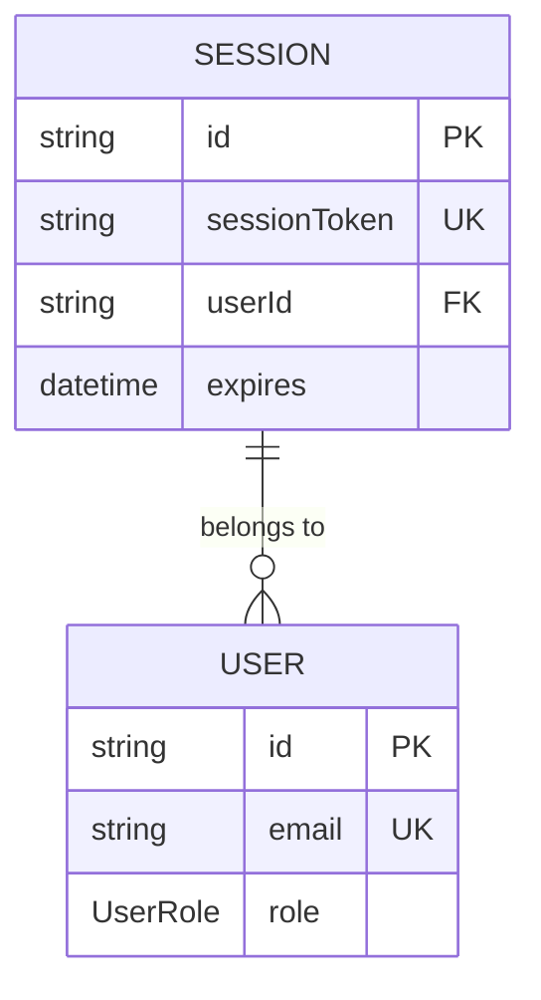
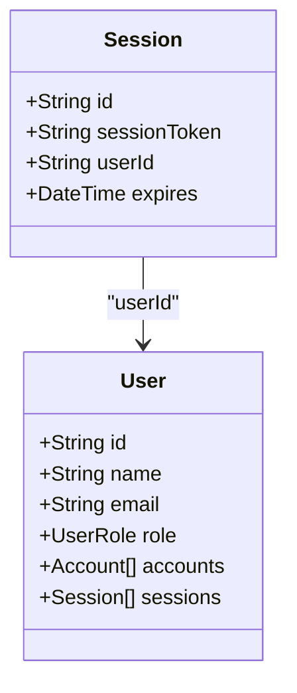
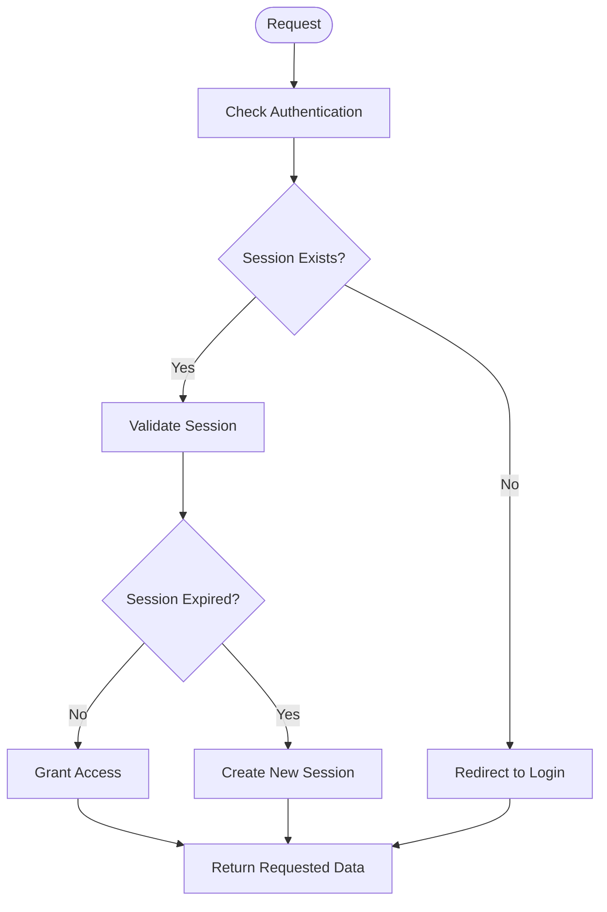
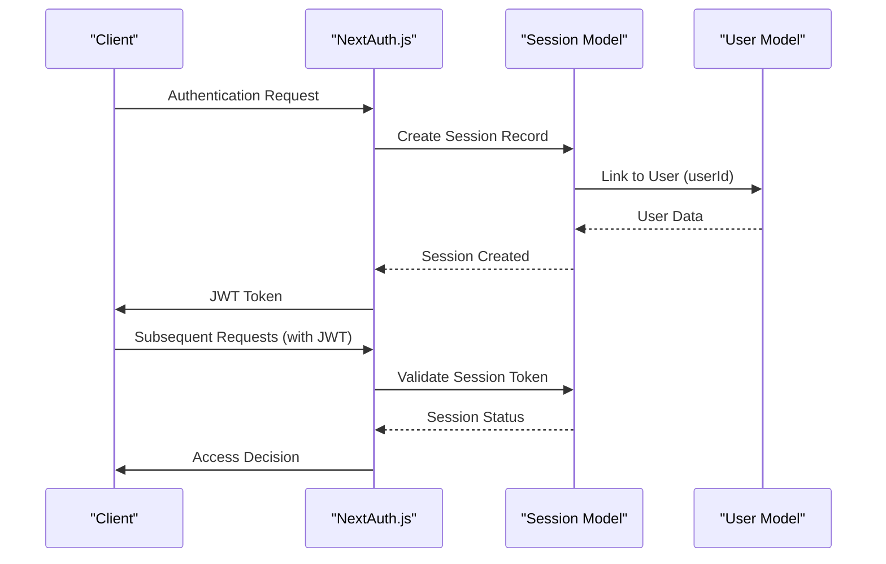

# Session Model

<cite>
**Referenced Files in This Document**   
- [schema.prisma](file://prisma/schema.prisma)
- [auth.ts](file://auth.ts)
- [session.ts](file://lib/session.ts)
</cite>

## Table of Contents
1. [Introduction](#introduction)
2. [Session Model Fields](#session-model-fields)
3. [Session Management with JWT](#session-management-with-jwt)
4. [User Relationship](#user-relationship)
5. [Session Validation and Retrieval](#session-validation-and-retrieval)
6. [Integration with NextAuth.js](#integration-with-nextauthjs)
7. [Security Considerations](#security-considerations)

## Introduction
The Session model is a core component of the authentication system in this Next.js SaaS application. It manages user sessions through JWT tokens and provides secure, stateless authentication. The model works in conjunction with Prisma ORM and NextAuth.js to maintain user sessions, track expiration, and ensure secure access to protected routes. This documentation details the model's structure, functionality, and integration points within the application.

**Section sources**
- [schema.prisma](file://prisma/schema.prisma#L25-L31)

## Session Model Fields
The Session model contains four essential fields that define a user's session:

- **id**: A unique identifier for the session, generated using Prisma's `cuid()` function
- **sessionToken**: A unique token used for authentication, marked with `@unique` constraint
- **userId**: A foreign key reference to the User model, establishing the session-user relationship
- **expires**: A DateTime field that defines when the session will expire

These fields work together to create a secure session management system where each session is uniquely identifiable, linked to a specific user, and has a defined expiration time.

**Diagram sources**
- [schema.prisma](file://prisma/schema.prisma#L25-L31)

**Section sources**
- [schema.prisma](file://prisma/schema.prisma#L25-L31)

## Session Management with JWT
The application uses JWT (JSON Web Token) strategy for session management, configured in the NextAuth.js setup. When a user authenticates, a JWT is created and stored as the sessionToken in the Session model. The session's lifetime is controlled by the expires field, which determines when the session becomes invalid.

The JWT strategy provides stateless authentication, meaning session data is encoded within the token itself rather than stored server-side. This approach improves scalability and reduces database load while maintaining security through token signing and expiration.

**Section sources**
- [auth.ts](file://auth.ts#L18-L19)

## User Relationship
The Session model has a many-to-one relationship with the User model through the userId foreign key. This relationship is defined in the Prisma schema with a relation directive that ensures referential integrity. Each session belongs to exactly one user, while a user can have multiple sessions (for example, when logged in from different devices or browsers).

The relationship is configured with Cascade deletion, meaning when a user is deleted, all their associated sessions are automatically removed. This prevents orphaned session records and maintains data consistency.

**Diagram sources**
- [schema.prisma](file://prisma/schema.prisma#L25-L31)
- [schema.prisma](file://prisma/schema.prisma#L33-L47)

**Section sources**
- [schema.prisma](file://prisma/schema.prisma#L25-L31)

## Session Validation and Retrieval
Session validation and retrieval are handled through the application's authentication system. The `getCurrentUser` function in the session utility retrieves the active session and validates it by checking the session data from the auth system.

To validate sessions, the system checks whether a valid session exists and contains user information. Active sessions can be retrieved by querying the Session model with appropriate filters, such as checking for sessions where the expires timestamp is in the future.

**Section sources**
- [lib/session.ts](file://lib/session.ts#L5-L11)

## Integration with NextAuth.js
The Session model integrates with NextAuth.js through the Prisma adapter, which bridges the ORM with the authentication library. The configuration in auth.ts sets up the JWT session strategy and defines callbacks for session and JWT handling.

The session callback in auth.ts augments the session data with additional user information, including the user's role. This allows role-based access control throughout the application by making the user's role available in the session object.

**Diagram sources**
- [auth.ts](file://auth.ts#L18-L38)

**Section sources**
- [auth.ts](file://auth.ts#L18-L38)

## Security Considerations
The session system implements several security measures to protect against common vulnerabilities:

- **Session expiration**: The expires field ensures sessions automatically become invalid after a defined period, reducing the window of opportunity for token misuse
- **Token uniqueness**: The sessionToken field has a unique constraint, preventing token duplication and potential conflicts
- **Cascade deletion**: When users are deleted, their sessions are automatically removed, eliminating orphaned authentication tokens
- **JWT signing**: The AUTH_SECRET environment variable is used to sign JWT tokens, ensuring their integrity and preventing tampering

To protect against session fixation attacks, the system generates new session tokens on authentication and invalidates previous sessions. Token rotation is handled automatically by the NextAuth.js framework, which creates new tokens with updated expiration times during the session lifecycle.

**Section sources**
- [auth.ts](file://auth.ts#L18-L19)
- [schema.prisma](file://prisma/schema.prisma#L25-L31)