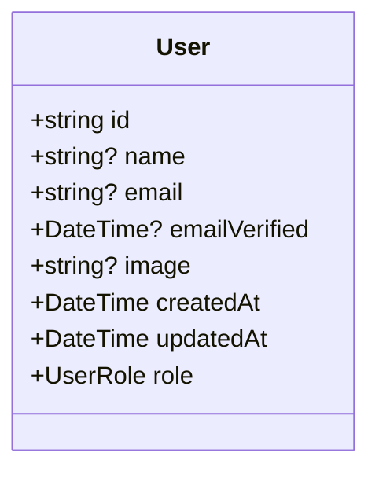
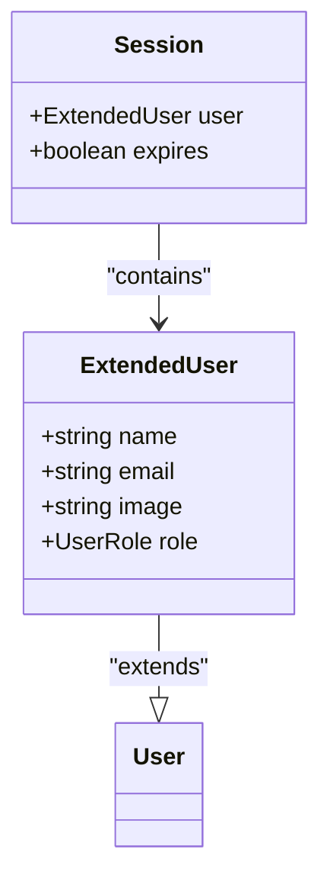
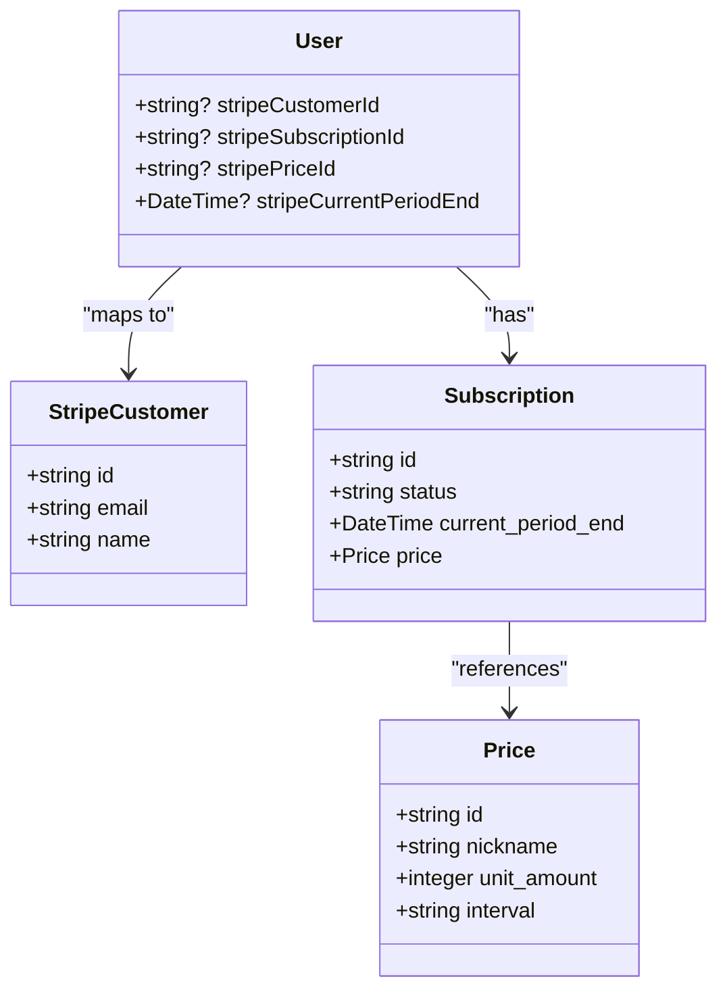
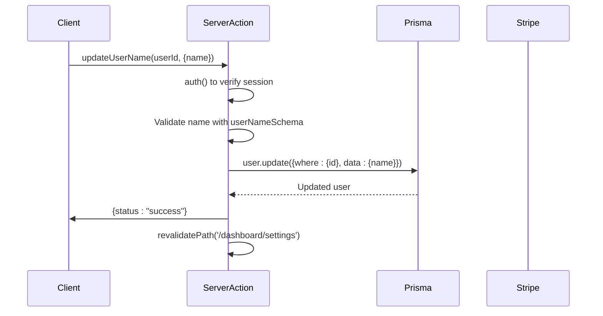
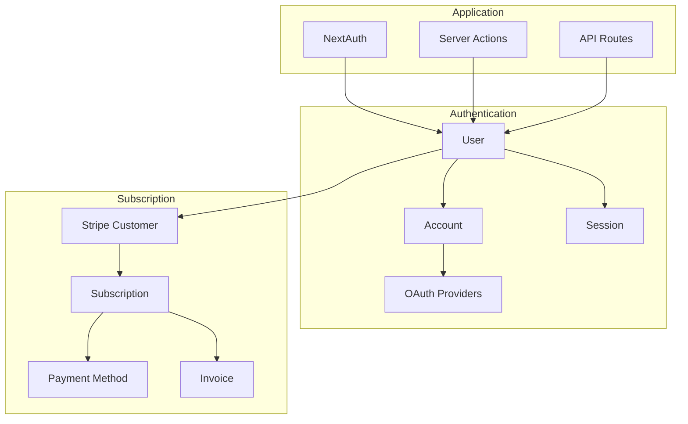
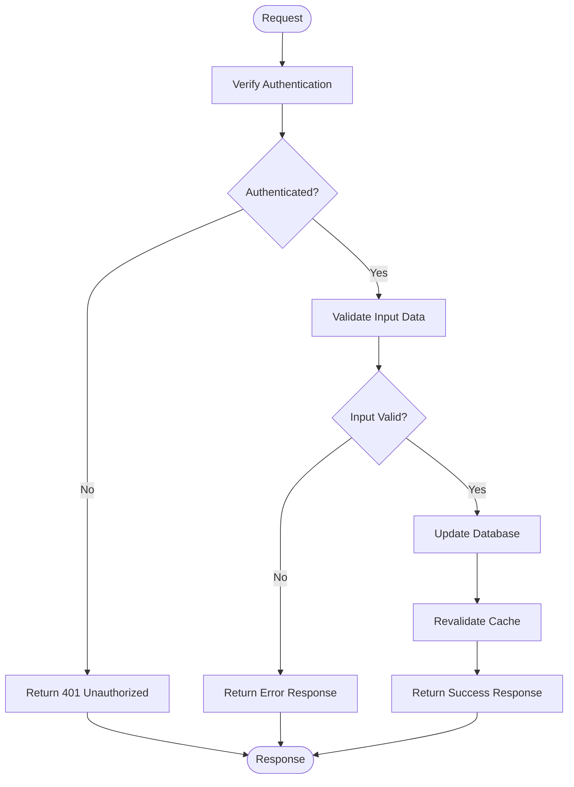

# User Model

<cite>
**Referenced Files in This Document**   
- [schema.prisma](file://prisma/schema.prisma)
- [next-auth.d.ts](file://types/next-auth.d.ts)
- [user.ts](file://lib/user.ts)
- [subscription.ts](file://lib/subscription.ts)
- [update-user-name.ts](file://actions/update-user-name.ts)
- [update-user-role.ts](file://actions/update-user-role.ts)
- [route.ts](file://app/api/user/route.ts)
</cite>

## Table of Contents
1. [Introduction](#introduction)
2. [User Model Fields](#user-model-fields)
3. [UserRole Enum Definition](#userrole-enum-definition)
4. [Stripe Subscription Fields](#stripe-subscription-fields)
5. [Common User Operations](#common-user-operations)
6. [Integration with Account, Session, and Subscription Flows](#integration-with-account-session-and-subscription-flows)
7. [Security Considerations and Server Actions](#security-considerations-and-server-actions)
8. [Conclusion](#conclusion)

## Introduction
The User model is a central component in the application's data architecture, serving as the foundation for authentication, authorization, and subscription management. Built using Prisma ORM, this model defines the structure and behavior of user data within the PostgreSQL database. It integrates tightly with NextAuth for authentication, Stripe for subscription billing, and leverages TypeScript type extensions for enhanced type safety across the stack. This document provides a comprehensive overview of the User model, its fields, relationships, and operational patterns.

**Section sources**
- [schema.prisma](file://prisma/schema.prisma#L1-L80)

## User Model Fields
The User model contains essential fields for user identification, authentication, and role-based access control. Key fields include:

- **id**: Unique identifier generated using Prisma's `cuid()` function
- **name**: Optional string for the user's display name
- **email**: Unique string used for login and communication, marked with `@unique` constraint
- **emailVerified**: DateTime field indicating when the user's email was verified
- **image**: Optional string storing the URL to the user's profile picture
- **createdAt** and **updatedAt**: Timestamps managed automatically with `@default(now())`
- **role**: UserRole enum field with default value set to USER

These fields support core application functionality such as user identification, profile management, and secure authentication flows.



**Diagram sources**
- [schema.prisma](file://prisma/schema.prisma#L55-L75)

**Section sources**
- [schema.prisma](file://prisma/schema.prisma#L55-L75)

## UserRole Enum Definition
The UserRole enum is defined within the Prisma schema with two possible values: USER and ADMIN. This enum provides a type-safe way to manage user permissions throughout the application. The enum is extended in the `next-auth.d.ts` file to enhance type safety in the authentication context.

In the Prisma schema:
```prisma
enum UserRole {
  ADMIN
  USER
}
```

The type extension in `next-auth.d.ts` creates an `ExtendedUser` type that merges the base User type from NextAuth with the UserRole enum, ensuring that the role property is properly typed throughout the application. This extension also updates the Session interface to include the extended user type, making the role information available in session objects with full type safety.



**Diagram sources**
- [schema.prisma](file://prisma/schema.prisma#L15-L17)
- [next-auth.d.ts](file://types/next-auth.d.ts#L4-L6)

**Section sources**
- [schema.prisma](file://prisma/schema.prisma#L15-L17)
- [next-auth.d.ts](file://types/next-auth.d.ts#L4-L20)

## Stripe Subscription Fields
The User model includes several fields dedicated to Stripe subscription management, enabling seamless integration with the payment system:

- **stripeCustomerId**: Unique identifier linking the user to their Stripe customer record, used for billing operations
- **stripeSubscriptionId**: Identifier for the user's current subscription, essential for managing subscription lifecycle
- **stripePriceId**: References the specific pricing plan (monthly/yearly) the user is subscribed to
- **stripeCurrentPeriodEnd**: DateTime field indicating when the current subscription period ends, crucial for determining active subscriptions

These fields work together to maintain synchronization between the application's user data and Stripe's billing system, allowing for accurate subscription status checks and plan management.



**Diagram sources**
- [schema.prisma](file://prisma/schema.prisma#L70-L74)
- [subscription.ts](file://lib/subscription.ts#L1-L65)

**Section sources**
- [schema.prisma](file://prisma/schema.prisma#L70-L74)
- [subscription.ts](file://lib/subscription.ts#L1-L65)

## Common User Operations
The application implements several common operations for user management through dedicated functions and server actions.

### Finding a User by Email
The `getUserByEmail` function in `lib/user.ts` retrieves a user based on their email address, returning selected fields including name and email verification status. This operation is commonly used during authentication flows.

### Updating User Name and Role
Server actions in the `actions/` directory handle updates to user properties:
- `update-user-name.ts` contains the `updateUserName` function that validates input and updates the user's name
- `update-user-role.ts` contains the `updateUserRole` function that changes the user's role with proper validation

Both actions use Zod schemas (`userNameSchema` and `userRoleSchema`) for input validation and include authentication checks to ensure only authorized users can modify data.

### Checking Subscription Status
The `getUserSubscriptionPlan` utility in `lib/subscription.ts` determines the user's subscription status by checking if the `stripePriceId` exists and if the `stripeCurrentPeriodEnd` is in the future. It returns a comprehensive object containing plan details and status flags.

### Retrieving User's Subscription Plan
The same `getUserSubscriptionPlan` function also retrieves the user's subscription plan details by matching the `stripePriceId` against configured pricing data in `config/subscriptions.ts`. It determines the billing interval (monthly/yearly) and whether the subscription is canceled.



**Diagram sources**
- [update-user-name.ts](file://actions/update-user-name.ts#L1-L37)
- [update-user-role.ts](file://actions/update-user-role.ts#L1-L40)
- [user.ts](file://lib/user.ts#L1-L28)
- [subscription.ts](file://lib/subscription.ts#L1-L65)

**Section sources**
- [update-user-name.ts](file://actions/update-user-name.ts#L1-L37)
- [update-user-role.ts](file://actions/update-user-role.ts#L1-L40)
- [user.ts](file://lib/user.ts#L1-L28)
- [subscription.ts](file://lib/subscription.ts#L1-L65)

## Integration with Account, Session, and Subscription Flows
The User model serves as the central entity that connects various authentication and subscription flows. It maintains relationships with Account and Session models through Prisma relations, enabling OAuth login and session management.

The Account model stores provider-specific information (Google, GitHub, etc.) linked to the User, while the Session model manages active sessions. This structure supports the NextAuth authentication flow where users can sign in via multiple providers while maintaining a consistent user profile.

For subscription management, the User model acts as the bridge between the application's business logic and Stripe's payment system. The `getUserSubscriptionPlan` function combines data from the User model with Stripe API calls to retrieve current subscription status, creating a unified view of the user's subscription state.



**Diagram sources**
- [schema.prisma](file://prisma/schema.prisma#L15-L80)
- [route.ts](file://app/api/user/route.ts#L1-L26)

**Section sources**
- [schema.prisma](file://prisma/schema.prisma#L15-L80)
- [route.ts](file://app/api/user/route.ts#L1-L26)

## Security Considerations and Server Actions
Security is enforced through server actions that implement authentication and authorization checks. Each server action begins by verifying the user's session using `auth()` from the centralized auth instance. The actions compare the session user ID with the target user ID to prevent unauthorized modifications.

Input validation is performed using Zod schemas imported from `lib/validations/user.ts`, ensuring data integrity before database operations. The use of server actions (marked with `"use server"`) ensures that sensitive operations occur on the server side, preventing client-side tampering.

Database operations are performed using Prisma's type-safe queries, and cache revalidation (`revalidatePath`) ensures that updated data is reflected in the UI. The DELETE API route in `app/api/user/route.ts` demonstrates proper error handling with appropriate HTTP status codes for different failure scenarios.



**Diagram sources**
- [update-user-name.ts](file://actions/update-user-name.ts#L1-L37)
- [update-user-role.ts](file://actions/update-user-role.ts#L1-L40)
- [route.ts](file://app/api/user/route.ts#L1-L26)

**Section sources**
- [update-user-name.ts](file://actions/update-user-name.ts#L1-L37)
- [update-user-role.ts](file://actions/update-user-role.ts#L1-L40)
- [route.ts](file://app/api/user/route.ts#L1-L26)

## Conclusion
The User model serves as the cornerstone of the application's data architecture, integrating authentication, authorization, and subscription management into a cohesive system. Its well-defined fields, type-safe enum usage, and integration with external services like Stripe create a robust foundation for user management. The implementation of server actions with proper authentication checks ensures data security, while the clear separation of concerns between data access, validation, and presentation layers promotes maintainability and scalability.