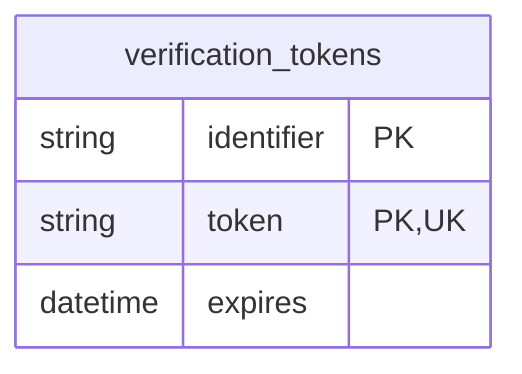
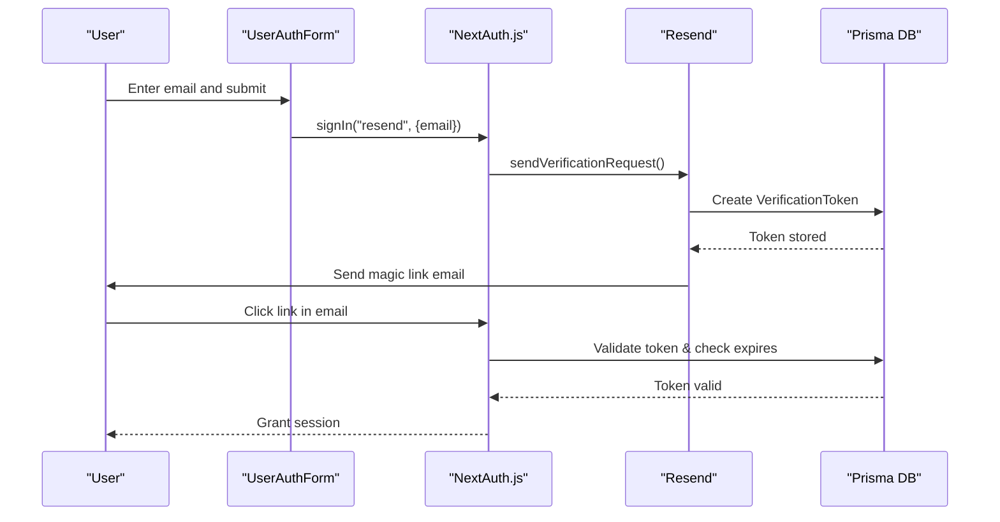
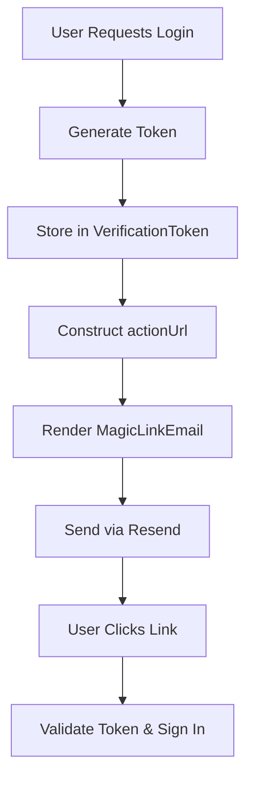
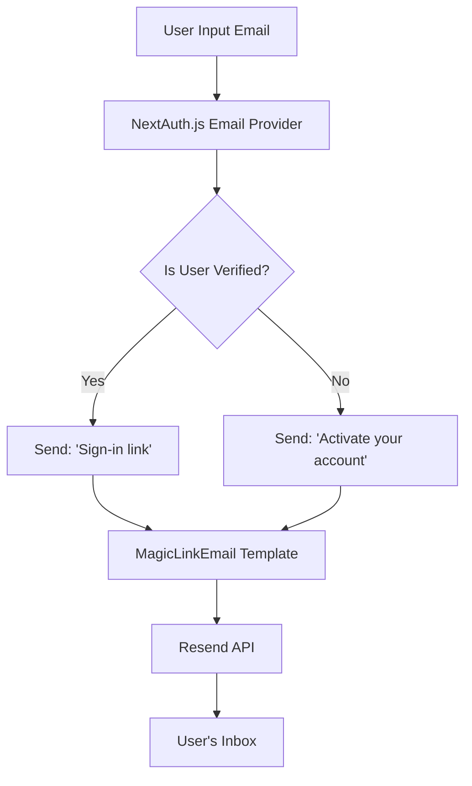

# Verification Token Model

<cite>
**Referenced Files in This Document**   
- [schema.prisma](file://prisma/schema.prisma)
- [auth.config.ts](file://auth.config.ts)
- [magic-link-email.tsx](file://emails/magic-link-email.tsx)
- [email.ts](file://lib/email.ts)
- [user-auth-form.tsx](file://components/forms/user-auth-form.tsx)
- [user.ts](file://lib/user.ts)
- [db.ts](file://lib/db.ts)
</cite>

## Table of Contents
1. [Introduction](#introduction)
2. [Model Structure and Fields](#model-structure-and-fields)
3. [Integration with Magic Link Authentication](#integration-with-magic-link-authentication)
4. [Token Lifecycle Management](#token-lifecycle-management)
5. [Security Considerations](#security-considerations)
6. [Email Template Integration](#email-template-integration)
7. [Configuration in Auth.js](#configuration-in-authjs)
8. [Conclusion](#conclusion)

## Introduction
The `VerificationToken` model is a critical component of the email-based authentication system in this Next.js SaaS application. It enables secure, passwordless sign-in through magic links by temporarily storing one-time use tokens tied to user email addresses. This document provides a comprehensive analysis of the model’s structure, functionality, and integration within the broader authentication flow.

## Model Structure and Fields

The `VerificationToken` model is defined in the Prisma schema and consists of three essential fields that support time-limited, secure email verification:

- **identifier**: A string field representing the user's email address. This serves as the identifier for which the verification token is issued.
- **token**: A unique string value used as the one-time verification code. Enforced as unique across all tokens to prevent reuse.
- **expires**: A DateTime field that defines the expiration timestamp, ensuring tokens are only valid for a limited duration (typically 24 hours).

The model enforces a composite unique constraint on the combination of `identifier` and `token`, preventing duplicate tokens for the same email while allowing multiple tokens over time (e.g., after retries). The underlying database table `verification_tokens` maps directly to this schema.

**Diagram sources**
- [schema.prisma](file://prisma/schema.prisma#L64-L70)
- [migration.sql](file://prisma/migrations/0_init/migration.sql#L34-L62)

**Section sources**
- [schema.prisma](file://prisma/schema.prisma#L64-L70)

## Integration with Magic Link Authentication

The `VerificationToken` model plays a central role in the magic link authentication flow. When a user requests to sign in via email, the system generates a unique token associated with their email address and stores it in the database. This process is orchestrated through NextAuth.js' email provider and custom logic in the application.

When a user submits their email on the login form (`user-auth-form.tsx`), the `signIn("resend")` method triggers the email-based authentication flow. This invokes the `sendVerificationRequest` function defined in `email.ts`, which retrieves user data using `getUserByEmail` and constructs a personalized magic link email.

The token and identifier are automatically managed by NextAuth.js, but the underlying persistence mechanism relies on Prisma to store the token in the `VerificationToken` model. Upon clicking the link, the token is validated against both its existence and expiration status before granting access.

**Diagram sources**
- [user-auth-form.tsx](file://components/forms/user-auth-form.tsx#L45-L52)
- [email.ts](file://lib/email.ts#L10-L45)
- [schema.prisma](file://prisma/schema.prisma#L64-L70)

**Section sources**
- [user-auth-form.tsx](file://components/forms/user-auth-form.tsx#L45-L52)
- [email.ts](file://lib/email.ts#L10-L45)

## Token Lifecycle Management

The lifecycle of a verification token involves creation, validation, and automatic cleanup:

1. **Creation**: Tokens are generated when a user requests a magic link. The `sendVerificationRequest` function is invoked by NextAuth.js and uses Prisma (via `prisma.verificationToken.create`) to persist the token with an expiration time (usually 24 hours from creation).
2. **Validation**: During sign-in, the token is checked for existence, correct identifier (email), and non-expired status. If valid, the user is authenticated and a session is created.
3. **Cleanup**: Once used or expired, tokens should be removed. While not explicitly shown in code, best practice involves periodic cleanup jobs or relying on NextAuth.js internal mechanisms to delete consumed tokens.

This lifecycle ensures that each token can only be used once and within a limited timeframe, reducing the risk of unauthorized access.

**Section sources**
- [email.ts](file://lib/email.ts#L10-L45)
- [db.ts](file://lib/db.ts#L8-L16)

## Security Considerations

Several security measures are implemented to protect the verification token system:

- **Token Uniqueness**: The `@unique` attribute on the `token` field ensures no two tokens have the same value, preventing collisions and replay attacks.
- **Expiration Enforcement**: The `expires` field is strictly validated during authentication. Any attempt to use an expired token fails, limiting the window of opportunity for interception.
- **Brute Force Protection**: While not explicitly coded, the combination of high-entropy tokens and short validity periods inherently mitigates brute force risks. Additionally, rate-limiting at the API level would further enhance protection.
- **Email Binding**: The `identifier` field binds the token to a specific email, ensuring that even if intercepted, the token cannot be used for another account.

These practices align with industry standards for secure passwordless authentication.

**Section sources**
- [schema.prisma](file://prisma/schema.prisma#L64-L70)
- [email.ts](file://lib/email.ts#L10-L45)

## Email Template Integration

The magic link email is rendered using the `MagicLinkEmail` component located in `magic-link-email.tsx`. This React-based email template receives dynamic props including:
- `actionUrl`: The magic link containing the token
- `firstName`: Personalization from user data
- `mailType`: Determines whether the email is for login or registration
- `siteName`: Branding from configuration

The email clearly informs users that the link expires in 24 hours and can only be used once, reinforcing security expectations. The visual design includes a prominent call-to-action button and footer details for trust and compliance.

**Diagram sources**
- [magic-link-email.tsx](file://emails/magic-link-email.tsx#L1-L68)
- [email.ts](file://lib/email.ts#L10-L45)

**Section sources**
- [magic-link-email.tsx](file://emails/magic-link-email.tsx#L1-L68)

## Configuration in Auth.js

The `VerificationToken` model integrates with NextAuth.js through the Resend email provider configured in `auth.config.ts`. Although the `sendVerificationRequest` function is imported, it is currently commented out in the provider options, implying that the default behavior may be sufficient or that customization occurs elsewhere.

However, the presence of the custom `sendVerificationRequest` function in `lib/email.ts` indicates extended control over the email delivery process, including personalization based on user state (e.g., distinguishing between new and returning users).

The `Resend` provider uses environment variables for API key and sender address, ensuring secure and configurable email delivery.

**Diagram sources**
- [auth.config.ts](file://auth.config.ts#L1-L19)
- [email.ts](file://lib/email.ts#L10-L45)

**Section sources**
- [auth.config.ts](file://auth.config.ts#L1-L19)
- [email.ts](file://lib/email.ts#L10-L45)

## Conclusion

The `VerificationToken` model is a foundational element of the application’s secure, passwordless authentication system. By combining unique, time-limited tokens with robust email integration and proper database constraints, it enables a seamless and secure user experience. Its integration with NextAuth.js, Resend, and custom email templates ensures flexibility, scalability, and adherence to modern security practices. Proper lifecycle management and inherent protections against common threats make this implementation suitable for production-grade SaaS applications.