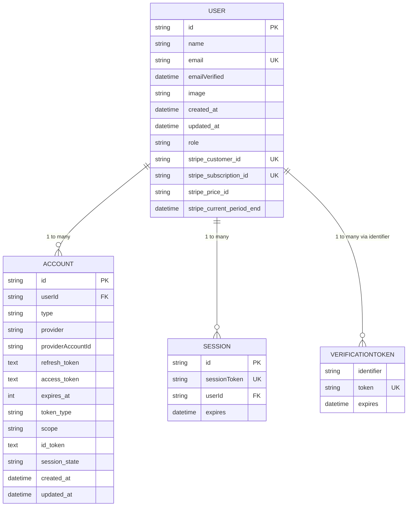

# Database & Prisma

<cite>
**Referenced Files in This Document**   
- [prisma/schema.prisma](file://prisma/schema.prisma)
- [lib/db.ts](file://lib/db.ts)
- [prisma/migrations/0_init/migration.sql](file://prisma/migrations/0_init/migration.sql)
</cite>

## Table of Contents
1. [Introduction](#introduction)
2. [Database Schema](#database-schema)
3. [Data Model Relationships](#data-model-relationships)
4. [Prisma Client Implementation](#prisma-client-implementation)
5. [Data Access Patterns](#data-access-patterns)
6. [Migration Strategy](#migration-strategy)
7. [Performance Considerations](#performance-considerations)

## Introduction
This document provides comprehensive documentation for the Prisma ORM implementation in the Next.js SaaS starter application. The system uses PostgreSQL as the underlying database with Prisma as the ORM layer for type-safe database access. The schema is designed to support authentication, user management, and Stripe subscription integration with proper indexing and constraints for performance optimization.

**Section sources**
- [prisma/schema.prisma](file://prisma/schema.prisma#L1-L80)

## Database Schema
The Prisma schema defines four core models: User, Account, Session, and VerificationToken. These models follow established conventions with lowercase plural table names, snake_case for timestamp fields, and proper indexing on foreign keys and unique constraints.

### User Model
The User model serves as the central entity in the application, storing user profile information and Stripe subscription details:

- **id**: Primary key using cuid() for unique identifier generation
- **name**: Optional string for display name
- **email**: Unique string field with email constraint
- **emailVerified**: DateTime timestamp for email verification status
- **image**: String URL for profile image
- **createdAt/updatedAt**: Timestamps with snake_case naming convention
- **role**: UserRole enum with default value of USER
- **Stripe fields**: Optional string fields prefixed with stripe_* for subscription management

### Account Model
The Account model stores OAuth provider information for authentication:

- **id**: Primary key using cuid()
- **userId**: Foreign key reference to User model with Cascade onDelete
- **type**: Authentication type (e.g., oauth, email)
- **provider**: Provider name (e.g., google, github)
- **providerAccountId**: Unique identifier from the provider
- **token fields**: Optional text fields for refresh_token, access_token, id_token
- **createdAt/updatedAt**: Timestamps with snake_case naming
- **Indexes**: Unique constraint on [provider, providerAccountId] and index on userId

### Session Model
The Session model manages user sessions:

- **id**: Primary key using cuid()
- **sessionToken**: Unique string token for session identification
- **userId**: Foreign key reference to User model with Cascade onDelete
- **expires**: DateTime field for session expiration
- **Indexes**: Index on userId for performance

### VerificationToken Model
The VerificationToken model handles email verification:

- **identifier**: String field for email address
- **token**: Unique string token
- **expires**: DateTime field for token expiration
- **Constraints**: Unique composite index on [identifier, token]

**Section sources**
- [prisma/schema.prisma](file://prisma/schema.prisma#L1-L80)
- [prisma/migrations/0_init/migration.sql](file://prisma/migrations/0_init/migration.sql#L1-L64)

## Data Model Relationships
The data model implements proper relationships between entities to maintain data integrity and enable efficient queries.



**Diagram sources**
- [prisma/schema.prisma](file://prisma/schema.prisma#L1-L80)

## Prisma Client Implementation
The application implements a production-safe singleton pattern for Prisma client instantiation to prevent connection leaks in serverless environments.

### Singleton Pattern
The implementation in lib/db.ts ensures only one Prisma client instance is created per serverless function instance:

```typescript
declare global {
  var cachedPrisma: PrismaClient
}

export let prisma: PrismaClient
if (process.env.NODE_ENV === "production") {
  prisma = new PrismaClient()
} else {
  if (!global.cachedPrisma) {
    global.cachedPrisma = new PrismaClient()
  }
  prisma = global.cachedPrisma
}
```

This pattern addresses the serverless environment challenge where multiple instances of the Prisma client could be created across different function invocations, potentially exhausting database connections.

### Key Implementation Details
- **server-only**: Import ensures the module is only used on the server side
- **Global caching**: In development, the client is cached on the global object to survive hot reloading
- **Production instantiation**: In production, a new client is created for each instance
- **Environment awareness**: Behavior differs between development and production environments

**Section sources**
- [lib/db.ts](file://lib/db.ts#L1-L17)

## Data Access Patterns
The application follows consistent patterns for database access throughout Server Actions and API routes.

### Server Actions Usage
Database mutations are performed in Server Actions, which are marked with "use server" directive:

```typescript
import { prisma } from "@/lib/db";

// Example pattern for updating user name
await prisma.user.update({
  where: { id: session.user.id },
  data: { name: validatedData.name },
});
```

### Query Patterns
- **Type-safe access**: Prisma provides TypeScript types for all models and queries
- **Relation loading**: Relations can be eagerly loaded using include or select
- **Transaction support**: Multi-step operations can be wrapped in transactions
- **Validation integration**: Input validation with Zod schemas precedes database operations

### Common Operations
- User profile updates
- Session management
- Account linking
- Email verification
- Subscription status updates

**Section sources**
- [lib/db.ts](file://lib/db.ts#L1-L17)
- [prisma/schema.prisma](file://prisma/schema.prisma#L1-L80)

## Migration Strategy
The application uses Prisma Migrate for schema evolution and version control.

### Initial Migration
The initial migration (0_init) contains the complete schema definition as SQL statements that create all tables with proper constraints and indexes. This approach provides full control over the database schema and ensures consistency across environments.

### Development Workflow
```bash
# Create new migration after schema changes
npx prisma migrate dev --name migration_name

# Generate Prisma client after migrations
npx prisma generate

# View database in Prisma Studio
npx prisma studio
```

### Production Considerations
- Migrations should be tested thoroughly in staging environments
- Backup database before applying migrations in production
- Monitor application performance after schema changes
- Use transactional operations to maintain data integrity

The migration strategy ensures that schema changes are version-controlled and can be safely applied across different environments.

**Section sources**
- [prisma/migrations/0_init/migration.sql](file://prisma/migrations/0_init/migration.sql#L1-L64)
- [prisma/schema.prisma](file://prisma/schema.prisma#L1-L80)

## Performance Considerations
The data model and access patterns are designed with performance optimization in mind.

### Indexing Strategy
The schema implements strategic indexing to optimize query performance:

- **Foreign key indexes**: userId fields in Account and Session tables are indexed
- **Unique constraints**: Email, sessionToken, and provider combinations have unique indexes
- **Composite indexes**: Multi-column indexes where appropriate

### Query Optimization
- **Select specific fields**: Use select to retrieve only needed fields
- **Batch operations**: Use createMany, updateMany, and deleteMany when appropriate
- **Connection pooling**: Prisma manages connection pooling automatically
- **Caching**: Application-level caching with revalidatePath after mutations

### Best Practices
- Avoid N+1 query problems by using include or join
- Use pagination for large result sets
- Implement proper error handling for database operations
- Monitor slow queries and optimize as needed
- Regularly review and optimize indexes based on query patterns

The combination of proper indexing, efficient query patterns, and the singleton Prisma client implementation ensures optimal database performance even under heavy load.

**Section sources**
- [prisma/schema.prisma](file://prisma/schema.prisma#L1-L80)
- [lib/db.ts](file://lib/db.ts#L1-L17)