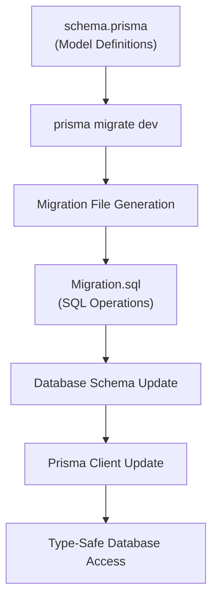
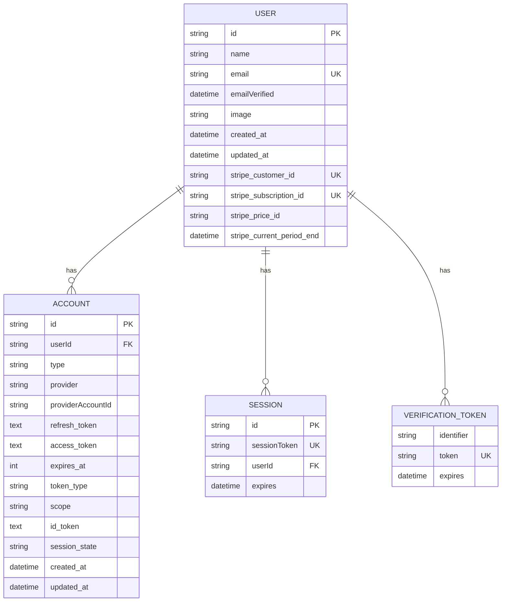

# Migration Strategy

<cite>
**Referenced Files in This Document**   
- [schema.prisma](file://prisma/schema.prisma)
- [0_init/migration.sql](file://prisma/migrations/0_init/migration.sql)
- [package.json](file://package.json)
- [QODER_AGENT_RULES.md](file://QODER_AGENT_RULES.md)
- [ENVIRONMENT_SETUP_GUIDE.md](file://ENVIRONMENT_SETUP_GUIDE.md)
- [db.ts](file://lib/db.ts)
</cite>

## Table of Contents
1. [Introduction](#introduction)
2. [Prisma Migration Workflow](#prisma-migration-workflow)
3. [Migration File Structure](#migration-file-structure)
4. [Development Workflow](#development-workflow)
5. [Production Deployment](#production-deployment)
6. [Initial Migration Creation](#initial-migration-creation)
7. [Best Practices](#best-practices)
8. [Environment-Specific Workflows](#environment-specific-workflows)
9. [Rollback Procedures](#rollback-procedures)

## Introduction
This document outlines the Prisma migration strategy implemented in the Next.js SaaS Stripe Starter project. The strategy focuses on maintaining database schema integrity across development and production environments using Prisma Migrate. The system uses a structured approach to database versioning, ensuring that schema changes are tracked, tested, and deployed systematically. The project currently has a single initial migration that establishes the core database schema for user authentication, sessions, and Stripe integration.

## Prisma Migration Workflow
The Prisma migration workflow in this project follows a structured process from schema definition to migration execution. Developers begin by modifying the `schema.prisma` file to reflect desired database changes. The Prisma schema defines models for Account, Session, User, and VerificationToken, each with specific fields and relationships. When schema changes are detected, Prisma Migrate generates migration files that contain the necessary SQL operations to transform the database schema. The migration process is designed to be idempotent and version-controlled, allowing team members to synchronize their database schemas through Git. Each migration is timestamped and sequentially numbered, ensuring proper execution order across environments.

**Section sources**
- [schema.prisma](file://prisma/schema.prisma#L1-L80)
- [QODER_AGENT_RULES.md](file://QODER_AGENT_RULES.md#L193-L261)

## Migration File Structure
Migration files in this project follow a standardized structure that includes both SQL scripts and metadata. The initial migration is located at `prisma/migrations/0_init/migration.sql` and contains raw SQL statements that create the necessary database tables. Each migration file includes `CreateTable` operations with proper constraints, indexes, and foreign key relationships. The SQL script defines tables for accounts, sessions, users, and verification tokens, with appropriate data types and constraints. Indexes are created on frequently queried fields like userId for performance optimization. The migration also establishes unique constraints on critical fields such as email and provider account IDs to maintain data integrity.

**Diagram sources**
- [schema.prisma](file://prisma/schema.prisma#L1-L80)
- [0_init/migration.sql](file://prisma/migrations/0_init/migration.sql#L1-L64)

**Section sources**
- [schema.prisma](file://prisma/schema.prisma#L1-L80)
- [0_init/migration.sql](file://prisma/migrations/0_init/migration.sql#L1-L64)

## Development Workflow
The development workflow for creating migrations centers around the `prisma migrate dev` command. Developers make schema changes in `schema.prisma` and then execute `npx prisma migrate dev --name migration_name` to create a new migration. This command automatically generates a migration file with the appropriate SQL operations based on the schema differences. During development, Prisma also updates the Prisma Client to reflect the new schema, providing type-safe database access in TypeScript. The workflow is integrated into the development process through package.json scripts and is documented in both QODER_AGENT_RULES.md and ENVIRONMENT_SETUP_GUIDE.md. After creating a migration, developers should test the changes locally before committing the migration files to version control.

**Section sources**
- [QODER_AGENT_RULES.md](file://QODER_AGENT_RULES.md#L591)
- [ENVIRONMENT_SETUP_GUIDE.md](file://ENVIRONMENT_SETUP_GUIDE.md#L212)
- [package.json](file://package.json#L1-L120)

## Production Deployment
For production deployment, the project uses `prisma migrate deploy` to apply migrations. This command is designed for production environments where interactive prompts are not available. It compares the migration history table in the database with the migration files in the source code and executes any pending migrations. The deployment process is typically automated through CI/CD pipelines, ensuring that database schema changes are applied consistently across production instances. Before deployment, it's critical to test migrations thoroughly in staging environments that mirror production. The Prisma Client in production uses connection pooling and proper error handling to maintain database reliability during migration execution.

**Section sources**
- [QODER_AGENT_RULES.md](file://QODER_AGENT_RULES.md#L591)
- [ENVIRONMENT_SETUP_GUIDE.md](file://ENVIRONMENT_SETUP_GUIDE.md#L212)

## Initial Migration Creation
The initial migration was created when setting up the project's database schema for the first time. It was generated using Prisma Migrate based on the initial `schema.prisma` file that defined the core models for authentication and user management. The migration establishes tables for accounts, sessions, users, and verification tokens with appropriate relationships and constraints. Foreign key relationships are set up between users and their accounts and sessions, with cascade deletion to maintain referential integrity. The migration also creates necessary indexes on frequently queried fields to optimize performance. This initial migration serves as the foundation for all subsequent schema changes in the project.

**Diagram sources**
- [schema.prisma](file://prisma/schema.prisma#L1-L80)
- [0_init/migration.sql](file://prisma/migrations/0_init/migration.sql#L1-L64)

**Section sources**
- [schema.prisma](file://prisma/schema.prisma#L1-L80)
- [0_init/migration.sql](file://prisma/migrations/0_init/migration.sql#L1-L64)

## Best Practices
The project follows several best practices for migration management. Migration names should be descriptive and follow a consistent naming convention that clearly indicates the purpose of the schema change. All migrations should be tested thoroughly in development and staging environments before being applied to production. Developers should avoid making destructive changes to the schema whenever possible, preferring additive changes that maintain backward compatibility. Each migration should be atomic, representing a single logical change to the schema. The project also emphasizes the importance of keeping migration files under version control and ensuring that all team members apply migrations in the correct order. Regular backups should be performed before applying migrations to production.

**Section sources**
- [QODER_AGENT_RULES.md](file://QODER_AGENT_RULES.md#L193-L261)
- [ENVIRONMENT_SETUP_GUIDE.md](file://ENVIRONMENT_SETUP_GUIDE.md#L212)

## Environment-Specific Workflows
The project supports environment-specific migration workflows through configuration and environment variables. Development environments use `prisma migrate dev` which can reset the database when needed, while production environments use `prisma migrate deploy` which only applies new migrations without resetting data. The DATABASE_URL environment variable determines which database instance receives the migrations, allowing for separate development, staging, and production databases. This separation ensures that schema changes can be tested thoroughly before affecting production data. The migration history is tracked in the _prisma_migrations table, which helps Prisma determine which migrations have already been applied to each environment.

**Section sources**
- [ENVIRONMENT_SETUP_GUIDE.md](file://ENVIRONMENT_SETUP_GUIDE.md#L212)
- [db.ts](file://lib/db.ts#L1-L16)

## Rollback Procedures
Rollback procedures for migrations require careful planning and execution. Since Prisma Migrate does not automatically generate rollback scripts, developers must create them manually when needed. For non-destructive changes, rollbacks can be achieved by creating a new migration that reverses the previous change. For destructive changes that cannot be easily reversed, the project should rely on database backups. Before applying any migration to production, a backup should be taken so that the database can be restored if necessary. In cases where a migration fails during deployment, Prisma will mark the migration as failed in the migration history table, preventing subsequent migrations from being applied until the issue is resolved.

**Section sources**
- [QODER_AGENT_RULES.md](file://QODER_AGENT_RULES.md#L591)
- [ENVIRONMENT_SETUP_GUIDE.md](file://ENVIRONMENT_SETUP_GUIDE.md#L212)