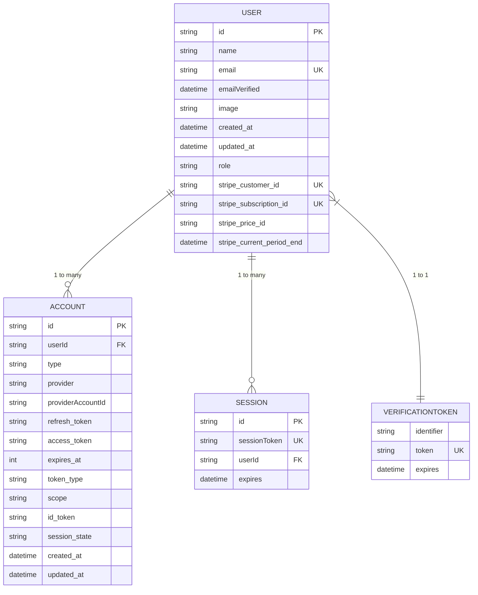

# Schema Design

<cite>
**Referenced Files in This Document**   
- [prisma/schema.prisma](file://prisma/schema.prisma)
- [auth.ts](file://auth.ts)
- [types/next-auth.d.ts](file://types/next-auth.d.ts)
- [lib/user.ts](file://lib/user.ts)
- [lib/db.ts](file://lib/db.ts)
</cite>

## Table of Contents
1. [Introduction](#introduction)
2. [Entity-Relationship Model](#entity-relationship-model)
3. [Model Definitions](#model-definitions)
4. [Field-Level Definitions](#field-level-definitions)
5. [Data Types and Constraints](#data-types-and-constraints)
6. [Indexes and Performance](#indexes-and-performance)
7. [Naming Conventions](#naming-conventions)
8. [PostgreSQL-Specific Features](#postgresql-specific-features)
9. [Integration with NextAuth.js](#integration-with-nextauthjs)
10. [System Architecture Role](#system-architecture-role)

## Introduction
This document provides comprehensive documentation for the Prisma schema design in the Next.js SaaS Stripe starter template. The schema defines the data model for user authentication, session management, and account verification, serving as the foundation for the application's identity and access management system. The design supports both OAuth and email/password authentication through integration with NextAuth.js, while also accommodating Stripe subscription data for SaaS functionality.

**Section sources**
- [prisma/schema.prisma](file://prisma/schema.prisma)

## Entity-Relationship Model
The Prisma schema defines four core models that work together to manage user identity and authentication: User, Account, Session, and VerificationToken. These models are interconnected through foreign key relationships, creating a comprehensive authentication system that supports multiple identity providers and session management.



**Diagram sources**
- [prisma/schema.prisma](file://prisma/schema.prisma)

**Section sources**
- [prisma/schema.prisma](file://prisma/schema.prisma)

## Model Definitions
The schema consists of four primary models that handle different aspects of user authentication and session management.

### User Model
The User model serves as the central entity in the authentication system, storing core user information and relationships to authentication methods. It includes fields for basic profile data, authentication state, and subscription information for the SaaS functionality.

### Account Model
The Account model stores information about third-party authentication providers linked to a user. This enables OAuth login through providers like Google or GitHub, with each account representing a connection to a specific provider.

### Session Model
The Session model manages active user sessions, allowing the application to maintain user login state across requests. Each session is tied to a user and has an expiration time for security purposes.

### VerificationToken Model
The VerificationToken model handles email verification and password reset functionality, storing temporary tokens that can be used to verify a user's email address or reset their password.

**Section sources**
- [prisma/schema.prisma](file://prisma/schema.prisma)

## Field-Level Definitions
Each model contains specific fields designed to support the authentication workflow and SaaS functionality.

### User Model Fields
- **id**: Primary key identifier using cuid() for uniqueness
- **name**: Optional user display name
- **email**: Unique email address used for login
- **emailVerified**: Timestamp when email was verified
- **image**: URL to user profile image
- **createdAt/updatedAt**: Timestamps for record lifecycle
- **role**: UserRole enum (ADMIN/USER) for access control
- **stripeCustomerId**: Unique Stripe customer identifier
- **stripeSubscriptionId**: Current subscription identifier
- **stripePriceId**: Current pricing plan identifier
- **stripeCurrentPeriodEnd**: Subscription period end timestamp

### Account Model Fields
- **id**: Primary key identifier
- **userId**: Foreign key to User model
- **type**: Authentication type (e.g., oauth, email)
- **provider**: Provider name (e.g., google, github)
- **providerAccountId**: Unique identifier from provider
- **refresh_token/access_token**: OAuth tokens
- **expires_at**: Token expiration timestamp
- **token_type/scope/id_token**: Additional OAuth data
- **session_state**: OAuth session state
- **createdAt/updatedAt**: Record lifecycle timestamps

### Session Model Fields
- **id**: Primary key identifier
- **sessionToken**: Unique token for session identification
- **userId**: Foreign key to User model
- **expires**: Expiration timestamp for session invalidation

### VerificationToken Model Fields
- **identifier**: Email address or identifier
- **token**: Unique verification token
- **expires**: Expiration timestamp for token invalidation

**Section sources**
- [prisma/schema.prisma](file://prisma/schema.prisma)

## Data Types and Constraints
The schema employs various data types and constraints to ensure data integrity and optimal performance.

### Primary Keys
All models use string primary keys generated with cuid() for distributed system compatibility. The User, Account, and Session models each have a single primary key field marked with @id.

### Foreign Keys
Foreign key relationships are established using the @relation attribute:
- Account.userId references User.id with Cascade deletion
- Session.userId references User.id with Cascade deletion

### Unique Constraints
Unique constraints ensure data integrity:
- User.email has a unique constraint to prevent duplicate accounts
- Session.sessionToken is unique for secure session management
- VerificationToken.token is unique for secure token validation
- Composite unique constraint on Account.provider and providerAccountId prevents duplicate provider connections

### Enum Type
The UserRole enum defines two possible values: ADMIN and USER, providing a type-safe way to manage user permissions within the application.

**Section sources**
- [prisma/schema.prisma](file://prisma/schema.prisma)

## Indexes and Performance
The schema includes strategic indexes to optimize query performance for common authentication operations.

### Database Indexes
- **Account.userId**: Index on the foreign key for efficient user account lookups
- **Session.userId**: Index on the foreign key for efficient session retrieval
- **User.email**: Implicit index from unique constraint for login operations
- **Session.sessionToken**: Implicit index from unique constraint for session validation

These indexes ensure that authentication-related queries perform efficiently, even as the user base grows. The foreign key indexes are particularly important for maintaining performance when retrieving related data through Prisma's relation queries.

**Section sources**
- [prisma/schema.prisma](file://prisma/schema.prisma)

## Naming Conventions
The schema follows consistent naming conventions that align with database best practices and framework expectations.

### Table Names
Table names use lowercase plural form as specified by the @@map attribute:
- "users" for the User model
- "accounts" for the Account model  
- "sessions" for the Session model
- "verification_tokens" for the VerificationToken model

### Column Names
Column names use snake_case for PostgreSQL compatibility:
- created_at and updated_at for timestamp fields
- stripe_customer_id and similar for Stripe-related fields
- provider_account_id for the provider-specific identifier

This naming convention ensures compatibility with PostgreSQL while maintaining readability and consistency with common database practices.

**Section sources**
- [prisma/schema.prisma](file://prisma/schema.prisma)

## PostgreSQL-Specific Features
The schema leverages several PostgreSQL-specific features through Prisma's database mapping capabilities.

### Text Field Mapping
Certain fields are explicitly mapped to PostgreSQL's text type using @db.Text:
- Account.refresh_token for potentially long OAuth tokens
- Account.access_token for potentially long OAuth tokens  
- Account.id_token for potentially long OpenID Connect tokens

This ensures these fields can accommodate large token values that might exceed the default varchar limit.

### Timestamp Handling
The schema uses Prisma's @default(now()) directive for createdAt and updatedAt fields, leveraging PostgreSQL's timestamp with time zone type for accurate time tracking across different time zones.

### Case-Insensitive Unique Constraints
While not explicitly shown, PostgreSQL's unique constraints are case-sensitive by default. The application likely handles case-insensitive email matching at the application level or through additional database configuration.

**Section sources**
- [prisma/schema.prisma](file://prisma/schema.prisma)

## Integration with NextAuth.js
The Prisma schema is specifically designed to integrate with NextAuth.js (Auth.js v5) for comprehensive authentication functionality.

### Prisma Adapter
The schema works with the @auth/prisma-adapter to connect NextAuth.js with the Prisma database client. The adapter maps NextAuth.js requirements to the Prisma models, enabling:
- OAuth/OIDC authentication through the Account model
- Session-based authentication through the Session model
- Email verification through the VerificationToken model
- User management through the User model

### Authentication Flow Support
The schema supports multiple authentication methods:
- **OAuth Login**: Uses the Account model to store provider credentials
- **Email/Password**: Uses the User model with email verification via VerificationToken
- **Session Management**: Uses the Session model for persistent login state

### User Role Extension
The schema integrates with NextAuth.js' session callback to extend the default session with role information:

```typescript
callbacks: {
  async session({ token, session }) {
    if (session.user && token.role) {
      session.user.role = token.role;
    }
    return session;
  }
}
```

This allows role-based access control throughout the application based on the UserRole enum defined in the schema.

**Section sources**
- [prisma/schema.prisma](file://prisma/schema.prisma)
- [auth.ts](file://auth.ts)
- [types/next-auth.d.ts](file://types/next-auth.d.ts)

## System Architecture Role
The Prisma schema plays a critical role in the overall system architecture, serving as the foundation for user management and authentication.

### Authentication Layer
The schema forms the data layer for the authentication system, working with NextAuth.js to provide secure user login and session management. The integration between the User, Account, Session, and VerificationToken models creates a robust authentication system that supports multiple identity providers.

### SaaS Functionality
Beyond authentication, the schema supports SaaS functionality through Stripe integration fields:
- stripeCustomerId links users to their Stripe customer record
- stripeSubscriptionId tracks current subscription status
- stripePriceId identifies the pricing plan
- stripeCurrentPeriodEnd manages subscription lifecycle

### Data Access Patterns
The schema is accessed through the Prisma client singleton in lib/db.ts, ensuring efficient database connections:

```typescript
export let prisma: PrismaClient
if (process.env.NODE_ENV === "production") {
  prisma = new PrismaClient()
} else {
  if (!global.cachedPrisma) {
    global.cachedPrisma = new PrismaClient()
  }
  prisma = global.cachedPrisma
}
```

This pattern prevents connection leaks in development while providing efficient database access in production.

### User Management
The schema supports user management operations through service functions like getUserById in lib/user.ts, which provide a clean interface between the application logic and database operations.

**Section sources**
- [prisma/schema.prisma](file://prisma/schema.prisma)
- [lib/db.ts](file://lib/db.ts)
- [lib/user.ts](file://lib/user.ts)