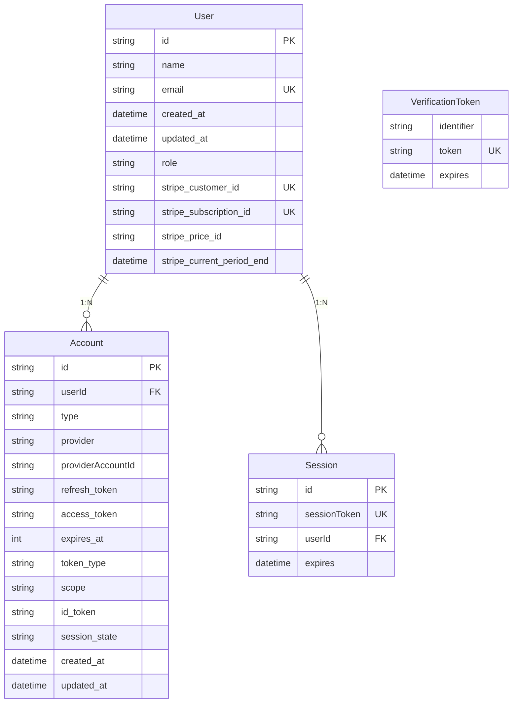
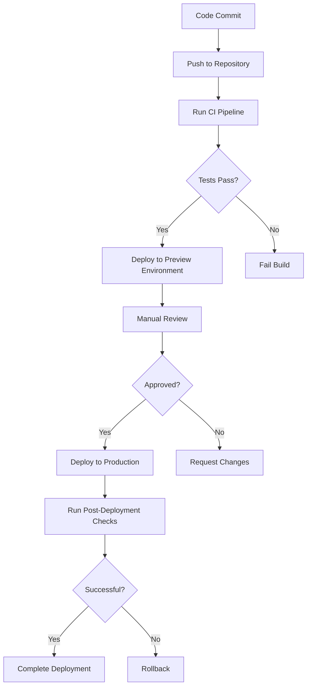

# Deployment Guide

<cite>
**Referenced Files in This Document**   
- [ENVIRONMENT_SETUP_GUIDE.md](file://ENVIRONMENT_SETUP_GUIDE.md)
- [QODER_AGENT_RULES.md](file://QODER_AGENT_RULES.md)
- [env.mjs](file://env.mjs)
- [prisma/schema.prisma](file://prisma/schema.prisma)
- [lib/db.ts](file://lib/db.ts)
- [lib/stripe.ts](file://lib/stripe.ts)
- [actions/generate-user-stripe.ts](file://actions/generate-user-stripe.ts)
- [app/api/webhooks/stripe/route.ts](file://app/api/webhooks/stripe/route.ts)
</cite>

## Table of Contents
1. [Environment Setup](#environment-setup)
2. [Vercel Deployment](#vercel-deployment)
3. [Production Checklist](#production-checklist)
4. [Database Migration Strategies](#database-migration-strategies)
5. [Monitoring and Logging](#monitoring-and-logging)
6. [CI/CD and Preview Deployments](#cicd-and-preview-deployments)
7. [Domain and SSL Configuration](#domain-and-ssl-configuration)
8. [Troubleshooting and Rollback](#troubleshooting-and-rollback)

## Environment Setup

This section provides step-by-step instructions for setting up the required services and environment variables for the next-saas-stripe-starter-main application.

### Required Services

The application requires the following services to be configured:

1. **PostgreSQL (Neon)**: Database service for storing application data
2. **Redis**: Not explicitly mentioned in the codebase, but commonly used for caching
3. **Stripe**: Payment processing and subscription management
4. **Resend**: Email delivery service for transactional emails

### Environment Variable Configuration

All environment variables are validated using Zod schemas in `env.mjs` and accessed through the `env` object imported from `@/env.mjs`.

#### Authentication (NextAuth.js)
- **AUTH_SECRET**: Generate a 32+ character secret using `openssl rand -base64 32` or visit https://generate-secret.vercel.app/32
- **GOOGLE_CLIENT_ID** & **GOOGLE_CLIENT_SECRET**: Create OAuth credentials in Google Cloud Console with redirect URIs for both development (`http://localhost:3000/api/auth/callback/google`) and production (`https://yourdomain.com/api/auth/callback/google`)
- **GITHUB_OAUTH_TOKEN**: Create an OAuth app in GitHub Developer Settings with appropriate callback URL

#### Database (PostgreSQL - Neon)
- **DATABASE_URL**: Copy the connection string from Neon Console after creating a project. The format is `postgres://[username]:[password]@[hostname]/[database]?sslmode=require`

#### Email (Resend)
- **RESEND_API_KEY**: Create an API key in the Resend dashboard
- **EMAIL_FROM**: Configure a domain in Resend and set the sender email address (e.g., "Your App Name <noreply@yourdomain.com>")

#### Subscriptions (Stripe)
- **STRIPE_API_KEY**: Copy the secret key from Stripe Dashboard (Developers → API keys). Use test keys (`sk_test_`) during development and live keys (`sk_live_`) in production
- **STRIPE_WEBHOOK_SECRET**: Create a webhook endpoint in Stripe Dashboard (Developers → Webhooks) for `https://yourdomain.com/api/webhooks/stripe` and copy the signing secret
- **NEXT_PUBLIC_STRIPE_*_PLAN_ID**: Create subscription products in Stripe Dashboard (Products) and copy the price IDs for Pro Monthly, Pro Yearly, Business Monthly, and Business Yearly plans

**Section sources**
- [ENVIRONMENT_SETUP_GUIDE.md](file://ENVIRONMENT_SETUP_GUIDE.md)
- [env.mjs](file://env.mjs)
- [QODER_AGENT_RULES.md](file://QODER_AGENT_RULES.md)

## Vercel Deployment

Deploying the Next.js application to Vercel follows standard procedures with specific recommendations for this starter template.

### Recommended Settings for Next.js Applications

1. **Framework Preset**: Next.js
2. **Build Command**: `pnpm build` (automatically detected)
3. **Output Directory**: Leave empty (Vercel detects Next.js output)
4. **Development Command**: `pnpm dev`

### Environment Variables Configuration

Configure the following environment variables in the Vercel dashboard:

```bash
# Authentication
AUTH_SECRET=your_generated_secret
GOOGLE_CLIENT_ID=your_google_client_id
GOOGLE_CLIENT_SECRET=your_google_client_secret
GITHUB_OAUTH_TOKEN=your_github_client_secret

# Database
DATABASE_URL=your_neon_connection_string

# Email
RESEND_API_KEY=your_resend_api_key
EMAIL_FROM="Your App Name <noreply@yourdomain.com>"

# Stripe
STRIPE_API_KEY=your_stripe_secret_key
STRIPE_WEBHOOK_SECRET=your_webhook_secret
NEXT_PUBLIC_APP_URL=https://yourdomain.com
NEXT_PUBLIC_STRIPE_PRO_MONTHLY_PLAN_ID=price_your_pro_monthly_id
NEXT_PUBLIC_STRIPE_PRO_YEARLY_PLAN_ID=price_your_pro_yearly_id
NEXT_PUBLIC_STRIPE_BUSINESS_MONTHLY_PLAN_ID=price_your_business_monthly_id
NEXT_PUBLIC_STRIPE_BUSINESS_YEARLY_PLAN_ID=price_your_business_yearly_id
```

### Prisma Integration

The application uses Prisma ORM with automatic client generation via the `postinstall` script. Vercel will automatically run `pnpm postinstall` during deployment, which generates the Prisma client.

**Section sources**
- [QODER_AGENT_RULES.md](file://QODER_AGENT_RULES.md)
- [package.json](file://package.json)

## Production Checklist

This section covers the security, performance, and reliability considerations from QODER_AGENT_RULES.md.

### Security Considerations

1. **Environment Variables**: Never commit `.env.local` to version control. All sensitive variables are properly segregated between server and client environments using the `env.mjs` configuration.
2. **API Key Protection**: Server-side variables (STRIPE_API_KEY, STRIPE_WEBHOOK_SECRET, DATABASE_URL, etc.) are not exposed to the client.
3. **Authentication**: Uses Auth.js v5 with proper session management and JWT encryption via AUTH_SECRET.
4. **Input Validation**: All user inputs are validated using Zod schemas before processing.
5. **Webhook Security**: Stripe webhooks are verified using the STRIPE_WEBHOOK_SECRET to prevent unauthorized requests.

### Performance Considerations

1. **Server Components**: The application follows the Server Components First pattern, minimizing client-side JavaScript.
2. **Image Optimization**: Uses Next.js Image component with proper width/height attributes and supports remote patterns for avatar services.
3. **Caching**: Implements Prisma client caching in development using the global object to prevent creating multiple instances.
4. **Code Splitting**: Leverages Next.js built-in code splitting and dynamic imports.

### Reliability Considerations

1. **Error Handling**: Comprehensive error handling with user-friendly messages and proper logging.
2. **Database Connection**: Robust database connection management with proper error handling and retry mechanisms.
3. **Session Management**: Uses secure session tokens with proper expiration and revocation.
4. **Payment Flow**: Implements proper subscription flow with both checkout sessions for new customers and billing portal sessions for existing customers.

**Section sources**
- [QODER_AGENT_RULES.md](file://QODER_AGENT_RULES.md)
- [lib/db.ts](file://lib/db.ts)
- [lib/stripe.ts](file://lib/stripe.ts)

## Database Migration Strategies

The application uses Prisma Migrate for database schema management in production environments.

### Prisma Migrate Workflow

1. **Development**: Use `npx prisma migrate dev` to create and apply migrations during development. This command creates a new migration file and updates the database schema.

2. **Production**: Use `npx prisma migrate deploy` to apply migrations in production. This command applies all pending migrations without creating new migration files.

### Migration Best Practices

1. **Test Migrations**: Always test migrations on a staging environment that mirrors production before applying to production.
2. **Backup Database**: Create a backup of the production database before running any migrations.
3. **Monitor Application**: After applying migrations, monitor the application for any issues related to the schema changes.
4. **Rollback Plan**: Have a rollback plan in place, including the ability to revert to a previous database backup if necessary.

### Schema Management

The Prisma schema is defined in `prisma/schema.prisma` and includes models for User, Account, Session, and VerificationToken. The schema uses snake_case for field names and follows PostgreSQL best practices.



**Diagram sources**
- [prisma/schema.prisma](file://prisma/schema.prisma)

**Section sources**
- [prisma/schema.prisma](file://prisma/schema.prisma)
- [QODER_AGENT_RULES.md](file://QODER_AGENT_RULES.md)

## Monitoring and Logging

This section covers the monitoring and logging setup recommendations for the application.

### Built-in Monitoring

1. **Vercel Analytics**: The application includes Vercel Analytics through the `components/analytics.tsx` component, providing insights into user behavior and performance metrics.

2. **Error Tracking**: While not explicitly implemented, the application structure supports integration with error tracking services like Sentry or LogRocket.

### Logging Recommendations

1. **Server-Side Logging**: Implement structured logging for server actions and API routes, especially for payment processing and user management operations.

2. **Error Logging**: Log errors with sufficient context for debugging, but avoid logging sensitive information like passwords or full API keys.

3. **Audit Logging**: For critical operations (e.g., subscription changes, user role updates), implement audit logging to track who performed what action and when.

### Performance Monitoring

1. **Database Query Monitoring**: Monitor slow database queries and optimize as needed. Prisma provides query logging that can be enabled in development.

2. **API Response Times**: Track API response times, particularly for Stripe webhook processing and user authentication flows.

3. **Memory Usage**: Monitor memory usage, especially with the Prisma client, to prevent memory leaks in long-running processes.

**Section sources**
- [components/analytics.tsx](file://components/analytics.tsx)
- [QODER_AGENT_RULES.md](file://QODER_AGENT_RULES.md)

## CI/CD and Preview Deployments

This section covers the setup of CI/CD pipelines and preview deployments for the application.

### CI/CD Pipeline Setup

1. **GitHub Actions**: Create a workflow that runs on pull requests and pushes to main:
   - Run `pnpm install` to install dependencies
   - Run `pnpm lint` to check code quality
   - Run `pnpm build` to verify the build process
   - Run tests if applicable

2. **Automated Testing**: Implement automated tests for critical functionality:
   - Authentication flows
   - Subscription management
   - Database operations
   - API endpoints

3. **Security Scanning**: Include security scanning tools to detect vulnerabilities in dependencies.

### Preview Deployments

1. **Vercel Integration**: Connect the repository to Vercel to enable automatic preview deployments for pull requests.

2. **Environment Configuration**: Preview deployments should use test/staging versions of external services:
   - Test Stripe keys
   - Staging database
   - Test email service configuration

3. **Automated Checks**: Configure automated checks that verify the preview deployment is accessible and functional.

### Deployment Workflow



**Diagram sources**
- [QODER_AGENT_RULES.md](file://QODER_AGENT_RULES.md)

**Section sources**
- [QODER_AGENT_RULES.md](file://QODER_AGENT_RULES.md)

## Domain and SSL Configuration

This section covers the domain configuration, SSL certificate management, and DNS setup for the application.

### Domain Configuration

1. **Domain Registration**: Register a domain name through a domain registrar (e.g., Namecheap, Google Domains).

2. **DNS Setup**: Configure DNS records to point to Vercel:
   - Create an A record or CNAME record pointing to Vercel's servers
   - For apex domains, use A records with Vercel's IP addresses
   - For subdomains, use CNAME records pointing to `cname.vercel-dns.com`

3. **Domain Verification**: Verify domain ownership in the Vercel dashboard by adding the required DNS records.

### SSL Certificate Management

1. **Automatic SSL**: Vercel automatically provisions and renews SSL certificates for custom domains using Let's Encrypt.

2. **HTTPS Enforcement**: Vercel automatically redirects HTTP requests to HTTPS, ensuring all traffic is encrypted.

3. **Certificate Monitoring**: Monitor SSL certificate expiration dates and renewal status through the Vercel dashboard.

### Additional DNS Records

1. **Email Configuration**: If using a custom domain for email, configure the necessary MX, SPF, DKIM, and DMARC records.

2. **Subdomain Configuration**: Set up subdomains for different environments if needed (e.g., staging.yourdomain.com).

3. **Redirects**: Configure any necessary redirects from old domains or URLs to the new application.

**Section sources**
- [QODER_AGENT_RULES.md](file://QODER_AGENT_RULES.md)

## Troubleshooting and Rollback

This section provides guidance on troubleshooting common deployment issues and rollback procedures.

### Common Deployment Issues

1. **Environment Variables Not Set**: Verify all required environment variables are configured in the Vercel dashboard, paying special attention to the distinction between server and client variables.

2. **Database Connection Issues**: Check the DATABASE_URL format and ensure the Neon project is active and accessible from the deployment environment.

3. **Authentication Failures**: Verify AUTH_SECRET is set and unique, and that OAuth redirect URIs match exactly between the application configuration and service providers (Google, GitHub).

4. **Stripe Integration Problems**: 
   - Verify webhook endpoints are accessible and use HTTPS
   - Ensure webhook signing secret matches between Stripe Dashboard and application configuration
   - Confirm price IDs are correct and correspond to active products in Stripe

5. **Build Errors**: Check for TypeScript errors and ensure all dependencies are properly installed. Run `pnpm build` locally to reproduce and debug build issues.

### Rollback Procedures

1. **Immediate Rollback**: If a deployment causes critical issues, use Vercel's rollback feature to quickly revert to a previous deployment.

2. **Database Rollback**: If a migration caused issues, restore from the most recent backup taken before the migration.

3. **Configuration Rollback**: Revert environment variables to their previous values if configuration changes caused issues.

4. **Communication Plan**: Have a communication plan in place to inform users of any service disruptions and the expected resolution time.

### Monitoring and Recovery

1. **Health Checks**: Implement health checks for critical application components (database, authentication, payment processing).

2. **Alerting**: Set up alerts for critical errors and performance degradation.

3. **Post-Mortem Analysis**: After resolving any issues, conduct a post-mortem analysis to identify root causes and prevent recurrence.

**Section sources**
- [QODER_AGENT_RULES.md](file://QODER_AGENT_RULES.md)
- [ENVIRONMENT_SETUP_GUIDE.md](file://ENVIRONMENT_SETUP_GUIDE.md)