# Vercel Deployment

<cite>
**Referenced Files in This Document**   
- [next.config.js](file://next.config.js)
- [tsconfig.json](file://tsconfig.json)
- [env.mjs](file://env.mjs)
- [prisma/schema.prisma](file://prisma/schema.prisma)
- [lib/db.ts](file://lib/db.ts)
- [lib/stripe.ts](file://lib/stripe.ts)
- [app/api/webhooks/stripe/route.ts](file://app/api/webhooks/stripe/route.ts)
- [config/subscriptions.ts](file://config/subscriptions.ts)
- [auth.config.ts](file://auth.config.ts)
- [QODER_AGENT_RULES.md](file://QODER_AGENT_RULES.md)
- [README.md](file://README.md)
</cite>

## Table of Contents
1. [Introduction](#introduction)
2. [Project Import and Initialization](#project-import-and-initialization)
3. [Environment Variable Configuration](#environment-variable-configuration)
4. [Next.js Configuration for Vercel](#nextjs-configuration-for-vercel)
5. [Prisma and Database Integration](#prisma-and-database-integration)
6. [Git Integration and Deployment Workflow](#git-integration-and-deployment-workflow)
7. [Common Deployment Issues and Solutions](#common-deployment-issues-and-solutions)
8. [Conclusion](#conclusion)

## Introduction
This guide provides a comprehensive walkthrough for deploying the Next.js SaaS Stripe Starter application to Vercel. The process covers everything from initial project import to production deployment, with special attention to configuration settings, environment variables, and integration with external services. The application leverages modern technologies including Next.js 14, Prisma ORM, Auth.js v5, and Stripe for payments, making it essential to properly configure each component for optimal performance on Vercel's serverless platform.

**Section sources**
- [README.md](file://README.md#L1-L128)

## Project Import and Initialization
To begin deployment, import the project into Vercel using either the CLI or web interface. The recommended approach is through Vercel's "Deploy with Vercel" button which automatically configures the project from the GitHub repository. Alternatively, use `create-next-app` with the example flag to clone locally before connecting to Vercel.

After importing, ensure the correct package manager is detected (pnpm in this case) and verify the build command is set to `pnpm build` and output directory is correctly configured. The project structure follows Next.js App Router conventions with distinct route groups for authentication, marketing, documentation, and protected routes.

The deployment process automatically runs the postinstall script which generates the Prisma client, ensuring database types are available during build time. This eliminates the need for manual intervention in the deployment pipeline.

**Section sources**
- [README.md](file://README.md#L15-L30)
- [package.json](file://package.json)
- [prisma/schema.prisma](file://prisma/schema.prisma)

## Environment Variable Configuration
Proper configuration of environment variables is critical for successful deployment. All environment variables must be added through the Vercel dashboard under the project's Environment Variables settings. The variables are categorized into server-side and client-side based on their usage.

Server-side variables (not prefixed with NEXT_PUBLIC_) include:
- AUTH_SECRET: A cryptographically secure random string (32+ characters)
- DATABASE_URL: PostgreSQL connection string (Neon recommended)
- STRIPE_API_KEY: Secret key from Stripe dashboard
- STRIPE_WEBHOOK_SECRET: Webhook signing secret from Stripe
- RESEND_API_KEY: API key for email sending
- EMAIL_FROM: Verified sender email address
- GOOGLE_CLIENT_ID and GOOGLE_CLIENT_SECRET: OAuth credentials

Client-side variables (prefixed with NEXT_PUBLIC_) include:
- NEXT_PUBLIC_APP_URL: Production URL of the deployed application
- NEXT_PUBLIC_STRIPE_PRO_MONTHLY_PLAN_ID: Stripe Price ID for Pro monthly plan
- NEXT_PUBLIC_STRIPE_PRO_YEARLY_PLAN_ID: Stripe Price ID for Pro yearly plan
- NEXT_PUBLIC_STRIPE_BUSINESS_MONTHLY_PLAN_ID: Stripe Price ID for Business monthly plan
- NEXT_PUBLIC_STRIPE_BUSINESS_YEARLY_PLAN_ID: Stripe Price ID for Business yearly plan

These variables are validated at runtime using Zod schemas defined in env.mjs, providing type safety and preventing deployment with missing or invalid configuration.

**Diagram sources**
- [env.mjs](file://env.mjs#L1-L48)
- [QODER_AGENT_RULES.md](file://QODER_AGENT_RULES.md#L500-L550)

**Section sources**
- [env.mjs](file://env.mjs#L1-L48)
- [QODER_AGENT_RULES.md](file://QODER_AGENT_RULES.md#L500-L550)

## Next.js Configuration for Vercel
The next.config.js file contains essential configuration for optimal performance on Vercel. Key settings include:

- **Image Optimization**: Remote patterns are pre-configured for avatar services (GitHub, Google, RandomUser) to enable secure image loading and optimization
- **Server Components External Packages**: Prisma client is explicitly listed in experimental.serverComponentsExternalPackages to ensure compatibility with React Server Components
- **Contentlayer Integration**: The configuration is wrapped with withContentlayer() to enable MDX processing for documentation and blog content
- **SWC Minification**: Enabled by default for faster builds and smaller bundle sizes
- **React Strict Mode**: Enabled to help identify potential issues in development

The tsconfig.json file is configured for broad compatibility with:
- Target set to ES5 for maximum browser support
- Incremental compilation enabled for faster builds
- Path aliases configured for clean imports using @/* syntax
- Strict null checks enabled for improved type safety

These configurations ensure the application builds efficiently on Vercel's platform while maintaining type safety and optimal performance.

**Diagram sources**
- [next.config.js](file://next.config.js#L1-L30)
- [tsconfig.json](file://tsconfig.json#L1-L38)

**Section sources**
- [next.config.js](file://next.config.js#L1-L30)
- [tsconfig.json](file://tsconfig.json#L1-L38)
- [QODER_AGENT_RULES.md](file://QODER_AGENT_RULES.md#L100-L150)

## Prisma and Database Integration
Prisma integration with Vercel requires special consideration due to the serverless nature of the platform. The application uses Prisma ORM with PostgreSQL (Neon recommended) and follows best practices for production deployment.

Key considerations include:
- **Database URL**: Must use a persistent connection string with SSL enabled
- **Prisma Client Caching**: The lib/db.ts file implements global caching in development and fresh instances in production to prevent connection leaks
- **Schema Push**: During deployment, Prisma schema is automatically pushed to the database through Vercel's build lifecycle
- **Connection Management**: The singleton pattern prevents multiple client instances which could exhaust connection pools

The Prisma schema defines essential models for authentication (User, Account, Session, VerificationToken) and subscription management (stripeCustomerId, stripeSubscriptionId, etc.). These fields are critical for the SaaS functionality and must be properly synchronized between the application and database.

```mermaid
classDiagram
class User {
+id : String
+name : String
+email : String
+role : UserRole
+stripeCustomerId : String
+stripeSubscriptionId : String
+stripePriceId : String
+stripeCurrentPeriodEnd : DateTime
}
class Account {
+id : String
+userId : String
+provider : String
+providerAccountId : String
}
class Session {
+id : String
+sessionToken : String
+userId : String
+expires : DateTime
}
class VerificationToken {
+identifier : String
+token : String
+expires : DateTime
}
User "1" -- "0..*" Account : has
User "1" -- "0..*" Session : has
User --> UserRole : enum
class UserRole {
ADMIN
USER
}
class prisma {
+user : Model
+account : Model
+session : Model
+verificationToken : Model
}
prisma --> User
prisma --> Account
prisma --> Session
prisma --> VerificationToken
```

**Diagram sources**
- [prisma/schema.prisma](file://prisma/schema.prisma#L1-L80)
- [lib/db.ts](file://lib/db.ts#L1-L17)

**Section sources**
- [prisma/schema.prisma](file://prisma/schema.prisma#L1-L80)
- [lib/db.ts](file://lib/db.ts#L1-L17)
- [QODER_AGENT_RULES.md](file://QODER_AGENT_RULES.md#L300-L350)

## Git Integration and Deployment Workflow
The application supports seamless integration with Git repositories for automated deployments. When connected to a GitHub, GitLab, or Bitbucket repository, Vercel automatically sets up preview deployments for pull requests and production deployments for merges to the main branch.

Key workflow features include:
- **Preview Branches**: Every pull request generates a unique preview URL with full functionality
- **Environment Variables**: Shared across production, preview, and development environments with appropriate scoping
- **Build Caching**: Leverages Vercel's build cache for faster subsequent deployments
- **Edge Functions**: API routes are deployed as serverless functions at the edge for low latency
- **Custom Domains**: Can be configured through the Vercel dashboard with automatic SSL provisioning

The deployment process automatically detects the pnpm package manager and runs the appropriate build scripts. The postinstall hook ensures Prisma client generation occurs during the build phase, making types available for type-checking and compilation.

For optimal results, maintain separate environment variables for different deployment environments (development, preview, production) while keeping the same variable names across environments.

**Section sources**
- [README.md](file://README.md#L20-L25)
- [package.json](file://package.json)
- [QODER_AGENT_RULES.md](file://QODER_AGENT_RULES.md#L600-L650)

## Common Deployment Issues and Solutions
Several common issues may arise during deployment to Vercel. Understanding these and their solutions ensures smooth deployment and operation.

### Cold Start Issues
Serverless functions may experience cold starts, particularly for database connections. Mitigation strategies include:
- Implementing connection pooling at the database level (Neon supports this)
- Using Prisma's global caching pattern in development
- Ensuring proper database connection string with SSL and connection parameters

### Edge Function Limitations
Vercel's edge functions have certain limitations:
- Maximum execution duration (10 seconds for Hobby, 60 seconds for Pro)
- Memory limits (512MB for Hobby, 3GB for Pro)
- No filesystem access

Applications should be designed to handle these constraints, particularly for operations involving large data processing or long-running tasks.

### Asset Optimization
The next.config.js file properly configures remote patterns for image optimization. Ensure all external image sources are included in the remotePatterns array to prevent loading issues.

### Webhook Configuration
Stripe webhooks must be properly configured:
- Endpoint URL should point to https://yourdomain.com/api/webhooks/stripe
- Use the same STRIPE_WEBHOOK_SECRET in both application and Stripe dashboard
- Test using Stripe CLI before going to production

### Authentication Issues
Common authentication problems include:
- Missing AUTH_SECRET (must be 32+ characters)
- Incorrect OAuth redirect URIs
- Database connection issues preventing session creation

The middleware.ts file properly exports the auth middleware from the auth.ts configuration, ensuring all routes are protected as intended.

**Diagram sources**
- [middleware.ts](file://middleware.ts#L1)
- [app/api/webhooks/stripe/route.ts](file://app/api/webhooks/stripe/route.ts#L1-L77)
- [auth.config.ts](file://auth.config.ts#L1-L20)
- [lib/stripe.ts](file://lib/stripe.ts#L1-L8)

**Section sources**
- [app/api/webhooks/stripe/route.ts](file://app/api/webhooks/stripe/route.ts#L1-L77)
- [lib/subscription.ts](file://lib/subscription.ts#L1-L65)
- [config/subscriptions.ts](file://config/subscriptions.ts#L1-L163)
- [QODER_AGENT_RULES.md](file://QODER_AGENT_RULES.md#L700-L750)

## Conclusion
Deploying the Next.js SaaS Stripe Starter to Vercel requires careful attention to environment configuration, database integration, and platform-specific considerations. By following the guidelines outlined in this document, developers can ensure a smooth deployment process with optimal performance in production. The combination of Next.js 14, Prisma, and Vercel's serverless platform provides a robust foundation for SaaS applications, with automatic scaling, global distribution, and developer-friendly workflows. Regular monitoring of deployment logs and performance metrics will help maintain application health and quickly address any issues that arise in production.