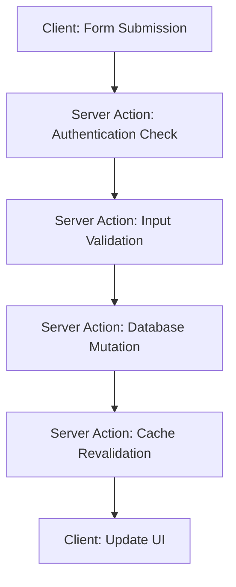
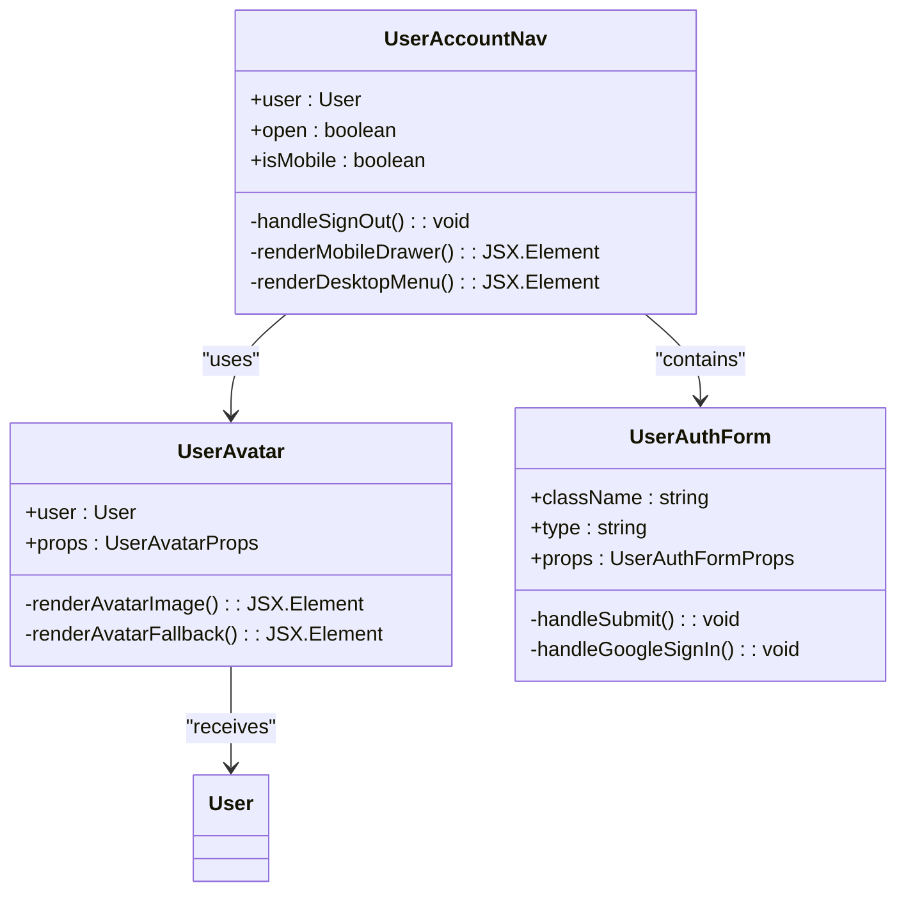
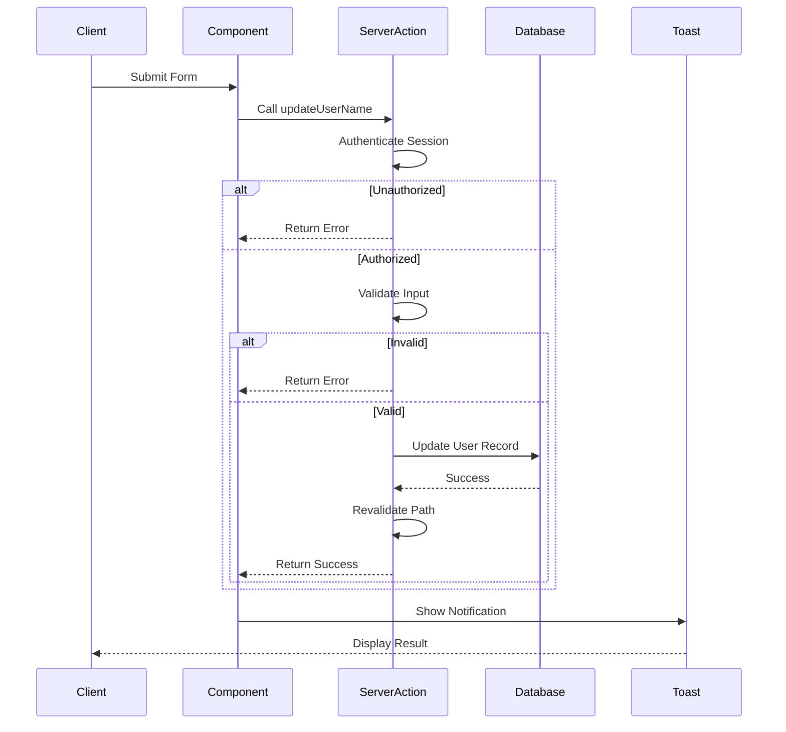
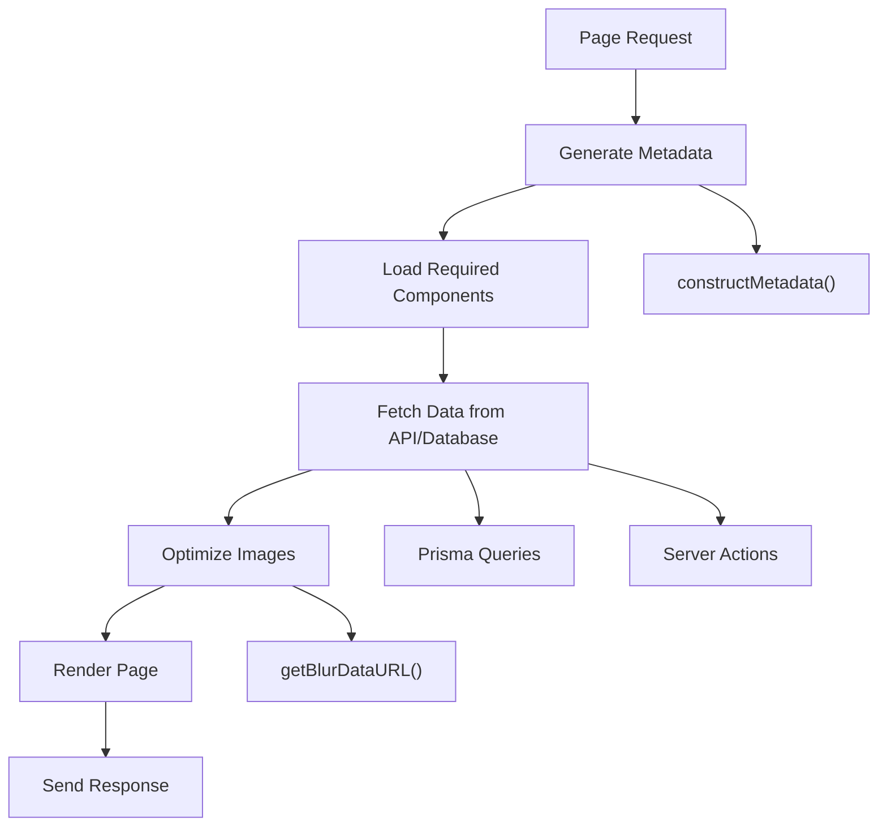

# Development Guidelines

<cite>
**Referenced Files in This Document**   
- [QODER_AGENT_RULES.md](file://QODER_AGENT_RULES.md)
- [actions/update-user-name.ts](file://actions/update-user-name.ts)
- [lib/validations/user.ts](file://lib/validations/user.ts)
- [lib/utils.ts](file://lib/utils.ts)
- [components/forms/user-auth-form.tsx](file://components/forms/user-auth-form.tsx)
- [components/layout/user-account-nav.tsx](file://components/layout/user-account-nav.tsx)
- [components/shared/user-avatar.tsx](file://components/shared/user-avatar.tsx)
- [env.mjs](file://env.mjs)
- [prettier.config.js](file://prettier.config.js)
- [middleware.ts](file://middleware.ts)
</cite>

## Table of Contents
1. [Code Structure and File Organization](#code-structure-and-file-organization)
2. [Naming Conventions and Import Ordering](#naming-conventions-and-import-ordering)
3. [Code Formatting with Prettier](#code-formatting-with-prettier)
4. [Server Actions Pattern](#server-actions-pattern)
5. [Validation Strategy with Zod](#validation-strategy-with-zod)
6. [Component Development Workflow](#component-development-workflow)
7. [Error Handling and User Feedback](#error-handling-and-user-feedback)
8. [Git Workflow and Pull Request Requirements](#git-workflow-and-pull-request-requirements)
9. [Performance Optimization Techniques](#performance-optimization-techniques)
10. [Debugging Strategies](#debugging-strategies)

## Code Structure and File Organization

The project follows a structured directory organization based on functional grouping and Next.js App Router conventions. The architecture separates concerns through clearly defined directories: `app/` for route handling, `components/` for UI elements, `lib/` for utilities and business logic, `actions/` for server mutations, and `config/` for application settings. This separation ensures maintainability and scalability as the codebase grows.

The App Router structure uses route groups with parentheses (e.g., `(auth)`, `(protected)`) to organize pages without affecting URL paths. Authentication-related pages reside in `app/(auth)/`, marketing content in `app/(marketing)/`, documentation in `app/(docs)/`, and protected dashboard routes in `app/(protected)/`. API routes are centralized in `app/api/` for webhooks, authentication callbacks, and user operations.

**Section sources**
- [QODER_AGENT_RULES.md](file://QODER_AGENT_RULES.md#L0-L769)

## Naming Conventions and Import Ordering

The project enforces strict naming conventions to maintain consistency across the codebase. Components use PascalCase (e.g., `UserAuthForm.tsx`), utilities and hooks follow camelCase (e.g., `useMediaQuery.ts`), configuration files use kebab-case (e.g., `site-config.ts`), server actions use descriptive camelCase (e.g., `updateUserName`), and TypeScript interfaces/types use PascalCase (e.g., `SubscriptionPlan`).

Import statements follow a specific order to enhance readability and prevent issues:
1. React imports
2. Next.js imports
3. Third-party modules
4. Types
5. Environment & Config
6. Lib & utilities
7. Hooks
8. UI components
9. Other components
10. Styles
11. Relative imports

This ordering ensures dependencies are loaded predictably and helps identify potential circular dependencies.

**Section sources**
- [QODER_AGENT_RULES.md](file://QODER_AGENT_RULES.md#L0-L769)

## Code Formatting with Prettier

Code formatting is standardized using Prettier with the following rules:
- **Quotes**: Double quotes (`"`)
- **Semi-colons**: Required (`;`)
- **Trailing commas**: All (`trailingComma: "all"`)
- **Tab width**: 2 spaces
- **Print width**: 80 characters
- **Line endings**: LF
- **Bracket spacing**: true

These rules are enforced through the `prettier.config.js` configuration file, ensuring consistent code style across all files regardless of individual developer preferences. The combination of Prettier with ESLint provides comprehensive code quality checks that catch both stylistic and logical issues during development.

**Section sources**
- [QODER_AGENT_RULES.md](file://QODER_AGENT_RULES.md#L0-L769)
- [prettier.config.js](file://prettier.config.js)

## Server Actions Pattern

Server Actions are the preferred method for handling data mutations in this Next.js 14 application. They provide a streamlined approach to performing server-side operations without requiring traditional API routes. Server Actions should be used for database mutations, payment processing, email sending, and other sensitive operations.

A typical Server Action follows this pattern:
1. Authentication check using the centralized `auth` instance
2. Input validation using Zod schemas
3. Database mutation via Prisma
4. Cache revalidation using `revalidatePath`
5. Optional redirection

Server Actions are defined in the `actions/` directory and marked with `"use server"` directive. They return standardized response objects with `status` and optional `message` fields for consistent error handling.



**Diagram sources**
- [actions/update-user-name.ts](file://actions/update-user-name.ts#L11-L37)
- [QODER_AGENT_RULES.md](file://QODER_AGENT_RULES.md#L0-L769)

**Section sources**
- [actions/update-user-name.ts](file://actions/update-user-name.ts#L11-L37)
- [QODER_AGENT_RULES.md](file://QODER_AGENT_RULES.md#L0-L769)

## Validation Strategy with Zod

The project uses Zod for runtime type validation, with schemas organized in the `lib/validations/` directory by feature (e.g., `auth.ts`, `user.ts`). This centralized approach makes it easy to locate and maintain validation logic.

Zod schemas are integrated with React Hook Form using `zodResolver` for seamless form validation. When defining a schema, always specify appropriate constraints such as minimum/maximum lengths, required fields, and data types. The `z.infer` utility extracts TypeScript types from Zod schemas, enabling type-safe operations throughout the application.

For example, the user name validation schema enforces a minimum length of 3 characters and maximum of 32 characters:
```typescript
export const userNameSchema = z.object({
  name: z.string().min(3).max(32),
});
```

This schema can then be used both for form validation and server-side input validation, ensuring consistency between client and server expectations.

**Section sources**
- [lib/validations/user.ts](file://lib/validations/user.ts#L3-L5)
- [components/forms/user-auth-form.tsx](file://components/forms/user-auth-form.tsx#L23-L117)
- [QODER_AGENT_RULES.md](file://QODER_AGENT_RULES.md#L0-L769)

## Component Development Workflow

Components are developed following a structured pattern that emphasizes reusability, accessibility, and type safety. The project distinguishes between Server Components (default) and Client Components (marked with `"use client"`).

Server Components handle data fetching and rendering, while Client Components manage interactivity through React hooks like `useState` and `useEffect`. UI components follow a template structure that includes variant definitions using `class-variance-authority`, props interfaces extending `React.HTMLAttributes`, and forwardRef for proper ref handling.

All components must be properly typed with TypeScript interfaces that extend appropriate HTML attributes. Accessibility requirements include proper use of ARIA labels, semantic HTML elements, and keyboard navigation support. The `cn()` utility from `lib/utils.ts` is used to conditionally apply Tailwind CSS classes while maintaining readability.



**Diagram sources**
- [components/shared/user-avatar.tsx](file://components/shared/user-avatar.tsx#L10-L23)
- [components/forms/user-auth-form.tsx](file://components/forms/user-auth-form.tsx#L17-L19)
- [components/layout/user-account-nav.tsx](file://components/layout/user-account-nav.tsx#L18-L186)

**Section sources**
- [components/shared/user-avatar.tsx](file://components/shared/user-avatar.tsx#L10-L23)
- [components/forms/user-auth-form.tsx](file://components/forms/user-auth-form.tsx#L17-L117)
- [components/layout/user-account-nav.tsx](file://components/layout/user-account-nav.tsx#L18-L186)
- [lib/utils.ts](file://lib/utils.ts#L8-L10)

## Error Handling and User Feedback

Error handling follows a consistent pattern across the application. Operations are wrapped in try-catch blocks, with errors logged appropriately and user-friendly messages returned. The system uses Sonner for toast notifications to provide feedback on success and error states.

For server operations, errors are caught and transformed into standardized response objects with `status` ("success" or "error") and optional `message` fields. These responses are then used to trigger appropriate toast notifications in the UI. Sensitive error details are never exposed to the client, only generic user-friendly messages.

Authentication-related operations include proper session validation and role checking using the `UserRole` enum from Prisma. Middleware handles authentication automatically for protected routes, redirecting unauthorized users to the login page.



**Diagram sources**
- [actions/update-user-name.ts](file://actions/update-user-name.ts#L11-L37)
- [components/ui/use-toast.ts](file://components/ui/use-toast.ts#L139-L166)
- [QODER_AGENT_RULES.md](file://QODER_AGENT_RULES.md#L0-L769)

**Section sources**
- [actions/update-user-name.ts](file://actions/update-user-name.ts#L11-L37)
- [components/ui/use-toast.ts](file://components/ui/use-toast.ts#L139-L166)
- [QODER_AGENT_RULES.md](file://QODER_AGENT_RULES.md#L0-L769)

## Git Workflow and Pull Request Requirements

The project follows a standard Git workflow with feature branches, pull requests, and code reviews. Branch names should be descriptive and follow the pattern `feature/descriptive-name`, `fix/issue-description`, or `docs/update-documentation`.

Pull requests must include:
- Clear description of changes
- Reference to related issues (if applicable)
- Screenshots for UI changes
- Testing instructions
- Confirmation that all checks pass (linting, type checking, tests)

Before submitting a pull request, developers must ensure their code adheres to the project's coding standards, passes all linting rules, and includes appropriate tests for new functionality. The code review checklist in QODER_AGENT_RULES.md should be followed to verify imports, TypeScript types, authentication checks, and other quality metrics.

**Section sources**
- [QODER_AGENT_RULES.md](file://QODER_AGENT_RULES.md#L0-L769)

## Performance Optimization Techniques

Performance optimization is addressed through several strategies:
- **Image Optimization**: Use Next.js `Image` component with specified dimensions and blur placeholders
- **Metadata Generation**: Utilize the `constructMetadata` utility for SEO-friendly metadata
- **Dynamic OG Images**: Implement API routes for generating dynamic Open Graph images
- **Code Splitting**: Leverage Next.js automatic code splitting by route
- **Caching**: Use `revalidatePath` to control revalidation of server components
- **Environment Variables**: Access environment variables through the type-safe `env.mjs` module

The `constructMetadata` function in `lib/utils.ts` provides a consistent way to generate metadata with proper Open Graph and Twitter card tags. Image optimization includes generating blur data URLs for placeholder effects using the `getBlurDataURL` utility.



**Diagram sources**
- [lib/utils.ts](file://lib/utils.ts#L12-L70)
- [lib/utils.ts](file://lib/utils.ts#L148-L168)
- [QODER_AGENT_RULES.md](file://QODER_AGENT_RULES.md#L0-L769)

**Section sources**
- [lib/utils.ts](file://lib/utils.ts#L12-L70)
- [lib/utils.ts](file://lib/utils.ts#L148-L168)
- [QODER_AGENT_RULES.md](file://QODER_AGENT_RULES.md#L0-L769)

## Debugging Strategies

Effective debugging strategies include:
- Using `console.log` judiciously in development, with proper removal before production
- Leveraging Next.js built-in error overlay for client-side issues
- Checking server logs for API route and Server Action errors
- Using Stripe CLI for webhook testing: `stripe listen --forward-to localhost:3000/api/webhooks/stripe`
- Validating environment variables with `pnpm tsc --noEmit`
- Running `npx prisma studio` to inspect database state
- Using browser developer tools to analyze network requests and component state

For authentication issues, verify that `AUTH_SECRET` is set and unique, OAuth redirect URIs match exactly, and the database connection is working. For Stripe integration problems, ensure webhook secrets match and price IDs are correct. Database connection issues can be diagnosed by verifying the `DATABASE_URL` format and running `npx prisma db push` to sync the schema.

**Section sources**
- [QODER_AGENT_RULES.md](file://QODER_AGENT_RULES.md#L0-L769)
- [ENVIRONMENT_SETUP_GUIDE.md](file://ENVIRONMENT_SETUP_GUIDE.md#L12-L58)
- [middleware.ts](file://middleware.ts)