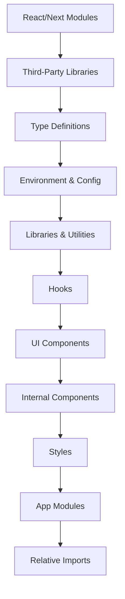
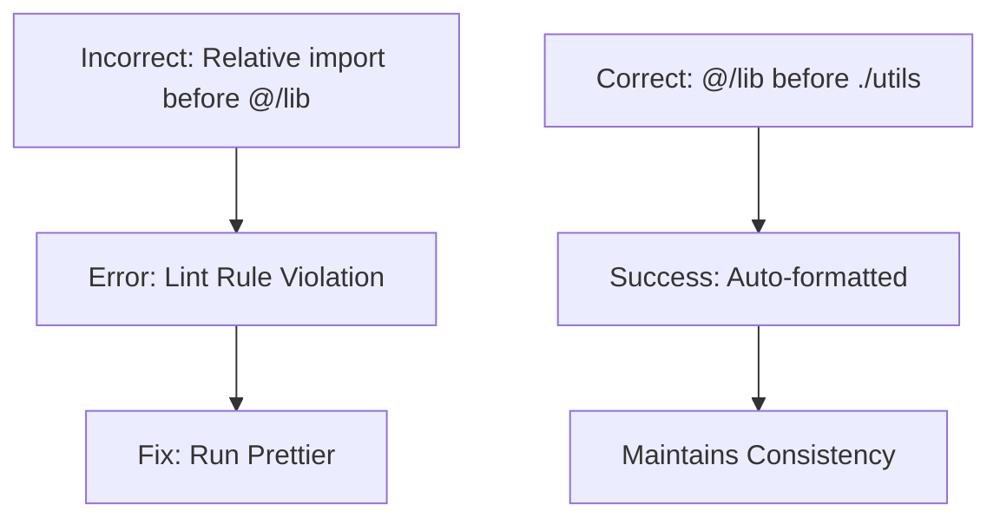

# Import Order

<cite>
**Referenced Files in This Document**   
- [prettier.config.js](file://prettier.config.js)
- [tsconfig.json](file://tsconfig.json)
- [page.tsx](file://app/(auth)/login/page.tsx)
- [user-auth-form.tsx](file://components/forms/user-auth-form.tsx)
- [update-user-name.ts](file://actions/update-user-name.ts)
- [utils.ts](file://lib/utils.ts)
- [auth.ts](file://lib/validations/auth.ts)
</cite>

## Table of Contents
1. [Introduction](#introduction)
2. [Import Grouping Strategy](#import-grouping-strategy)
3. [ESLint and Prettier Integration](#eslint-and-prettier-integration)
4. [Codebase Examples of Correct Import Ordering](#codebase-examples-of-correct-import-ordering)
5. [Common Import Mistakes and Prevention](#common-import-mistakes-and-prevention)
6. [Tooling Support and TypeScript Resolution](#tooling-support-and-typescript-resolution)
7. [Troubleshooting Import-Related Errors](#troubleshooting-import-related-errors)
8. [Performance Implications of Optimal Import Organization](#performance-implications-of-optimal-import-organization)

## Introduction
This document outlines the standardized import ordering rules enforced across the codebase to ensure consistency, readability, and maintainability. The project leverages Prettier with a custom plugin to automatically sort and group imports according to a well-defined hierarchy. This convention supports seamless integration with TypeScript, ESLint, and other tooling while minimizing risks such as circular dependencies and path resolution errors.

**Section sources**
- [prettier.config.js](file://prettier.config.js#L1-L35)
- [tsconfig.json](file://tsconfig.json#L1-L39)

## Import Grouping Strategy
The codebase follows a strict import grouping strategy designed to logically separate dependencies by origin and purpose. The order is defined in `prettier.config.js` using the `@ianvs/prettier-plugin-sort-imports` plugin, which enforces the following sequence:

1. **React and Next.js core modules** – Special handling for React and Next.js runtime essentials.
2. **Third-party libraries** – External packages from `node_modules`.
3. **Type definitions** – Top-level `types` imports.
4. **Environment and configuration** – Environment variables and app-wide config.
5. **Internal utilities and hooks** – Shared logic and reusable functions.
6. **UI components** – Component library imports, prioritizing base UI.
7. **Application modules** – Route and page-level imports.
8. **Relative path imports** – Local file references within the same module or directory.

This grouping enhances readability by making dependency origins immediately apparent and reduces cognitive load when auditing or refactoring code.

**Diagram sources**
- [prettier.config.js](file://prettier.config.js#L6-L24)

**Section sources**
- [prettier.config.js](file://prettier.config.js#L6-L24)

## ESLint and Prettier Integration
The import order is enforced through Prettier's integration with the `@ianvs/prettier-plugin-sort-imports` plugin, configured in `prettier.config.js`. This setup ensures that all imports are automatically sorted on save or during formatting runs. Key configuration options include:

- `importOrderSortSpecifiers`: Ensures named imports within each group are alphabetized.
- `importOrderBuiltinModulesToTop`: Prioritizes Node.js built-ins.
- `importOrderMergeDuplicateImports`: Combines repeated imports from the same module.
- `importOrderCombineTypeAndValueImports`: Groups type and value imports together when possible.

These rules work in tandem with ESLint to flag unsorted or incorrectly grouped imports during linting, ensuring consistency before commits.

**Section sources**
- [prettier.config.js](file://prettier.config.js#L6-L28)

## Codebase Examples of Correct Import Ordering
The following examples illustrate proper import ordering as enforced by the toolchain.

### Page Component: Login Page
In `app/(auth)/login/page.tsx`, imports follow the expected hierarchy:
- React and Next.js metadata first.
- Third-party components and utilities.
- Internal components using `@/` path aliases.
- UI and shared components.

This structure ensures that external dependencies are declared before internal abstractions, improving clarity.

**Section sources**
- [app/(auth)/login/page.tsx](file://app/(auth)/login/page.tsx#L1-L55)

### Form Component: User Authentication
The `user-auth-form.tsx` component demonstrates complex import usage:
- Client-side React and Next.js hooks.
- Third-party libraries like `zod` and `react-hook-form`.
- Internal validations and utilities.
- UI components from the component library.

All imports are correctly grouped, enabling easy identification of external versus internal dependencies.

**Section sources**
- [components/forms/user-auth-form.tsx](file://components/forms/user-auth-form.tsx#L1-L119)

### Server Action: Update User Name
In `actions/update-user-name.ts`, server-side imports are ordered to reflect:
- Server directive (`"use server"`).
- Authentication and database clients.
- Validation schemas.
- Next.js cache revalidation utilities.

This ordering supports clear separation between infrastructure, business logic, and side effects.

**Section sources**
- [actions/update-user-name.ts](file://actions/update-user-name.ts#L1-L38)

## Common Import Mistakes and Prevention
### Circular Dependencies
Improper import ordering can lead to circular dependencies, especially when utility modules import from higher-level components. The enforced grouping minimizes this risk by ensuring lower-level modules (e.g., `lib`, `utils`) are not dependent on higher-level ones (e.g., `components`, `app`).

### Incorrect Path Aliases
Misuse of `@/` aliases (e.g., `@/src/components`) can break resolution. The `tsconfig.json` defines `@/*` to map to the root, so all internal imports must follow `@/lib`, `@/components`, etc., without additional path segments.

### Unsorted Imports
Manual edits may disrupt order. Prettier automatically corrects this during formatting, but developers should understand the grouping logic to avoid confusion.

**Diagram sources**
- [prettier.config.js](file://prettier.config.js#L6-L24)
- [tsconfig.json](file://tsconfig.json#L20-L22)

**Section sources**
- [prettier.config.js](file://prettier.config.js#L6-L24)
- [tsconfig.json](file://tsconfig.json#L20-L22)

## Tooling Support and TypeScript Resolution
The `tsconfig.json` file configures `baseUrl` and `paths` to support absolute imports via the `@/*` alias. This enables consistent module resolution across the codebase and aligns with Prettier’s sorting logic. TypeScript recognizes these paths, providing accurate type checking and autocomplete in editors.

Additionally, the `importOrderParserPlugins` setting ensures compatibility with TypeScript syntax, JSX, and legacy decorators, allowing correct parsing of all module types.

**Section sources**
- [tsconfig.json](file://tsconfig.json#L19-L23)

## Troubleshooting Import-Related Errors
### "Module Not Found" Errors
- Verify the import path matches the file location.
- Ensure `@/` is used for root-relative imports (not `src/` or `./`).
- Confirm the file exists and the extension is correct (TypeScript infers `.ts`, `.tsx`).

### Type Resolution Failures
- Check `tsconfig.json` includes the file in `include` patterns.
- Validate that type imports are not being stripped due to incorrect `import type` usage.

### Prettier Formatting Issues
- Install `@ianvs/prettier-plugin-sort-imports` in the dev environment.
- Ensure Prettier runs with the correct configuration.
- Restart editor language servers if imports fail to sort.

**Section sources**
- [tsconfig.json](file://tsconfig.json#L34-L37)
- [prettier.config.js](file://prettier.config.js#L1-L35)

## Performance Implications of Optimal Import Organization
Well-organized imports contribute to better build performance and bundle optimization:
- **Tree-shaking**: Properly grouped and named imports help bundlers eliminate unused code.
- **Caching**: Stable import order improves cache hit rates in development and CI/CD pipelines.
- **Bundle Analysis**: Clear grouping simplifies identifying large dependencies.
- **Lazy Loading**: Relative imports at the bottom support dynamic `import()` patterns for code splitting.

By maintaining a consistent structure, the codebase ensures that performance optimizations are not undermined by disorganized module references.

**Section sources**
- [prettier.config.js](file://prettier.config.js#L6-L24)
- [tsconfig.json](file://tsconfig.json#L19-L23)