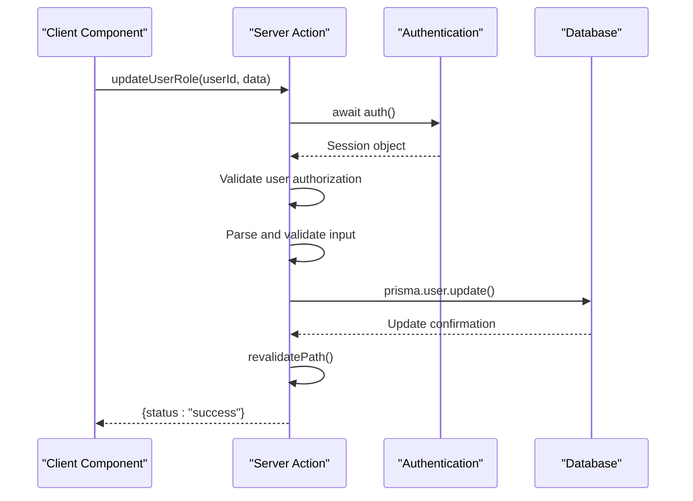
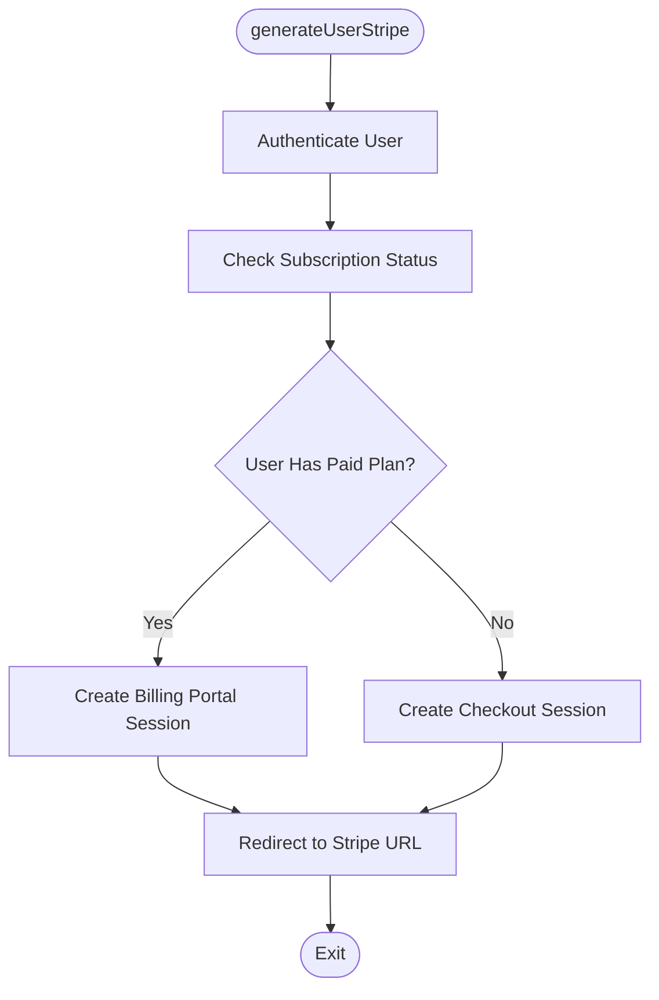
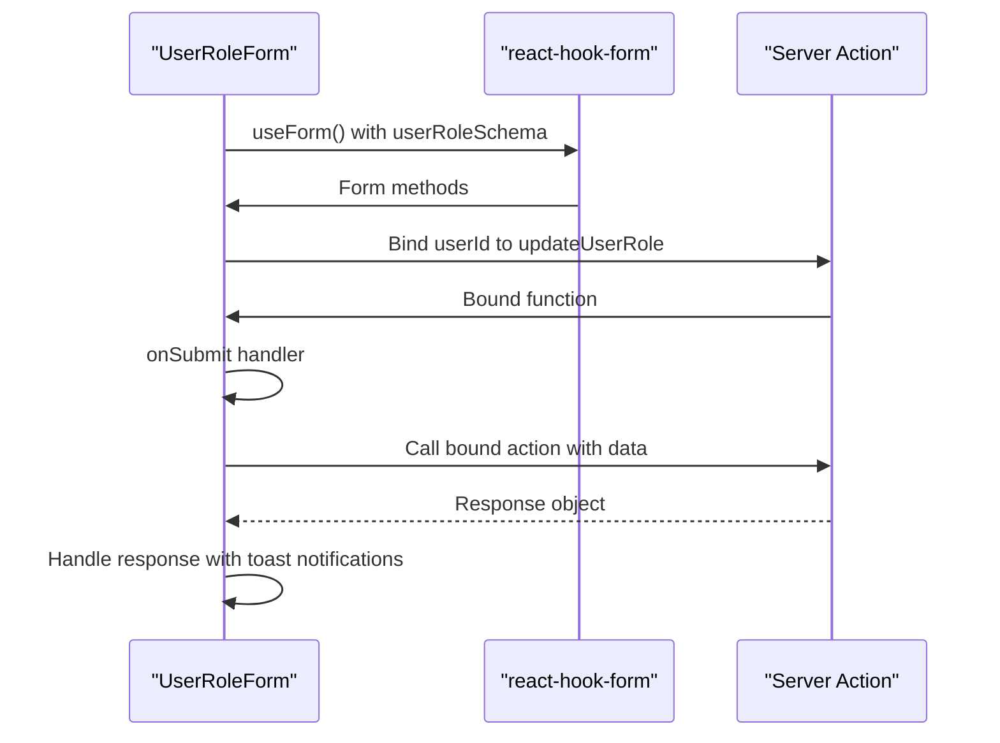
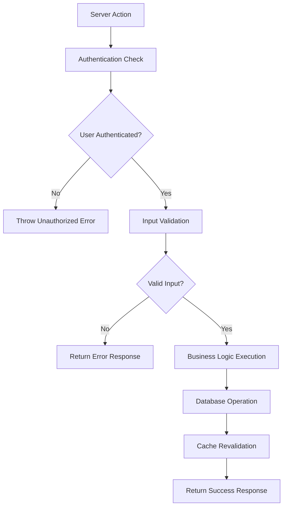

# Server Actions Pattern

<cite>
**Referenced Files in This Document**   
- [generate-user-stripe.ts](file://actions/generate-user-stripe.ts)
- [update-user-role.ts](file://actions/update-user-role.ts)
- [user-role-form.tsx](file://components/forms/user-role-form.tsx)
- [billing-form-button.tsx](file://components/forms/billing-form-button.tsx)
- [user.ts](file://lib/validations/user.ts)
- [stripe.ts](file://lib/stripe.ts)
- [subscription.ts](file://lib/subscription.ts)
- [types/index.d.ts](file://types/index.d.ts)
</cite>

## Table of Contents
1. [Introduction](#introduction)
2. [Server Actions Overview](#server-actions-overview)
3. [Core Implementation Examples](#core-implementation-examples)
4. [Form Integration Patterns](#form-integration-patterns)
5. [Error Handling and Security](#error-handling-and-security)
6. [Performance and Execution Context](#performance-and-execution-context)
7. [Troubleshooting Common Issues](#troubleshooting-common-issues)

## Introduction
Server Actions in Next.js App Router provide a modern approach to handling data mutations directly from React components. This document explores the implementation and usage patterns of Server Actions within the application, focusing on real-world examples such as user role updates and Stripe integration. The pattern eliminates the need for traditional API routes by allowing direct server function calls from client components, improving developer experience and reducing boilerplate code.

## Server Actions Overview
Server Actions enable direct invocation of server-side functions from client components without requiring separate API endpoints. Marked with `"use server"` directive, these functions execute on the server and can securely access backend resources like databases and external services. They offer several advantages over traditional API routes:

- Simplified data mutation handling
- Reduced boilerplate code
- Improved type safety through direct function imports
- Automatic protection against client-side exposure of sensitive logic
- Built-in support for form handling and progressive enhancement

The implementation follows security best practices by performing authentication checks, input validation, and proper error handling within each action.

**Section sources**
- [generate-user-stripe.ts](file://actions/generate-user-stripe.ts#L1-L15)
- [update-user-role.ts](file://actions/update-user-role.ts#L1-L12)

## Core Implementation Examples

### User Role Update Action
The `updateUserRole` action demonstrates a typical data mutation pattern. It accepts a user ID and form data, performs authentication validation to ensure the current user matches the target user, validates input using Zod schemas, updates the database via Prisma, and revalidates the relevant path to reflect changes.

**Diagram sources**
- [update-user-role.ts](file://actions/update-user-role.ts#L13-L39)
- [user.ts](file://lib/validations/user.ts#L7-L10)

### Stripe Session Generation
The `generateUserStripe` action handles subscription management by determining whether to create a checkout session for new customers or a billing portal session for existing subscribers. It uses the user's subscription status to determine the appropriate flow, creates the corresponding Stripe session, and redirects the user to the payment interface.

**Diagram sources**
- [generate-user-stripe.ts](file://actions/generate-user-stripe.ts#L16-L65)
- [subscription.ts](file://lib/subscription.ts#L10-L65)

## Form Integration Patterns
Server Actions integrate seamlessly with React Hook Form through the use of bound functions and transition states. The client components import server actions and bind necessary parameters (like user ID) before passing them to form handlers.

### Role Update Form Integration
The `UserRoleForm` component demonstrates this pattern by binding the user ID to the `updateUserRole` action, creating a specialized function that only requires the form data. It uses `useTransition` to manage pending states and `react-hook-form` with Zod resolver for validation.

**Diagram sources**
- [user-role-form.tsx](file://components/forms/user-role-form.tsx#L20-L45)
- [update-user-role.ts](file://actions/update-user-role.ts#L13-L39)

### Billing Action Integration
The `BillingFormButton` component integrates the `generateUserStripe` action by binding the price ID based on the selected subscription plan. It handles both upgrade flows for free users and subscription management for paid users, displaying appropriate button states based on the current subscription status.

**Section sources**
- [billing-form-button.tsx](file://components/forms/billing-form-button.tsx#L10-L35)
- [generate-user-stripe.ts](file://actions/generate-user-stripe.ts#L16-L65)

## Error Handling and Security
The Server Actions implementation includes comprehensive error handling and security measures to protect against unauthorized access and invalid inputs.

### Authentication and Authorization
All actions begin with authentication checks using the `auth()` function from the centralized auth instance. They verify both the presence of a valid session and that the requesting user has permission to perform the action (e.g., matching user IDs for personal data updates).

### Input Validation
Input validation is performed using Zod schemas defined in the `lib/validations` directory. The `userRoleSchema` validates that the role value matches the defined `UserRole` enum from Prisma, preventing invalid data from reaching the database.

**Diagram sources**
- [update-user-role.ts](file://actions/update-user-role.ts#L13-L39)
- [user.ts](file://lib/validations/user.ts#L7-L10)

**Section sources**
- [update-user-role.ts](file://actions/update-user-role.ts#L13-L39)
- [generate-user-stripe.ts](file://actions/generate-user-stripe.ts#L16-L65)

## Performance and Execution Context
Server Actions execute in the server environment, providing access to backend resources while maintaining separation from client-side code. This execution context offers several performance and security benefits:

- Database connections are established server-side, avoiding exposure of credentials
- External service API keys (like Stripe) remain secure on the server
- Cache revalidation can be performed directly after mutations
- No additional network requests are needed for API communication

The actions leverage Next.js caching mechanisms through `revalidatePath` to ensure UI consistency after data mutations. For redirect scenarios like the Stripe integration, the framework handles navigation without requiring additional client-side logic.

**Section sources**
- [generate-user-stripe.ts](file://actions/generate-user-stripe.ts#L63-L65)
- [update-user-role.ts](file://actions/update-user-role.ts#L37-L38)

## Troubleshooting Common Issues

### "Action Not Available" Errors
This error typically occurs when:
- The action function is not properly exported from the actions directory
- There's a mismatch between the imported action name and the actual export
- The `"use server"` directive is missing from the action file
- The component attempting to use the action is not a Client Component (missing `"use client"`)

Resolution steps:
1. Verify the action file includes `"use server"` at the top
2. Ensure the component using the action has `"use client"` directive
3. Check import paths and export names for consistency
4. Confirm the action is being called with correct parameters

### Debugging Techniques
Effective debugging strategies include:
- Using console logs in development (commented out in production)
- Implementing proper error boundaries in client components
- Validating input types match expected schemas
- Checking authentication state before action invocation
- Verifying environment variables are properly configured

Common issues often stem from authentication state mismatches or invalid input data that fails schema validation. The pattern of returning structured response objects (with status field) enables consistent error handling across different actions.

**Section sources**
- [update-user-role.ts](file://actions/update-user-role.ts#L30-L35)
- [generate-user-stripe.ts](file://actions/generate-user-stripe.ts#L45-L55)
- [user-role-form.tsx](file://components/forms/user-role-form.tsx#L50-L75)