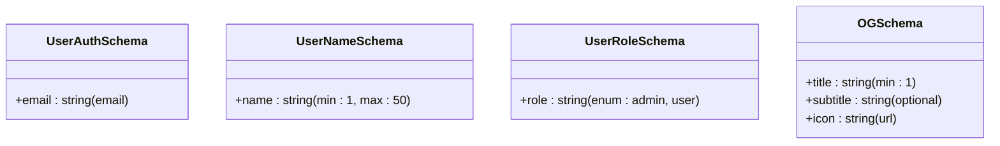
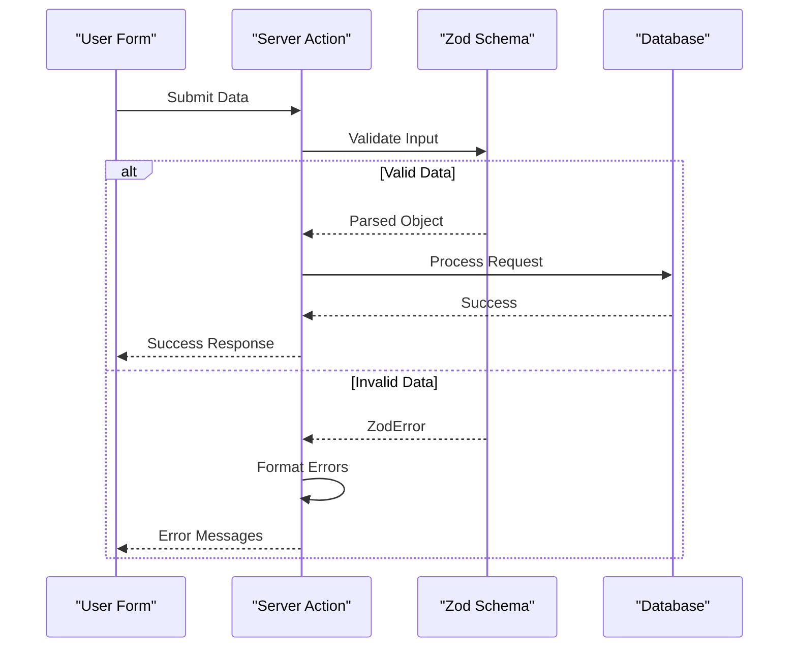
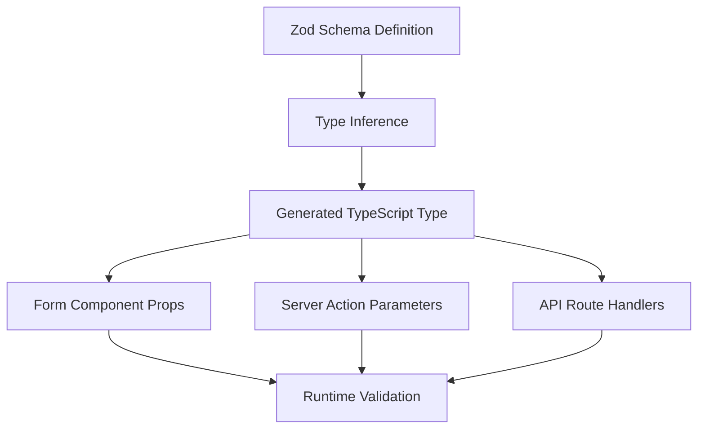

# Validation with Zod

<cite>
**Referenced Files in This Document**   
- [auth.ts](file://lib/validations/auth.ts)
- [og.ts](file://lib/validations/og.ts)
- [user.ts](file://lib/validations/user.ts)
- [update-user-name.ts](file://actions/update-user-name.ts)
- [update-user-role.ts](file://actions/update-user-role.ts)
- [page.tsx](file://app/(protected)/dashboard/settings/page.tsx)
- [user-name-form.tsx](file://components/forms/user-name-form.tsx)
- [user-role-form.tsx](file://components/forms/user-role-form.tsx)
- [route.ts](file://app/api/user/route.ts)
</cite>

## Table of Contents
1. [Introduction](#introduction)
2. [Zod Validation Strategy Overview](#zod-validation-strategy-overview)
3. [Core Validation Schemas](#core-validation-schemas)
4. [Integration with Server Actions](#integration-with-server-actions)
5. [API Route Validation](#api-route-validation)
6. [TypeScript Integration and Type Inference](#typescript-integration-and-type-inference)
7. [Error Handling and User Feedback](#error-handling-and-user-feedback)
8. [Security Benefits of Zod Validation](#security-benefits-of-zod-validation)
9. [Handling Complex Nested Objects](#handling-complex-nested-objects)
10. [Performance Considerations](#performance-considerations)
11. [Schema Reusability Across Application](#schema-reusability-across-application)
12. [Conclusion](#conclusion)

## Introduction
This document provides a comprehensive analysis of the validation strategy implemented using Zod schemas in the Next.js SaaS application. It details how Zod ensures type safety, data integrity, and security across Server Actions and API routes. The documentation covers schema design, integration patterns, error handling, and performance optimization techniques used throughout the codebase.

## Zod Validation Strategy Overview
The application employs Zod as its primary validation library to enforce strict data contracts at runtime. Validation occurs at multiple entry points including Server Actions, API routes, and form submissions. Zod schemas are centrally defined in `lib/validations/` to promote consistency and reusability. This strategy prevents malformed data from propagating through the system while providing clear error messages for user feedback.

**Section sources**
- [auth.ts](file://lib/validations/auth.ts#L1-L5)
- [og.ts](file://lib/validations/og.ts#L1-L10)
- [user.ts](file://lib/validations/user.ts#L1-L15)

## Core Validation Schemas
The validation system is built around three primary schema files in the `lib/validations/` directory:

- **auth.ts**: Contains authentication-related schemas such as email validation
- **og.ts**: Defines schemas for Open Graph image generation parameters
- **user.ts**: Includes user data validation schemas for profile updates

These schemas use Zod's fluent API to define type-safe validation rules with minimal boilerplate. For example, the `userAuthSchema` validates email format using Zod's built-in string validators.



**Diagram sources**
- [auth.ts](file://lib/validations/auth.ts#L3-L6)
- [user.ts](file://lib/validations/user.ts#L5-L12)
- [og.ts](file://lib/validations/og.ts#L8-L15)

**Section sources**
- [auth.ts](file://lib/validations/auth.ts#L1-L10)
- [user.ts](file://lib/validations/user.ts#L1-L20)
- [og.ts](file://lib/validations/og.ts#L1-L20)

## Integration with Server Actions
Zod schemas are tightly integrated with Server Actions to validate incoming data before processing. Actions like `update-user-name.ts` and `update-user-role.ts` import their respective validation schemas and parse input data using Zod's `.parse()` method. This ensures that only properly formatted data reaches the business logic layer.

The validation process follows a consistent pattern:
1. Import the appropriate Zod schema
2. Parse the input data using the schema
3. Handle validation errors with structured error objects
4. Proceed with business logic only on successful validation



**Diagram sources**
- [update-user-name.ts](file://actions/update-user-name.ts#L10-L25)
- [update-user-role.ts](file://actions/update-user-role.ts#L8-L22)

**Section sources**
- [update-user-name.ts](file://actions/update-user-name.ts#L1-L30)
- [update-user-role.ts](file://actions/update-user-role.ts#L1-L25)
- [user-name-form.tsx](file://components/forms/user-name-form.tsx#L15-L40)
- [user-role-form.tsx](file://components/forms/user-role-form.tsx#L12-L35)

## API Route Validation
API routes leverage Zod validation to secure external endpoints. The `/api/user` route, for example, uses Zod schemas to validate incoming JSON payloads before any database operations occur. This prevents malformed requests from reaching critical backend systems.

Validation in API routes typically follows this flow:
- Parse request body
- Apply Zod schema validation
- Return 400 status for invalid data with detailed error messages
- Proceed with request handling for valid data

This approach ensures that API consumers receive clear feedback about malformed requests while protecting the application from invalid data injection.

**Section sources**
- [route.ts](file://app/api/user/route.ts#L15-L40)
- [user.ts](file://lib/validations/user.ts#L1-L20)

## TypeScript Integration and Type Inference
One of Zod's key advantages in this codebase is its seamless integration with TypeScript. Each Zod schema automatically generates TypeScript types through inference, eliminating the need for duplicate type definitions. This provides compile-time type safety alongside runtime validation.

For example, the `userAuthSchema` can be used to derive a TypeScript type:
```typescript
type UserAuthInput = z.infer<typeof userAuthSchema>
```

This inferred type is then used throughout the codebase in form components and Server Actions, ensuring consistency between validation rules and type expectations. The combination of runtime validation and compile-time checking creates a robust type safety system.



**Diagram sources**
- [auth.ts](file://lib/validations/auth.ts#L3-L6)
- [user.ts](file://lib/validations/user.ts#L5-L12)
- [page.tsx](file://app/(protected)/dashboard/settings/page.tsx#L20-L35)

**Section sources**
- [auth.ts](file://lib/validations/auth.ts#L1-L10)
- [user.ts](file://lib/validations/user.ts#L1-L20)
- [page.tsx](file://app/(protected)/dashboard/settings/page.tsx#L10-L50)

## Error Handling and User Feedback
The application implements a structured error handling pattern when Zod validation fails. Instead of exposing raw validation errors, they are transformed into user-friendly messages that can be displayed in form interfaces.

Key aspects of the error handling strategy:
- Catch Zod validation errors using try/catch blocks
- Map Zod error paths to form field names
- Convert technical validation messages into plain language
- Return structured error objects to the frontend
- Display errors using UI components like toast notifications

This approach ensures that users receive clear, actionable feedback when form submissions fail validation, improving the overall user experience.

**Section sources**
- [update-user-name.ts](file://actions/update-user-name.ts#L20-L35)
- [user-name-form.tsx](file://components/forms/user-name-form.tsx#L25-L60)
- [user-role-form.tsx](file://components/forms/user-role-form.tsx#L20-L55)

## Security Benefits of Zod Validation
Zod validation serves as a critical security layer by preventing malformed or malicious data from reaching sensitive parts of the application. By validating all external inputs, the system mitigates several common security risks:

- **Injection attacks**: Ensures data conforms to expected formats
- **Data corruption**: Prevents invalid data from being stored
- **Type confusion**: Enforces strict type checking at runtime
- **Information disclosure**: Blocks malformed requests that could expose system details

The validation layer acts as a gatekeeper, ensuring that only properly structured data can trigger business logic, database operations, or external service calls.

**Section sources**
- [auth.ts](file://lib/validations/auth.ts#L1-L10)
- [user.ts](file://lib/validations/user.ts#L1-L20)
- [route.ts](file://app/api/user/route.ts#L15-L40)

## Handling Complex Nested Objects
While the current implementation primarily deals with flat objects, Zod provides robust support for complex nested validation scenarios. The schema system can handle:

- Nested object structures
- Arrays of objects with their own validation rules
- Conditional validation based on field values
- Union and intersection types
- Custom validation functions

For future expansion, the validation system can be enhanced to handle more complex data structures by leveraging Zod's advanced features like `.refine()`, `.superRefine()`, and recursive schemas.

**Section sources**
- [og.ts](file://lib/validations/og.ts#L8-L25)
- [user.ts](file://lib/validations/user.ts#L15-L30)

## Performance Considerations
Zod validation introduces minimal runtime overhead while providing significant safety benefits. The performance characteristics include:

- **Fast parsing**: Zod is optimized for high-performance validation
- **Tree shaking**: Unused validation rules are eliminated in production
- **Caching**: Schema compilation is cached after initial creation
- **Selective validation**: Only validate data that will be used

To optimize performance:
- Reuse compiled schemas rather than redefining them
- Use `.strict()` only when necessary to avoid excessive validation
- Consider lazy validation for non-critical paths
- Leverage Zod's async validation for complex checks

The current implementation balances thorough validation with performance by applying strict checks only at entry points and trusting data within the internal system boundary.

**Section sources**
- [auth.ts](file://lib/validations/auth.ts#L1-L10)
- [user.ts](file://lib/validations/user.ts#L1-L20)
- [og.ts](file://lib/validations/og.ts#L1-L20)

## Schema Reusability Across Application
A key strength of the validation architecture is schema reusability. Zod schemas defined in `lib/validations/` are imported and used across multiple contexts:

- **Server Actions**: For form submissions
- **API Routes**: For REST endpoint validation
- **Form Components**: For client-side type safety
- **Utility Functions**: For data processing

This centralized approach ensures consistency in validation rules throughout the application. When a validation rule changes, it only needs to be updated in one location, reducing the risk of inconsistencies and making maintenance easier.

**Section sources**
- [auth.ts](file://lib/validations/auth.ts#L1-L10)
- [update-user-name.ts](file://actions/update-user-name.ts#L5-L15)
- [route.ts](file://app/api/user/route.ts#L10-L20)
- [page.tsx](file://app/(protected)/dashboard/settings/page.tsx#L15-L30)

## Conclusion
The Zod-based validation strategy in this application provides a robust system for ensuring data integrity, type safety, and security. By centralizing validation logic in reusable schemas and integrating them consistently across Server Actions and API routes, the codebase maintains high data quality while providing excellent developer experience through TypeScript integration. The error handling patterns ensure users receive meaningful feedback, and the performance characteristics remain efficient even with comprehensive validation. This approach serves as a strong foundation for building reliable and maintainable applications.