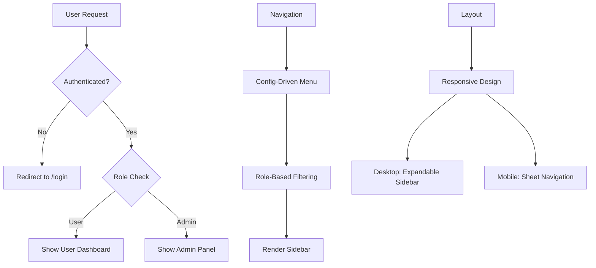
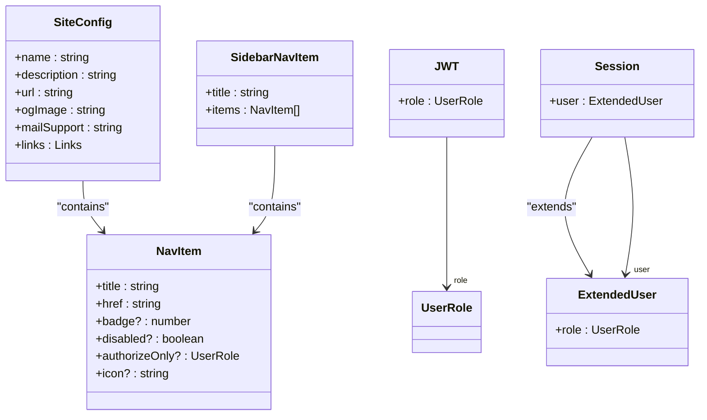

# Directory Structure Breakdown

<cite>
**Referenced Files in This Document**   
- [app/layout.tsx](file://app/layout.tsx)
- [app/(auth)/layout.tsx](file://app/(auth)/layout.tsx)
- [app/(protected)/layout.tsx](file://app/(protected)/layout.tsx)
- [components/layout/navbar.tsx](file://components/layout/navbar.tsx)
- [components/layout/dashboard-sidebar.tsx](file://components/layout/dashboard-sidebar.tsx)
- [config/site.ts](file://config/site.ts)
- [config/dashboard.ts](file://config/dashboard.ts)
- [types/index.d.ts](file://types/index.d.ts)
- [types/next-auth.d.ts](file://types/next-auth.d.ts)
- [lib/session.ts](file://lib/session.ts)
- [lib/user.ts](file://lib/user.ts)
- [auth.config.ts](file://auth.config.ts)
- [auth.ts](file://auth.ts)
- [app/api/auth/[...nextauth]/route.ts](file://app/api/auth/[...nextauth]/route.ts)
</cite>

## Table of Contents
1. [Top-Level Directory Overview](#top-level-directory-overview)
2. [Routing Strategy and Route Groups](#routing-strategy-and-route-groups)
3. [UI Component Organization](#ui-component-organization)
4. [Navigation and Layout Patterns](#navigation-and-layout-patterns)
5. [Configuration and Type System](#configuration-and-type-system)

## Top-Level Directory Overview

The project follows a modular and scalable structure designed for a Next.js SaaS application with clear separation of concerns. Each top-level directory serves a distinct purpose:

- **actions**: Contains server actions responsible for data mutations such as updating user information, generating Stripe customer portals, and managing user roles. These are used in server components to perform secure backend operations.
  
- **app**: Implements the Next.js App Router architecture, organizing routes into logical groups using route groups (e.g., (auth), (protected)). This directory includes both UI pages and API routes, enabling full-stack functionality within a single routing system.

- **components**: Houses a comprehensive UI component library categorized by feature (e.g., charts, dashboard, forms). Components are further divided into reusable primitives (ui), layout structures (layout), and higher-level sections (sections), promoting consistency and reusability.

- **config**: Centralizes application configuration objects that define navigation items, site metadata, and feature-specific settings. These configurations are consumed across the app to maintain consistent UI and behavior.

- **emails**: Stores transactional email templates such as magic link authentication emails, enabling reusable and type-safe email content generation.

- **hooks**: Contains custom React hooks for handling common frontend logic like media queries, scroll detection, local storage synchronization, and modal state management.

- **lib**: Encapsulates core business logic, utility functions, and service integrations (e.g., Stripe, authentication, database access). This layer abstracts complex operations and provides reusable functions across the application.

- **prisma**: Manages the database schema and migration history, defining data models and relationships using Prisma ORM. This ensures type-safe database interactions and version-controlled schema evolution.

- **styles**: Contains global CSS definitions and MDX-specific styling rules, ensuring consistent visual presentation across the application.

- **types**: Defines TypeScript interfaces and augments external types (e.g., NextAuth) to ensure type safety throughout the codebase. This includes custom user roles, navigation structures, and subscription plan definitions.

**Section sources**
- [types/index.d.ts](file://types/index.d.ts#L1-L102)
- [types/next-auth.d.ts](file://types/next-auth.d.ts#L1-L19)

## Routing Strategy and Route Groups

The application leverages Next.js route groups to logically separate different areas of the application while keeping them within the same routing hierarchy. Route groups are denoted by parentheses and do not appear in the URL path, allowing for organizational clarity without affecting routing semantics.

- **(auth)**: Contains authentication-related routes such as login and registration. It uses a dedicated layout (`app/(auth)/layout.tsx`) that redirects authenticated users away from auth pages, enforcing access control at the routing level.

- **(docs)**: Organizes documentation content with dynamic routing for guides and documentation pages. The layout provides consistent navigation and search functionality across all documentation routes.

- **(marketing)**: Houses public-facing marketing pages including the homepage, blog, and pricing information. This route group uses a shared layout that includes navigation, SEO metadata, and error handling components.

- **(protected)**: Wraps authenticated user routes such as dashboard and admin panels. The layout enforces authentication by redirecting unauthenticated users to the login page and conditionally rendering sidebar navigation based on user role.

- **api**: Contains API routes implemented using Next.js Route Handlers. These include authentication endpoints, webhook handlers (e.g., Stripe), and utility endpoints like OpenGraph image generation.

The root `app/layout.tsx` provides global providers such as `SessionProvider`, `ThemeProvider`, and `ModalProvider`, which are available across all routes regardless of group.

```mermaid
graph TD
A[App Router] --> B[(auth)]
A --> C[(docs)]
A --> D[(marketing)]
A --> E[(protected)]
A --> F[api]
B --> B1[/login]
B --> B2[/register]
C --> C1[/docs]
C --> C2[/guides]
D --> D1[/]
D --> D2[/pricing]
D --> D3[/blog]
E --> E1[/dashboard]
E --> E2[/admin]
F --> F1[/api/auth]
F --> F2[/api/webhooks/stripe]
F --> F3[/api/og]
```

**Diagram sources**
- [app/layout.tsx](file://app/layout.tsx#L1-L48)
- [app/(auth)/layout.tsx](file://app/(auth)/layout.tsx#L1-L18)
- [app/(protected)/layout.tsx](file://app/(protected)/layout.tsx#L1-L56)
- [app/api/auth/[...nextauth]/route.ts](file://app/api/auth/[...nextauth]/route.ts#L1)

**Section sources**
- [app/layout.tsx](file://app/layout.tsx#L1-L48)
- [app/(auth)/layout.tsx](file://app/(auth)/layout.tsx#L1-L18)
- [app/(protected)/layout.tsx](file://app/(protected)/layout.tsx#L1-L56)

## UI Component Organization

The `components` directory is structured to promote discoverability and reuse through feature-based categorization:

- **charts**: Contains data visualization components built with responsive charting libraries, supporting various chart types including stacked area, mixed bar, radial, and line charts.

- **dashboard**: Includes dashboard-specific components such as info cards, transaction lists, project switchers, and upgrade prompts that are used within protected routes.

- **forms**: Houses form components for user input including authentication forms, name updates, role changes, and billing actions, ensuring consistent form behavior and validation.

- **layout**: Provides structural components like navigation bars, sidebars, footers, and theme toggles that define the application's overall layout across different sections.

- **shared**: Contains low-level reusable components such as icons, avatars, copy buttons, skeletons, and UI placeholders used throughout the application.

- **ui**: Implements unstyled, accessible UI primitives based on Radix UI and Tailwind CSS, providing a consistent design system foundation.

- **sections**: Contains high-level page sections for marketing pages, including hero banners, feature grids, testimonials, and landing page layouts.

This hierarchical organization enables developers to quickly locate components based on their functional context while maintaining separation between generic and domain-specific UI elements.

**Section sources**
- [components/layout/navbar.tsx](file://components/layout/navbar.tsx#L1-L135)
- [components/layout/dashboard-sidebar.tsx](file://components/layout/dashboard-sidebar.tsx#L1-L273)

## Navigation and Layout Patterns

Navigation is implemented through a combination of configuration-driven menus and role-based access control. The `config` directory defines navigation structures that are consumed by layout components to render consistent navigation across different sections.

The marketing layout (`app/(marketing)/page.tsx`) uses a component-based composition model where each section (hero, features, testimonials) is rendered as a standalone component, enabling modular page construction.

Authenticated routes use a protected layout (`app/(protected)/layout.tsx`) that conditionally filters sidebar navigation items based on the user's role (USER or ADMIN), ensuring that users only see relevant navigation options.

The dashboard sidebar (`components/layout/dashboard-sidebar.tsx`) implements responsive behavior with collapsible states for desktop and mobile views, using local state and media query detection to adapt the interface to different screen sizes.

Authentication state is managed through NextAuth.js, with session retrieval abstracted in `lib/session.ts` using React's `cache` function for optimal performance. The `getCurrentUser` function is used throughout protected routes to determine access and redirect accordingly.



**Diagram sources**
- [components/layout/dashboard-sidebar.tsx](file://components/layout/dashboard-sidebar.tsx#L1-L273)
- [config/dashboard.ts](file://config/dashboard.ts#L1-L54)
- [lib/session.ts](file://lib/session.ts#L1-L11)
- [lib/user.ts](file://lib/user.ts#L1-L28)

**Section sources**
- [components/layout/dashboard-sidebar.tsx](file://components/layout/dashboard-sidebar.tsx#L1-L273)
- [config/dashboard.ts](file://config/dashboard.ts#L1-L54)
- [lib/session.ts](file://lib/session.ts#L1-L11)

## Configuration and Type System

The application uses a centralized configuration system in the `config` directory, where TypeScript interfaces define the shape of navigation items, site metadata, and feature settings. These configurations are strongly typed using definitions in the `types` directory.

The `types/index.d.ts` file defines key interfaces such as `NavItem`, `SidebarNavItem`, and `SiteConfig`, ensuring type safety when consuming configuration objects across components. This prevents runtime errors due to incorrect property access or structure mismatches.

NextAuth.js types are augmented in `types/next-auth.d.ts` to include custom user properties like `role`, which are then used throughout the application for access control decisions. The augmentation is implemented using module declaration merging, allowing seamless integration with the authentication system.

Authentication configuration is separated in `auth.config.ts`, which defines providers (Google, Resend) and their respective credentials from environment variables. This configuration is then consumed by the main `auth.ts` file, which sets up the NextAuth instance with Prisma adapter, JWT session strategy, and custom callbacks for session and JWT handling.



**Diagram sources**
- [types/index.d.ts](file://types/index.d.ts#L1-L102)
- [types/next-auth.d.ts](file://types/next-auth.d.ts#L1-L19)
- [auth.config.ts](file://auth.config.ts#L1-L20)
- [auth.ts](file://auth.ts#L1-L67)

**Section sources**
- [types/index.d.ts](file://types/index.d.ts#L1-L102)
- [types/next-auth.d.ts](file://types/next-auth.d.ts#L1-L19)
- [auth.config.ts](file://auth.config.ts#L1-L20)
- [auth.ts](file://auth.ts#L1-L67)