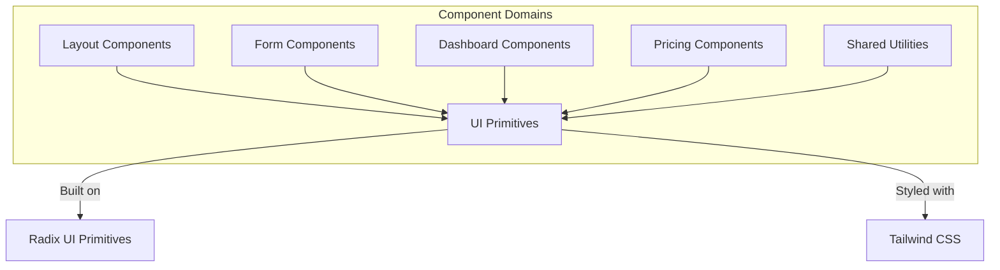
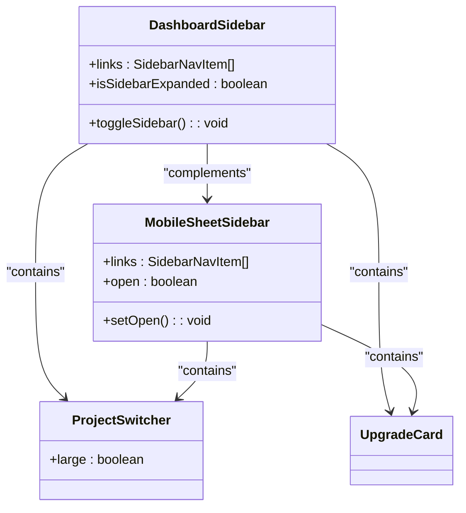
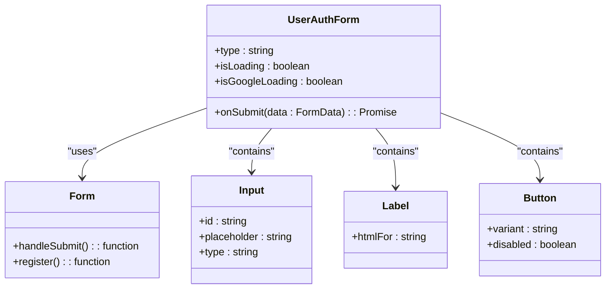
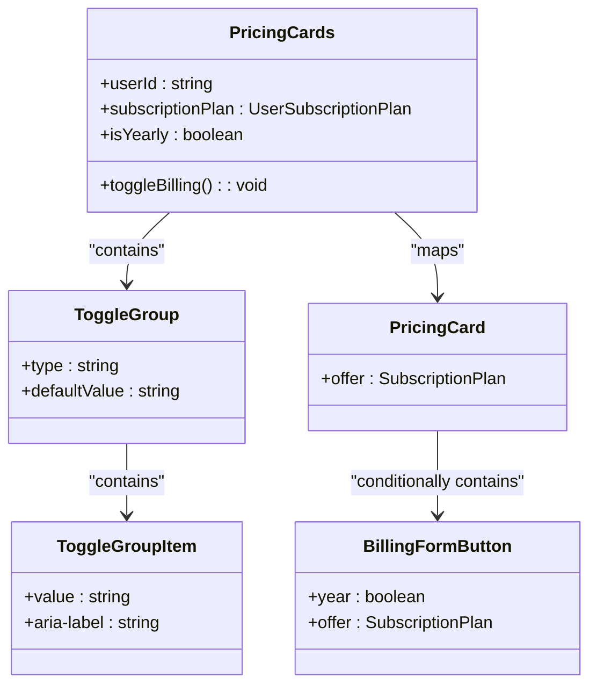
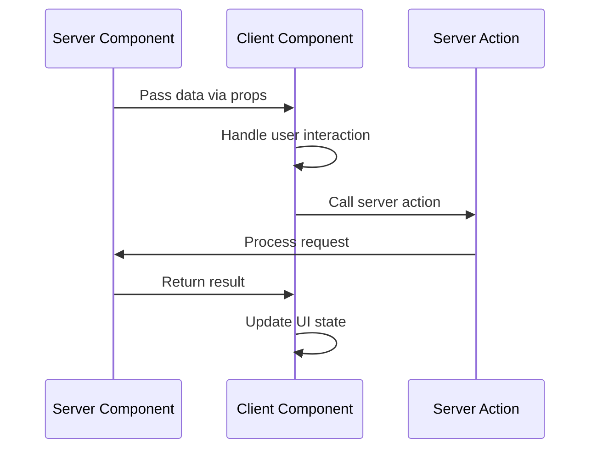
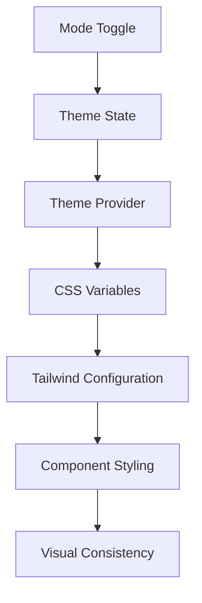

# Component Architecture

<cite>
**Referenced Files in This Document**   
- [dashboard-sidebar.tsx](file://components/layout/dashboard-sidebar.tsx)
- [user-auth-form.tsx](file://components/forms/user-auth-form.tsx)
- [pricing-cards.tsx](file://components/pricing/pricing-cards.tsx)
- [button.tsx](file://components/ui/button.tsx)
- [icons.tsx](file://components/shared/icons.tsx)
- [form.tsx](file://components/ui/form.tsx)
- [accordion.tsx](file://components/ui/accordion.tsx)
- [card.tsx](file://components/ui/card.tsx)
- [toggle-group.tsx](file://components/ui/toggle-group.tsx)
- [toggle.tsx](file://components/ui/toggle.tsx)
- [sheet.tsx](file://components/ui/sheet.tsx)
</cite>

## Table of Contents
1. [Introduction](#introduction)
2. [Component Organization by Feature Domain](#component-organization-by-feature-domain)
3. [Core UI Principles](#core-ui-principles)
4. [Compound Components and Props Interface](#compound-components-and-props-interface)
5. [Client Components and Server Integration](#client-components-and-server-integration)
6. [Accessibility, Responsiveness, and Theming](#accessibility-responsiveness-and-theming)
7. [Creating New Components](#creating-new-components)
8. [Conclusion](#conclusion)

## Introduction
The component architecture of the next-saas-stripe-starter-main project follows a modular, feature-driven organization that emphasizes reusability, composition, and consistency. Built on top of Shadcn/ui components which leverage Radix UI primitives, the system combines accessible, unstyled base components with Tailwind CSS for styling. This documentation details the architectural patterns, component organization, and development practices used throughout the codebase.

## Component Organization by Feature Domain

The components are organized into distinct feature domains within the `components/` directory:

- **UI Primitives** (`components/ui/`): Reusable base components built on Radix UI
- **Layout** (`components/layout/`): Structural components like navigation and sidebars
- **Forms** (`components/forms/`): Form implementations and related controls
- **Dashboard** (`components/dashboard/`): Dashboard-specific UI elements
- **Pricing** (`components/pricing/`): Subscription and pricing-related components
- **Shared** (`components/shared/`): Cross-cutting utilities and common elements

This domain-based organization enables developers to quickly locate components by functionality while maintaining separation of concerns.



**Diagram sources**
- [dashboard-sidebar.tsx](file://components/layout/dashboard-sidebar.tsx)
- [user-auth-form.tsx](file://components/forms/user-auth-form.tsx)
- [pricing-cards.tsx](file://components/pricing/pricing-cards.tsx)

**Section sources**
- [dashboard-sidebar.tsx](file://components/layout/dashboard-sidebar.tsx)
- [user-auth-form.tsx](file://components/forms/user-auth-form.tsx)
- [pricing-cards.tsx](file://components/pricing/pricing-cards.tsx)

## Core UI Principles

### Shadcn/ui and Radix UI Foundation
The project leverages Shadcn/ui components, which are themselves built on Radix UI primitives. This provides several advantages:

- **Accessibility**: Radix UI ensures all interactive components meet WCAG standards
- **Unstyled Base**: Components have no default styling, allowing complete customization via Tailwind CSS
- **Controlled Behavior**: Rich set of props and callbacks for fine-grained control
- **Composition**: Designed to be composed together to create complex interfaces

### Tailwind CSS Integration
All visual styling is implemented using Tailwind CSS utility classes. The components use `cn()` (a utility from `@/lib/utils`) to conditionally apply classes, enabling dynamic styling based on props and state.

### Reusability and Composition
Components are designed to be highly reusable through:
- **Prop-based customization**: Extensive use of props to modify appearance and behavior
- **Compound patterns**: Components that work together as a system (e.g., Accordion, Form)
- **Slot patterns**: Using React children and render props for flexible content

## Compound Components and Props Interface

### Dashboard Sidebar Example
The `DashboardSidebar` component demonstrates a compound pattern with multiple related parts:



**Diagram sources**
- [dashboard-sidebar.tsx](file://components/layout/dashboard-sidebar.tsx)

**Section sources**
- [dashboard-sidebar.tsx](file://components/layout/dashboard-sidebar.tsx)

### User Authentication Form
The `UserAuthForm` component illustrates form composition using React Hook Form and Shadcn/ui primitives:



**Diagram sources**
- [user-auth-form.tsx](file://components/forms/user-auth-form.tsx)

**Section sources**
- [user-auth-form.tsx](file://components/forms/user-auth-form.tsx)

### Pricing Cards Implementation
The `PricingCards` component demonstrates advanced composition with state management and conditional rendering:



**Diagram sources**
- [pricing-cards.tsx](file://components/pricing/pricing-cards.tsx)

**Section sources**
- [pricing-cards.tsx](file://components/pricing/pricing-cards.tsx)

## Client Components and Server Integration

### 'use client' Directive
Components that require interactivity use the `"use client"` directive to designate them as Client Components in the Next.js App Router. This includes:

- Interactive forms
- Stateful UI elements
- Components using React hooks
- Event handlers and callbacks

### Server Component Integration
Client Components are seamlessly integrated with Server Components through:

- **Prop passing**: Server Components pass data as props to Client Components
- **Action boundaries**: Client Components handle user interactions and call server actions
- **Conditional rendering**: Server Components determine which Client Components to render

### Example Integration Pattern


**Diagram sources**
- [dashboard-sidebar.tsx](file://components/layout/dashboard-sidebar.tsx)
- [user-auth-form.tsx](file://components/forms/user-auth-form.tsx)
- [pricing-cards.tsx](file://components/pricing/pricing-cards.tsx)

## Accessibility, Responsiveness, and Theming

### Accessibility Features
The component architecture prioritizes accessibility through:

- **Semantic HTML**: Proper use of ARIA attributes and roles
- **Keyboard navigation**: Full keyboard support for interactive elements
- **Screen reader support**: SR-only classes and proper labeling
- **Focus management**: Visible focus states and logical tab order

### Responsive Behavior
Components adapt to different screen sizes using:

- **Media queries**: Custom hook `useMediaQuery` for responsive logic
- **Conditional rendering**: Different layouts for mobile vs desktop
- **Progressive disclosure**: Mobile-first approach with expanding functionality

### Theming Support
The theming system enables consistent visual design across the application:

- **CSS variables**: Theme-aware styling through Tailwind
- **Mode toggle**: Light/dark mode support via `mode-toggle.tsx`
- **Consistent tokens**: Reusable color, spacing, and typography values



**Diagram sources**
- [dashboard-sidebar.tsx](file://components/layout/dashboard-sidebar.tsx)
- [ui/button.tsx](file://components/ui/button.tsx)
- [shared/icons.tsx](file://components/shared/icons.tsx)

## Creating New Components

### Following Existing Patterns
When creating new components, follow these guidelines:

1. **Organize by feature domain**: Place components in the appropriate subdirectory
2. **Use existing primitives**: Leverage Shadcn/ui components when possible
3. **Maintain consistent props**: Follow established naming conventions
4. **Include proper types**: Define TypeScript interfaces for props

### Component Structure Template
```typescript
"use client";

import * as React from "react";
// Import from @/components/ui, @/lib/utils, etc.

interface ComponentNameProps extends React.HTMLAttributes<HTMLDivElement> {
  // Define props with appropriate types
}

export function ComponentName({ className, ...props }: ComponentNameProps) {
  // Component implementation
  return (
    <div className={cn("your-classes", className)} {...props}>
      {/* Component content */}
    </div>
  );
}
```

### Best Practices
- **Start with composition**: Combine existing components before creating new ones
- **Prioritize accessibility**: Ensure all interactive elements are accessible
- **Test responsiveness**: Verify behavior across different screen sizes
- **Document props**: Provide clear TypeScript interfaces and JSDoc comments

## Conclusion
The component architecture of the next-saas-stripe-starter-main project demonstrates a well-structured, maintainable approach to building modern web applications. By leveraging Shadcn/ui and Radix UI primitives with Tailwind CSS, the system achieves a balance of accessibility, reusability, and visual consistency. The feature-based organization, compound component patterns, and clear separation between client and server components create a scalable foundation for development. Following the established patterns ensures new components integrate seamlessly with the existing codebase.