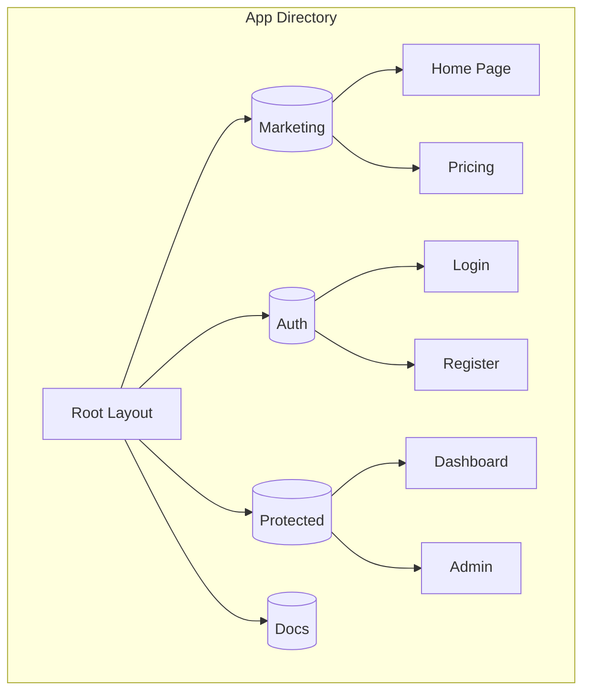
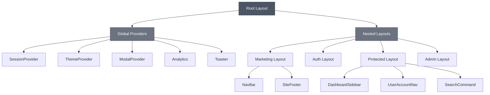
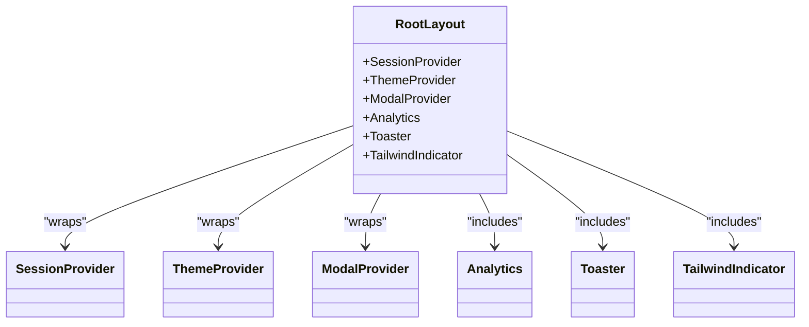
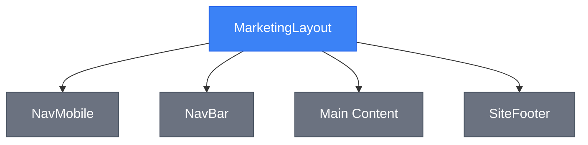
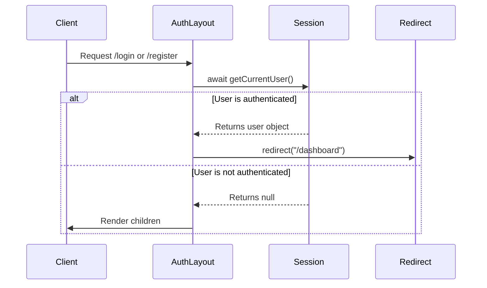
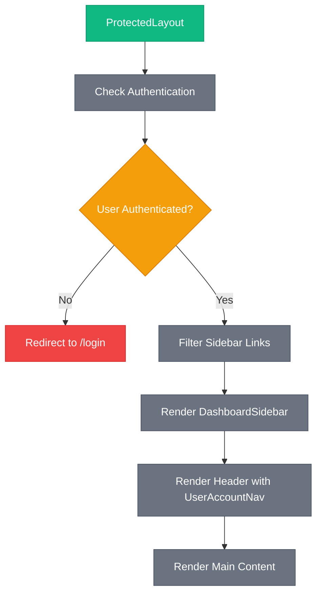
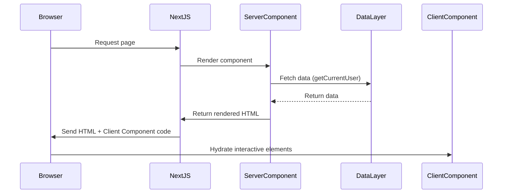
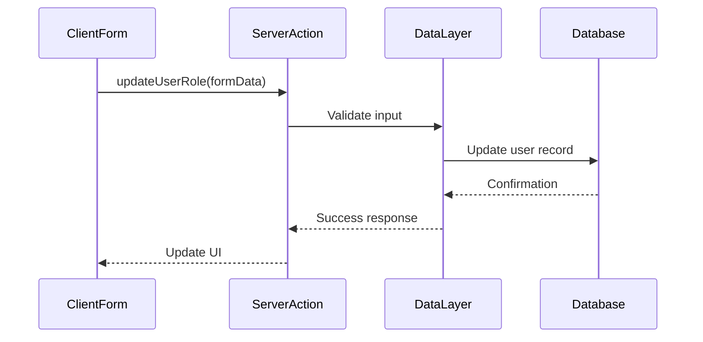

# Frontend Architecture

<cite>
**Referenced Files in This Document**   
- [app/layout.tsx](file://app/layout.tsx)
- [app/(marketing)/layout.tsx](file://app/(marketing)/layout.tsx)
- [app/(auth)/layout.tsx](file://app/(auth)/layout.tsx)
- [app/(protected)/layout.tsx](file://app/(protected)/layout.tsx)
- [app/(protected)/admin/layout.tsx](file://app/(protected)/admin/layout.tsx)
- [app/(marketing)/page.tsx](file://app/(marketing)/page.tsx)
- [app/(protected)/dashboard/page.tsx](file://app/(protected)/dashboard/page.tsx)
- [components/layout/navbar.tsx](file://components/layout/navbar.tsx)
- [components/layout/site-footer.tsx](file://components/layout/site-footer.tsx)
- [components/layout/dashboard-sidebar.tsx](file://components/layout/dashboard-sidebar.tsx)
- [components/layout/user-account-nav.tsx](file://components/layout/user-account-nav.tsx)
- [components/shared/max-width-wrapper.tsx](file://components/shared/max-width-wrapper.tsx)
- [components/ui/sonner.tsx](file://components/ui/sonner.tsx)
- [components/modals/providers.tsx](file://components/modals/providers.tsx)
- [lib/session.ts](file://lib/session.ts)
- [actions/update-user-name.ts](file://actions/update-user-name.ts)
- [components/forms/user-name-form.tsx](file://components/forms/user-name-form.tsx)
</cite>

## Table of Contents
1. [Introduction](#introduction)
2. [Project Structure](#project-structure)
3. [Core Components](#core-components)
4. [Architecture Overview](#architecture-overview)
5. [Detailed Component Analysis](#detailed-component-analysis)
6. [Dependency Analysis](#dependency-analysis)
7. [Performance Considerations](#performance-considerations)
8. [Troubleshooting Guide](#troubleshooting-guide)
9. [Conclusion](#conclusion)

## Introduction
This document provides a comprehensive overview of the frontend architecture of the next-saas-stripe-starter-main project. The application leverages modern Next.js features including the App Router, React Server Components, and Server Actions to deliver a scalable and maintainable frontend architecture. The system is built with TypeScript and React, emphasizing reusability, type safety, and clean separation of concerns. UI components are implemented using Shadcn/ui, which are built on Radix UI primitives, enabling accessible and customizable interfaces.

## Project Structure

The project follows a feature-based organization within the `app` directory, utilizing Next.js App Router conventions. Route groups are used to logically separate different sections of the application:

- `(marketing)` - Public-facing marketing pages
- `(auth)` - Authentication flows (login, register)
- `(protected)` - User dashboard and admin areas requiring authentication
- `(docs)` - Documentation and guides section

Each route group contains its own layout file, enabling shared UI elements and logic within that section. The root `layout.tsx` provides global providers and wrappers for the entire application.

**Diagram sources**
- [app/layout.tsx](file://app/layout.tsx#L1-L47)
- [app/(marketing)/layout.tsx](file://app/(marketing)/layout.tsx#L8-L17)

**Section sources**
- [app/layout.tsx](file://app/layout.tsx#L1-L47)
- [app/(marketing)/layout.tsx](file://app/(marketing)/layout.tsx#L1-L17)

## Core Components

The application's core components are organized by functional areas within the `components` directory. Key categories include layout components, UI primitives, forms, dashboards, and marketing sections. Components are designed for reusability and composability, following atomic design principles. The architecture leverages React Server Components by default, with Client Components explicitly marked using the `'use client'` directive when interactivity is required.

**Section sources**
- [components/layout/navbar.tsx](file://components/layout/navbar.tsx)
- [components/layout/site-footer.tsx](file://components/layout/site-footer.tsx)
- [components/ui/button.tsx](file://components/ui/button.tsx)

## Architecture Overview

The frontend architecture is built around Next.js App Router with a clear separation between Server and Client Components. Server Components handle data fetching and initial rendering, while Client Components manage user interactions and state. The architecture employs a hierarchical layout system with nested layouts providing context-specific UI elements and logic.

**Diagram sources**
- [app/layout.tsx](file://app/layout.tsx#L1-L47)
- [app/(marketing)/layout.tsx](file://app/(marketing)/layout.tsx#L8-L17)
- [app/(auth)/layout.tsx](file://app/(auth)/layout.tsx#L8-L17)
- [app/(protected)/layout.tsx](file://app/(protected)/layout.tsx#L17-L55)

## Detailed Component Analysis

### Layout System Analysis

The application implements a multi-level layout system that provides appropriate context and UI elements based on the current route. The root layout establishes global providers, while nested layouts add section-specific components.

#### Root Layout Analysis
The root layout (`app/layout.tsx`) serves as the foundation for the entire application, providing global context providers that are available throughout the app. It wraps all content with essential providers for authentication, theming, modals, and analytics.

**Diagram sources**
- [app/layout.tsx](file://app/layout.tsx#L1-L47)

**Section sources**
- [app/layout.tsx](file://app/layout.tsx#L1-L47)

#### Marketing Layout Analysis
The marketing layout provides a consistent structure for public-facing pages, including navigation and footer components. It is designed to present information in a visually appealing way for potential users.

**Diagram sources**
- [app/(marketing)/layout.tsx](file://app/(marketing)/layout.tsx#L8-L17)

**Section sources**
- [app/(marketing)/layout.tsx](file://app/(marketing)/layout.tsx#L1-L17)

#### Authentication Layout Analysis
The authentication layout implements a server-side redirect pattern, checking user authentication status before rendering content. This prevents authenticated users from accessing login/register pages.

**Diagram sources**
- [app/(auth)/layout.tsx](file://app/(auth)/layout.tsx#L8-L17)
- [lib/session.ts](file://lib/session.ts)

**Section sources**
- [app/(auth)/layout.tsx](file://app/(auth)/layout.tsx#L8-L17)

#### Protected Layout Analysis
The protected layout enforces authentication and role-based access control. It filters navigation links based on the user's role, ensuring that users only see relevant options.

**Diagram sources**
- [app/(protected)/layout.tsx](file://app/(protected)/layout.tsx#L17-L55)
- [config/dashboard.ts](file://config/dashboard.ts)

**Section sources**
- [app/(protected)/layout.tsx](file://app/(protected)/layout.tsx#L17-L55)

### Data Flow and Server Components

The application leverages React Server Components for data fetching and initial rendering. Data is fetched on the server and passed to components without requiring client-side API calls, improving performance and security.

#### Server Component Data Flow

**Diagram sources**
- [app/(protected)/dashboard/page.tsx](file://app/(protected)/dashboard/page.tsx)
- [lib/session.ts](file://lib/session.ts)

**Section sources**
- [app/(protected)/dashboard/page.tsx](file://app/(protected)/dashboard/page.tsx#L1-L31)

#### Server Actions Implementation
Server Actions are used for mutations, allowing form submissions and data updates without traditional API routes. The actions are defined in the `actions/` directory and imported directly into Client Components.

**Diagram sources**
- [actions/update-user-role.ts](file://actions/update-user-role.ts)
- [components/forms/user-role-form.tsx](file://components/forms/user-role-form.tsx)

**Section sources**
- [actions/update-user-role.ts](file://actions/update-user-role.ts)
- [components/forms/user-role-form.tsx](file://components/forms/user-role-form.tsx)

## Dependency Analysis

The frontend architecture demonstrates a clear dependency hierarchy, with higher-level components depending on lower-level utilities and providers. The dependency graph shows minimal circular dependencies and a well-defined separation of concerns.

```mermaid
graph TD
A[RootLayout] --> B[SessionProvider]
A --> C[ThemeProvider]
A --> D[ModalProvider]
A --> E[Analytics]
A --> F[Toaster]
G[MarketingLayout] --> H[NavBar]
G --> I[SiteFooter]
G --> J[NavMobile]
K[ProtectedLayout] --> L[DashboardSidebar]
K --> M[SearchCommand]
K --> N[ModeToggle]
K --> O[UserAccountNav]
K --> P[MaxWidthWrapper]
B --> Q[lib/session.ts]
L --> R[config/dashboard.ts]
style A fill:#4B5563,stroke:#374151,color:white
style G fill:#3B82F6,stroke:#2563EB,color:white
style K fill:#10B981,stroke:#059669,color:white
style B fill:#6B7280,stroke:#4B5563,color:white
style C fill:#6B7280,stroke:#4B5563,color:white
style D fill:#6B7280,stroke:#4B5563,color:white
style E fill:#6B7280,stroke:#4B5563,color:white
style F fill:#6B7280,stroke:#4B5563,color:white
style H fill:#6B7280,stroke:#4B5563,color:white
style I fill:#6B7280,stroke:#4B5563,color:white
style J fill:#6B7280,stroke:#4B5563,color:white
style L fill:#6B7280,stroke:#4B5563,color:white
style M fill:#6B7280,stroke:#4B5563,color:white
style N fill:#6B7280,stroke:#4B5563,color:white
style O fill:#6B7280,stroke:#4B5563,color:white
style P fill:#6B7280,stroke:#4B5563,color:white
style Q fill:#6B7280,stroke:#4B5563,color:white
style R fill:#6B7280,stroke:#4B5563,color:white
```

**Diagram sources**
- [app/layout.tsx](file://app/layout.tsx#L1-L47)
- [app/(marketing)/layout.tsx](file://app/(marketing)/layout.tsx#L8-L17)
- [app/(protected)/layout.tsx](file://app/(protected)/layout.tsx#L17-L55)
- [lib/session.ts](file://lib/session.ts)
- [config/dashboard.ts](file://config/dashboard.ts)

**Section sources**
- [app/layout.tsx](file://app/layout.tsx#L1-L47)
- [app/(marketing)/layout.tsx](file://app/(marketing)/layout.tsx#L1-L17)
- [app/(protected)/layout.tsx](file://app/(protected)/layout.tsx#L17-L55)

## Performance Considerations

The architecture prioritizes performance through several key strategies:
- Server Components reduce client-side JavaScript bundle size
- Server Actions eliminate the need for separate API routes
- Code splitting via route groups loads only necessary code
- Static generation where possible for marketing pages
- Dynamic rendering for personalized content

The use of React Server Components allows data fetching to occur on the server, eliminating waterfalls of client-side API calls. This results in faster initial page loads and improved SEO.

## Troubleshooting Guide

Common issues and their solutions:

1. **Authentication redirects not working**: Ensure `getCurrentUser()` is properly implemented in `lib/session.ts` and returns consistent user objects.

2. **Client Components not hydrating**: Verify the `'use client'` directive is present at the top of files that require interactivity.

3. **Theme not persisting**: Check that `ThemeProvider` is properly configured in the root layout with `enableSystem` and `disableTransitionOnChange`.

4. **Server Actions failing**: Ensure actions are properly defined in the `actions/` directory and imported correctly in client components.

5. **Layout components not rendering**: Verify the component hierarchy and ensure all required providers are available in the parent layout.

**Section sources**
- [lib/session.ts](file://lib/session.ts)
- [app/layout.tsx](file://app/layout.tsx#L1-L47)
- [components/ui/sonner.tsx](file://components/ui/sonner.tsx)

## Conclusion

The frontend architecture of the next-saas-stripe-starter-main project demonstrates a modern approach to building React applications with Next.js. By leveraging Server Components and Server Actions, the architecture achieves optimal performance while maintaining a clean separation of concerns. The layout system provides a flexible foundation for different sections of the application, with proper authentication and authorization handling. The component structure promotes reusability and maintainability, with Shadcn/ui components providing a consistent and accessible UI. This architecture serves as a solid foundation for a scalable SaaS application with complex routing and authentication requirements.