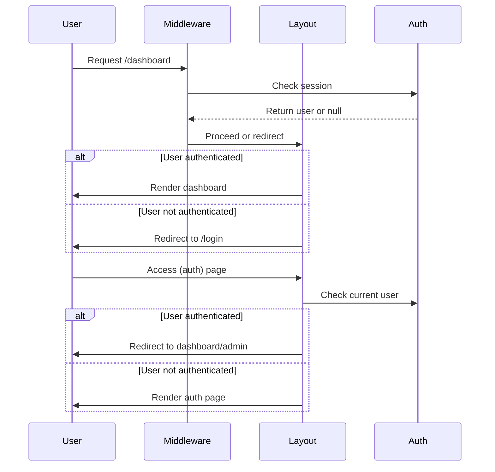
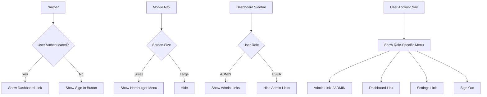
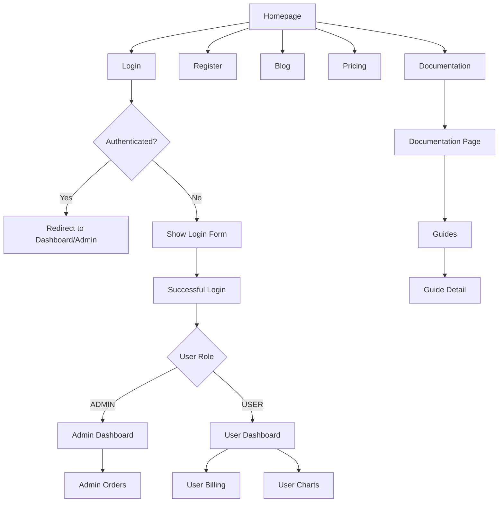

# Routing & Navigation

<cite>
**Referenced Files in This Document**   
- [app/(auth)/layout.tsx](file://app/(auth)/layout.tsx)
- [app/(marketing)/layout.tsx](file://app/(marketing)/layout.tsx)
- [app/(protected)/layout.tsx](file://app/(protected)/layout.tsx)
- [app/layout.tsx](file://app/layout.tsx)
- [middleware.ts](file://middleware.ts)
- [auth.ts](file://auth.ts)
- [lib/session.ts](file://lib/session.ts)
- [components/layout/navbar.tsx](file://components/layout/navbar.tsx)
- [components/layout/mobile-nav.tsx](file://components/layout/mobile-nav.tsx)
- [components/layout/dashboard-sidebar.tsx](file://components/layout/dashboard-sidebar.tsx)
- [components/layout/user-account-nav.tsx](file://components/layout/user-account-nav.tsx)
- [config/dashboard.ts](file://config/dashboard.ts)
</cite>

## Table of Contents
1. [Introduction](#introduction)
2. [Route Groups and Application Organization](#route-groups-and-application-organization)
3. [Layout Hierarchy and Nested Layouts](#layout-hierarchy-and-nested-layouts)
4. [Authentication and Middleware Protection](#authentication-and-middleware-protection)
5. [Client-Side Navigation and Navigation Events](#client-side-navigation-and-navigation-events)
6. [Dynamic Routes and Catch-All Segments](#dynamic-routes-and-catch-all-segments)
7. [Navigation Components Integration](#navigation-components-integration)
8. [Navigation Flow Diagrams](#navigation-flow-diagrams)
9. [Conclusion](#conclusion)

## Introduction
This document provides a comprehensive overview of the routing and navigation system in the Next.js App Router architecture used in the SaaS application. It details how route groups organize application sections, how nested layouts provide contextual UI, and how middleware enforces authentication and role-based access. The integration of navigation components such as navbar, sidebar, and mobile navigation is also explained, along with client-side navigation patterns and dynamic routing capabilities.

## Route Groups and Application Organization
The application uses Next.js route groups to logically organize different sections of the application. Route groups, denoted by parentheses, allow grouping routes without affecting the URL structure. The application implements four primary route groups:

- **(auth)**: Contains authentication routes (login, register) with a dedicated layout that redirects authenticated users to appropriate dashboards.
- **(marketing)**: Houses public-facing pages including the homepage, blog, and pricing, with a shared marketing layout.
- **(docs)**: Organizes documentation and guides with nested layouts for consistent UI.
- **(protected)**: Wraps authenticated user routes (dashboard, admin) with access control.

These groups enable independent layout management and middleware application while maintaining clean URL paths.

**Section sources**
- [app/(auth)/layout.tsx](file://app/(auth)/layout.tsx#L1-L18)
- [app/(marketing)/layout.tsx](file://app/(marketing)/layout.tsx#L1-L18)
- [app/(protected)/layout.tsx](file://app/(protected)/layout.tsx#L1-L56)

## Layout Hierarchy and Nested Layouts
The application implements a hierarchical layout system that provides contextual UI elements at different levels. The root layout (`app/layout.tsx`) establishes global providers including theme, session, and analytics. Route group layouts then add section-specific UI:

- **Marketing Layout**: Includes navigation bar, mobile navigation, and site footer for public pages.
- **Protected Layout**: Renders dashboard sidebar, header with search/command palette, and user account navigation for authenticated users.
- **Docs Layout**: Provides documentation-specific navigation and search functionality.

Nested layouts allow shared UI components to persist during navigation within a section, reducing re-renders and improving user experience.

```mermaid
graph TD
A[Root Layout] --> B[Theme Provider]
A --> C[Session Provider]
A --> D[Analytics]
A --> E[Modal Provider]
B --> F[(auth) Layout]
B --> G[(marketing) Layout]
B --> H[(protected) Layout]
B --> I[(docs) Layout]
G --> J[Navbar]
G --> K[Mobile Nav]
G --> L[Site Footer]
H --> M[Dashboard Sidebar]
H --> N[Header with Search]
H --> O[User Account Nav]
```

**Diagram sources**
- [app/layout.tsx](file://app/layout.tsx#L1-L48)
- [app/(marketing)/layout.tsx](file://app/(marketing)/layout.tsx#L1-L18)
- [app/(protected)/layout.tsx](file://app/(protected)/layout.tsx#L1-L56)

## Authentication and Middleware Protection
The application implements a robust authentication system using NextAuth.js with role-based access control. The middleware (`middleware.ts`) leverages the authentication configuration to protect routes and redirect unauthenticated users.

The `(protected)` route group layout checks authentication status and redirects unauthorized users to the login page. It also filters sidebar navigation items based on user role, ensuring users only see accessible routes. The `(auth)` layout prevents authenticated users from accessing login/register pages by redirecting them to their appropriate dashboards.

Role-based authorization is implemented through the `authorizeOnly` property in sidebar links, which restricts access to ADMIN or USER roles as appropriate.



**Diagram sources**
- [middleware.ts](file://middleware.ts#L1-L1)
- [auth.ts](file://auth.ts#L1-L67)
- [lib/session.ts](file://lib/session.ts#L1-L11)
- [app/(protected)/layout.tsx](file://app/(protected)/layout.tsx#L1-L56)

**Section sources**
- [middleware.ts](file://middleware.ts#L1-L1)
- [auth.ts](file://auth.ts#L1-L67)
- [lib/session.ts](file://lib/session.ts#L1-L11)

## Client-Side Navigation and Navigation Events
Client-side navigation is implemented using Next.js `Link` component throughout the application. The navbar, mobile navigation, and sidebar components use `Link` for instant page transitions without full reloads. The `useSelectedLayoutSegment` hook determines the current route segment to highlight active navigation items.

Navigation events are handled through React hooks and context. The modal system uses context to control sign-in modal visibility from navigation elements. User actions like sign-out trigger `signOut()` from `next-auth/react` with proper callback URLs.

The application also implements prefetching for better navigation performance, ensuring linked pages are loaded in the background when the link is visible in the viewport.

**Section sources**
- [components/layout/navbar.tsx](file://components/layout/navbar.tsx#L1-L135)
- [components/layout/mobile-nav.tsx](file://components/layout/mobile-nav.tsx#L1-L140)
- [components/layout/user-account-nav.tsx](file://components/layout/user-account-nav.tsx#L1-L187)

## Dynamic Routes and Catch-All Segments
The application implements dynamic routing for content-driven pages:

- **Blog Posts**: Uses `[slug]` parameter in `app/(marketing)/blog/[slug]/page.tsx` to render individual blog posts.
- **Documentation**: Implements catch-all routes with `[[...slug]]` in `app/(docs)/docs/[[...slug]]/page.tsx` to support nested documentation pages.
- **Categories**: Uses `[slug]` in `app/(marketing)/blog/category/[slug]/page.tsx` for blog category filtering.

These dynamic routes enable flexible content management while maintaining clean URL structures. The catch-all segment `[[...slug]]` supports both single and nested paths, allowing documentation to be organized in a hierarchical structure without requiring separate route definitions.

**Section sources**
- [app/(marketing)/blog/[slug]/page.tsx](file://app/(marketing)/blog/[slug]/page.tsx)
- [app/(docs)/docs/[[...slug]]/page.tsx](file://app/(docs)/docs/[[...slug]]/page.tsx)
- [app/(marketing)/blog/category/[slug]/page.tsx](file://app/(marketing)/blog/category/[slug]/page.tsx)

## Navigation Components Integration
Navigation components are tightly integrated with the routing system to provide a cohesive user experience:

- **Navbar**: Conditionally renders links based on the current layout segment and user authentication status. Shows "Sign In" for unauthenticated users and "Dashboard" for authenticated users.
- **Mobile Navigation**: Provides a hamburger menu that reveals navigation links and additional user actions on smaller screens.
- **Dashboard Sidebar**: Displays role-filtered navigation items from `config/dashboard.ts`, with tooltips for collapsed state and persistent project switcher.
- **User Account Navigation**: Shows user avatar with dropdown/sheet menu containing role-specific links (Admin, Dashboard, Settings) and sign-out functionality.

These components use Next.js navigation hooks like `usePathname` and `useSelectedLayoutSegment` to determine active routes and update UI accordingly.



**Diagram sources**
- [components/layout/navbar.tsx](file://components/layout/navbar.tsx#L1-L135)
- [components/layout/mobile-nav.tsx](file://components/layout/mobile-nav.tsx#L1-L140)
- [components/layout/dashboard-sidebar.tsx](file://components/layout/dashboard-sidebar.tsx#L1-L273)
- [components/layout/user-account-nav.tsx](file://components/layout/user-account-nav.tsx#L1-L187)

**Section sources**
- [components/layout/navbar.tsx](file://components/layout/navbar.tsx#L1-L135)
- [components/layout/mobile-nav.tsx](file://components/layout/mobile-nav.tsx#L1-L140)
- [components/layout/dashboard-sidebar.tsx](file://components/layout/dashboard-sidebar.tsx#L1-L273)
- [components/layout/user-account-nav.tsx](file://components/layout/user-account-nav.tsx#L1-L187)

## Navigation Flow Diagrams
The following diagrams illustrate the navigation flow across different user roles and authentication states.



**Diagram sources**
- [app/(marketing)/page.tsx](file://app/(marketing)/page.tsx)
- [app/(auth)/login/page.tsx](file://app/(auth)/login/page.tsx)
- [app/(protected)/dashboard/page.tsx](file://app/(protected)/dashboard/page.tsx)
- [app/(protected)/admin/page.tsx](file://app/(protected)/admin/page.tsx)

## Conclusion
The Next.js App Router implementation in this SaaS application demonstrates a well-structured approach to routing and navigation. Route groups provide logical organization without affecting URLs, while nested layouts enable contextual UI persistence. The authentication system with middleware protection and role-based access control ensures secure access to protected resources. Client-side navigation with integrated components creates a seamless user experience across desktop and mobile devices. Dynamic routing supports content-rich sections like documentation and blog, while the navigation system adapts to user roles and authentication states.