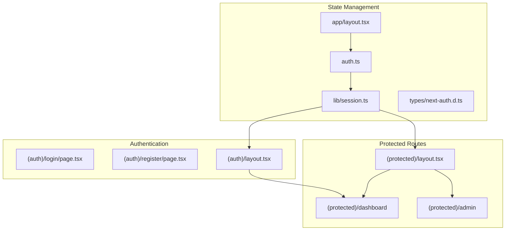
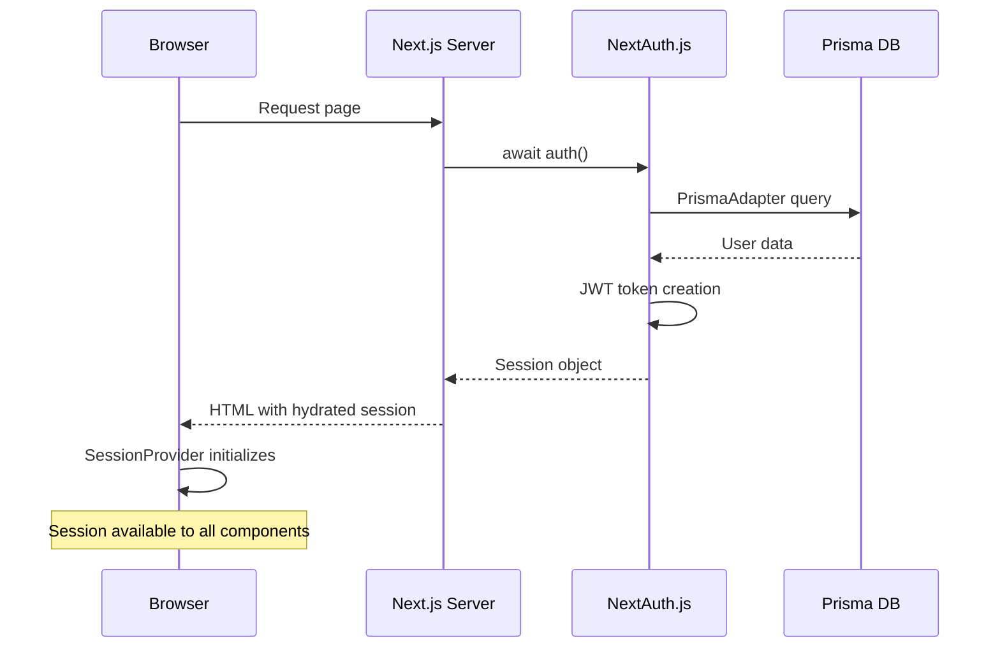
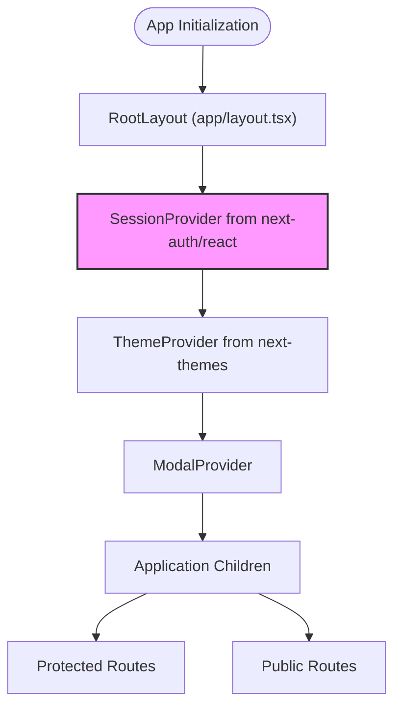
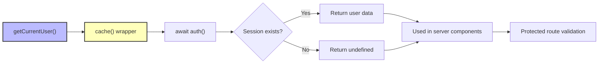
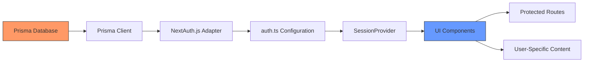

# State Management

<cite>
**Referenced Files in This Document**   
- [auth.ts](file://auth.ts)
- [app/layout.tsx](file://app/layout.tsx)
- [lib/session.ts](file://lib/session.ts)
- [types/next-auth.d.ts](file://types/next-auth.d.ts)
- [lib/user.ts](file://lib/user.ts)
- [app/(protected)/admin/layout.tsx](file://app/(protected)/admin/layout.tsx)
- [app/(auth)/layout.tsx](file://app/(auth)/layout.tsx)
- [components/layout/navbar.tsx](file://components/layout/navbar.tsx)
- [app/api/auth/[...nextauth]/route.ts](file://app/api/auth/[...nextauth]/route.ts)
</cite>

## Table of Contents
1. [Introduction](#introduction)
2. [Project Structure](#project-structure)
3. [Core Components](#core-components)
4. [Architecture Overview](#architecture-overview)
5. [Detailed Component Analysis](#detailed-component-analysis)
6. [Dependency Analysis](#dependency-analysis)
7. [Performance Considerations](#performance-considerations)
8. [Troubleshooting Guide](#troubleshooting-guide)
9. [Conclusion](#conclusion)

## Introduction
This document provides a comprehensive overview of the state management system in the Next.js SaaS application, with a focus on authentication state handling using React Context and NextAuth.js. The system enables seamless user session management across server and client environments, supporting role-based access control and protected routing. The documentation details how session data is initialized, propagated, and consumed throughout the application.

## Project Structure
The application follows a Next.js App Router structure with organized routing segments for different user experiences. Authentication state management is centralized through a combination of server-side session handling and client-side context propagation. Key directories include `(auth)` for login/registration flows, `(protected)` for authenticated routes, and shared components that consume session data.



**Diagram sources**
- [auth.ts](file://auth.ts#L1-L67)
- [lib/session.ts](file://lib/session.ts#L1-L11)
- [app/layout.tsx](file://app/layout.tsx#L1-L48)

**Section sources**
- [app/layout.tsx](file://app/layout.tsx#L1-L48)
- [auth.ts](file://auth.ts#L1-L67)

## Core Components
The state management system revolves around several core components: the NextAuth.js configuration for authentication logic, the SessionProvider for React Context distribution, the getCurrentUser function for server-side session retrieval, and type extensions that enhance session data with role information. These components work together to provide a type-safe, efficient authentication state system.

**Section sources**
- [auth.ts](file://auth.ts#L1-L67)
- [lib/session.ts](file://lib/session.ts#L1-L11)
- [types/next-auth.d.ts](file://types/next-auth.d.ts#L1-L19)

## Architecture Overview
The application implements a hybrid authentication state architecture that combines server-side session generation with client-side context propagation. During SSR, session data is fetched and hydrated to the client through NextAuth's built-in mechanisms. The SessionProvider wraps the entire application, making session data available to all components without prop drilling.



**Diagram sources**
- [auth.ts](file://auth.ts#L1-L67)
- [app/layout.tsx](file://app/layout.tsx#L1-L48)
- [lib/session.ts](file://lib/session.ts#L1-L11)

## Detailed Component Analysis

### Authentication Configuration
The auth.ts file configures NextAuth.js with Prisma adapter integration, JWT session strategy, and custom callbacks for session and JWT manipulation. The configuration extends the default session type to include user roles, enabling role-based access control throughout the application.

```mermaid
classDiagram
class NextAuthConfig {
+adapter : PrismaAdapter
+session : {strategy : "jwt"}
+pages : {signIn : "/login"}
+callbacks : Object
}
class SessionCallback {
+session({token, session})
+jwt({token})
}
class User {
+id : string
+email : string
+name : string
+image : string
+role : UserRole
}
NextAuthConfig --> SessionCallback : "has"
SessionCallback --> User : "produces"
SessionCallback --> User : "consumes"
```

**Diagram sources**
- [auth.ts](file://auth.ts#L1-L67)
- [types/next-auth.d.ts](file://types/next-auth.d.ts#L1-L19)

### Session Provider Implementation
The SessionProvider from next-auth/react is implemented at the root layout level, ensuring that authentication state is available to all components in the application. This context provider receives the initial session state during server-side rendering and maintains it on the client for reactivity.



**Diagram sources**
- [app/layout.tsx](file://app/layout.tsx#L1-L48)

### Server-Side Session Retrieval
The getCurrentUser function in lib/session.ts provides a cached server-side method for retrieving the current user's session data. This function leverages React's cache feature to prevent redundant database queries during server rendering, improving performance for authenticated routes.



**Diagram sources**
- [lib/session.ts](file://lib/session.ts#L1-L11)
- [app/(protected)/admin/layout.tsx](file://app/(protected)/admin/layout.tsx#L1-L14)

## Dependency Analysis
The state management system has well-defined dependencies between authentication, database, and UI layers. The Prisma database serves as the source of truth for user data, which is accessed through the Prisma client. NextAuth.js integrates with Prisma via its adapter pattern, and the resulting session data flows through React Context to UI components.



**Diagram sources**
- [auth.ts](file://auth.ts#L1-L67)
- [lib/db.ts](file://lib/db.ts)
- [app/layout.tsx](file://app/layout.tsx#L1-L48)

**Section sources**
- [auth.ts](file://auth.ts#L1-L67)
- [lib/db.ts](file://lib/db.ts)
- [app/layout.tsx](file://app/layout.tsx#L1-L48)

## Performance Considerations
The state management approach prioritizes performance through several mechanisms: server-side session hydration eliminates client-side fetching, React's cache directive prevents redundant database queries, and JWT strategy reduces database load by encoding user data in tokens. The use of React Context at the root level ensures efficient state distribution without unnecessary re-renders.

**Section sources**
- [lib/session.ts](file://lib/session.ts#L1-L11)
- [auth.ts](file://auth.ts#L1-L67)

## Troubleshooting Guide
Common issues in the state management system typically involve session hydration problems, type mismatches, or routing inconsistencies. Ensure that the SessionProvider wraps all components that need access to session data, verify that environment variables for authentication are properly configured, and check that role-based redirects function correctly in layout files.

**Section sources**
- [app/(auth)/layout.tsx](file://app/(auth)/layout.tsx#L1-L17)
- [app/(protected)/admin/layout.tsx](file://app/(protected)/admin/layout.tsx#L1-L14)
- [components/layout/navbar.tsx](file://components/layout/navbar.tsx#L102-L134)

## Conclusion
The state management system in this Next.js application effectively combines NextAuth.js, React Context, and server-side rendering to create a robust authentication solution. By leveraging the SessionProvider at the root level and implementing cached server-side session retrieval, the application achieves both security and performance. The integration with Prisma provides type safety and reliable data persistence, while the role-based access control enables sophisticated permission patterns.