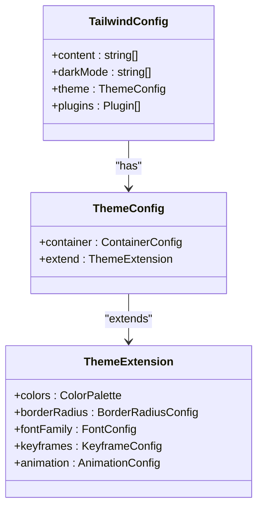
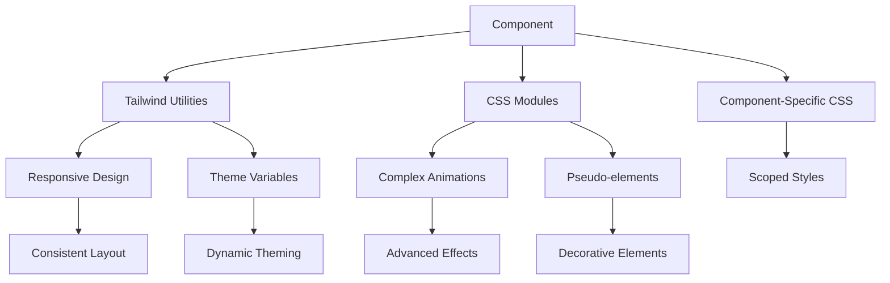
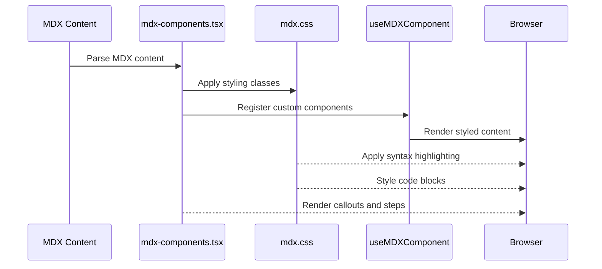
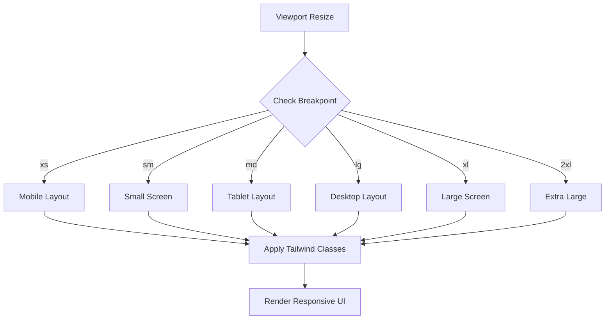
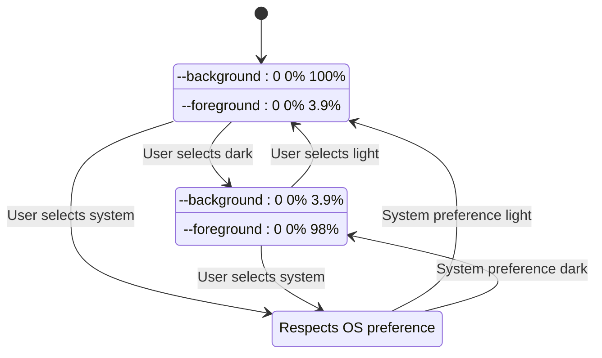

# Styling Strategy

<cite>
**Referenced Files in This Document**   
- [tailwind.config.ts](file://tailwind.config.ts)
- [globals.css](file://styles/globals.css)
- [mdx.css](file://styles/mdx.css)
- [components.json](file://components.json)
- [mode-toggle.tsx](file://components/layout/mode-toggle.tsx)
- [tailwind-indicator.tsx](file://components/tailwind-indicator.tsx)
- [mdx-components.tsx](file://components/content/mdx-components.tsx)
- [callout.tsx](file://components/shared/callout.tsx)
</cite>

## Table of Contents
1. [Introduction](#introduction)
2. [Tailwind CSS Configuration](#tailwind-css-configuration)
3. [Theme and Color System](#theme-and-color-system)
4. [Global Styles and Base Resets](#global-styles-and-base-resets)
5. [Component Styling and CSS Modules](#component-styling-and-css-modules)
6. [MDX Content Styling](#mdx-content-styling)
7. [Responsive Design Implementation](#responsive-design-implementation)
8. [Dark Mode Strategy](#dark-mode-strategy)
9. [Custom Utility Classes](#custom-utility-classes)
10. [Integration with Component Architecture](#integration-with-component-architecture)
11. [Best Practices for Style Extension](#best-practices-for-style-extension)

## Introduction
This document outlines the comprehensive styling strategy implemented in the Next.js SaaS application. The approach combines Tailwind CSS with custom configuration, CSS modules, and global styles to create a consistent, maintainable, and scalable design system. The architecture supports responsive design, dark mode, and rich content rendering for documentation and blog posts through MDX.

## Tailwind CSS Configuration

The project utilizes a custom Tailwind CSS configuration that extends the default theme with project-specific design tokens, animations, and typography settings. The configuration is defined in `tailwind.config.ts` and follows the recommended TypeScript format for type safety.



**Diagram sources**
- [tailwind.config.ts](file://tailwind.config.ts#L1-L146)

**Section sources**
- [tailwind.config.ts](file://tailwind.config.ts#L1-L146)

## Theme and Color System

The styling strategy implements a CSS variable-based theme system that supports both light and dark modes. The color palette is defined using HSL (Hue, Saturation, Lightness) values, which enables dynamic theme switching by updating CSS variables.

The theme configuration extends Tailwind's default colors with semantic variables that map to CSS custom properties, allowing for easy theme customization without modifying component classes.

```mermaid
erDiagram
THEME_VARIABLES {
string --background
string --foreground
string --primary
string --secondary
string --accent
string --destructive
string --muted
string --border
string --input
string --ring
string --radius
}
COLOR_MODES {
string light
string dark
}
THEME_VARIABLES ||--o{ COLOR_MODES : "supports"
```

**Diagram sources**
- [globals.css](file://styles/globals.css#L4-L53)
- [tailwind.config.ts](file://tailwind.config.ts#L15-L78)

**Section sources**
- [globals.css](file://styles/globals.css#L4-L53)
- [tailwind.config.ts](file://tailwind.config.ts#L15-L78)

## Global Styles and Base Resets

Global styles are managed through the `globals.css` file, which serves as the entry point for Tailwind's base, components, and utilities layers. The styling strategy includes a comprehensive base reset that ensures consistent rendering across browsers and establishes the foundation for the design system.

The base layer defines root CSS variables for both light and dark themes, sets default typography styles, and applies consistent border colors across all elements. This approach ensures visual consistency while maintaining the flexibility to override styles at the component level.

**Section sources**
- [globals.css](file://styles/globals.css#L1-L91)

## Component Styling and CSS Modules

The project employs a hybrid approach to component styling, combining Tailwind's utility-first methodology with CSS modules for complex styling requirements. Components use Tailwind classes for layout, spacing, and basic styling, while CSS modules handle more complex scenarios like animations and pseudo-elements.

The `components.json` file configures the integration between the component library and Tailwind, specifying the location of the Tailwind configuration and CSS file. This setup enables seamless usage of custom components with the established design system.



**Diagram sources**
- [components.json](file://components.json#L1-L16)
- [globals.css](file://styles/globals.css#L1-L91)

**Section sources**
- [components.json](file://components.json#L1-L16)
- [globals.css](file://styles/globals.css#L1-L91)

## MDX Content Styling

The styling strategy includes specialized handling for MDX content used in documentation and blog posts. The `mdx.css` file contains targeted styles for code blocks, line numbering, and syntax highlighting, ensuring a consistent reading experience across all content.

The `mdx-components.tsx` file defines custom components for MDX rendering, including specialized handling for callouts, steps, and linked cards. These components integrate seamlessly with the overall design system while providing enhanced functionality for content presentation.



**Diagram sources**
- [mdx.css](file://styles/mdx.css#L1-L61)
- [mdx-components.tsx](file://components/content/mdx-components.tsx#L1-L237)

**Section sources**
- [mdx.css](file://styles/mdx.css#L1-L61)
- [mdx-components.tsx](file://components/content/mdx-components.tsx#L1-L237)

## Responsive Design Implementation

The responsive design strategy leverages Tailwind's breakpoint system to create a mobile-first, progressively enhanced user interface. The project defines standard breakpoints (xs, sm, md, lg, xl, 2xl) that correspond to common device sizes and viewport widths.

A visual indicator component (`tailwind-indicator.tsx`) displays the current breakpoint during development, aiding in responsive design testing. The indicator shows the active breakpoint in the bottom-left corner of the screen, updating in real-time as the viewport size changes.



**Diagram sources**
- [tailwind-indicator.tsx](file://components/tailwind-indicator.tsx#L1-L13)
- [tailwind.config.ts](file://tailwind.config.ts#L1-L146)

**Section sources**
- [tailwind-indicator.tsx](file://components/tailwind-indicator.tsx#L1-L13)
- [tailwind.config.ts](file://tailwind.config.ts#L1-L146)

## Dark Mode Strategy

The dark mode implementation uses the `next-themes` library to manage theme switching and persistence. The `mode-toggle.tsx` component provides a dropdown interface for users to select between light, dark, and system themes.

The styling strategy relies on CSS variables defined in `globals.css` that are updated based on the current theme. Tailwind's `darkMode: ['class']` configuration applies the `.dark` class to the root element when dark mode is active, enabling conditional styling throughout the application.



**Diagram sources**
- [mode-toggle.tsx](file://components/layout/mode-toggle.tsx#L14-L42)
- [globals.css](file://styles/globals.css#L27-L53)

**Section sources**
- [mode-toggle.tsx](file://components/layout/mode-toggle.tsx#L14-L42)
- [globals.css](file://styles/globals.css#L27-L53)

## Custom Utility Classes

The project extends Tailwind's utility classes with custom definitions to support specific design requirements. The `globals.css` file includes utility classes for step indicators and text gradients that are not available in the default Tailwind distribution.

The step indicator utility creates numbered steps with a circular background, commonly used in tutorials and guides. The text gradient utility applies a linear gradient from indigo to purple, creating a visually distinctive heading style for key sections.

**Section sources**
- [globals.css](file://styles/globals.css#L55-L91)

## Integration with Component Architecture

The styling system is tightly integrated with the component architecture through the `components.json` configuration file. This file establishes the connection between the component library and Tailwind CSS, specifying the location of the Tailwind configuration and global CSS file.

The integration enables consistent styling across all components while supporting advanced features like CSS variables and theme customization. The configuration also defines aliases for common import paths, simplifying component usage throughout the application.

**Section sources**
- [components.json](file://components.json#L1-L16)

## Best Practices for Style Extension

When extending styles in this project, developers should follow these guidelines to maintain design consistency:

1. **Use Tailwind utilities first**: Prefer existing Tailwind classes over custom CSS whenever possible
2. **Extend the theme**: Add new design tokens to `tailwind.config.ts` rather than using arbitrary values
3. **Leverage CSS variables**: Use semantic CSS variables from `globals.css` for colors and spacing
4. **Maintain responsive design**: Ensure all new components work across all breakpoints
5. **Support dark mode**: Verify that custom styles appear correctly in both light and dark themes
6. **Use component variants**: For UI components, define variants using `cva` rather than creating multiple component files

By following these practices, developers can extend the styling system while preserving the integrity and consistency of the overall design language.

**Section sources**
- [tailwind.config.ts](file://tailwind.config.ts#L1-L146)
- [globals.css](file://styles/globals.css#L1-L91)
- [components.json](file://components.json#L1-L16)