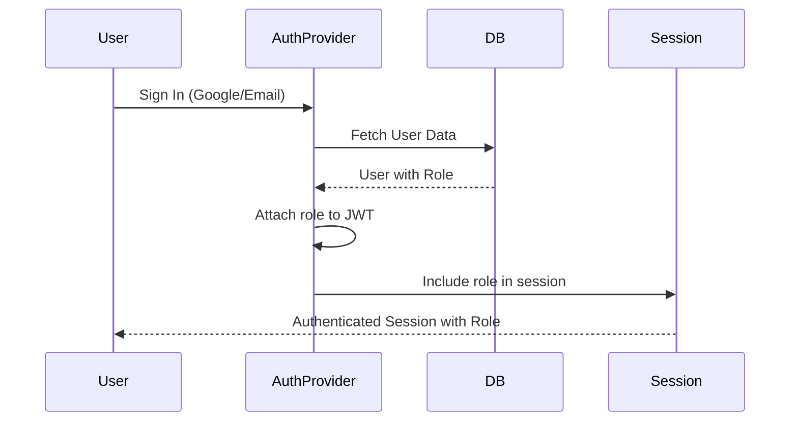
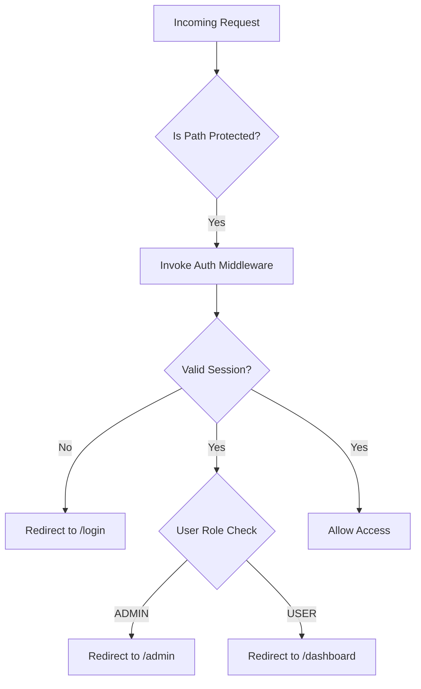

# Authentication Best Practices

<cite>
**Referenced Files in This Document**   
- [auth.config.ts](file://auth.config.ts)
- [auth.ts](file://auth.ts)
- [middleware.ts](file://middleware.ts)
- [lib/email.ts](file://lib/email.ts)
- [types/next-auth.d.ts](file://types/next-auth.d.ts)
- [ENVIRONMENT_SETUP_GUIDE.md](file://ENVIRONMENT_SETUP_GUIDE.md)
- [QODER_AGENT_RULES.md](file://QODER_AGENT_RULES.md)
- [components/forms/user-auth-form.tsx](file://components/forms/user-auth-form.tsx)
- [lib/session.ts](file://lib/session.ts)
- [actions/update-user-role.ts](file://actions/update-user-role.ts)
- [components/forms/user-role-form.tsx](file://components/forms/user-role-form.tsx)
</cite>

## Table of Contents
1. [Secure Configuration with Environment Variables](#secure-configuration-with-environment-variables)
2. [Authentication Strategies: JWT and Email Magic Links](#authentication-strategies-jwt-and-email-magic-links)
3. [Role-Based Access Control Implementation](#role-based-access-control-implementation)
4. [Session Management and Security](#session-management-and-security)
5. [Route Protection via Middleware](#route-protection-via-middleware)
6. [OAuth Provider Security (Google)](#oauth-provider-security-google)
7. [Email Magic Link Authentication Flow](#email-magic-link-authentication-flow)
8. [Secure Sign-In, Session Validation, and Logout](#secure-sign-in-session-validation-and-logout)
9. [Vulnerability Mitigation: Session Fixation and Token Leakage](#vulnerability-mitigation-session-fixation-and-token-leakage)
10. [Compliance with QODER_AGENT_RULES.md Authentication Hardening](#compliance-with-qoder_agent_rulesmd-authentication-hardening)

## Secure Configuration with Environment Variables

The application leverages environment variables to securely configure authentication mechanisms, ensuring sensitive credentials are never hardcoded. The `auth.config.ts` file imports configuration values through the type-safe `env.mjs` module, which validates environment inputs at runtime using Zod. Critical secrets such as `AUTH_SECRET`, `GOOGLE_CLIENT_ID`, and `GOOGLE_CLIENT_SECRET` are abstracted from source code and injected during deployment.

The `AUTH_SECRET` is used to sign and encrypt JWT tokens and session cookies, requiring a cryptographically strong value (32+ characters) generated via `openssl rand -base64 32` or similar secure methods. OAuth provider credentials (Google, GitHub) are similarly isolated, with redirect URIs strictly defined for development and production environments to prevent open redirect attacks.

**Section sources**
- [auth.config.ts](file://auth.config.ts#L1-L21)
- [ENVIRONMENT_SETUP_GUIDE.md](file://ENVIRONMENT_SETUP_GUIDE.md#L12-L58)
- [QODER_AGENT_RULES.md](file://QODER_AGENT_RULES.md#L216-L225)

## Authentication Strategies: JWT and Email Magic Links

NextAuth.js is configured with multiple providers, including Google OAuth and Resend-based email magic links. The JWT strategy is enabled by default through NextAuth’s built-in session management, where tokens are signed using the `AUTH_SECRET`. Sessions are stored server-side with JWT payloads containing minimal user data to reduce exposure.

The email provider uses Resend to deliver magic links, implementing a stateless, passwordless authentication flow. Upon sign-in request, a time-limited, one-time-use URL is generated and sent to the user’s email. This link contains a cryptographically signed token that expires after a short duration, preventing replay attacks.

**Section sources**
- [auth.config.ts](file://auth.config.ts#L1-L21)
- [lib/email.ts](file://lib/email.ts#L11-L50)
- [QODER_AGENT_RULES.md](file://QODER_AGENT_RULES.md#L216-L225)

## Role-Based Access Control Implementation

Role-based access control (RBAC) is enforced through session augmentation. The `ExtendedUser` type extends the default NextAuth `User` interface to include a `role` field of type `UserRole` (enum: USER, ADMIN). This role is persisted in both the JWT and session objects via callbacks in the authentication flow.

During sign-in, the user’s role is retrieved from the database and attached to the JWT in the `jwt` callback. On subsequent requests, the `session` callback injects the role into the session object, making it available across the application. This ensures that role checks are performed server-side and cannot be manipulated client-side.

Administrative actions, such as role updates, are protected by server actions that validate the requesting user’s identity and permissions before mutation.

**Diagram sources**
- [types/next-auth.d.ts](file://types/next-auth.d.ts#L4-L18)
- [auth.ts](file://auth.ts#L9-L15)
- [actions/update-user-role.ts](file://actions/update-user-role.ts#L13-L39)

**Section sources**
- [types/next-auth.d.ts](file://types/next-auth.d.ts#L4-L18)
- [auth.ts](file://auth.ts#L9-L15)
- [actions/update-user-role.ts](file://actions/update-user-role.ts#L13-L39)
- [components/forms/user-role-form.tsx](file://components/forms/user-role-form.tsx#L35-L133)

## Session Management and Security

Sessions are managed securely using encrypted JWT tokens transmitted over HTTPS. The `AUTH_SECRET` ensures token integrity and confidentiality. Session expiration is configured with reasonable defaults to balance usability and security—short-lived sessions reduce the window for token misuse.

Tokens are stored in HTTP-only, secure cookies, preventing access via JavaScript and mitigating XSS-based theft. The application adheres to the principle of least privilege by including only essential claims (user ID, role) in the session payload.

**Section sources**
- [auth.config.ts](file://auth.config.ts#L1-L21)
- [QODER_AGENT_RULES.md](file://QODER_AGENT_RULES.md#L216-L225)

## Route Protection via Middleware

Route protection is implemented using Next.js middleware that leverages the centralized `auth` instance from `@/auth`. The `middleware.ts` file exports `auth as middleware`, automatically protecting routes under `(protected)` and redirecting unauthenticated users to `/login`.

The middleware intercepts requests and validates the session before rendering protected pages. Role-based routing is further enforced in layout components; for example, authenticated users are redirected to `/dashboard` or `/admin` based on their role upon login.

**Diagram sources**
- [middleware.ts](file://middleware.ts#L1-L1)
- [app/(auth)/layout.tsx](file://app/(auth)/layout.tsx#L8-L17)

**Section sources**
- [middleware.ts](file://middleware.ts#L1-L1)
- [app/(auth)/layout.tsx](file://app/(auth)/layout.tsx#L8-L17)

## OAuth Provider Security (Google)

Google OAuth integration follows security best practices by using official provider configuration. Client credentials are securely stored and accessed via environment variables. Redirect URIs are strictly registered in the Google Cloud Console, preventing unauthorized callback endpoints.

The OAuth flow uses PKCE (Proof Key for Code Exchange) and state parameters by default through NextAuth.js, protecting against CSRF and authorization code interception. User identity is verified through Google’s ID token, and profile data is minimally scoped to reduce privacy exposure.

**Section sources**
- [auth.config.ts](file://auth.config.ts#L1-L21)
- [ENVIRONMENT_SETUP_GUIDE.md](file://ENVIRONMENT_SETUP_GUIDE.md#L23-L40)

## Email Magic Link Authentication Flow

The magic link flow begins when a user submits their email via the `UserAuthForm` component. The `signIn("resend")` call triggers the email provider, invoking the `sendVerificationRequest` function in `lib/email.ts`. This function retrieves the user from the database, generates a secure, time-limited URL, and sends it via Resend.

The email subject and content are dynamically generated based on whether the user is new or returning. Each email includes a unique `X-Entity-Ref-ID` header to prevent Gmail threading, ensuring each login attempt is treated as a separate message.

The magic link is valid for a single use and expires after a short duration (configured by NextAuth), enforcing one-time use and reducing the risk of link interception.

**Section sources**
- [components/forms/user-auth-form.tsx](file://components/forms/user-auth-form.tsx#L1-L118)
- [lib/email.ts](file://lib/email.ts#L11-L50)

## Secure Sign-In, Session Validation, and Logout

Sign-in is initiated through a client-side form that validates input using Zod (`userAuthSchema`). The form prevents submission during loading states and provides user feedback via toast notifications. Server-side, the `auth` function is used to retrieve session data in server components or actions, ensuring authentication checks occur in a secure context.

Session validation is performed via `getCurrentUser()` in `lib/session.ts`, which uses React’s `cache` to memoize the result within a request. This function verifies the presence of a valid session and returns the user object or `undefined`.

Logout is handled by NextAuth’s built-in sign-out mechanism, which invalidates the session cookie and clears local state.

**Section sources**
- [components/forms/user-auth-form.tsx](file://components/forms/user-auth-form.tsx#L1-L118)
- [lib/session.ts](file://lib/session.ts#L5-L11)

## Vulnerability Mitigation: Session Fixation and Token Leakage

The application mitigates session fixation by regenerating session tokens upon authentication. NextAuth.js automatically handles this by issuing a new JWT on sign-in, preventing attackers from pre-authentication session injection.

Token leakage is minimized by transmitting tokens only over HTTPS and storing them in HTTP-only cookies. Sensitive operations are performed via server actions, which validate the session before execution and avoid exposing tokens in client-side logic.

Error handling in authentication flows avoids leaking implementation details; for example, email sending failures return generic messages to prevent email enumeration.

**Section sources**
- [auth.config.ts](file://auth.config.ts#L1-L21)
- [lib/email.ts](file://lib/email.ts#L11-L50)
- [QODER_AGENT_RULES.md](file://QODER_AGENT_RULES.md#L216-L225)

## Compliance with QODER_AGENT_RULES.md Authentication Hardening

The implementation strictly follows the guidelines in `QODER_AGENT_RULES.md`, including the use of a centralized `auth` instance, proper import ordering, and server-side session validation. Environment variables are type-safe via `env.mjs`, and all authentication logic is isolated from client components.

Role management is type-safe using the `UserRole` enum from Prisma, and updates are guarded by authorization checks in server actions. The codebase avoids exposing API keys or secrets in client bundles and uses server actions for all sensitive operations.

These practices ensure alignment with security best practices for Next.js SaaS applications, including input validation, secure dependencies, and audit-ready authentication flows.

**Section sources**
- [QODER_AGENT_RULES.md](file://QODER_AGENT_RULES.md#L193-L225)
- [actions/update-user-role.ts](file://actions/update-user-role.ts#L13-L39)
- [auth.config.ts](file://auth.config.ts#L1-L21)